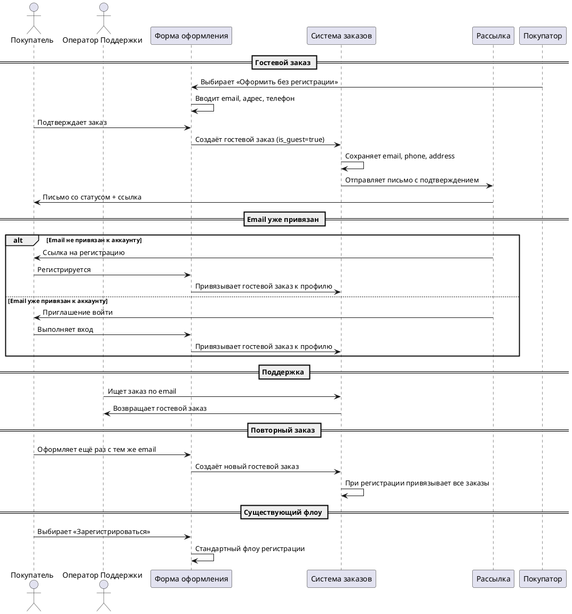

# [БФТ] issue-41: Гостевой заказ без регистрации

## Бизнес описание

Образ результата: Покупатель может оформить заказ без создания учётной записи, введя email, адрес доставки и телефон. Гостевой заказ сохраняется в системе с флагом `is_guest`, покупатель получает письмо с подтверждением и ссылкой для входа или регистрации. Существующий флоу с обязательной регистрацией остаётся доступным параллельно.

Зачем делать: Снизить отток покупателей на шаге оплаты, где часть уходит при требовании обязательной регистрации. Метрика: доля успешно оформленных заказов от начатых оформлений.

Подробный контекст

Текущая система требует обязательной регистрации на этапе оплаты. Часть покупателей покидает оформление на этом шаге, не завершая заказ. Введение гостевого флоу позволит этим покупателям оформить заказ без создания учётной записи, снижая барьер конверсии.

Гостевой заказ хранится с флагом `is_guest` в той же таблице заказов. Письмо отправляется через stdlib (`nodemailer`) в рамках принципа «без внешних зависимостей» (D-002). Привязка гостевых заказов к профилю при регистрации вынесена в SubIssue после MVP.

## Общая информация

| Поле | Значение |
|---|---|
| **Epic** | issue-41 |
| **Название** | Гостевой заказ без регистрации |
| **Проект** | [УТОЧНИТЬ] |
| **Владелец** | [УТОЧНИТЬ у PO] |
| **Автор** | bft-draft |
| **Дата создания** | 2026-08-19 |
| **Статус** | Черновик |
| **Приоритет** | [УТОЧНИТЬ у PO] |

## Заинтересованные стороны

| Роль | Интерес | Влияние |
|---|---|---|
| Покупатель | Оформить заказ быстро, без регистрации | Высокий |
| Поддержка | Иметь идентификатор для поиска заказа (email/телефон) | Средний |
| Курьер | Получить телефон и адрес для доставки | Средний |
| Product Owner | Снизить отток на этапе оплаты | Высокий |
| Юрист | Соблюдение ФЗ-152, GDPR | Высокий |
| Команда разработки | Реализация флоу в срок MVP | Высокий |

## История изменений

| Версия | Дата | Автор | Изменение |
|---|---|---|---|
| 1.0 | 2026-08-19 | bft-draft | Первая версия черновика |

## Дополнительные материалы

| Артефакт | Расположение |
|---|---|
| Концепт решения | [.bft/documentation/issue-41/artefacts/concept.md](.bft/documentation/issue-41/artefacts/concept.md) |
| Диагноз проблемы | [.bft/documentation/issue-41/artefacts/problem.md](.bft/documentation/issue-41/artefacts/problem.md) |
| Контекст-пак | [.bft/documentation/issue-41/artefacts/bft-context-pack.md](.bft/documentation/issue-41/artefacts/bft-context-pack.md) |
| Постановка заказчика | [.bft/documentation/issue-41/artefacts/po-statement.md](.bft/documentation/issue-41/artefacts/po-statement.md) |

## Проблема которую решаем

| ДЛЯ КОГО | ЧТО ДЕЛАЕМ | ASIS | ПРОБЛЕМА | TOBE |
|---|---|---|---|---|
| Покупатель | Оформление заказа | Обязательная регистрация на шаге оплаты | Часть покупателей уходит на этапе логина, не завершая заказ | Возможность оформить без регистрации: email + адрес + телефон |
| Поддержка | Поиск заказа | Поиск по email или телефону | Нет идентификатора для поиска гостевых заказов | Email хранится в БД, поиск доступен |
| Продукт (PO) | Конверсия оформления | Блокировка на шаге логина | Уходящие покупатели = упущенная выручка | Снижение барьера регистрации, рост конверсии |

## Изменение в UJM

| Точка демо | Было (As-Is) | Стало (To-Be) |
|---|---|---|
| Шаг оплаты | Форма требует логин, часть уходит | Выбор: зарегистрироваться или оформить как гость |
| Создание заказа | Только после регистрации | Гостевой заказ создаётся с флагом `is_guest` |
| Поиск заказа | Поддержка находит по email зарегистрированного | Поддержка находит по email и гостевой заказ |
| Привязка заказа | Профиль создаётся сразу | Привязка к профилю при последующей регистрации (SubIssue) |

## План демонстрации

### Акторы

| Актор | Роль в демо |
|---|---|
| Покупатель | Оформляет гостевой заказ, получает письмо |
| Поддержка | Ищет заказ по email |

### Сценарий приёмки

## Бизнес-Требования

### Вводные для разрабатываемого функционала*

| Информация или вопрос | Конспект | Ответ | В рамках чего получен | Кто ответил | Дата |
|---|---|---|---|---|---|
| Какая БД хранит заказы и профили? | [УТОЧНИТЬ у архитектора] | | issue-41 | Архитектор | |
| Какая система рассылки писем? | В MVP — nodemailer (stdlib), продакшн — [УТОЧНИТЬ] | SubIssue после MVP | issue-41 | Архитектор | |
| Где находится форма оформления (фронт)? | [УТОЧНИТЬ у архитектора] | | issue-41 | Архитектор | |
| Платёжный шлюз — требования для гостевого флоу? | [УТОЧНИТЬ у архитектора] | | issue-41 | Архитектор | |
| ФЗ-152, GDPR — требуется ли согласие? | [УТОЧНИТЬ у юриста] | | issue-41 | Юрист | |
| Кто владелец домена checkout? | [УТОЧНИТЬ у PO] | | issue-41 | PO | |
| Кто утверждает требования? | [УТОЧНИТЬ у PO] | | issue-41 | PO | |
| SLA доставки письма? | ≤30 сек, 99.5% доступность | НФТ-1 | concept.md (вердикт) | Модератор дебатов | 2026-08-19 |
| Триггер миграции в GuestOrder? | При 10k гостевых заказов | Архитектурное решение | concept.md (вердикт) | Модератор дебатов | 2026-08-19 |

### Ценность*

| ID | Бизнес-требование | Приоритет | Связанные требования | Источник |
|---|---|---|---|---|---|
| БТ-1 | Снизить долю уходящих покупателей на шаге оплаты за счёт опции оформления без регистрации | Высокий | ПТ-1, ФТ-1, ФТ-2 | [po-statement.md:7-12] |
| БТ-2 | Обеспечить поиск гостевых заказов поддержкой по email/телефону | Средний | ПТ-1, ФТ-2, ИТ-1 | [po-statement.md:17] |
| БТ-3 | Исключить утечку факта регистрации при оформлении гостевого заказа | Высокий | УТ-1, УТ-2, ФТ-4 | [po-statement.md:26-29] |
| БТ-4 | Обеспечить привязку гостевых заказов к профилю при последующей регистрации/входе | Средний | ПТ-3, ФТ-5 | [po-statement.md:11-12] |

## Пользовательские требования

| ID | Пользовательское требование | Приоритет | Связанные требования | Источник |
|---|---|---|---|---|---|
| ПТ-1 | Когда я нахожусь на шаге оформления заказа, я хочу иметь возможность оформить заказ без создания учётной записи, чтобы я мог быстро завершить покупку | Высокий | БТ-1, ИТ-1, ФТ-1 | [po-statement.md:10-12] |
| ПТ-2 | Когда я оформляю гостевой заказ, я хочу получить письмо с подтверждением и ссылкой для создания аккаунта, чтобы я мог позже привязать заказ к профилю | Высокий | БТ-4, ИТ-2, ФТ-3 | [po-statement.md:11-12] |
| ПТ-3 | Когда я создаю аккаунт после гостевого заказа, я хочу чтобы прошлые заказы подтянулись к профилю, чтобы я видел их в личном кабинете | Средний | БТ-4, ФТ-5 | [po-statement.md:12] |
| ПТ-4 | Когда я ввожу email на гостевой форме, я не хочу видеть подсказки «email уже зарегистрирован», чтобы факт регистрации не раскрывался | Высокий | БТ-3, УТ-2, ФТ-4 | [po-statement.md:29] |
| ПТ-5 | Когда я оформляю гостевой заказ повторно с тем же email, я хочу чтобы при регистрации все мои заказы привязались к одному профилю без дублей | Средний | БТ-4, ФТ-6 | [po-statement.md:18] |

## Интерфейсные требования

| ID | Интерфейсное требование | Приоритет | Связанные требования | Источник |
|---|---|---|---|---|---|
| ИТ-1 | Форма оформления заказа содержит выбор «Оформить без регистрации» рядом с опцией «Зарегистрироваться» | Высокий | ПТ-1, ФТ-1 | [po-statement.md:10-12] |
| ИТ-2 | Форма гостевого заказа содержит обязательные поля: email, адрес доставки, телефон | Высокий | УТ-3, ФТ-2 | [po-statement.md:30] |
| ИТ-3 | Форма гостевого заказа содержит опциональное поле ФИО | Низкий | УТ-3 | [po-statement.md:30] |
| ИТ-4 | Форма гостевого заказа содержит галочку «Я согласен на обработку персональных данных» | Высокий | ФТ-4, НФТ-3 | [concept.md:352-356] |
| ИТ-5 | Письмо подтверждения содержит статус заказа и ссылку для регистрации или входа | Высокий | ПТ-2, ФТ-3 | [po-statement.md:11-12] |
| ИТ-6 | При вводе email на форме не выводятся подсказки о существовании аккаунта | Высокий | ПТ-4, ФТ-4, УТ-2 | [po-statement.md:29] |

## Функциональные требования

| ID | Функциональное требование | Приоритет | Связанные требования | Источник |
|---|---|---|---|---|---|
| ФТ-1 | Система предоставляет опцию оформления заказа без регистрации параллельно с существующим флоу обязательной регистрации | Высокий | БТ-1, ПТ-1, ИТ-1, D-041-1 | [po-statement.md:16] |
| ФТ-2 | Система требует обязательного заполнения полей email, адрес доставки, телефон при гостевом оформлении | Высокий | ИТ-2, УТ-3, D-041-4 | [po-statement.md:30] |
| ФТ-3 | Система отправляет письмо со статусом заказа и ссылкой на регистрацию/вход после создания гостевого заказа | Высокий | ПТ-2, ИТ-5 | [po-statement.md:11-12] |
| ФТ-4 | Система проверяет наличие галочки согласия на обработку ПД и сохраняет `consent_timestamp` для каждого гостевого заказа | Высокий | ИТ-4, НФТ-3 | [concept.md:352-356] |
| ФТ-5 | При вводе email на форме система не выводит подсказки о существовании аккаунта | Высокий | ПТ-4, ИТ-6, УТ-2, PD-001 | [po-statement.md:29] |
| ФТ-6 | При регистрации пользователя с email, для которого существуют гостевые заказы, система привязывает все эти заказы к профилю | Средний | БТ-4, ПТ-3, ПТ-5 | [po-statement.md:18] |
| ФТ-7 | При входе пользователя с email, для которого существуют гостевые заказы, система привязывает все эти заказы к профилю | Средний | БТ-4, УТ-1, PD-002 | [po-statement.md:26-29] |
| ФТ-8 | Система сохраняет гостевой заказ с флагом `is_guest=true` в таблице заказов | Высокий | | [concept.md:107] |
| ФТ-9 | API поиска заказов по email возвращает гостевые заказы | Средний | БТ-2 | [concept.md:362] |
| ФТ-10 | При повторном гостевом заказе на тот же email система создаёт новый заказ, не создавая дубль профиля при регистрации | Средний | ПТ-5, УТ-1 | [po-statement.md:18] |

## Нефункциональные требования

| ID | Нефункциональное требование | Приоритет | Связанные требования | Источник |
|---|---|---|---|---|---|
| НФТ-1 | Время доставки письма ≤ 30 секунд, SLA доступности 99.5% | Высокий | | [concept.md:334-336] |
| НФТ-2 | Система работает без внешних зависимостей (только stdlib Node.js) в рамках D-002 | Высокий | | [CLAUDE.md:63-67] |
| НФТ-3 | Хранение согласия на обработку ПД соответствует требованиям ФЗ-152 и GDPR | Высокий | ФТ-4 | [concept.md:352-356] |
| НФТ-4 | При достижении 10k гостевых заказов выполняется миграция в отдельную сущность GuestOrder | Средний | | [concept.md:346] |

## Зависимости

| Зависимость | Статус согласования | Описание |
|---|---|---|
| Система хранения заказов и профилей | [УТОЧНИТЬ у архитектора] | БД для хранения заказов с флагом `is_guest` |
| Система рассылки писем (продакшн) | SubIssue после MVP | Интеграция с Confluent Kafka → Email Service |
| Форма оформления заказа (фронт) | [УТОЧНИТЬ у архитектора] | Место размещения формы гостевого заказа |
| Платёжный шлюз | [УТОЧНИТЬ у архитектора] | Требования для гостевого флоу |
| Юридическое заключение по ФЗ-152, GDPR | [УТОЧНИТЬ у юриста] | Требования к согласию на обработку ПД |

## Риски

| Риск | Вероятность | Влияние | Митигация |
|---|---|---|---|
| Stub-рассылка (nodemailer) не доставляет письма в production | Средняя | Высокое | SubIssue: интеграция с продакшн-рассылкой после MVP (Confluent Kafka → Email Service) |
| Дубликат профиля при повторном заказе на тот же email | Низкая | Среднее | Negative Flow: при регистрации привязываются все гостевые заказы, создаётся один профиль |
| Изменение требований регуляторики (ФЗ-152, GDPR) | Средняя | Высокое | Явное требование ФТ-4: галочка согласия + `consent_timestamp` |
| Масштабирование: флаг `is_guest` усложняет querying при росте доли гостевых заказов | Средняя | Среднее | Архитектурное решение: миграция в GuestOrder при 10k заказов |
| Поддержка не сможет эффективно искать заказы без UI | Низкая | Среднее | Явное требование ФТ-9: API поиска возвращает гостевые заказы |
| Привязка к профилю не реализована в MVP | Высокая | Среднее | Вынесено в SubIssue, HowToDemo проверяет базовый флоу |

## Ревью требований

| Роль | ФИО | Статус |
|---|---|---|
| Product Owner | [УТОЧНИТЬ] | |
| Архитектор | [УТОЧНИТЬ] | |
| Аналитик (кросс-ревью) | [УТОЧНИТЬ] | |
| Разработка | [УТОЧНИТЬ] | |
| Тестирование | [УТОЧНИТЬ] | |

## Якоря истины

| Факт | Источник | Ранг | Тип |
|---|---|---|---|
| HTTP-сервис расчёта стоимости: `POST /quote`, `GET /healthz` | [src/server.mjs:1-2, src/server.mjs:27] | R1 | Код |
| Арифметика в чистых функциях: `pricing.mjs` | [src/pricing.mjs:1-3] | R1 | Код |
| Доставка 300 руб., бесплатно от 3000 руб. | [src/pricing.mjs:5, src/pricing.mjs:8-9] | R1 | Код |
| Принцип: без внешних зависимостей | [CLAUDE.md:63-67] | R1 | Код |
| Сейчас оформление заказа только после регистрации | [po-statement.md:7] | R2 | Постановка |
| Часть покупателей уходит на шаге логина | [po-statement.md:8] | R2 | Постановка |
| Почта обязательна — поиск заказа в поддержке | [po-statement.md:17] | R2 | Постановка |
| Повторный заказ на ту же почту не создаёт дубль профиля | [po-statement.md:18] | R2 | Постановка |
| ФТ-1: существующий флоу с регистрацией остаётся параллельно | [po-statement.md:16] | R2 | Постановка |
| УТ-1: если email уже привязан к аккаунту — заказ как гостевой, письмо с приглашением войти | [po-statement.md:26-29] | R2 | Постановка |
| УТ-2: никаких подсказок о существовании аккаунта — утечка факта регистрации | [po-statement.md:29] | R2 | Постановка |
| УТ-3: обязательны почта, адрес доставки, телефон. ФИО опционально | [po-statement.md:30] | R2 | Постановка |
| D-041-1: гостевой флоу параллельно существующему | [decisions.md:100-105] | R2 | Решение |
| D-041-2: почта как идентификатор заказа | [decisions.md:108-113] | R2 | Решение |
| D-041-3: обработка существующей почты без утечки | [decisions.md:116-121] | R2 | Решение |
| D-041-4: минимальный набор обязательных полей | [decisions.md:124-129] | R2 | Решение |
| PD-001: никаких подсказок о существовании аккаунта | [regulatory.md:30] | R2 | Регуляторика |
| PD-002: письмо с приглашением войти, если почта уже привязана | [regulatory.md:31] | R2 | Регуляторика |
| Концепт 2 (упрощённый гостевой флоу) принят с модификациями | [concept.md:407-430] | R2 | Решение |
| НФТ-1: SLA на доставку письма ≤ 30 сек, 99.5% | [concept.md:334-336] | R2 | Решение |
| ФТ-4: согласие на ПД (checkbox + consent_timestamp) | [concept.md:352-356] | R2 | Решение |
| Negative Flow: повторный заказ не создаёт дубль профиля | [concept.md:339-342] | R2 | Решение |
| SubIssue: интеграция с продакшн-рассылкой после MVP | [concept.md:421] | R2 | Решение |
| Архитектурное решение: миграция в GuestOrder при 10k заказов | [concept.md:346] | R2 | Решение |
