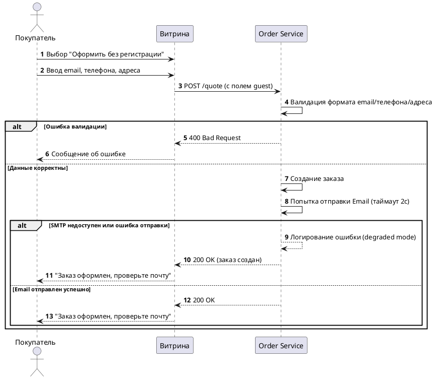

# [БФТ] issue-43: Гостевой заказ без регистрации

Бизнес описание
===============

**Образ результата:** Покупатель может оформить заказ без обязательной регистрации, введя почту, телефон и адрес доставки. Существующий флоу с регистрацией сохраняется параллельно. При успешном оформлении пользователь получает письмо со статусом заказа и ссылкой для входа или регистрации.

**Зачем делать:** Снижение оттока клиентов на шаге оплаты за счёт удаления барьера обязательной регистрации.

Подробный контекст

Система рассчитывает стоимость заказа и принимает запросы на оформление. Сейчас шаг оплаты требует обязательной авторизации, что приводит к потере клиентов. Внедряется альтернативный путь: «Гостевой заказ». Данные гостя (email, phone, address) передаются в API `/quote`, валидируются и сохраняются. Отправка уведомления происходит через встроенную библиотеку (inline email) с таймаутом, чтобы не блокировать создание заказа при сбоях SMTP. Привязка заказа к профилю пользователя возможна постфактум при переходе по ссылке из письма.

Общая информация
================

| Поле | Значение |
| --- | --- |
| Название проекта | poh-demo-checkout |
| Ответственный за продукт | [УТОЧНИТЬ] |
| Ответственный за документ | bft-draft |
| Задача/Epic Jira | issue-43 |
| Статус | АНАЛИЗ |
| Системные требования | [УТОЧНИТЬ] |

Заинтересованные стороны
========================

| ФИО | Роль/должность | Контакты |
| --- | --- | --- |
| [УТОЧНИТЬ] | Product Owner | [УТОЧНИТЬ] |
| [УТОЧНИТЬ] | Архитектор | [УТОЧНИТЬ] |
| Команда Frontend | Разработка UI/UX | [УТОЧНИТЬ] |
| Команда Backend (Order Service) | Разработка API | [УТОЧНИТЬ] |
| Служба поддержки | Поиск заказов | [УТОЧНИТЬ] |

История изменений
=================

| # | Дата | Автор | Суть изменений |
| --- | --- | --- | --- |
| 1 | 20.08.2026 | bft-draft | Создание документа. |

Дополнительные материалы и артефакты
====================================

| Артефакт/Файл/Ссылка | Описание |
| --- | --- |
| [po-statement.md](https://github.com/po-helper-org/poh-demo-checkout/blob/main/po-statement.md) | Постановка задачи |
| [bft-context-pack.md](https://github.com/po-helper-org/poh-demo-checkout/blob/main/bft-context-pack.md) | Контекст-пак |
| [problem.md](https://github.com/po-helper-org/poh-demo-checkout/blob/main/problem.md) | Диагноз проблемы |
| [concept.md](https://github.com/po-helper-org/poh-demo-checkout/blob/main/concept.md) | Концепты решения и вердикт |

Проблема которую решаем
=======================

| Срез | Содержание |
| --- | --- |
| **ДЛЯ КОГО** | Покупатель, желающий оформить заказ без создания учётной записи |
| **ЧТО ДЕЛАЕМ** | Внедряем сценарий гостевого оформления заказа параллельно существующей авторизации |
| **ASIS** | Оформление заказа требует обязательной регистрации или входа на шаге оплаты ([po-statement.md:7](https://github.com/po-helper-org/poh-demo-checkout/blob/main/po-statement.md)) |
| **ПРОБЛЕМА** | <ul><li>Часть покупателей уходит на шаге оплаты из-за необходимости регистрации</li><li>Барьер входа снижает конверсию в продажу</li></ul> |
| **TOBE** | <ul><li>Покупатель вводит email, адрес и телефон, заказ создаётся без регистрации</li><li>Пользователь получает письмо со статусом и ссылкой для привязки заказа к профилю</li></ul> |

Изменение в UJM
===============

| Точка демо | Было (As-Is) | Стало (To-Be) |
| --- | --- | --- |
| Экран оформления заказа (Checkout) | Кнопка «Оформить» перенаправляет на форму входа/регистрации | Выбор между кнопками «Войти / Зарегистрироваться» и «Оформить без регистрации» |

План демонстрации
=================

### Акторы

| Актор | Описание |
| --- | --- |
| Покупатель (Гость) | Пользователь без аккаунта, оформляющий заказ |
| Витрина (Frontend) | Интерфейс корзины и формы заказа |
| Order Service | Бэкенд-сервис обработки заказов |
| Email Service (Inline) | Компонент отправки уведомлений внутри Order Service |

### Сценарий приёмки

Бизнес-Требования
=================

## Вводные для разрабатываемого функционала*

| Информация или вопрос | Конспект | Ответ | В рамках чего был получен ответ | Кто ответил | Дата |
| --- | --- | --- | --- | --- | --- |
| Детали провайдера SMTP и настройки подключения | Требуются хост, порт, аутентификация для встроенной библиотеки | [УТОЧНИТЬ] | Решение по Concept 2 | Архитектор | [УТОЧНИТЬ] |
| Схема хранения профилей в User Service | Требуется для будущей логики слияния гостевых заказов | Отложено (пост-MVP) | Граница текущего эпика | PO | 20.08.2026 |
| Логика автоматической привязки при самостоятельной регистрации | Что происходит, если пользователь регистрируется не по ссылке из письма | [УТОЧНИТЬ] | Требует отдельного анализа | User Service / Backend | [УТОЧНИТЬ] |

## Ценность разрабатываемого функционала для бизнес-заказчиков*

| Идентификатор | Наименование требования | Ценность разрабатываемого функционала для бизнес-заказчиков | Краткое описание доработки из данного БФТ | Связанные требования |
| --- | --- | --- | --- | --- |
| БТ-1 | Снижение оттока на этапе оплаты | Снижение количества брошенных корзин на шаге оплаты | Внедрение опции оформления без создания пароля | ПТ-1, ПТ-2, [issue-43](https://github.com/po-helper-org/poh-demo-checkout/issues/43) |
| БТ-2 | Оформление заказа без учётной записи | Увеличение конверсии за счёт упрощения пути покупки | Реализация API для приёма данных гостя и создания заказа | ПТ-1, ФТ-1 |
| БТ-3 | Привязка заказа к профилю постфактум | Сохранение истории покупок клиента при поздней регистрации | Механизм связывания гостевого заказа с аккаунтом по email | ПТ-3, ПТ-5, ФТ-7 |
| БТ-4 | Поиск заказа в поддержке | Оперативность обработки обращений клиентов без аккаунта | Хранение email гостя в карточке заказа | ПТ-2, ФТ-6 |

Пользовательские требования*
============================

| Идентификатор | Наименование требования | Story | Комментарий | Связанные требования |
| --- | --- | --- | --- | --- |
| ПТ-1 | Оформление заказа как гость | **Когда** я нахожусь на шаге оплаты и не хочу регистрироваться **Я хочу** выбрать опцию «Оформить без регистрации» **Чтобы** быстро купить товар без создания пароля | | БТ-1, БТ-2, ИТ-1 |
| ПТ-2 | Ввод контактных данных | **Когда** я выбираю гостевой заказ **Я хочу** ввести email, адрес доставки и телефон **Чтобы** получить заказ и уведомление о его статусе | Email обязателен для поиска в поддержке | БТ-4, ИТ-2, ИТ-3, ИТ-4 |
| ПТ-3 | Получение статуса заказа | **Когда** я оформляю гостевой заказ **Я хочу** получить письмо на email со статусом заказа **Чтобы** быть в курсе состояния покупки | | ФТ-7, ФТ-9 |
| ПТ-4 | Отсутствие подсказки о занятости email | **Когда** я ввожу email, который уже зарегистрирован **Я хочу** НЕ видеть сообщения «email уже занят» на форме **Чтобы** факт наличия аккаунта не раскрывался (приватность) | Защита от утечки данных | ФТ-3, ФТ-5, НФТ-2 |
| ПТ-5 | Ссылка на вход или регистрацию | **Когда** я получаю письмо о гостевом заказе **Я хочу** видеть ссылку на вход, если аккаунт уже есть, или на регистрацию, если нет **Чтобы** привязать заказ к профилю одним кликом | | БТ-3, ФТ-7, ФТ-8 |

Требования к интерфейсам*
=========================

Контекст: Web desktop/mobile, адаптивная вёрстка.

| Идентификатор | Наименование требования | Требование к пользовательскому интерфейсу | Предложения по элементам UI, механике и композиции | Связанные требования |
| --- | --- | --- | --- | --- |
| ИТ-1 | Выбор способа оформления | На экране корзины/оформления заказа присутствуют две кнопки: «Войти / Зарегистрироваться» и «Оформить без регистрации» | Кнопки расположены рядом, акцент на быстром оформлении | ПТ-1 |
| ИТ-2 | Поле Email | Форма гостевого заказа содержит поле «Email» с признаком обязательности (валидация формата на стороне клиента) | Поле должно поддерживать ввод стандартного email | ПТ-2, ФТ-2 |
| ИТ-3 | Поле Адрес доставки | Форма гостевого заказа содержит поле «Адрес доставки» с признаком обязательности | Текстовое поле или виджет ввода адреса | ПТ-2, ФТ-4 |
| ИТ-4 | Поле Телефон | Форма гостевого заказа содержит поле «Телефон» с признаком обязательности | Маскировка ввода для телефона | ПТ-2, ФТ-4 |
| ИТ-5 | Поле ФИО | Форма гостевого заказа содержит поле «ФИО» без признака обязательности | Можно оставить пустым | ПТ-2 |
| ИТ-6 | Сообщение об успехе | После отправки формы пользователь видит сообщение «Заказ оформлен, проверьте почту», а не редирект на форму входа | Экран успеха с текстом уведомления | ПТ-3 |

## Макеты интерфейса*

Макеты отсутствуют. Ссылка на Figma: [УТОЧНИТЬ].

Функциональные требования*
==========================

| Идентификатор | Наименование требования | Приоритет | Функциональные требования | Параметры, ограничения | Связанные требования |
| --- | --- | --- | --- | --- | --- |
| ФТ-1 | Расширение API контракта | Высокий | Эндпоинт POST /quote принимает дополнительное необязательное поле guest в теле запроса | Поле guest опционально для обратной совместимости | БТ-2, НФТ-4 |
| ФТ-2 | Валидация формата email | Высокий | Система валидирует поле guest.email на соответствие базовому формату (наличие @), но не проверяет уникальность | Проверка только синтаксиса, без запроса к БД пользователей | ПТ-2, ПТ-4, НФТ-2 |
| ФТ-3 | Валидация телефона | Высокий | Система валидирует поле guest.phone на базовый формат (не пустое, допустимые символы) | [УТОЧНИТЬ] точный формат | ПТ-2 |
| ФТ-4 | Валидация адреса | Высокий | Система проверяет, что поле guest.address не пустое | Обязательное поле | ПТ-2 |
| ФТ-5 | Отсутствие блокировки по email | Высокий | При создании заказа система не проверяет существование пользователя с таким email в БД. Заказ создаётся в любом случае при корректном формате | Запрещена ошибка "email уже занят" при оформлении | ПТ-4, НФТ-2 |
| ФТ-6 | Хранение гостевых данных | Высокий | Данные гостя (email, phone, address) сохраняются вместе с заказом для отображения в поддержке | Хранение в БД заказа | БТ-4 |
| ФТ-7 | Определение типа ссылки в письме | Средний | При формировании письма система проверяет существование аккаунта по email. Если существует — ссылка «Войти», если нет — «Зарегистрироваться» | Логика выбора ссылки | ПТ-3, ПТ-5 |
| ФТ-8 | Обработка дублей по email | Средний | Повторный заказ на тот же email создаёт новую запись, не перезаписывая предыдущие гостевые заказы | Допускается множество заказов на один email | БТ-3, ФТ-6 |
| ФТ-9 | Отправка email с таймаутом | Высокий | Попытка отправки email ограничивается таймаутом (1-2 с). При истечении таймаута или ошибке SMTP заказ считается созданным, ошибка логируется | Таймаут 2000 мс. Не блокировать создание заказа | ПТ-3, НФТ-1 |
| ФТ-10 | Healthcheck SMTP | Средний | При старте сервис проверяет доступность SMTP-сервера. При недоступности сервис стартует в режиме пониженной функциональности (degraded mode) | Проверка при старте (startup probe) | НФТ-3 |
| ФТ-11 | Обратная совместимость | Высокий | Если поле guest не передано, система работает как ранее (для зарегистрированных пользователей) | Поле guest опционально | БТ-5 |

Нефункциональные требования*
============================

| Идентификатор | Наименование требования | Описание | Связанные требования |
| --- | --- | --- | --- |
| НФТ-1 | Латентность отправки email | Время ожидания ответа от SMTP-сервера при отправке письма не должно превышать 2000 мс (P95) | ФТ-9 |
| НФТ-2 | Приватность данных | Система не должна раскрывать факт существования аккаунта по email через API или UI сообщения | ПТ-4, ФТ-5 |
| НФТ-3 | Отказоустойчивость SMTP | Недоступность SMTP-сервера не должна приводить к падению сервиса или отказу в создании заказа (режим degraded) | ФТ-9, ФТ-10 |
| НФТ-4 | Совместимость API | Изменения в API /quote должны быть обратно-совместимы для существующих клиентов, не передающих поле guest | ФТ-1, ФТ-11 |

Зависимости
===========

| Команда / система | Тип зависимости | Статус согласования |
| --- | --- | --- |
| SMTP сервер (Инфраструктура) | Внешняя зависимость (Email sending) | Требуется уточнение провайдера |
| User Service | Логика профилей (будущее слияние) | Вне скоупа текущего эпика |

Риски
=====

| Риск | Вероятность | Влияние | Митигация |
| --- | --- | --- | --- |
| Недоступность SMTP-сервера | Средняя | Среднее | Внедрён таймаут и режим degraded (ФТ-9, НФТ-3) |
| Утечка факта регистрации через UI | Низкая | Высокое | Валидация только формата, без проверки уникальности (ФТ-5, НФТ-2) |
| Дублирование профилей при слиянии | Средняя | Среднее | Требуется отдельная логика в User Service (вынесено в GROW) |

Ревью требований
================

* Продакт — [УТОЧНИТЬ]
* Архитектор — [УТОЧНИТЬ]
* Аналитик (кросс-ревью) — [УТОЧНИТЬ]
* Разработка — [УТОЧНИТЬ]
* Тестирование — [УТОЧНИТЬ]

Якоря истины
============

| Факт в БФТ | Источник (якорь) | Ранг | Тип |
| --- | --- | --- | --- |
| Оформление заказа требует обязательной регистрации/входа на шаге оплаты | [po-statement.md:7](https://github.com/po-helper-org/poh-demo-checkout/blob/main/po-statement.md) | R2 | Постановка |
| Часть покупателей уходит на шаге оплаты из-за обязательной регистрации | [po-statement.md:8](https://github.com/po-helper-org/poh-demo-checkout/blob/main/po-statement.md) | R2 | Постановка |
| Хотим разрешить оформление без учётной записи: почта + адрес доставки → письмо со статусом + ссылка на регистрацию позже | [po-statement.md:9](https://github.com/po-helper-org/poh-demo-checkout/blob/main/po-statement.md) | R2 | Постановка |
| Существующий флоу с регистрацией остаётся как есть, гостевой добавляется рядом | [po-statement.md:16](https://github.com/po-helper-org/poh-demo-checkout/blob/main/po-statement.md) | R2 | Постановка |
| Почта обязательна — по ней ищется заказ в поддержке | [po-statement.md:14](https://github.com/po-helper-org/poh-demo-checkout/blob/main/po-statement.md) | R2 | Постановка |
| Повторный заказ на ту же почту не должен создавать дубль профиля | [po-statement.md:18](https://github.com/po-helper-org/poh-demo-checkout/blob/main/po-statement.md) | R2 | Постановка |
| Если почта уже привязана к аккаунту: заказ оформляется как гостевой, письмо содержит приглашение войти | [po-statement.md:35-36](https://github.com/po-helper-org/poh-demo-checkout/blob/main/po-statement.md) | R2 | Постановка |
| Никаких подсказок о существовании аккаунта на форме — это утечка факта регистрации | [po-statement.md:37](https://github.com/po-helper-org/poh-demo-checkout/blob/main/po-statement.md) | R2 | Постановка |
| Обязательны почта, адрес доставки и телефон для курьера. ФИО опционально | [po-statement.md:39-40](https://github.com/po-helper-org/poh-demo-checkout/blob/main/po-statement.md) | R2 | Постановка |
| Выбран концепт 2 — «Компромисс» (inline email-клиент) | [concept.md:207-210](https://github.com/po-helper-org/poh-demo-checkout/blob/main/concept.md) | R2 | Решение |
| Order Service отправляет email напрямую через lightweight-библиотеку | [concept.md:81](https://github.com/po-helper-org/poh-demo-checkout/blob/main/concept.md) | R2 | Решение |
| Валидация email ТОЛЬКО формата, не уникальности | [concept.md:214-216](https://github.com/po-helper-org/poh-demo-checkout/blob/main/concept.md) | R2 | Решение |
| Отказ SMTP → degraded, не downtime. Таймаут 1-2 секунды | [concept.md:219-221](https://github.com/po-helper-org/poh-demo-checkout/blob/main/concept.md) | R2 | Решение |
| Гонки: повторные заказы на один email → отдельные записи | [concept.md:223-224](https://github.com/po-helper-org/poh-demo-checkout/blob/main/concept.md) | R2 | Решение |
| Обязательный healthcheck SMTP при старте | [concept.md:229-230](https://github.com/po-helper-org/poh-demo-checkout/blob/main/concept.md) | R2 | Решение |
| API контракта /quote принимает только {items} | [src/server.mjs:39](https://github.com/po-helper-org/poh-demo-checkout/blob/main/src/server.mjs) | R1 | Код |
| Логика валидации цены и количества находится в pricing.mjs | [src/pricing.mjs:24-36](https://github.com/po-helper-org/poh-demo-checkout/blob/main/src/pricing.mjs) | R1 | Код |
| Стоимость доставки — 300 рублей | [src/pricing.mjs:5](https://github.com/po-helper-org/poh-demo-checkout/blob/main/src/pricing.mjs) | R1 | Код |
| Бесплатная доставка от 3000 рублей включительно | [src/pricing.mjs:10](https://github.com/po-helper-org/poh-demo-checkout/blob/main/src/pricing.mjs) | R1 | Код |
| Минимальная сумма заказа — 1000 рублей | [src/pricing.mjs:13](https://github.com/po-helper-org/poh-demo-checkout/blob/main/src/pricing.mjs) | R1 | Код |
| Зависимостей у сервиса нет — это свойство сервиса | [AGENTS.md:20-22](https://github.com/po-helper-org/poh-demo-checkout/blob/main/AGENTS.md) | R2 | Документация |
| Арифметика проверяется без сети (в pricing.mjs) | [src/pricing.mjs:1-3](https://github.com/po-helper-org/poh-demo-checkout/blob/main/src/pricing.mjs) | R1 | Код |
| Сервис возвращает HTTP 400 при бизнес-ошибках | [src/server.mjs:41](https://github.com/po-helper-org/poh-demo-checkout/blob/main/src/server.mjs) | R1 | Код |
| Проверки запускаются командой node --test | [package.json:9](https://github.com/po-helper-org/poh-demo-checkout/blob/main/package.json) | R2 | Конфигурация |
| Порт сервиса по умолчанию 8080 | [src/server.mjs:8](https://github.com/po-helper-org/poh-demo-checkout/blob/main/src/server.mjs) | R1 | Код |
| Сервис запускается через npm start | [package.json:8](https://github.com/po-helper-org/poh-demo-checkout/blob/main/package.json) | R2 | Конфигурация |