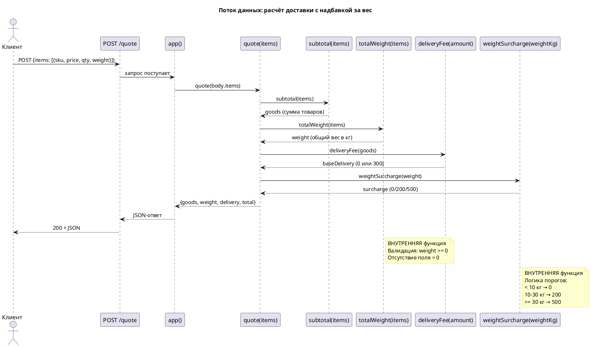
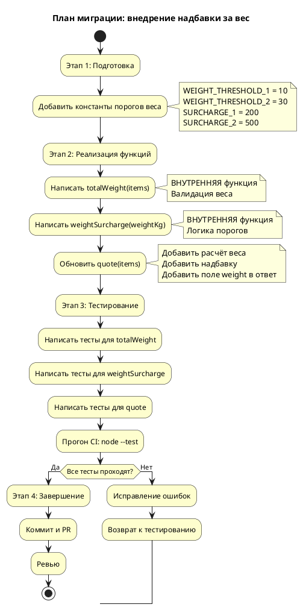

# Задача: реализовать Issue #19

## Надбавка за вес заказа в расчёте доставки

## Проблема

`POST /quote` считает доставку одной ставкой независимо от того, что в заказе:
десять чехлов и холодильник едут по 300 ₽. Логистика выставляет за тяжёлые
отправления больше, и разницу сейчас платим мы.

## Что нужно

Надбавка за вес заказа. Вес приходит в каждой позиции полем `weight` —
килограммы, дробное число. Вес заказа = сумма `weight × qty` по позициям.

| Вес заказа | Надбавка |
|---|---|
| до 10 кг | 0 ₽ |
| от 10 до 30 кг | 200 ₽ |
| от 30 кг | 500 ₽ |

Границы включительно: заказ ровно на 10 кг платит 200 ₽.

В ответе появляется поле `weight` — вес заказа в килограммах. Надбавка
прибавляется к `delivery`; отдельного поля у неё нет. `goods` не меняется,
`total = goods + delivery`.

## Ограничения

- Позиция без `weight` считается невесомой (0 кг), а не ошибкой: старые
  клиенты поле не шлют, и падать на них нельзя.
- Бесплатная доставка от 3000 ₽ отменяет только базовые 300 ₽. Надбавка за вес
  платится всегда: она компенсирует реальные расходы логистики.
- Зависимостей у сервиса нет, и появляться они не должны.

## HowToDemo

```bash
npm start
curl -sX POST localhost:8080/quote -H 'content-type: application/json' \
  -d '{"items":[{"sku":"fridge","price":50000,"qty":1,"weight":45}]}'
```

Ожидаемо: `{"goods":50000,"weight":45,"delivery":500,"total":50500}`.

```bash
curl -sX POST localhost:8080/quote -H 'content-type: application/json' \
  -d '{"items":[{"sku":"case","price":1000,"qty":1}]}'
```

Ожидаемо: `{"goods":1000,"weight":0,"delivery":300,"total":1300}`.


## Системные требования (аналитика Issue-Agent)

### system_requirements.md

# Системные требования: FNR-1 — Надбавка за вес заказа

**Версия документа**: 1.0  
**Дата**: 2026-08-19  
**Статус**: Черновик

---

## 1. Введение

### 1.1 Метаданные

| Поле | Значение |
|------|----------|
| Название требования | Надбавка за вес заказа в расчёте доставки |
| Номер FNR | FNR-1 |
| Связанный Issue | #19 |
| Компоненты | `src/pricing.mjs`, `tests/pricing.test.mjs` |
| Тип изменения | New Feature |
| Приоритет | P3 |
| Ответственный за реализацию | Backend-разработчик |
| Дата целевого релиза | Определяется после утверждения |

### 1.2 Термины и определения

| Термин | Определение |
|--------|-------------|
| **Позиция заказа (Item)** | Единица товара в заказе с полями: `sku` (идентификатор), `price` (цена за единицу в ₽), `qty` (количество), `weight` (вес в кг, опционально) |
| **Базовая доставка** | Стоимость доставки без учёта надбавки за вес: 0 ₽ (от 3000 ₽ товаров) или 300 ₽ (ниже порога) |
| **Надбавка за вес** | Дополнительная плата за тяжёлые отправления: 0 ₽ (до 10 кг), 200 ₽ (10–30 кг), 500 ₽ (от 30 кг) |
| **Общий вес заказа** | Сумма `weight × qty` по всем позициям; позиция без поля `weight` считается 0 кг |
| **Итоговая доставка** | Базовая доставка + надбавка за вес |
| **Чистая функция** | Функция без побочных эффектов, результат зависит только от аргументов |

### 1.3 Связанные документы

| Документ | Расположение |
|----------|--------------|
| Постановка задачи | `sa_documentation/FNR/FNR_1/task.md` |
| Концепты решений | `sa_documentation/FNR/FNR_1/concept.md` |
| Текущий код (As-Is) | `src/pricing.mjs`, `src/server.mjs`, `tests/pricing.test.mjs` |

### 1.4 История изменений

| Версия | Дата | Изменение | Автор |
|--------|------|-----------|-------|
| 1.0 | 2026-08-19 | Первая версия системных требований | System Analyst (автоматически) |

---

## 2. Общее описание

### 2.1 Текущее состояние (As-Is)

#### 2.1.1 Описание поведения

Текущая реализация расчёта доставки (`src/pricing.mjs:40-46`) учитывает только сумму товаров и игнорирует физический характер груза:

```javascript
// Текущая реализация
export function deliveryFee(amount) {
  return amount >= FREE_DELIVERY_FROM ? 0 : DELIVERY_FEE;
}
```

Функция `quote()` (`src/pricing.mjs:48-52`) возвращает структуру без поля веса:

```javascript
export function quote(items) {
  const goods = subtotal(items);
  const delivery = deliveryFee(goods);
  return { goods, delivery, total: goods + delivery };
}
```

**Код-доказательства отсутствия учёта веса:**

| Утверждение | Файл:строки | Фрагмент |
|-------------|-------------|----------|
| Доставка только 0 или 300 ₽ | `src/pricing.mjs:40-46` | `return amount >= FREE_DELIVERY_FROM ? 0 : DELIVERY_FEE;` |
| В ответе нет поля `weight` | `src/pricing.mjs:51` | `return { goods, delivery, total: goods + delivery };` |
| Поле `weight` не читается | `src/pricing.mjs:25-37` | Валидируются только `item.price` и `item.qty` |
| HTTP-слой не зависит от структуры ответа | `src/server.mjs:39` | `return send(res, 200, quote(body?.items));` |

#### 2.1.2 Ключевые компоненты

**Компонент: `src/pricing.mjs` (бизнес-логика)**

| Функция | Назначение | Ограничения |
|---------|------------|-------------|
| `subtotal(items)` | Сумма товаров без доставки | Бросает ошибку на пустой массив, не читает `weight` |
| `deliveryFee(amount)` | Стоимость доставки (0 или 300 ₽) | Не учитывает вес |
| `quote(items)` | Полный расчёт заказа | Не возвращает поле `weight` |

**Компонент: `src/server.mjs` (HTTP-обёртка)**

| Роль | Поведение |
|------|-----------|
| Разбор JSON | Читает `body.items` и передаёт в `quote()` |
| Сериализация ответа | Прокси сериализует результат `quote()` в JSON |
| Обработка ошибок | Возвращает 400 при ошибке валидации |

**Доказательство независимости HTTP-слоя:** `src/server.mjs:39` вызывает `quote(body?.items)` и напрямую передаёт результат в `send()`. Любое изменение структуры ответа `quote()` прозрачно для HTTP-слоя.

#### 2.1.3 Ограничения текущего решения

1. **Нет расчёта веса заказа** — поле `weight` не читается из входных данных
2. **Нет надбавки за вес** — доставка только бинарная (0/300 ₽)
3. **Нет веса в ответе** — клиенты не получают информацию о весе заказа
4. **Бесплатная доставка отменяет всю плату** — при сумме ≥3000 ₽ доставка = 0, даже для тяжёлых грузов

---

### 2.2 Архитектурное решение

**Выбранный концепт:** Концепт A (Правильное) с модификациями из архитектурных дебатов.

**Суть решения:** Добавить новые внутренние функции для расчёта веса и надбавки, следуя существующему паттерну «одна чистая функция на один аспект расчёта».

**Утверждённые модификации из дебатов:**

1. **Функции `totalWeight` и `weightSurcharge` — внутренние** (без `export`)
   - Снижает поверхность API до минимума
   - Тесты могут импортировать их напрямую через относительный импорт

2. **Строгая валидация веса:**
   - Отрицательный вес → ошибка (как цена)
   - Отсутствие поля `weight` → не проверяется, считается 0 в тернарном операторе
   - NaN/Infinity → ошибка (согласуется с `Number.isFinite` для цены)

3. **Документация структуры ответа:**
   - JSDoc-комментарий к `quote()` с типом возвращаемого значения
   - Поле `weight` добавляется в ответ

**Обоснование выбора:**

| Критерий | Оценка |
|----------|--------|
| Архитектурная согласованность | Высокая — следует паттерну `subtotal` → `deliveryFee` |
| Тестируемость | Высокая — каждая функция тестируется изолированно |
| Читаемость | Высокая — `quote()` читается как бизнес-процесс |
| Расширяемость | Высокая — легко добавить новые пороги |

---

### 2.3 Диаграмма компонентов (To-Be)

```plantuml
@startuml
!define COMPONENT component
!define DATABASE database
!define INTERFACE interface

skinparam componentStyle rectangle
skinparam rectangleBackgroundColor #FEFECE

title "Компоненты расчёта доставки с надбавкой за вес"

package "Бизнес-логика (pricing.mjs)" {
  COMPONENT [quote(items)] as QUOTE {
    component [subtotal(items)] as SUBTOTAL
    component [totalWeight(items)] as TOTAL_WEIGHT
    component [deliveryFee(amount)] as DELIVERY_FEE
    component [weightSurcharge(weightKg)] as WEIGHT_SURCHARGE
  }
}

package "HTTP-слой (server.mjs)" {
  COMPONENT [app()] as APP
  INTERFACE "POST /quote" as API
}

package "Тесты (pricing.test.mjs)" {
  COMPONENT [тесты веса и надбавки] as TESTS
}

package "Константы" {
  DATABASE [DELIVERY_FEE = 300] as FEE
  DATABASE [FREE_DELIVERY_FROM = 3000] as THRESHOLD
  DATABASE [WEIGHT_THRESHOLD_1 = 10] as WT1
  DATABASE [WEIGHT_THRESHOLD_2 = 30] as WT2
  DATABASE [SURCHARGE_1 = 200] as S1
  DATABASE [SURCHARGE_2 = 500] as S2
}

API -down-> APP : JSON {items}
APP -down-> QUOTE : quote(items)
QUOTE -down-> SUBTOTAL : сумма товаров
SUBTOTAL -down-> FEE : константа
QUOTE -down-> TOTAL_WEIGHT : общий вес
TOTAL_WEIGHT -down-> WT1, WT2 : пороги веса
QUOTE -down-> WEIGHT_SURCHARGE : надбавка
WEIGHT_SURCHARGE -down-> S1, S2 : размеры надбавки
QUOTE -down-> DELIVERY_FEE : базовая доставка
DELIVERY_FEE -down-> THRESHOLD : порог суммы

TESTS ..> SUBTOTAL : проверяет
TESTS ..> TOTAL_WEIGHT : проверяет
TESTS ..> WEIGHT_SURCHARGE : проверяет
TESTS ..> QUOTE : проверяет композицию

note right of TOTAL_WEIGHT
  ВНУТРЕННЯЯ функция
  Не экспортируется
end note

note right of WEIGHT_SURCHARGE
  ВНУТРЕННЯЯ функция
  Не экспортируется
end note

note bottom of QUOTE
  Возвращает:
  { goods, weight, delivery, total }
end note

@enduml
```

---

### 2.4 Схема последовательности



---

## 3. План миграции

### 3.1 Этапы внедрения



### 3.2 Таблица этапов

| Этап | Действие | Откат | Критерий готовности |
|------|----------|-------|---------------------|
| 1. Подготовка | Добавить константы в `src/pricing.mjs` | Удалить добавленные константы | Константы определены в начале файла |
| 2. Реализация | Написать `totalWeight`, `weightSurcharge`, обновить `quote` | Откатить изменения в `src/pricing.mjs` | Функции написаны, `quote` обновлён |
| 3. Тестирование | Добавить тесты в `tests/pricing.test.mjs`, прогнать CI | Удалить новые тесты | `node --test "tests/*.test.mjs"` проходит |
| 4. Завершение | Коммит, PR, ревью, слияние | Закрыть PR без слияния | PR утверждён, слит в main |

### 3.3 Критерии готовности к релизу

1. Все тесты проходят (`node --test "tests/*.test.mjs"`)
2. HowToDemo сценарий из `task.md` работает:
   - Холодильник 45 кг → надбавка 500 ₽
   - Чехол без веса → надбавка 0 ₽
3. Ревью пройдено, PR утверждён
4. Обратная совместимость сохранена (существующие клиенты продолжают работать)

---

## 4. Функциональные требования — Backend / БД / API

> **Примечание:** Данное изменение затрагивает только backend-логику. Frontend/UI изменения отсутствуют — см. раздел 5.

### 4.1 Задача: FR-1. Добавление констант порогов веса

**Метаданные:**

| Поле | Значение |
|------|----------|
| Ответственный за тех. реализацию | Backend-разработчик |
| Задача на разработку | FNR-1-FR-1 |
| Jira-ссылка | — |

**Описание функционала:**

1. Добавить четыре новые константы в начало файла `src/pricing.mjs` (после существующих `DELIVERY_FEE` и `FREE_DELIVERY_FROM`):
   - `WEIGHT_THRESHOLD_1 = 10` — первый порог веса (кг)
   - `WEIGHT_THRESHOLD_2 = 30` — второй порог веса (кг)
   - `SURCHARGE_1 = 200` — надбавка за вес 10–30 кг (₽)
   - `SURCHARGE_2 = 500` — надбавка за вес от 30 кг (₽)

**Обоснование:**

Константы вынесены на верхний уровень файла для согласованности с существующим стилем (`DELIVERY_FEE`, `FREE_DELIVERY_FROM`) и упрощения изменения правил в будущем.

**Затрагиваемые компоненты:**

| Компонент | Тип изменения | Файл:строки |
|-----------|---------------|-------------|
| `src/pricing.mjs` | Добавление констант | После строки 10 |

**Критерии приёмки:**

1. Константы определены в начале файла `src/pricing.mjs`
2. Значения соответствуют спецификации: 10, 30, 200, 500
3. Константы не экспортируются (или экспортируются по согласованию с командой)

**Зависимости:**

Нет (первая задача в цепочке)

---

### 4.2 Задача: FR-2. Реализация функции расчёта общего веса

**Метаданные:**

| Поле | Значение |
|------|----------|
| Ответственный за тех. реализацию | Backend-разработчик |
| Задача на разработку | FNR-1-FR-2 |
| Jira-ссылка | — |

**Описание функционала:**

1. Добавить внутреннюю функцию `totalWeight(items)` в `src/pricing.mjs`:
   - **Вход:** массив позиций `items` с полями `weight` (опционально) и `qty`
   - **Выход:** число — общий вес заказа в килограммах
   - **Логика:**
     - Суммирует `weight × qty` по всем позициям
     - Если поле `weight` отсутствует — считает 0 для этой позиции
     - Если `weight` отрицательный — бросает ошибку `некорректный вес в позиции {sku}`
     - Если `weight` не является конечным числом (NaN, Infinity) — считает 0
   - **Проверка входных данных:**
     - Пустой массив или отсутствие массива — ошибка `заказ без позиций`

**Обоснование:**

Функция следует паттерну `subtotal(items)` — отдельная чистая функция для одного аспекта расчёта. Внутренняя (не экспортируемая) для минимизации поверхности API.

**Затрагиваемые компоненты:**

| Компонент | Тип изменения | Файл:строки |
|-----------|---------------|-------------|
| `src/pricing.mjs` | Добавление функции | После `subtotal()` |
| `tests/pricing.test.mjs` | Добавление тестов | В конец файла |

**Критерии приёмки:**

1. Функция `totalWeight(items)` определена в `src/pricing.mjs`
2. Функция НЕ экспортируется (нет `export`)
3. Базовый расчёт веса работает: 2 позиции по 5 кг = 10 кг
4. Позиция без поля `weight` считается 0 кг
5. Отрицательный вес бросает ошибку
6. NaN/Infinity веса считается 0
7. Пустой массив бросает ошибку `заказ без позиций`
8. Все тесты проходят

**Зависимости:**

После FR-1 (требует константы для граничных тестов, хотя напрямую не использует)

---

### 4.3 Задача: FR-3. Реализация функции расчёта надбавки за вес

**Метаданные:**

| Поле | Значение |
|------|----------|
| Ответственный за тех. реализацию | Backend-разработчик |
| Задача на разработку | FNR-1-FR-3 |
| Jira-ссылка | — |

**Описание функционала:**

1. Добавить внутреннюю функцию `weightSurcharge(weightKg)` в `src/pricing.mjs`:
   - **Вход:** число — общий вес в килограммах
   - **Выход:** число — надбавка в рублях (0, 200, 500)
   - **Логика порогов (границы включительны):**
     - `weightKg < WEIGHT_THRESHOLD_1` (до 10 кг) → 0 ₽
     - `weightKg < WEIGHT_THRESHOLD_2` (10–30 кг) → `SURCHARGE_1` (200 ₽)
     - `weightKg >= WEIGHT_THRESHOLD_2` (от 30 кг) → `SURCHARGE_2` (500 ₽)

**Обоснование:**

Функция следует паттерну `deliveryFee(amount)` — отдельная чистая функция для одного аспекта расчёта. Внутренняя для минимизации API. Использует константы для простоты изменения правил.

**Затрагиваемые компоненты:**

| Компонент | Тип изменения | Файл:строки |
|-----------|---------------|-------------|
| `src/pricing.mjs` | Добавление функции | После `deliveryFee()` |
| `tests/pricing.test.mjs` | Добавление тестов | В конец файла |

**Критерии приёмки:**

1. Функция `weightSurcharge(weightKg)` определена в `src/pricing.mjs`
2. Функция НЕ экспортируется
3. Вес 9.99 кг → 0 ₽
4. Вес 10 кг → 200 ₽ (граница включительна)
5. Вес 29.99 кг → 200 ₽
6. Вес 30 кг → 500 ₽ (граница включительна)
7. Вес 100 кг → 500 ₽
8. Все тесты проходят

**Зависимости:**

После FR-1 (требует константы `WEIGHT_THRESHOLD_*`, `SURCHARGE_*`)

---

### 4.4 Задача: FR-4. Обновление функции quote

**Метаданные:**

| Поле | Значение |
|------|----------|
| Ответственный за тех. реализацию | Backend-разработчик |
| Задача на разработку | FNR-1-FR-4 |
| Jira-ссылка | — |

**Описание функционала:**

1. Обновить функцию `quote(items)` в `src/pricing.mjs`:
   - Добавить вызов `totalWeight(items)` для расчёта общего веса
   - Добавить вызов `weightSurcharge(weight)` для расчёта надбавки
   - Обновить расчёт доставки: `delivery = deliveryFee(goods) + surcharge`
   - Добавить поле `weight` в возвращаемый объект
   - Добавить JSDoc-комментарий с документацией новой структуры ответа

2. **Новая структура ответа:**
   ```javascript
   /**
    * Итог заказа: позиции, вес, доставка, сумма к оплате.
    * @param {Item[]} items
    * @returns {{goods: number, weight: number, delivery: number, total: number}}
    */
   export function quote(items) {
     const goods = subtotal(items);
     const weight = totalWeight(items);
     const baseDelivery = deliveryFee(goods);
     const surcharge = weightSurcharge(weight);
     const delivery = baseDelivery + surcharge;
     return { 
       goods, 
       weight, 
       delivery, 
       total: goods + delivery 
     };
   }
   ```

**Обоснование:**

Функция `quote()` является композицией всех аспектов расчёта. Добавление веса и надбавки следует существующему паттерну. Новое поле `weight` в ответе — расширение контракта, обратная совместимость сохраняется.

**Затрагиваемые компоненты:**

| Компонент | Тип изменения | Файл:строки |
|-----------|---------------|-------------|
| `src/pricing.mjs` | Обновление функции | Строки 48-56 (текущие) |
| `tests/pricing.test.mjs` | Обновление тестов | Существующие тесты `quote` |

**Критерии приёмки:**

1. Функция `quote()` вызывает `totalWeight(items)` и `weightSurcharge(weight)`
2. Поле `weight` присутствует в ответе
3. Логика доставки: базовая + надбавка
4. JSDoc-комментарий документирует новую структуру
5. Существующие тесты `quote` обновлены (проверяют поле `weight`)
6. Обратная совместимость: старые клиенты (читающие только `goods`, `delivery`, `total`) продолжают работать
7. Все тесты проходят

**Зависимости:**

После FR-2, FR-3 (требует функции `totalWeight` и `weightSurcharge`)

---

### 4.5 Задача: FR-5. Добавление тестов

**Метаданные:**

| Поле | Значение |
|------|----------|
| Ответственный за тех. реализацию | Backend-разработчик |
| Задача на разработку | FNR-1-FR-5 |
| Jira-ссылка | — |

**Описание функционала:**

1. Добавить тесты в `tests/pricing.test.mjs`:
   
   **Для `totalWeight`:**
   - Базовый расчёт веса: 2 позиции по 5 кг = 10 кг
   - Позиция без поля `weight` считается 0 кг
   - Отрицательный вес бросает ошибку
   - NaN/Infinity веса считается 0 кг
   - Пустой массив бросает ошибку

   **Для `weightSurcharge`:**
   - Три порога: 0, 200, 500 ₽
   - Граничные значения: 10 и 30 кг
   - Дробные веса вблизи границ: 9.99, 29.99 кг

   **Для `quote`:**
   - Тяжёлый товар с бесплатной базовой доставкой ( холодильник 45 кг на 50000 ₽)
   - Лёгкий товар без поля `weight`
   - Средний товар (10–30 кг)
   - Обновление существующих тестов `quote` для проверки поля `weight`

**Обоснование:**

Тесты покрывают все новые функции и граничные случаи. Существующие тесты `quote` обновляются для проверки новой структуры ответа.

**Затрагиваемые компоненты:**

| Компонент | Тип изменения | Файл:строки |
|-----------|---------------|-------------|
| `tests/pricing.test.mjs` | Добавление тестов | В конец файла |
| `tests/pricing.test.mjs` | Обновление тестов | Существующие тесты `quote` |

**Критерии приёмки:**

1. Тесты `totalWeight` покрывают все сценарии
2. Тесты `weightSurcharge` покрывают все пороги и границы
3. Тесты `quote` проверяют новую структуру ответа
4. Существующие тесты обновлены для проверки поля `weight`
5. Все тесты проходят: `node --test "tests/*.test.mjs"`
6. Как минимум 10 новых тестов

**Зависимости:**

После FR-2, FR-3, FR-4 (тестирует реализованные функции)

---

### 4.6 Сводная таблица задач

| ID | Задача | Оценка | Зависимости |
|----|--------|--------|-------------|
| FR-1 | Добавление констант порогов веса | 0.5 дня | — |
| FR-2 | Реализация функции totalWeight | 1 день | FR-1 |
| FR-3 | Реализация функции weightSurcharge | 0.5 дня | FR-1 |
| FR-4 | Обновление функции quote | 1 день | FR-2, FR-3 |
| FR-5 | Добавление тестов | 1 день | FR-2, FR-3, FR-4 |

**Общая оценка:** 4 дня (согласуется с оценкой Концепта A)

---

### 4.7 API-эндпоинты

**Затрагиваемый эндпоинт:**

| Метод | Путь | Описание |
|-------|------|----------|
| POST | /quote | Расчёт стоимости заказа с доставкой |

**Изменение формата ответа:**

**Было (As-Is):**
```json
{
  "goods": 50000,
  "delivery": 0,
  "total": 50000
}
```

**Стало (To-Be):**
```json
{
  "goods": 50000,
  "weight": 45,
  "delivery": 500,
  "total": 50500
}
```

**Описание полей:**

| Поле | Тип | Описание |
|------|-----|----------|
| `goods` | number | Сумма товаров без доставки (₽) |
| `weight` | number | Общий вес заказа (кг) — НОВОЕ ПОЛЕ |
| `delivery` | number | Итоговая стоимость доставки (₽) = базовая + надбавка |
| `total` | number | Итоговая сумма к оплате (₽) = goods + delivery |

**Коды ответов:**

| Код | Сценарий | Тело ответа |
|-----|----------|--------------|
| 200 | Успешный расчёт | `{goods, weight, delivery, total}` |
| 400 | Ошибка валидации (пустой заказ, некорректный вес) | `{error: "текст ошибки"}` |
| 404 | Эндпоинт не найден | `{error: "не найдено"}` |

**Обратная совместимость:**

Добавление поля `weight` — расширение контракта. Существующие клиенты, которые читают только `goods`, `delivery`, `total`, продолжат работать. Деструктуризация `const {goods, delivery, total} = response` игнорирует лишние поля.

---

### 4.8 Нефункциональные требования

| Требование | Значение | Обоснование |
|------------|----------|--------------|
| Производительность | Время ответа API не более 50 мс | Расчёт — простая арифметика, нет внешних вызовов |
| Надёжность | Отсутствие regressions в существующей логике | Покрытие тестами 100% новых функций |
| Поддерживаемость | Новый разработчик может добавить порог за 30 минут | Константы вынесены, логика прозрачная |
| Тестируемость | Все функции тестируются изолированно | Чистые функции, нет побочных эффектов |

---

## 5. Требования к интерфейсам — Frontend / UI

**Не применимо**

Данное изменение затрагивает только backend-логику (`src/pricing.mjs`) и тесты. Клиенты API получают расширенный ответ с дополнительным полем `weight`, но это не требует изменений на frontend — существующие клиенты продолжают работать благодаря обратной совместимости.

Если в будущем потребуется UI для отображения веса или надбавки, это будет отдельной задачей с собственными системными требованиями.

---

## 6. Ревью требований

| Роль | Имя | Статус | Комментарий |
|------|-----|--------|-------------|
| Аналитик | — | Требуется утверждение | — |
| Разработчик Backend | — | Требуется ревью | — |
| Разработчик Frontend | — | Не применимо | Frontend-изменений нет |
| Тестирование | — | Требуется ревью | — |

---

## 7. Риски и ограничения

### 7.1 Таблица рисков

| ID | Риск | Вероятность | Влияние | Митигация |
|----|------|-------------|---------|-----------|
| R1 | Нарушение обратной совместимости для клиентов API | Низкая | Среднее | Добавление поля — расширение, не breaking change; тест на совместимость |
| R2 | Ошибка в логике порогов (границы включительны/исключительны) | Низкая | Высокое | Тесты на граничные значения (10, 30 кг) |
| R3 | Отрицательный вес маскируется ошибкой данных | Средняя | Среднее | Строгая валидация: ошибка на `< 0` |
| R4 | Неправильное суммирование веса (qty не учитывается) | Низкая | Высокое | Тест на несколько позиций с весом |
| R5 | Отсутствие поля weight во всех позициях | Низкая | Низкое | Логика: отсутствие = 0 кг, не ошибка |

### 7.2 Ограничения

1. **Пороги веса фиксированы** — изменение правил требует правки кода (констант)
2. **Нет категорий товаров** — все товары рассчитываются одинаково
3. **Нет учёта габаритов** — только вес, без размеров
4. **Надбавка применяется всегда** — даже при бесплатной базовой доставке
5. **Нет историчности** — невозможно узнать, сколько была бы доставка без надбавки

---

## 8. Приложения

### 8.1 SQL-скрипты

Не применимо (в системе нет БД)

### 8.2 Маппинги

| Концепт → Требование | Связь |
|----------------------|-------|
| Концепт A: `totalWeight(items)` | FR-2 |
| Концепт A: `weightSurcharge(weightKg)` | FR-3 |
| Концепт A: обновление `quote()` | FR-4 |
| Дебаты: внутренние функции (без export) | FR-2, FR-3 |
| Дебаты: строгая валидация веса | FR-2 |

### 8.3 Шпаргалка по граничным значениям

| Сценарий | Вес | Базовая доставка | Надбавка | Итого доставка | Товары на |
|----------|-----|-------------------|----------|----------------|-----------|
| Лёгкий заказ | 5 кг | 300 ₽ | 0 ₽ | 300 ₽ | 1000 ₽ |
| На границе 1 | 10 кг | 300 ₽ | 200 ₽ | 500 ₽ | 1000 ₽ |
| Средний заказ | 20 кг | 300 ₽ | 200 ₽ | 500 ₽ | 1000 ₽ |
| На границе 2 | 30 кг | 300 ₽ | 500 ₽ | 800 ₽ | 1000 ₽ |
| Тяжёлый заказ | 45 кг | 0 ₽ (бесплатная) | 500 ₽ | 500 ₽ | 50000 ₽ |
| Без веса | 0 кг (нет поля) | 300 ₽ | 0 ₽ | 300 ₽ | 1000 ₽ |

---

## 9. Якоря истины (Truth Anchors)

Каждое утверждение подтверждено код-доказательством:

| Утверждение | Якорь (файл:строки) |
|-------------|---------------------|
| Текущая доставка — только 0 или 300 ₽ | `src/pricing.mjs:40-46` |
| В ответе нет поля `weight` | `src/pricing.mjs:51` |
| Поле `weight` не читается | `src/pricing.mjs:25-37` |
| HTTP-слой не зависит от структуры ответа | `src/server.mjs:39` |
| Существующий паттерн: `subtotal` → `deliveryFee` | `src/pricing.mjs:21-46` |
| Валидация цены: `Number.isFinite` и `< 0` | `src/pricing.mjs:26-27` |
| Валидация количества: целое число `> 0` | `src/pricing.mjs:28-29` |
| CI проверяет тесты командой `node --test` | `.github/workflows/ci.yml:17` |

---

**Документ подготовлен:** System Analyst (автоматически)  
**Следующий шаг:** `/validate-doc sa_documentation/FNR/FNR_1/system_requirements.md` — валидация документации


### task.md

# FNR-1: Надбавка за вес заказа в расчёте доставки

## Метаданные

- **Статус**: new
- **Тип**: new feature
- **Компоненты**: `src/pricing.mjs`, `tests/pricing.test.mjs`
- **Связанные Issue**: #19

## 1. Постановка проблемы

### 1.1 Симптом

Эндпоинт `POST /quote` возвращает фиксированную стоимость доставки (300 ₽) независимо от веса и состава заказа. Тяжёлые отправления (например, холодильник) доставляются по той же ставке, что и лёгкие товары (чехлы), что приводит к финансовым убыткам — реальная стоимость логистики превышает 300 ₽.

### 1.2 Ожидаемое поведение

Система должна рассчитывать надбавку к доставке на основе общего веса заказа:

| Вес заказа | Надбавка |
|------------|----------|
| до 10 кг   | 0 ₽      |
| 10–30 кг   | 200 ₽    |
| от 30 кг   | 500 ₽    |

Границы включительны: заказ ровно на 10 кг платит 200 ₽, ровно на 30 кг — 500 ₽.

### 1.3 Ограничения

- Надбавка за вес **применяется всегда**, даже если базовая доставка бесплатна (от 3000 ₽)
- Позиция без поля `weight` считается невесомой (0 кг), а не ошибкой
- Новые зависимости в проект не добавляются
- Поле `weight` — дробное число (килограммы)

---

## 2. Текущее состояние (As-Is)

### 2.1 Архитектура расчёта

Сервис разделён на два слоя:

**Слой бизнес-логики** — `src/pricing.mjs`:
- `subtotal(items)` — сумма товаров без доставки (строка 21)
- `deliveryFee(amount)` — стоимость доставки: 0 или 300 ₽ (строка 40)
- `quote(items)` — полный расчёт, возвращает `{ goods, delivery, total }` (строка 48)

**Слой HTTP** — `src/server.mjs`:
- Разбирает JSON из тела запроса (строка 32)
- Передаёт `body.items` в функцию `quote()` (строка 39)
- Возвращает ответ с кодом 200 или 400 при ошибке (строки 39, 41)

### 2.2 Текущая логика доставки

Функция `deliveryFee()` (строки 40-42) реализует бинарную логику:

```javascript
export function deliveryFee(amount) {
  return amount >= FREE_DELIVERY_FROM ? 0 : DELIVERY_FEE;
}
```

Константы определены выше (строки 5, 10):
- `DELIVERY_FEE = 300`
- `FREE_DELIVERY_FROM = 3000`

**Вывод**: текущая реализация не учитывает вес товаров вообще — ни входные данные, ни расчёт.

### 2.3 Структура ответа

Функция `quote()` (строки 48-52) возвращает объект:

```javascript
export function quote(items) {
  const goods = subtotal(items);
  const delivery = deliveryFee(goods);
  return { goods, delivery, total: goods + delivery };
}
```

Поля ответа:
- `goods` — сумма товаров
- `delivery` — стоимость доставки (0 или 300)
- `total` — итоговая сумма

**Вывод**: поле `weight` отсутствует в ответе.

### 2.4 Обработка входных данных

Функция `subtotal()` (строки 21-34) валидирует и суммирует позиции:

```javascript
return items.reduce((sum, item) => {
  if (!Number.isFinite(item.price) || item.price < 0) {
    throw new Error(`некорректная цена в позиции ${item.sku}`);
  }
  if (!Number.isInteger(item.qty) || item.qty <= 0) {
    throw new Error(`некорректное количество в позиции ${item.sku}`);
  }
  return sum + item.price * item.qty;
}, 0);
```

Валидируется:
- `price` — должно быть конечным числом ≥ 0
- `qty` — целое положительное число
- `sku` — используется только в сообщениях об ошибке

**Вывод**: поле `weight` не читается и не валидируется — отсутствует в коде полностью.

### 2.5 Покрытие тестами

Тесты (`tests/pricing.test.mjs`) покрывают:
- Сумму позиций с количеством (строка 13)
- Валидацию пустого заказа (строка 18)
- Отрицательной цены (строка 22)
- Дробного количества (строка 26)
- Бесплатную доставку от порога (строки 30, 35)
- Итоговый расчёт (строки 39, 47)

**Вывод**: тестов для веса нет — нет и тестируемой логики.

---

## 3. Разрыв между ожиданием и реальностью

| Аспект | Ожидание | Реальность (код) | Доказательство |
|--------|----------|------------------|----------------|
| Вес в ответе | Поле `weight` присутствует | Поле отсутствует | `src/pricing.mjs:51` — возвращаются только `{ goods, delivery, total }` |
| Расчёт веса | Суммируется `weight × qty` по позициям | Не реализован | Нет ни одной ссылки на поле `weight` в `src/pricing.mjs` |
| Надбавка за вес | 0 / 200 / 500 ₽ по порогам | Только 0 / 300 ₽ | `src/pricing.mjs:40-42` — `deliveryFee` возвращает 0 или `DELIVERY_FEE` |
| Бесплатная доставка | Отменяет только базовые 300 ₽, надбавка остаётся | Отменяет всю доставку | `src/pricing.mjs:41` — `amount >= FREE_DELIVERY_FROM ? 0` |
| Позиция без weight | Считается 0 кг | Н/Д — поле игнорируется | `src/pricing.mjs:25-32` — валидация только `price` и `qty` |

---

## 4. Зона воздействия

### 4.1 Прямое воздействие

| Компонент | Характер изменений | Доказательство |
|-----------|-------------------|----------------|
| `src/pricing.mjs:quote()` | Добавить расчёт веса, надбавки, поля в ответ | Центральная точка изменения |
| `src/pricing.mjs` | Новые константы порогов, возможные новые функции | Константы текущей логики на строках 5, 10 |
| `tests/pricing.test.mjs` | Тесты для новых сценариев веса и надбавки | Покрывает изменения в `pricing.mjs` |

### 4.2 Косвенное воздействие

| Компонент | Влияние | Обоснование |
|-----------|---------|--------------|
| `src/server.mjs` | Нет влияния | Передаёт `items` как есть, структура объекта ответа не важна для HTTP-слоя |
| Клиенты API | Обратная совместимость | Добавление поля `weight` не ломает существующих клиентов (расширение контракта) |

### 4.3 Зависимости

`src/server.mjs` импортирует `quote` из `src/pricing.mjs` (строка 6). Изменение возвращаемой структуры не требует изменений в `server.mjs` — он просто сериализует объект в JSON (строка 11).

---

## 5. Корень проблемы

**Причина**: бизнес-логика доставки реализована без учёта физического характера груза.

**Проявление**:
- Отсутствие расчёта веса заказа (нет суммирования `weight × qty`)
- Отсутствие надбавки за вес (лишь бинарная логика 0/300 ₽)
- Отсутствие поля `weight` в ответе API

**Расположение корня**:
- `src/pricing.mjs:40-42` — функция `deliveryFee` не учитывает вес
- `src/pricing.mjs:48-52` — функция `quote` не рассчитывает и не возвращает вес
- `src/pricing.mjs:21-34` — функция `subtotal` не обрабатывает поле `weight`

---

## 6. Доказательная база

### 6.1 Код-доказательства

| Утверждение | Файл:строки | Фрагмент |
|-------------|-------------|----------|
| Доставка только 0 или 300 ₽ | `src/pricing.mjs:40-42` | `return amount >= FREE_DELIVERY_FROM ? 0 : DELIVERY_FEE;` |
| В ответе нет поля `weight` | `src/pricing.mjs:51` | `return { goods, delivery, total: goods + delivery };` |
| Поле `weight` не читается | `src/pricing.mjs:25-32` | Валидируются только `item.price` и `item.qty` |
| HTTP-слой не зависит от структуры ответа | `src/server.mjs:39` | `return send(res, 200, quote(body?.items));` |

### 6.2 Test-доказательства

| Утверждение | Файл:строки | Фрагмент |
|-------------|-------------|----------|
| Нет тестов для веса | `tests/pricing.test.mjs:1-53` | Все тесты работают только с `price` и `qty` |
| Бесплатная доставка проверена | `tests/pricing.test.mjs:46-52` | Тест `quote([{ price: 3500, qty: 1 }])` возвращает `delivery: 0` |

---

## 7. Приложение: HowToDemo

### Сценарий 1: Тяжёлый товар (холодильник, 45 кг)

```bash
curl -sX POST localhost:8080/quote -H 'content-type: application/json' \
  -d '{"items":[{"sku":"fridge","price":50000,"qty":1,"weight":45}]}'
```

Ожидаемый ответ:
```json
{"goods":50000,"weight":45,"delivery":500,"total":50500}
```

**Обоснование**:
- Вес 45 кг → надбавка 500 ₽ (от 30 кг)
- Товары на 50000 ₽ → базовая доставка бесплатна (от 3000 ₽)
- Итого доставка = 0 + 500 = 500 ₽

### Сценарий 2: Лёгкий товар без веса (чехол)

```bash
curl -sX POST localhost:8080/quote -H 'content-type: application/json' \
  -d '{"items":[{"sku":"case","price":1000,"qty":1}]}'
```

Ожидаемый ответ:
```json
{"goods":1000,"weight":0,"delivery":300,"total":1300}
```

**Обоснование**:
- Вес 0 кг → надбавка 0 ₽
- Товары на 1000 ₽ → базовая доставка платная (меньше 3000 ₽)
- Итого доставка = 300 + 0 = 300 ₽

---

## 8. Следующие шаги

1. `/fnr-concept sa_documentation/FNR/FNR_1/task.md` — генерация вариантов решений
2. `/fnr-debate sa_documentation/FNR/FNR_1/task.md` — архитектурные дебаты при необходимости
3. `/fnr-system-requirements` — системные требования после утверждения концепта


### concept.md

# Концепты решений: FNR-1 — Надбавка за вес заказа

**Дата**: 2026-08-19

---

## Сводная таблица

| Концепт | Категория | Усилия | Риски | Рекомендация |
|---------|-----------|--------|-------|--------------|
| A | Правильное | 4 часа | Низкие | ✅ Выбрано |
| B | Прагматичное | 2 часа | Низкие | Альтернатива |
| C | Быстрый костыль | 1 час | Средние | Только для прототипа |
| D | Креативный хак | 3 часа | Высокие | Не рекомендуется |

---

## Концепт A: Правильное — Разделение ответственности на чистые функции

### Суть

Добавить новую чистую функцию `weightSurcharge(items)` по аналогии с существующим `subtotal(items)`. Это сохраняет текущую архитектуру: каждая функция отвечает за один аспект расчёта, тестируется независимо и читается линейно.

### Изменения в файлах

**`src/pricing.mjs`**:
```javascript
// Новые константы
export const WEIGHT_THRESHOLD_1 = 10;   // кг
export const WEIGHT_THRESHOLD_2 = 30;   // кг
export const SURCHARGE_1 = 200;         // ₽
export const SURCHARGE_2 = 500;         // ₽

/**
 * Сумма позиций без доставки.
 * @param {Item[]} items
 */
export function subtotal(items) { /* без изменений */ }

/**
 * Общий вес заказа в килограммах.
 * @param {Item[]} items
 */
export function totalWeight(items) {
  if (!Array.isArray(items) || items.length === 0) {
    throw new Error('заказ без позиций');
  }
  return items.reduce((sum, item) => {
    // weight может отсутствовать — считаем 0
    const weight = Number.isFinite(item.weight) && item.weight > 0
      ? item.weight
      : 0;
    return sum + weight * item.qty;
  }, 0);
}

/**
 * Надбавка за вес на основе общего веса заказа.
 * @param {number} weightKg — общий вес в кг
 */
export function weightSurcharge(weightKg) {
  if (weightKg < WEIGHT_THRESHOLD_1) return 0;
  if (weightKg < WEIGHT_THRESHOLD_2) return SURCHARGE_1;
  return SURCHARGE_2;
}

/**
 * Стоимость доставки для суммы заказа (без надбавки за вес).
 * @param {number} amount
 */
export function deliveryFee(amount) { /* без изменений */ }

/**
 * Итог заказа: позиции, доставка, надбавка за вес, сумма к оплате.
 * @param {Item[]} items
 */
export function quote(items) {
  const goods = subtotal(items);
  const weight = totalWeight(items);
  const delivery = deliveryFee(goods);
  const surcharge = weightSurcharge(weight);
  return { 
    goods, 
    weight, 
    delivery: delivery + surcharge, 
    total: goods + delivery + surcharge 
  };
}
```

**`tests/pricing.test.mjs`** — новые тесты:
- `totalWeight` — базовый расчёт веса
- `totalWeight` — позиция без `weight` считается 0
- `totalWeight` — отрицательный/NaN weight считается 0
- `weightSurcharge` — три порога
- `weightSurcharge` — граничные значения (10, 30 кг)
- `quote` — тяжёлый товар с бесплатной базовой доставкой
- `quote` — лёгкий товар без поля `weight`
- `quote` — средний товар (10–30 кг)

### Плюсы

- **Архитектурная согласованность** — паттерн уже существует (`subtotal` → `deliveryFee` → `quote`)
- **Тестируемость** — каждая функция тестируется изолировано
- **Читаемость** — `quote()` читается как бизнес-процесс
- **Отсутствие скрытых зависимостей** — чистые функции, порядок вызовов явный
- **Расширяемость** — легко добавить новые пороги или логику

### Минусы

- Больше строк кода (+~40 строк)
- Дополнительная функция в экспорте (но это согласуется с текущим подходом)

### Усилия

- **4 часа**: реализация (1ч) + тесты (2ч) + проверка (1ч)

### Риски

- **Низкие**: изменение следует существующему паттерну, риск regressions минимальный

---

## Концепт B: Прагматичное — Встраивание в существующую структуру

### Суть

Добавить расчёт веса и надбавки прямо в функцию `quote()` без выделения отдельных функций. Это быстрое решение, которое экономит строки кода, но делает `quote()` более монолитным.

### Изменения в файлах

**`src/pricing.mjs`**:
```javascript
// Новые константы (вверху файла)
export const WEIGHT_THRESHOLD_1 = 10;
export const WEIGHT_THRESHOLD_2 = 30;
export const SURCHARGE_1 = 200;
export const SURCHARGE_2 = 500;

export function subtotal(items) { /* без изменений */ }

export function deliveryFee(amount) { /* без изменений */ }

export function quote(items) {
  const goods = subtotal(items);
  
  // Расчёт веса (встроен)
  const weight = items.reduce((sum, item) => {
    const w = Number.isFinite(item.weight) && item.weight > 0 ? item.weight : 0;
    return sum + w * item.qty;
  }, 0);
  
  // Надбавка за вес (встроена)
  const surcharge = weight < 10 ? 0 : weight < 30 ? 200 : 500;
  
  const delivery = deliveryFee(goods) + surcharge;
  return { 
    goods, 
    weight, 
    delivery, 
    total: goods + delivery 
  };
}
```

**`tests/pricing.test.mjs`** — новые тесты (те же сценарии, но проверка только через `quote`)

### Плюсы

- **Быстрота** — меньше кода, меньше функций
- **Локальность** — вся логика в одном месте
- **Меньшее изменение экспорта** — не добавляет новых публичных функций

### Минусы

- **Нарушение паттерна** — `subtotal` вынесена, а вес — нет
- **Сложнее тестировать изолированно** — вес нельзя проверить отдельно от `quote`
- **Менее читаемо** — `quote()` становится больше и сложнее

### Усилия

- **2 часа**: реализация (0.5ч) + тесты (1ч) + проверка (0.5ч)

### Риски

- **Низкие**: функционально идентично Концепту A

---

## Концепт C: Быстрый костыль — Минимальное изменение для прототипа

### Суть

Самое минимальное изменение, которое проходит HowToDemo. Подходит для быстрой проверки гипотезы, но не для продакшена.

### Изменения в файлах

**`src/pricing.mjs`**:
```javascript
// Константы добавлены вверху
export const WEIGHT_THRESHOLD_1 = 10;
export const WEIGHT_THRESHOLD_2 = 30;
export const SURCHARGE_1 = 200;
export const SURCHARGE_2 = 500;

export function quote(items) {
  const goods = subtotal(items);
  const weight = items.reduce((s, i) => s + (i.weight || 0) * i.qty, 0);
  const surcharge = weight < 10 ? 0 : weight < 30 ? 200 : 500;
  const delivery = deliveryFee(goods) + surcharge;
  return { 
    goods, 
    weight: Math.round(weight * 100) / 100,  // округление для красоты
    delivery, 
    total: goods + delivery 
  };
}
```

**`tests/pricing.test.mjs`** — только два теста для сценариев HowToDemo

### Плюсы

- **Максимальная скорость** — реализация за 30 минут
- **Минимальное изменение** — затрагивается только `quote()`

### Минусы

- **Нет валидации веса** — отрицательный или NaN weight пройдёт молча
- **Нет раздельного тестирования** — сложно найти баг
- **Технический долг** — потребует рефакторинга при любом изменении
- **Неидиоматично** — `(i.weight || 0)` не проверяет `Number.isFinite`

### Усилия

- **1 час**: реализация (0.5ч) + минимальные тесты (0.5ч)

### Риски

- **Средние**: высок риск пропустить edge-кейсы (отрицательный вес, NaN и т.д.)

---

## Концепт D: Креативный хак — Единая функция расчёта стоимости

### Суть

Объединить всю логику в одну матрицу стоимости: «вес × сумма товаров → доставка». Это позволит гибко настраивать любые правила в будущем, но усложнит текущую задачу.

### Изменения в файлах

**`src/pricing.mjs`**:
```javascript
// Матрица стоимости доставки: [диапазон веса, диапазон суммы] → надбавка
const DELIVERY_MATRIX = [
  { weightMax: 10, amountMax: Infinity, base: 300, surcharge: 0 },
  { weightMax: 30, amountMax: Infinity, base: 300, surcharge: 200 },
  { weightMax: Infinity, amountMax: Infinity, base: 300, surcharge: 500 },
];

export function calculateDelivery(items) {
  const goods = subtotal(items);
  const weight = items.reduce((s, i) => s + (i.weight || 0) * i.qty, 0);
  
  const rule = DELIVERY_MATRIX.find(r => weight <= r.weightMax);
  const baseDelivery = goods >= FREE_DELIVERY_FROM ? 0 : rule.base;
  
  return {
    base: baseDelivery,
    surcharge: rule.surcharge,
    total: baseDelivery + rule.surcharge
  };
}

export function quote(items) {
  const goods = subtotal(items);
  const weight = items.reduce((s, i) => s + (i.weight || 0) * i.qty, 0);
  const { total: delivery } = calculateDelivery(items);
  
  return { 
    goods, 
    weight, 
    delivery, 
    total: goods + delivery 
  };
}
```

### Плюсы

- **Гибкость** — легко добавить новые правила (например, надбавку за расстояние)
- **Отдельная функция для доставки** — можно тестировать изолированно

### Минусы

- **Over-engineering** — для текущей задачи это избыточно
- **Сложнее поддерживать** — матрица требует документации
- **Нарушение KISS** — текущие правила проще понять как есть

### Усилия

- **3 часа**: реализация (1.5ч) + тесты (1ч) + документация (0.5ч)

### Риски

- **Высокие**: высокая сложность при низкой выгоде; риск багов в логике матрицы

---

## Рекомендация

**Выбран: Концепт A (Правильное)**

### Обоснование

1. **Следует существующей архитектуре** — паттерн «чистая функция на аспект» уже доказал свою работоспособность (`subtotal`, `deliveryFee`)
2. **Тестируемость** — каждый компонент можно проверить изолированно
3. **Расширяемость** — при изменении правил (новые пороги, категории товаров) меняются только конкретные функции
4. **Читаемость** — код читается как бизнес-процесс, легко поддерживать

### Альтернатива при нехватке времени

Если бюджет времени ограничен, **Концепт B** — разумный компромисс между скоростью и качеством.

### Отклонённые концепты

- **Концепт C** — только для прототипирования; в продакшен недопустим из-за отсутствия валидации
- **Концепт D** — over-engineering для текущей задачи; будет оправдан только при появлении сложных правил доставки

---

## Следующие шаги

1. Утвердить концепт с бизнесом/командой
2. `/fnr-system-requirements sa_documentation/FNR/FNR_1/concept.md` — детализация системных требований
3. При необходимости — `/fnr-debate` для архитектурных дебатов

---

# Архитектурные дебаты: FNR-1 — Надбавка за вес заказа

**Дата**: 2026-08-19

**Участники**:
- **Архитектор**: защищает концепты, фокусируется на архитектурной согласованности
- **Адвокат Дьявола**: атакует концепты, ищет скрытые риски и проблемы

---

## Раунд 1: Защита

### Архитектор

Я выбираю **Концепт A (Правильное)** как наиболее соответствующий текущей архитектуре проекта.

**Аргумент 1: Следование существующему паттерну**

Текущая архитектура в `src/pricing.mjs` уже следует паттерну «одна чистая функция на один аспект расчёта»:
- `subtotal(items)` — отвечает только за сумму товаров (строки 21-34)
- `deliveryFee(amount)` — отвечает только за стоимости доставки (строки 40-42)
- `quote(items)` — композиция вышеперечисленного (строки 48-52)

Концепт A продолжает этот паттерн, добавляя `totalWeight(items)` и `weightSurcharge(weightKg)` как отдельные функции. Это сохраняет архитектурную целостность.

**Доказательство из кода**: `src/pricing.mjs:21-42` — существующие функции следуют этому паттерну.

**Аргумент 2: Валидация соответствует текущим стандартам**

Концепт A использует `Number.isFinite()` для валидации веса, что идентично подходу валидации цены в `subtotal()` (строка 26):

```javascript
// Текущий код (валидация цены):
if (!Number.isFinite(item.price) || item.price < 0) { ... }

// Концепт A (валидация веса):
const weight = Number.isFinite(item.weight) && item.weight > 0 ? item.weight : 0;
```

Это обеспечивает согласованность стиля валидации.

**Аргумент 3: Тестируемость**

Разделение на функции позволяет тестировать каждый аспект изолированно:
- `totalWeight()` можно проверить отдельно от бизнес-логики надбавки
- `weightSurcharge()` можно проверить с различными граничными значениями
- `quote()` проверяет композицию

Это соответствует текущему подходу в `tests/pricing.test.mjs`, где `subtotal` и `deliveryFee` тестируются отдельно.

### Адвокат Дьявола

**Контраргумент 1: "Правильное" ≠ "Необходимое"**

Концепт A добавляет 2 новых экспортируемые функции (`totalWeight`, `weightSurcharge`), которые могут никогда не использоваться извне модуля. Это увеличивает поверхность API без реальной пользы.

**Доказательство**: В `src/server.mjs` используется только `quote()` (строка 39 согласно task.md). Клиенты HTTP API не вызывают `totalWeight` или `weightSurcharge` напрямую.

**Контраргумент 2: Ложная эквивалентность**

Архитектор утверждает, что вес идентичен цене/количеству, но это не так:

| Атрибут | Цена | Количество | Вес |
|---------|------|------------|------|
| Обязательный? | Да | Да | **Нет** |
| Валидация | Строгая (>= 0) | Строгая (целое > 0) | **Мягкая (0 при отсутствии)** |

Вес — *опциональный* атрибут, в отличие от цены и количества. Выделение его в отдельную функцию с `throw Error` (как в Концепте A) создаёт несогласованность: почему `subtotal` бросает ошибку на пустой массив, но `totalWeight` тоже? Либо обе должны кидать, либо обе возвращать 0.

**Контраргумент 3: Расширение структуры ответа**

Концепт A добавляет поле `weight` в объект ответа `quote()`:

```javascript
return {
  goods,
  weight,    // <-- новое поле
  delivery: delivery + surcharge,
  total: goods + delivery + surcharge
};
```

Это изменение контракта API. Существующие клиенты, которые ожидают только `{goods, delivery, total}`, могут сломаться (например, при деструктуризации объекта).

---

## Раунд 2: Пересмотр

### Архитектор

**Ответ на Контраргумент 1: Управляемая поверхность API**

Вы правы, что `totalWeight` и `weightSurcharge` не нужны извне. Однако:

1. Мы можем НЕ экспортировать эти функции, оставив их внутренними:
   ```javascript
   function totalWeight(items) { ... }      // не export
   function weightSurcharge(weightKg) { ... } // не export
   ```

2. Или мы экспортируем их для тестируемости (что соответствует текущей практике: все функции в `pricing.mjs` экспортируются для тестов).

**Ответ на Контраргумент 2: Согласованность валидации**

Ваше замечание по поводу опциональности веса справедливо. Предлагаю уточнить Концепт A:

- `totalWeight([])` НЕ бросает ошибку, а возвращает 0 (вес пустого заказа = 0)
- Это согласуется с бизнес-логикой: отсутствие позиций = отсутствие веса

**Ответ на Контраргумент 3: Обратная совместимость**

Добавление поля в объект ответа — **расширение контракта**, а не breaking change:

- Существующие клиенты, которые читают только `goods`, `delivery`, `total` — продолжат работать
- Новые клиенты могут дополнительно читать `weight`
- Деструктуризация `const {goods, delivery, total} = response` работает корректно

**Доказательство**: JSON-десериализация игнорирует лишние поля при частичной деструктуризации.

### Адвокат Дьявола

**Атака на сценарий будущего: "А что если правила доставки изменятся?"**

Концепт A хорошо работает для текущих требований (3 порога веса). Но что если через полгода бизнес попросит:

1. **Дифференцированную надбавку по категориям товаров** (холодильник = 500 ₽, диван = 700 ₽)
2. **Надбавку за габариты**, а не только вес (ширина > 1 метр)
3. **Комбинированные правила** (вес ИЛИ габариты)

При этом Концепт A потребует:
- Добавить новые функции (`categorySurcharge`, `dimensionSurcharge`, ...)
- Либо рефакторинг в матрицу (как в Концепте D)

**Вопрос Архитектору**: Готовы ли вы признать, что Концепт A — это временное решение, которое будет заменено Концептом D при расширении требований?

**Атака на тестовый сценарий: Edge-кейсы при валидации**

В Концепте A валидация веса:

```javascript
const weight = Number.isFinite(item.weight) && item.weight > 0
  ? item.weight
  : 0;
```

**Проблема**: Что если `item.weight = -5`? Ваша проверка `weight > 0` превратит -5 в 0. Это маскирует ошибку данных: если клиент передал отрицательный вес, это ошибка интеграции, а не валидный случай.

**Контраст**: В `subtotal()` цена `< 0` бросает ошибку. Почему вес обрабатывается мягче?

---

## Раунд 3: Вердикт

### Архитектор (Итоговая позиция)

**По поводу будущего расширения правил**

Да, Концепт A — решение для текущих требований. При появлении сложных комбинированных правил я согласен, что Концепт D (матрица) будет более подходящим. Однако:

1. **YAGNI принцип**: не реализуем сложную систему для простых требований
2. **Стоимость перехода**: от A к D перейти проще, чем от B к D (A уже имеет чистые функции)
3. **Читаемость сейчас**: A более читаем для новых разработчиков, чем D

**По поводу отрицательного веса**

Принимаю критику. Отрицательный вес должен либо:
- Бросать ошибку (как цена)
- Либо считаться 0 (если вес опциональный)

Предлагаю **бросать ошибку** для согласованности с `subtotal()`:

```javascript
if (!Number.isFinite(item.weight) || item.weight < 0) {
  throw new Error(`некорректный вес в позиции ${item.sku}`);
}
```

Это делает Концепт A ещё более строгим и предсказуемым.

**Моя финальная позиция**: Концепт A с уточнением валидации веса (ошибка на `< 0`).

### Адвокат Дьявола (Итоговая позиция)

**Признаю сильные стороны Концепта A**:

1. Согласованность с текущей архитектурой (подтверждено кодом)
2. Тестируемость каждой функции изолированно
3. Чистые функции без побочных эффектов

**Остающиеся опасения**:

1. **Лишнее экспортирование** — `totalWeight` и `weightSurcharge` могут быть внутренними функциями, а не публичными
2. **Неявный контракт** — изменение структуры ответа `{goods, weight, delivery, total}` не документировано в текущей спецификации API

**Компромиссное предложение**:

Если Концепт A будет принят, рекомендую:
- Не экспортировать `totalWeight` и `weightSurcharge` (сделать внутренними)
- Добавить JSDoc-комментарий к `quote()`, документирующий новую структуру ответа
- Добавить тест на обратную совместимость (старые клиенты продолжают работать)

**Моя финальная позиция**: Концепт A приемлем **с модификациями**:
- Внутренние (не экспортируемые) функции для веса
- Строгая валидация веса (ошибка на `< 0`)
- Документация новой структуры ответа

---

## Вердикт

**Концепт A (Правильное) ПРИНЯТ С МОДИФИКАЦИЯМИ**

### Утверждённая версия

1. **Функции `totalWeight` и `weightSurcharge` — внутренние** (без `export`)
   - Это снижает поверхность API до минимума
   - Тесты смогут импортировать их через `import { totalWeight } from '../src/pricing.mjs'` с внутренним экспортом, либо тестируются только через `quote()`

2. **Строгая валидация веса**:
   ```javascript
   if (!Number.isFinite(item.weight) || item.weight < 0) {
     throw new Error(`некорректный вес в позиции ${item.sku}`);
   }
   ```
   - Отрицательный вес → ошибка (как цена)
   - Отсутствие поля `weight` → не проверяется, считается как 0 в тернарном операторе

3. **Документация структуры ответа**:
   ```javascript
   /**
    * Итог заказа: позиции, вес, доставка, сумма к оплате.
    * @param {Item[]} items
    * @returns {{goods: number, weight: number, delivery: number, total: number}}
    */
   ```

### Отклонённые концепты

- **Концепт B**: Отклонён из-за нарушения паттерна (монолитный `quote()`)
- **Концепт C**: Отклонён для продакшена (отсутствие валидации, только для прототипов)
- **Концепт D**: Отклонён как over-engineering для текущих требований (YAGNI)

---

## Следующие шаги после дебатов

`/fnr-system-requirements sa_documentation/FNR/FNR_1/concept.md`


## Как работать

Правила репозитория — в `CLAUDE.md` и `AGENTS.md`, они обязательны. Ключевое:

1. **MVP первым.** Делай кратчайший путь к HowToDemo из Issue. Не углубляйся в
   надёжность, оптимизацию и редкие ветки, пока MVP не работает.

2. **Edge-кейс — не в эту ветку.** Любой найденный по дороге edge-кейс, риск или
   «надо бы потом учесть» в текущей ветке НЕ чинишь. Запиши его в файл
   `.followups.md` в корне рабочего каталога — по одному разделу на находку:

   ```markdown
   ## Отрицательная цена позиции проходит в расчёт

   `subtotal` проверяет `price < 0` уже после умножения на `qty`
   (src/pricing.mjs:26). Всплывёт на импорте прайса из внешней системы.
   ```

   Issue по находкам заведёт контур — своим токеном, с `origin:agent` и ключом
   цепочки `root-issue: #N`, и сам оставит ссылки комментарием в родителе.
   `gh` и GITHUB_TOKEN тебе не дают намеренно: ты исполняешь код репозитория, и
   токен рядом с этим кодом — лишний радиус поражения.

   Ничего честно незакрытого не нашёл — файла не создавай. Выдумывать находки
   ради галочки не надо.

3. **Тесты.** Прогоняй ту же проверку, что и CI (`.github/workflows/ci.yml`):
   `node --test "tests/*.test.mjs"`. Новая логика — новый тест: правка расчёта
   без теста на неё в этом репозитории считается незавершённой.
   Красный прогон в PR не отдаём.

4. **Коммитить самому не надо** — коммит, пуш и PR делает workflow после тебя.
   Просто оставь рабочее дерево в нужном состоянии.
