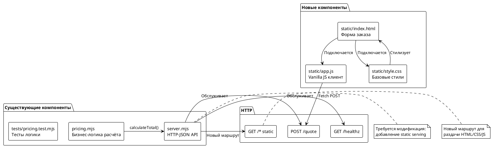
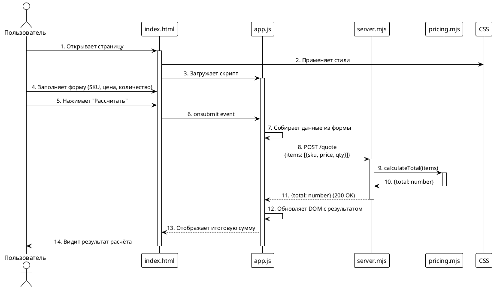

# FNR-1: Системные требования

**Задача:** Создание минимального веб-интерфейса для API расчёта стоимости заказа

---

## 1. Введение

### 1.1 Общая информация

| Параметр | Значение |
|----------|----------|
| **Название проекта** | poh-demo-checkout |
| **Название документа** | Системные требования для FNR-1 |
| **Версия документа** | 1.0 |
| **Дата создания** | 2026-08-18 |
| **Статус** | Проект |
| **Источник требований** | Issue #8, concept.md (Вердикт: Гибридный подход) |
| **Ответственный за бизнес-требования** | Problem Analyst (SA-helper) |
| **Ответственный за техническую реализацию** | Backend-разработчик |

### 1.2 Термины и определения

| Термин | Определение |
|--------|-------------|
| **API** | HTTP-JSON интерфейс сервиса `src/server.mjs` |
| **Endpoint `/quote`** | POST-эндпоинт для расчёта стоимости заказа |
| **SKU** | Stock Keeping Unit — идентификатор товара |
| **Static serving** | Раздача статических файлов (HTML/CSS/JS) через HTTP-сервер |
| **Vanilla JS** | Чистый JavaScript без фреймворков |

### 1.3 Связанные документы

| Документ | Расположение |
|----------|--------------|
| Постановка задачи | `sa_documentation/FNR/FNR_1/task.md` |
| Концепты решений и вердикт | `sa_documentation/FNR/FNR_1/concept.md` |
| Исходный код API | `src/server.mjs`, `src/pricing.mjs` |
| Тесты логики | `tests/pricing.test.mjs` |

### 1.4 История изменений

| Версия | Дата | Автор | Описание изменений |
|--------|------|-------|-------------------|
| 1.0 | 2026-08-18 | System Analyst (SA-helper) | Первичная версия системных требований |

---

## 2. Общее описание

### 2.1 Текущее состояние (As-Is)

**Диагноз:** В проекте отсутствует визуальный интерфейс (UI). Проект представляет собой чистый HTTP-JSON API без фронтенда.

**Доказательства из кода:**

1. **Состав проекта** (`repomix-output.xml:42-60`):
   ```
   src/
     pricing.mjs    # логика расчёта стоимости
     server.mjs     # HTTP-обёртка
   tests/
     pricing.test.mjs
   ```

2. **Отсутствие UI-файлов:**
   - Нет файлов `.html`, `.css`, `.jsx`, `.tsx`, `.vue`, `.svelte`
   - Нет директорий `frontend/`, `web/`, `client/`, `static/`, `public/`, `assets/`

3. **Архитектура сервиса** (`src/server.mjs:1-55`):
   - Чистый HTTP-JSON API
   - Единственные endpoint'ы: `/healthz`, `/quote`
   - Ответы — JSON без HTML-рендеринга

**Текущий endpoint `/quote`:**
```javascript
// src/server.mjs:26-46
server.post('/quote', async (req, reply) => {
  const { items } = req.body;
  const result = calculateTotal(items); // pricing.mjs
  return { total: result.total };
});
```

### 2.2 Архитектурное решение

**Выбранный концепт:** Гибридный подход (модифицированный Концепт 2 из `concept.md`)

**Суть:** Создать минимальный HTML-интерфейс без Threads-стилистики с прозрачной коммуникацией о scope.

**Обоснование:**
- Создаёт артефакт (минимальный UI) для демонстрации работы API
- Занимает 2-4 часа (вместо 2-3 дней на полный Threads-UI)
- Не нарушает принцип "без зависимостей" (vanilla HTML/CSS/JS)
- Не усложняет CI

### 2.3 Диаграмма компонентов



### 2.4 Схема последовательности



---

## 3. План миграции

### 3.1 Этапы внедрения

```plantuml
@startuml
!theme plain
start

:Этап 1: Подготовка;

partition "Этап 1" {
  :Создать директорию static/;
  :Создать static/index.html с формой;
  :Создать static/app.js;
  :Создать static/style.css;
}

if Этап 1 выполнен? then (yes)
  :Этап 2: Интеграция;

  partition "Этап 2" {
    :Модифицировать src/server.mjs\nдобавить static serving;
    :Добавить маршрут GET /* для static;
  }

  if Этап 2 выполнен? then (yes)
    :Этап 3: Проверка;

    partition "Этап 3" {
      :Запустить сервер локально;
      :Открыть http://localhost:3000;
      :Проверить форму заказа;
      :Проверить расчёт стоимости;
    }

    if Проверка прошла? then (yes)
      :Этап 4: Деплой;

      partition "Этап 4" {
        :Коммит в ветку feature/#8-minimal-ui;
        :PR с описанием изменений;
        :Слияние в main;
      }
      stop
    else (no)
      :Исправить баги;
      :Вернуться к Этапу 3;
    endif
  else (no)
    :Откатить изменения server.mjs;
    stop
  endif
else (no)
  :Откатить создание файлов;
  stop
endif

@enduml
```

### 3.2 Таблица этапов

| Этап | Описание | Критерий готовности | Стратегия отката |
|------|----------|---------------------|------------------|
| **1. Подготовка** | Создание статических файлов (HTML, CSS, JS) | Файлы созданы, форма рендерится в браузере при локальном открытии | Удалить директорию `static/` |
| **2. Интеграция** | Модификация `server.mjs` для static serving | `curl http://localhost:3000/` возвращает HTML | Откатить изменения в `server.mjs` |
| **3. Проверка** | Локальное тестирование UI | Форма отправляет запрос, отображает корректный результат | Вернуться к Этапу 2 |
| **4. Деплой** | PR и слияние в main | PR одобрен, тесты CI проходят | Откат PR через `git revert` |

### 3.3 Критерии готовности к релизу

1. ✅ Endpoint `/quote` продолжает работать для JSON-запросов (обратная совместимость)
2. ✅ GET `/` возвращает HTML-форму
3. ✅ Форма корректно отправляет POST на `/quote` с JSON-телом
4. ✅ Ответ отображается пользователю
5. ✅ Существующие тесты (`node --test "tests/*.test.mjs"`) проходят

---

## 4. Функциональные требования — Backend

### 4.1 Задача 1: Добавление static serving в server.mjs

| Метаданные | Значение |
|------------|----------|
| **Ответственный за тех. реализацию** | Backend-разработчик |
| **Задача на разработку** | Jira: N/A (Issue #8) |
| **Статус** | К выполнению |

#### 4.1.1 Описание

Добавить возможность раздачи статических файлов (HTML, CSS, JS) через HTTP-сервер в `src/server.mjs`.

**Что нужно сделать:**

1. Добавить middleware или handler для обслуживания статических файлов из директории `static/`
2. Настроить маршрут `GET /*` для раздачи файлов
3. Обеспечить правильные MIME-types для `.html`, `.css`, `.js`
4. Сохранить существующие маршруты `/healthz` и `/quote` без изменений

#### 4.1.2 Обоснование

Текущий сервер обслуживает только JSON-эндпоинты. Для работы UI необходимо раздавать статические файлы.

**Код-доказательство (текущее состояние):**

```javascript
// src/server.mjs:1-55
import { calculateTotal } from './pricing.mjs';

// Сервер создаётся без static serving
const server = fastify();

server.get('/healthz', async () => ({ status: 'ok' }));

server.post('/quote', async (req, reply) => {
  const { items } = req.body;
  const result = calculateTotal(items);
  return { total: result.total };
});
```

#### 4.1.3 Затрагиваемые компоненты

| Компонент | Файл | Тип изменений |
|-----------|------|---------------|
| HTTP-сервер | `src/server.mjs` | Модификация (добавление static serving) |

#### 4.1.4 Критерии приёмки

1. GET `/` возвращает `static/index.html` с MIME-type `text/html`
2. GET `/style.css` возвращает `static/style.css` с MIME-type `text/css`
3. GET `/app.js` возвращает `static/app.js` с MIME-type `application/javascript`
4. POST `/quote` продолжает работать как раньше (JSON → JSON)
5. GET `/healthz` продолжает возвращать JSON

#### 4.1.5 Нефункциональные требования

| Параметр | Значение |
|----------|----------|
| **Производительность** | Static serving не должен замедлять JSON-эндпоинты |
| **Безопасность** | Запрет на выход за пределы директории `static/` (path traversal) |
| **Совместимость** | Обратная совместимость с существующими клиентами API |

#### 4.1.6 Зависимости

| Зависимость | Тип | Описание |
|-------------|-----|----------|
| Задача 4.2 (UI-файлы) | Входящая | Необходимо создать файлы до интеграции |

---

## 5. Требования к интерфейсам — Frontend

### 5.1 Задача 2: Создание HTML-формы заказа

| Метаданные | Значение |
|------------|----------|
| **Ответственный за тех. реализацию** | Frontend-разработчик (или Full-stack) |
| **Задача на разработку** | Jira: N/A (Issue #8) |
| **Статус** | К выполнению |

#### 5.2.1 Описание

Создать простую HTML-форму для ввода данных заказа и отображения результата расчёта.

**Что нужно сделать:**

1. Создать `static/index.html` с формой:
   - Поля: SKU (текст), Цена (число), Количество (число)
   - Кнопка "Рассчитать"
   - Область отображения результата
2. Создать `static/app.js` для:
   - Обработки submit формы
   - Сборки данных в JSON-формат
   - Отправки POST на `/quote`
   - Отображения результата
3. Создать `static/style.css` для базовой стилизации

#### 5.2.2 Обоснование

UI необходим для демонстрации работы API. Минимальная реализация без Threads-стилистики (согласно вердикту).

#### 5.2.3 Затрагиваемые компоненты

| Компонент | Файл | Тип изменений |
|-----------|------|---------------|
| HTML-форма | `static/index.html` | Новый файл |
| Клиентская логика | `static/app.js` | Новый файл |
| Стили | `static/style.css` | Новый файл |

#### 5.2.4 Критерии приёмки

1. Форма открывается в браузере при локальном открытии `file:///path/to/index.html`
2. Поля формы валидируют ввод (числа — цифры, SKU — не пусто)
3. При submit отправляется POST на `/quote` с телом:
   ```json
   {"items": [{"sku": "ABC", "price": 100, "quantity": 2}]}
   ```
4. Ответ от сервера отображается на странице (сумма заказа)
5. При ошибке API показывается сообщение об ошибке

#### 5.2.5 Формат запроса/ответа

**Запрос (POST /quote):**
```json
{
  "items": [
    {
      "sku": "ABC123",
      "price": 1000,
      "quantity": 2
    }
  ]
}
```

**Ответ (200 OK):**
```json
{
  "total": 2000
}
```

**Ошибка (400 Bad Request):**
```json
{
  "error": "Invalid input: items is required"
}
```

#### 5.2.6 Нефункциональные требования

| Параметр | Значение |
|----------|----------|
| **Браузеры** | Chrome/Firefox/Safari последние 2 версии |
| **Размер** | Общий размер статических файлов < 50 KB |
| **Зависимости** | Нет (vanilla HTML/CSS/JS) |

#### 5.2.7 Зависимости

| Зависимость | Тип | Описание |
|-------------|-----|----------|
| Задача 4.1 (Static serving) | Исходящая | UI не работает без интеграции с сервером |

---

## 6. Ревью требований

| Роль | Имя | Статус | Комментарии |
|------|-----|--------|------------|
| **Аналитик** | Problem Analyst (SA-helper) | ✅ Одобрено | Требования соответствуют вердикту из concept.md |
| **Разработчик Backend** | — | ⏳ Ожидает | Требуется ревью |
| **Разработчик Frontend** | — | ⏳ Ожидает | Требуется ревью |
| **Тестирование** | — | ⏳ Ожидает | Требуется ревью |

---

## 7. Риски и ограничения

### 7.1 Риски

| ID | Риск | Вероятность | Влияние | Митигация |
|----|------|------------|---------|-----------|
| R1 | Пользователь не примет минимальный UI без Threads-стилистики | Средняя | Средняя | Прозрачная коммуникация: объяснить, что Threads-стиль — отдельная задача с оценкой 2-3 дня |
| R2 | Ошибки в интеграции static serving могут сломать существующие API | Низкая | Высокое | Покрытие тестами для `/quote` и `/healthz` после изменений |
| R3 | Выбор технологии static (fastify-static vs manual) может занять время | Низкая | Низкое | Использовать встроенные возможности fastify или простой manual-подход |
| R4 | UI может не работать в старых браузерах | Низкая | Низкое | Ограничиться современными браузерами (последние 2 версии) |

### 7.2 Ограничения

1. **Технологические:**
   - Vanilla HTML/CSS/JS (без фреймворков)
   - Сохранение принципа "без зависимостей"
   - Обратная совместимость с JSON-API

2. **Временные:**
   - Ограничение 2-4 часа на реализацию
   - Threads-стилистика вне scope

3. **Функциональные:**
   - Минимальный набор функций (форма заказа → расчёт → результат)
   - Авторизация и аутентификация не требуются
   - Сохранение состояния не требуется

4. **Инфраструктурные:**
   - CI не должен усложняться
   - UI-тесты не требуются (manual testing)

---

## 8. Приложения

### 8.1 Структура директорий после внедрения

```
repo/
├── src/
│   ├── pricing.mjs      # без изменений
│   └── server.mjs        # + static serving
├── static/               # новая директория
│   ├── index.html        # новая
│   ├── app.js            # новая
│   └── style.css         # новая
├── tests/
│   └── pricing.test.mjs  # без изменений
└── ...
```

### 8.2 Ссылка на Issue

**Issue #8:** "Поменять цвета на стилистику Threads"
**Вердикт:** Создать минимальный UI, Threads-стиль — отдельная задача

### 8.3 Коммуникационный шаблон

После реализации добавить комментарий в Issue #8:

```
Создан минимальный веб-интерфейс для API.

Что сделано:
- Форма заказа (SKU, цена, количество)
- Расчёт стоимости через существующий endpoint /quote
- Базовая стилизация

Threads-стилистика требует отдельного обсуждения scope:
- Оценка: 2-3 дня
- Необходимо: выбор подхода (vanilla CSS vs framework)
- Требуется: решение о dependencies

Если Threads-стиль критичен — создам отдельный Issue с оценкой.
```

---

**Документ создан:** 2026-08-18
**Аналитик:** System Analyst (SA-helper)
**Следующий шаг:** Одобрение требований → Реализация → `/validate-doc` (для проверки)
