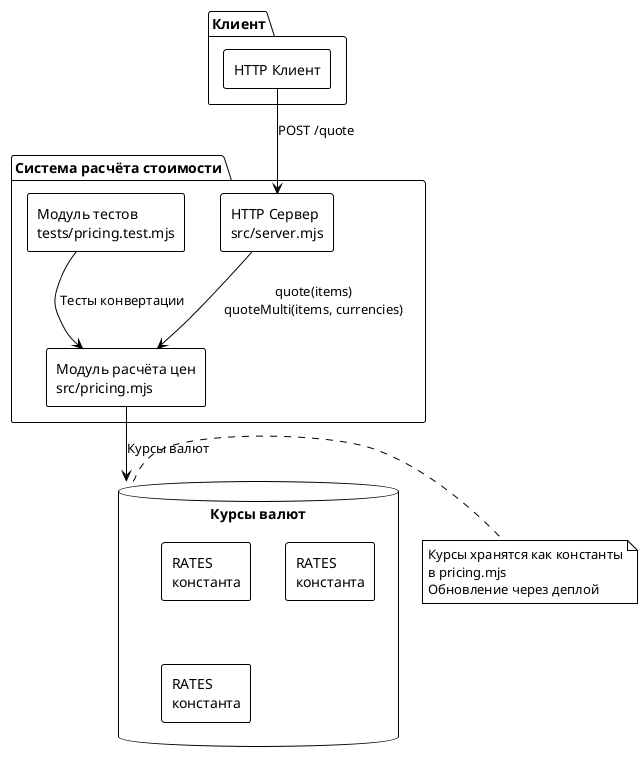

# Системные требования: FNR-1 Пересчёт цены в международную валюту

## 1. Введение

### 1.1 Общая информация

| Параметр | Значение |
|----------|----------|
| **Задача** | FNR-1: Пересчёт цены в международную валюту |
| **Источник** | Issue #11 |
| **Статус** | Системные требования |
| **Дата создания** | 2026-08-19 |
| **Версия** | 1.0 |
| **Выбранный концепт** | Концепт 1: Прагматичное решение (MVP) |

### 1.2 Термины и определения

| Термин | Определение |
|--------|-------------|
| **Базовая валюта** | Валюта, в которой ведётся учёт и хранение цен (RUB) |
| **Целевая валюта** | Валюта конвертации для отображения клиенту (USD, KZT, CNY) |
| **Курс валюты** | Коэффициент конвертации из базовой валюты в целевую |
| **Quote** | Расчёт стоимости заказа (товары + доставка + итог) |
| **Конвертация** | Пересчёт денежной суммы из одной валюты в другую по курсу |

### 1.3 Ссылки на связанные документы

| Документ | Расположение |
|----------|---------------|
| Постановка задачи | `sa_documentation/FNR/FNR_1/task.md` |
| Концепты решений | `sa_documentation/FNR/FNR_1/concept.md` |
| Текущий код | `src/pricing.mjs`, `src/server.mjs` |
| Тесты | `tests/pricing.test.mjs` |
| Issue | [#11](https://github.com/po-helper-org/poh-demo-checkout/issues/11) |

### 1.4 История изменений

| Версия | Дата | Автор | Изменение |
|--------|------|-------|-----------|
| 1.0 | 2026-08-19 | Issue-Agent | Первичная версия системных требований |

---

## 2. Общее описание

### 2.1 As-Is: Текущее состояние

#### Ключевые компоненты

**Файл: `src/pricing.mjs` (строки 592-644)**

```javascript
export const DELIVERY_FEE = 300;
export const FREE_DELIVERY_FROM = 3000;

export function subtotal(items) {
  if (!Array.isArray(items) || items.length === 0) {
    throw new Error('заказ без позиций');
  }
  return items.reduce((sum, item) => {
    if (!Number.isFinite(item.price) || item.price < 0) {
      throw new Error(`некорректная цена в позиции ${item.sku}`);
    }
    if (!Number.isInteger(item.qty) || item.qty <= 0) {
      throw new Error(`некорректное количество в позиции ${item.sku}`);
    }
    return sum + item.price * item.qty;
  }, 0);
}

export function deliveryFee(amount) {
  return amount >= FREE_DELIVERY_FROM ? 0 : DELIVERY_FEE;
}

export function quote(items) {
  const goods = subtotal(items);
  const delivery = deliveryFee(goods);
  return { goods, delivery, total: goods + delivery };
}
```

**Ограничения текущего решения:**

1. **Одиночная валюта:** Все суммы возвращаются только в рублях (RUB)
2. **Нет курсов валют:** Отсутствует механизм конвертации
3. **Жёсткий формат ответа:** `{goods, delivery, total}` без указания валюты
4. **Отсутствие типа валюты:** Структуры данных не содержат поле для валюты

**Файл: `src/server.mjs` (строки 646-701)**

```javascript
export const app = async (req, res) => {
  if (req.url === '/quote' && req.method === 'POST') {
    let body;
    try {
      body = await readJson(req);
    } catch {
      return send(res, 400, { error: 'тело запроса не разобралось как JSON' });
    }
    try {
      return send(res, 200, quote(body?.items));
    } catch (err) {
      return send(res, 400, { error: err.message });
    }
  }
  return send(res, 404, { error: 'не найдено' });
};
```

**Ограничения API:**

- Эндпоинт `/quote` возвращает только рубли
- Нет параметров для запроса мультивалютного ответа
- Нет обработки ошибок конвертации (функционал отсутствует)

**Файл: `tests/pricing.test.mjs` (строки 703-756)**

Все тесты проверяют расчёты только в рублях:
```javascript
assert.deepEqual(quote([{ sku: 'a', price: 1000, qty: 1 }]), {
  goods: 1000,
  delivery: DELIVERY_FEE,
  total: 1300,
});
```

### 2.2 Архитектурное решение

Выбранный подход: **Концепт 1 — Прагматичное решение (MVP)**

**Принципы:**

1. **Минимальные изменения:** Не ломает существующую архитектуру
2. **Сохранение паттерна:** Логика остаётся в `pricing.mjs` как чистые функции
3. **Обратная совместимость:** Старый формат ответа доступен
4. **Без внешних зависимостей:** Курсы хранятся как константы
5. **Тестируемость:** Новые функции покрываются тестами

**Курсы валют (RUB → целевая валюта):**

| Валюта | Курс | Описание |
|--------|------|----------|
| USD | 0.0105 | ~95 RUB/USD |
| KZT | 4.75 | ~0.21 RUB/KZT |
| CNY | 0.078 | ~12.8 RUB/CNY |

> **Внимание:** Курсы являются временными для демо-сценария. Обновление требует деплоя.

### 2.3 Диаграмма компонентов



### 2.4 Схема последовательности

```plantuml
@startuml
!theme plain
actor Клиент
participant Server as HTTP Сервер\nsrc/server.mjs
participant Pricing as Модуль расчёта\nsrc/pricing.mjs

Клиент -> Server: POST /quote\n{items: [...], currencies: false}
activate Server
Server -> Pricing: quote(items)
activate Pricing
Pricing --> Server: {goods, delivery, total} (RUB)
deactivate Pricing
Server --> Клиент: 200 OK\n{goods: 1000, delivery: 300, total: 1300}
deactivate Server

== Новый сценарий: мультивалютный ответ ==

Клиент -> Server: POST /quote\n{items: [...], currencies: ['USD', 'KZT']}
activate Server
Server -> Pricing: quoteMulti(items, currencies)
activate Pricing
Pricing -> Pricing: quote(items) → базовый расчёт
Pricing -> Pricing: convertToCurrency(goods, USD)
Pricing -> Pricing: convertToCurrency(delivery, USD)
Pricing -> Pricing: convertToCurrency(total, USD)
Pricing -> Pricing: convertToCurrency(goods, KZT)
Pricing -> Pricing: convertToCurrency(delivery, KZT)
Pricing -> Pricing: convertToCurrency(total, KZT)
Pricing --> Server: {RUB: {...}, USD: {...}, KZT: {...}}
deactivate Pricing
Server --> Клиент: 200 OK\n{RUB: {...}, USD: {...}, KZT: {...}}
deactivate Server

@enduml
```

---

## 3. План миграции

### 3.1 Этапы внедрения

```plantuml
@startuml
!theme plain
start

:Этап 1\nИзменение pricing.mjs\n- Добавить RATES\n- Добавить convertToCurrency\n- Добавить quoteMulti;

if "Тесты проходят?" then (Нет)
  :Отладка и исправление;
  :Повторный запуск тестов;
  goto "Тесты проходят?"
else (Да)
  :Этап 2\nИзменение server.mjs\n- Расширить обработку /quote\n- Добавить параметр currencies;
  
  if "API отвечает корректно?" then (Нет)
    :Отладка HTTP-обработки;
    goto "API отвечает корректно?"
  else (Да)
    :Этап 3\nДобавление тестов\n- Тесты convertToCurrency\n- Тесты quoteMulti\n- Тесты Unsupported валюты;
    
    if "Все тесты проходят?" then (Нет)
      :Исправление тестов;
      goto "Все тесты проходят?"
    else (Да)
      :Этап 4\nПроверка обратной совместимости\n- currencies=false\n- currencies=undefined;
      
      if "Обратная совместимость\nсохранена?" then (Нет)
        :Исправление логики\nсовместимости;
        goto "Обратная совместимость\nсохранена?"
      else (Да)
        :Готово к_deploy;
        stop
      endif
    endif
  endif
endif

@enduml
```

### 3.2 Таблица этапов

| Этап | Описание | Критерий готовности | План отката |
|------|----------|---------------------|-------------|
| 1. Изменение pricing.mjs | Добавить RATES, convertToCurrency, quoteMulti | Тесты проходят в изоляции | Revert файла |
| 2. Изменение server.mjs | Расширить обработку /quote с параметром currencies | API отвечает корректно на оба формата | Revert файла |
| 3. Добавление тестов | Тесты для новой функциональности | Все тесты проходят | Revert тестов |
| 4. Проверка совместимости | Проверка обратной совместимости | currencies=false возвращает старый формат | Исправление логики |

### 3.3 Критерии готовности к_deploy

1. ✅ Все существующие тесты проходят без изменений
2. ✅ Новые тесты покрывают convertToCurrency и quoteMulti
3. ✅ API возвращает старый формат при currencies=false
4. ✅ API возвращает мультивалютный формат при currencies=['USD', 'KZT', 'CNY']
5. ✅ Unsupported валюта вызывает ошибку с понятным сообщением
6. ✅ Округление работает корректно (до 2 знаков)

---

## 4. Функциональные требования — Backend / БД / API

> **Примечание:** Данный проект не использует базу данных. Все изменения касаются backend-логики и API.

### 4.1 Задача 1: Добавить константы курсов валют

**Метаданные:**

| Поле | Значение |
|------|----------|
| **Ответственный за тех. реализацию** | Backend-разработчик |
| **Задача на разработку** | TBD |
| **Jira** | — |

**Описание:**

Добавить объект `RATES` с курсами конвертации в файл `src/pricing.mjs`. Курсы являются временными для демо-сценария.

**Обоснование:**

Константы обеспечивают минимальное решение без внешних зависимостей (согласно AGENTS.md: "Зависимостей у сервиса нет намеренно").

**Затрагиваемые компоненты:**

- `src/pricing.mjs`

**Критерии приёмки:**

1. ✅ Объект `RATES` экспортируется из `pricing.mjs`
2. ✅ Содержит курсы для USD, KZT, CNY
3. ✅ Добавлен JSDoc-комментарий: "Временные курсы для демо-сценария. Обновление через деплой."
4. ✅ Значения курсов: USD=0.0105, KZT=4.75, CNY=0.078

**Зависимости:**

Нет

**Реализация (пример):**

```javascript
// src/pricing.mjs

/**
 * Курсы валют для конвертации.
 * Временные курсы для демо-сценария. Обновление через деплой.
 * @type {{USD: number, KZT: number, CNY: number}}
 */
export const RATES = {
  USD: 0.0105,  // 1 RUB = 0.0105 USD (~95 RUB/USD)
  KZT: 4.75,    // 1 RUB = 4.75 KZT (~0.21 RUB/KZT)
  CNY: 0.078,   // 1 RUB = 0.078 CNY (~12.8 RUB/CNY)
};
```

---

### 4.2 Задача 2: Реализовать функцию конвертации валют

**Метаданные:**

| Поле | Значение |
|------|----------|
| **Ответственный за тех. реализацию** | Backend-разработчик |
| **Задача на разработку** | TBD |
| **Jira** | — |

**Описание:**

Добавить функцию `convertToCurrency(amountRub, currency)` в `src/pricing.mjs` для конвертации суммы из рублей в целевую валюту.

**Обоснование:**

Функция обеспечивает чистую абстракцию конвертации (соответствует паттерну `pricing.mjs` — чистые функции без ввода-вывода).

**Затрагиваемые компоненты:**

- `src/pricing.mjs`
- `tests/pricing.test.mjs` (тесты)

**Критерии приёмки:**

1. ✅ Функция принимает amountRub (number) и currency (string)
2. ✅ Возвращает конвертированную сумму, округлённую до 2 знаков
3. ✅ Выбрасывает ошибку для неподдерживаемой валюты
4. ✅ Покрыта тестами (базовые кейсы + edge-кейсы)

**Зависимости:**

- Зависит от Задачи 1 (RATES)

**Реализация (пример):**

```javascript
/**
 * Конвертация суммы из рублей в целевую валюту.
 * @param {number} amountRub — сумма в рублях
 * @param {string} currency — код валюты (USD, KZT, CNY)
 * @returns {number} Сумма в целевой валюте, округлённая до 2 знаков
 * @throws {Error} Если валюта не поддерживается
 */
export function convertToCurrency(amountRub, currency) {
  const rate = RATES[currency];
  if (!rate) throw new Error(`неподдерживаемая валюта: ${currency}`);
  
  // Округление до 2 знаков для представления, но возвращаем число
  return Math.round(amountRub * rate * 100) / 100;
}
```

**Нефункциональные требования:**

- Точность округления: до 2 знаков после запятой
- Производительность: O(1) — одна операция умножения

---

### 4.3 Задача 3: Реализовать функцию quoteMulti

**Метаданные:**

| Поле | Значение |
|------|----------|
| **Ответственный за тех. реализацию** | Backend-разработчик |
| **Задача на разработку** | TBD |
| **Jira** | — |

**Описание:**

Добавить функцию `quoteMulti(items, currencies)` в `src/pricing.mjs` для расчёта котировки в нескольких валютах одновременно.

**Обоснование:**

Функция обеспечивает новый формат ответа с мультивалютностью, сохраняя обратную совместимость через существующую функцию `quote`.

**Затрагиваемые компоненты:**

- `src/pricing.mjs`
- `tests/pricing.test.mjs` (тесты)

**Критерии приёмки:**

1. ✅ Функция принимает items и массив currencies (опционально, по умолчанию ['USD', 'KZT', 'CNY'])
2. ✅ Возвращает объект с валютами как ключами: `{RUB: {...}, USD: {...}, KZT: {...}}`
3. ✅ Каждая валюта содержит {goods, delivery, total}
4. ✅ RUB всегда присутствует и содержит базовый расчёт
5. ✅ Покрыта тестами

**Зависимости:**

- Зависит от Задачи 1 (RATES)
- Зависит от Задачи 2 (convertToCurrency)

**Реализация (пример):**

```javascript
/**
 * Расширенный расчёт с конвертацией в несколько валют.
 * @param {Item[]} items — позиции заказа
 * @param {string[]} currencies — список валют для конвертации
 * @returns {{RUB: {goods, delivery, total}, [currency]: {goods, delivery, total}}}
 */
export function quoteMulti(items, currencies = ['USD', 'KZT', 'CNY']) {
  const baseQuote = quote(items);
  const result = {
    RUB: baseQuote
  };
  
  for (const currency of currencies) {
    result[currency] = {
      goods: convertToCurrency(baseQuote.goods, currency),
      delivery: convertToCurrency(baseQuote.delivery, currency),
      total: convertToCurrency(baseQuote.total, currency),
    };
  }
  
  return result;
}
```

---

### 4.4 Задача 4: Расширить API-эндпоинт /quote

**Метаданные:**

| Поле | Значение |
|------|----------|
| **Ответственный за тех. реализацию** | Backend-разработчик |
| **Задача на разработку** | TBD |
| **Jira** | — |

**Описание:**

Расширить обработку эндпоинта `/quote` в `src/server.mjs` для поддержки параметра `currencies` в теле запроса.

**Обоснование:**

Позволяет клиентам выбирать формат ответа (одновалютный или мультивалютный), обеспечивая обратную совместимость.

**Затрагиваемые компоненты:**

- `src/server.mjs`

**Критерии приёмки:**

1. ✅ Параметр currencies=false возвращает старый формат (только RUB)
2. ✅ Параметр currencies=['USD', 'KZT'] возвращает мультивалютный формат
3. ✅ Параметр currencies не указан → мультивалютный формат по умолчанию
4. ✅ Несуществующая валюта → HTTP 400 с ошибкой из pricing.mjs

**Перечень эндпоинтов:**

| Метод | Путь | Описание |
|-------|-----|----------|
| POST | /quote | Расчёт стоимости заказа (одно- или мультивалютный) |

**Формат ответа (JSON):**

**Старый формат (currencies=false):**
```json
{
  "goods": 1000,
  "delivery": 300,
  "total": 1300
}
```

**Новый формат (currencies=['USD', 'KZT']):**
```json
{
  "RUB": {
    "goods": 1000,
    "delivery": 300,
    "total": 1300
  },
  "USD": {
    "goods": 10.5,
    "delivery": 3.15,
    "total": 13.65
  },
  "KZT": {
    "goods": 4750,
    "delivery": 1425,
    "total": 6175
  }
}
```

**Статусы ответов:**

| Код | Описание | Тело ответа |
|-----|----------|-------------|
| 200 | Успешный расчёт | Quote-объект |
| 400 | Ошибка валидации | `{error: "текст ошибки"}` |
| 404 | Эндпоинт не найден | `{error: "не найдено"}` |

**Зависимости:**

- Зависит от Задачи 3 (quoteMulti)

**Реализация (пример):**

```javascript
// src/server.mjs

import { quote, quoteMulti } from './pricing.mjs';

// В обработчике /quote:
if (req.url === '/quote' && req.method === 'POST') {
  let body;
  try {
    body = await readJson(req);
  } catch {
    return send(res, 400, { error: 'тело запроса не разобралось как JSON' });
  }
  try {
    const multi = body?.currencies !== false;
    const currencies = body?.currencies === true ? undefined : body?.currencies;
    const result = multi 
      ? quoteMulti(body?.items, currencies)
      : quote(body?.items);
    return send(res, 200, result);
  } catch (err) {
    return send(res, 400, { error: err.message });
  }
}
```

---

### 4.5 Задача 5: Добавить тесты для новой функциональности

**Метаданные:**

| Поле | Значение |
|------|----------|
| **Ответственный за тех. реализацию** | Backend-разработчик |
| **Задача на разработку** | TBD |
| **Jira** | — |

**Описание:**

Добавить тесты в `tests/pricing.test.mjs` для покрытия новой функциональности: `convertToCurrency`, `quoteMulti`, edge-кейсы.

**Обоснование:**

Согласно AGENTS.md: "Новая логика — новый тест. Расчёт здесь единственное, что может сломаться молча."

**Затрагиваемые компоненты:**

- `tests/pricing.test.mjs`

**Критерии приёмки:**

1. ✅ Тест базовой конвертации для каждой валюты
2. ✅ Тест округления до 2 знаков
3. ✅ Тест quoteMulti с базовым набором валют
4. ✅ Тест quoteMulti с пустым массивом валют
5. ✅ Тест неподдерживаемой валюты → error
6. ✅ Все тесты проходят

**Зависимости:**

- Зависит от Задач 1-4 (реализация функционала)

**Пример тестов:**

```javascript
// tests/pricing.test.mjs

import { convertToCurrency, quoteMulti, RATES } from '../src/pricing.mjs';

test('конвертация в USD', () => {
  assert.equal(convertToCurrency(1000, 'USD'), 10.5);
});

test('конвертация в KZT', () => {
  assert.equal(convertToCurrency(1000, 'KZT'), 4750);
});

test('конвертация в CNY', () => {
  assert.equal(convertToCurrency(1000, 'CNY'), 78);
});

test('округление до 2 знаков', () => {
  assert.equal(convertToCurrency(333, 'USD'), 3.5);
});

test('неподдерживаемая валюта → ошибка', () => {
  assert.throws(() => convertToCurrency(1000, 'EUR'), /неподдерживаемая валюта/);
});

test('quoteMulti возвращает RUB + конвертированные валюты', () => {
  const result = quoteMulti([{ sku: 'a', price: 1000, qty: 1 }], ['USD']);
  
  assert.equal(result.RUB.goods, 1000);
  assert.equal(result.RUB.delivery, 300);
  assert.equal(result.RUB.total, 1300);
  
  assert.equal(result.USD.goods, 10.5);
  assert.equal(result.USD.delivery, 3.15);
  assert.equal(result.USD.total, 13.65);
});

test('quoteMulti с пустым массивом валют', () => {
  const result = quoteMulti([{ sku: 'a', price: 1000, qty: 1 }], []);
  
  assert.deepEqual(Object.keys(result), ['RUB']);
});
```

---

## 5. Требования к интерфейсам — Frontend / UI

> **Примечание:** Данный проект не содержит Frontend/UI. Сервер возвращает JSON, который может потребляться любым клиентом. Раздел не применим.

---

## 6. Ревью требований

| Роль | Имя | Статус | Комментарии |
|------|-----|--------|-------------|
| Аналитик | Issue-Agent | ✅ | Требования сформулированы |
| Разработчик Backend | TBD | ⏳ | На ревью |
| Разработчик Frontend | N/A | — | Не применимо |
| Тестирование | TBD | ⏳ | На ревью |

---

## 7. Риски и ограничения

### 7.1 Риски

| ID | Риск | Вероятность | Влияние | Митигация |
|----|------|-------------|---------|-----------|
| R1 | Ошибки в курсах валют | Средняя | Высокая | Code review с проверкой курсов |
| R2 | Округление даёт расхождение в 1 копейку | Низкая | Низкая | Округление до 2 знаков (стандарт) |
| R3 | Регрессия в существующих тестах | Низкая | Средняя | Полное покрытие тестами |
| R4 | Неправильная обработка currencies | Низкая | Средняя | Тесты edge-кейсов |
| R5 | Клиент запрашивает несуществующую валюту | Средняя | Низкая | Clear error message |

### 7.2 Ограничения

1. **Курсы фиксированы:** Обновление требует деплоя (временное решение для демо)
2. **Поддерживаемые валюты:** Только USD, KZT, CNY (расширение — через правку кода)
3. **Нет истории курсов:** Не хранятся предыдущие значения
4. **Округление до 2 знаков:** Потеря точности при больших суммах
5. **Без внешних зависимостей:** Курсы не загружаются из внешних источников
6. **Однонаправленная конвертация:** Только RUB → целевая валюта

---

## 8. Приложения

### 8.1 Примеры запросов и ответов

#### Запрос 1: Старый формат (обратная совместимость)

```bash
curl -sX POST localhost:8080/quote \
  -H 'content-type: application/json' \
  -d '{
    "items": [{"sku": "a", "price": 1000, "qty": 2}],
    "currencies": false
  }'
```

**Ответ:**
```json
{
  "goods": 2000,
  "delivery": 300,
  "total": 2300
}
```

#### Запрос 2: Мультивалютный формат

```bash
curl -sX POST localhost:8080/quote \
  -H 'content-type: application/json' \
  -d '{
    "items": [{"sku": "a", "price": 1000, "qty": 2}],
    "currencies": ["USD", "KZT"]
  }'
```

**Ответ:**
```json
{
  "RUB": {
    "goods": 2000,
    "delivery": 300,
    "total": 2300
  },
  "USD": {
    "goods": 21,
    "delivery": 3.15,
    "total": 24.15
  },
  "KZT": {
    "goods": 9500,
    "delivery": 1425,
    "total": 10925
  }
}
```

#### Запрос 3: Ошибка — неподдерживаемая валюта

```bash
curl -sX POST localhost:8080/quote \
  -H 'content-type: application/json' \
  -d '{
    "items": [{"sku": "a", "price": 1000, "qty": 1}],
    "currencies": ["EUR"]
  }'
```

**Ответ:**
```json
{
  "error": "неподдерживаемая валюта: EUR"
}
```

### 8.2 Краткая шпаргалка по API

| Параметр | Тип | Обязательный | Описание |
|----------|-----|--------------|----------|
| items | Item[] | Да | Массив позиций заказа |
| currencies | string[] \| false | Нет | Валюты для конвертации (false = только RUB) |

---

**Дата создания:** 2026-08-19
**Автор:** Issue-Agent
**Версия:** 1.0

**Следующий шаг:** `/validate-doc sa_documentation/FNR/FNR_1/system_requirements.md`
