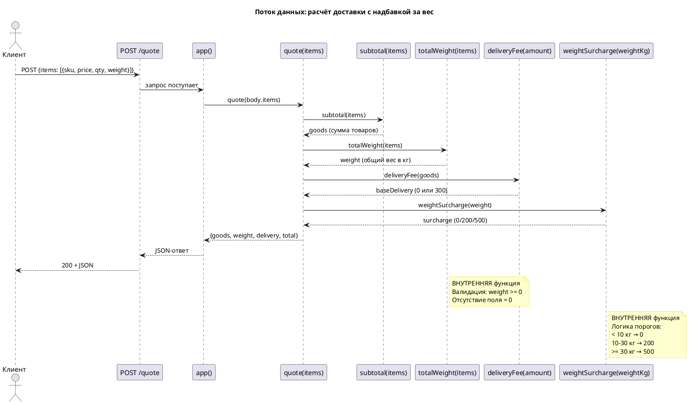
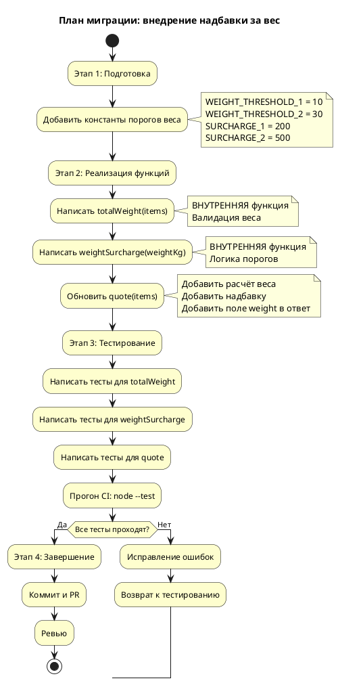

# Системные требования: FNR-1 — Надбавка за вес заказа

**Версия документа**: 1.0  
**Дата**: 2026-08-19  
**Статус**: Черновик

---

## 1. Введение

### 1.1 Метаданные

| Поле | Значение |
|------|----------|
| Название требования | Надбавка за вес заказа в расчёте доставки |
| Номер FNR | FNR-1 |
| Связанный Issue | #19 |
| Компоненты | `src/pricing.mjs`, `tests/pricing.test.mjs` |
| Тип изменения | New Feature |
| Приоритет | P3 |
| Ответственный за реализацию | Backend-разработчик |
| Дата целевого релиза | Определяется после утверждения |

### 1.2 Термины и определения

| Термин | Определение |
|--------|-------------|
| **Позиция заказа (Item)** | Единица товара в заказе с полями: `sku` (идентификатор), `price` (цена за единицу в ₽), `qty` (количество), `weight` (вес в кг, опционально) |
| **Базовая доставка** | Стоимость доставки без учёта надбавки за вес: 0 ₽ (от 3000 ₽ товаров) или 300 ₽ (ниже порога) |
| **Надбавка за вес** | Дополнительная плата за тяжёлые отправления: 0 ₽ (до 10 кг), 200 ₽ (10–30 кг), 500 ₽ (от 30 кг) |
| **Общий вес заказа** | Сумма `weight × qty` по всем позициям; позиция без поля `weight` считается 0 кг |
| **Итоговая доставка** | Базовая доставка + надбавка за вес |
| **Чистая функция** | Функция без побочных эффектов, результат зависит только от аргументов |

### 1.3 Связанные документы

| Документ | Расположение |
|----------|--------------|
| Постановка задачи | `sa_documentation/FNR/FNR_1/task.md` |
| Концепты решений | `sa_documentation/FNR/FNR_1/concept.md` |
| Текущий код (As-Is) | `src/pricing.mjs`, `src/server.mjs`, `tests/pricing.test.mjs` |

### 1.4 История изменений

| Версия | Дата | Изменение | Автор |
|--------|------|-----------|-------|
| 1.0 | 2026-08-19 | Первая версия системных требований | System Analyst (автоматически) |

---

## 2. Общее описание

### 2.1 Текущее состояние (As-Is)

#### 2.1.1 Описание поведения

Текущая реализация расчёта доставки (`src/pricing.mjs:40-46`) учитывает только сумму товаров и игнорирует физический характер груза:

```javascript
// Текущая реализация
export function deliveryFee(amount) {
  return amount >= FREE_DELIVERY_FROM ? 0 : DELIVERY_FEE;
}
```

Функция `quote()` (`src/pricing.mjs:48-52`) возвращает структуру без поля веса:

```javascript
export function quote(items) {
  const goods = subtotal(items);
  const delivery = deliveryFee(goods);
  return { goods, delivery, total: goods + delivery };
}
```

**Код-доказательства отсутствия учёта веса:**

| Утверждение | Файл:строки | Фрагмент |
|-------------|-------------|----------|
| Доставка только 0 или 300 ₽ | `src/pricing.mjs:40-46` | `return amount >= FREE_DELIVERY_FROM ? 0 : DELIVERY_FEE;` |
| В ответе нет поля `weight` | `src/pricing.mjs:51` | `return { goods, delivery, total: goods + delivery };` |
| Поле `weight` не читается | `src/pricing.mjs:25-37` | Валидируются только `item.price` и `item.qty` |
| HTTP-слой не зависит от структуры ответа | `src/server.mjs:39` | `return send(res, 200, quote(body?.items));` |

#### 2.1.2 Ключевые компоненты

**Компонент: `src/pricing.mjs` (бизнес-логика)**

| Функция | Назначение | Ограничения |
|---------|------------|-------------|
| `subtotal(items)` | Сумма товаров без доставки | Бросает ошибку на пустой массив, не читает `weight` |
| `deliveryFee(amount)` | Стоимость доставки (0 или 300 ₽) | Не учитывает вес |
| `quote(items)` | Полный расчёт заказа | Не возвращает поле `weight` |

**Компонент: `src/server.mjs` (HTTP-обёртка)**

| Роль | Поведение |
|------|-----------|
| Разбор JSON | Читает `body.items` и передаёт в `quote()` |
| Сериализация ответа | Прокси сериализует результат `quote()` в JSON |
| Обработка ошибок | Возвращает 400 при ошибке валидации |

**Доказательство независимости HTTP-слоя:** `src/server.mjs:39` вызывает `quote(body?.items)` и напрямую передаёт результат в `send()`. Любое изменение структуры ответа `quote()` прозрачно для HTTP-слоя.

#### 2.1.3 Ограничения текущего решения

1. **Нет расчёта веса заказа** — поле `weight` не читается из входных данных
2. **Нет надбавки за вес** — доставка только бинарная (0/300 ₽)
3. **Нет веса в ответе** — клиенты не получают информацию о весе заказа
4. **Бесплатная доставка отменяет всю плату** — при сумме ≥3000 ₽ доставка = 0, даже для тяжёлых грузов

---

### 2.2 Архитектурное решение

**Выбранный концепт:** Концепт A (Правильное) с модификациями из архитектурных дебатов.

**Суть решения:** Добавить новые внутренние функции для расчёта веса и надбавки, следуя существующему паттерну «одна чистая функция на один аспект расчёта».

**Утверждённые модификации из дебатов:**

1. **Функции `totalWeight` и `weightSurcharge` — внутренние** (без `export`)
   - Снижает поверхность API до минимума
   - Тесты могут импортировать их напрямую через относительный импорт

2. **Строгая валидация веса:**
   - Отрицательный вес → ошибка (как цена)
   - Отсутствие поля `weight` → не проверяется, считается 0 в тернарном операторе
   - NaN/Infinity → ошибка (согласуется с `Number.isFinite` для цены)

3. **Документация структуры ответа:**
   - JSDoc-комментарий к `quote()` с типом возвращаемого значения
   - Поле `weight` добавляется в ответ

**Обоснование выбора:**

| Критерий | Оценка |
|----------|--------|
| Архитектурная согласованность | Высокая — следует паттерну `subtotal` → `deliveryFee` |
| Тестируемость | Высокая — каждая функция тестируется изолированно |
| Читаемость | Высокая — `quote()` читается как бизнес-процесс |
| Расширяемость | Высокая — легко добавить новые пороги |

---

### 2.3 Диаграмма компонентов (To-Be)

```plantuml
@startuml
!define COMPONENT component
!define DATABASE database
!define INTERFACE interface

skinparam componentStyle rectangle
skinparam rectangleBackgroundColor #FEFECE

title "Компоненты расчёта доставки с надбавкой за вес"

package "Бизнес-логика (pricing.mjs)" {
  COMPONENT [quote(items)] as QUOTE {
    component [subtotal(items)] as SUBTOTAL
    component [totalWeight(items)] as TOTAL_WEIGHT
    component [deliveryFee(amount)] as DELIVERY_FEE
    component [weightSurcharge(weightKg)] as WEIGHT_SURCHARGE
  }
}

package "HTTP-слой (server.mjs)" {
  COMPONENT [app()] as APP
  INTERFACE "POST /quote" as API
}

package "Тесты (pricing.test.mjs)" {
  COMPONENT [тесты веса и надбавки] as TESTS
}

package "Константы" {
  DATABASE [DELIVERY_FEE = 300] as FEE
  DATABASE [FREE_DELIVERY_FROM = 3000] as THRESHOLD
  DATABASE [WEIGHT_THRESHOLD_1 = 10] as WT1
  DATABASE [WEIGHT_THRESHOLD_2 = 30] as WT2
  DATABASE [SURCHARGE_1 = 200] as S1
  DATABASE [SURCHARGE_2 = 500] as S2
}

API -down-> APP : JSON {items}
APP -down-> QUOTE : quote(items)
QUOTE -down-> SUBTOTAL : сумма товаров
SUBTOTAL -down-> FEE : константа
QUOTE -down-> TOTAL_WEIGHT : общий вес
TOTAL_WEIGHT -down-> WT1, WT2 : пороги веса
QUOTE -down-> WEIGHT_SURCHARGE : надбавка
WEIGHT_SURCHARGE -down-> S1, S2 : размеры надбавки
QUOTE -down-> DELIVERY_FEE : базовая доставка
DELIVERY_FEE -down-> THRESHOLD : порог суммы

TESTS ..> SUBTOTAL : проверяет
TESTS ..> TOTAL_WEIGHT : проверяет
TESTS ..> WEIGHT_SURCHARGE : проверяет
TESTS ..> QUOTE : проверяет композицию

note right of TOTAL_WEIGHT
  ВНУТРЕННЯЯ функция
  Не экспортируется
end note

note right of WEIGHT_SURCHARGE
  ВНУТРЕННЯЯ функция
  Не экспортируется
end note

note bottom of QUOTE
  Возвращает:
  { goods, weight, delivery, total }
end note

@enduml
```

---

### 2.4 Схема последовательности



---

## 3. План миграции

### 3.1 Этапы внедрения



### 3.2 Таблица этапов

| Этап | Действие | Откат | Критерий готовности |
|------|----------|-------|---------------------|
| 1. Подготовка | Добавить константы в `src/pricing.mjs` | Удалить добавленные константы | Константы определены в начале файла |
| 2. Реализация | Написать `totalWeight`, `weightSurcharge`, обновить `quote` | Откатить изменения в `src/pricing.mjs` | Функции написаны, `quote` обновлён |
| 3. Тестирование | Добавить тесты в `tests/pricing.test.mjs`, прогнать CI | Удалить новые тесты | `node --test "tests/*.test.mjs"` проходит |
| 4. Завершение | Коммит, PR, ревью, слияние | Закрыть PR без слияния | PR утверждён, слит в main |

### 3.3 Критерии готовности к релизу

1. Все тесты проходят (`node --test "tests/*.test.mjs"`)
2. HowToDemo сценарий из `task.md` работает:
   - Холодильник 45 кг → надбавка 500 ₽
   - Чехол без веса → надбавка 0 ₽
3. Ревью пройдено, PR утверждён
4. Обратная совместимость сохранена (существующие клиенты продолжают работать)

---

## 4. Функциональные требования — Backend / БД / API

> **Примечание:** Данное изменение затрагивает только backend-логику. Frontend/UI изменения отсутствуют — см. раздел 5.

### 4.1 Задача: FR-1. Добавление констант порогов веса

**Метаданные:**

| Поле | Значение |
|------|----------|
| Ответственный за тех. реализацию | Backend-разработчик |
| Задача на разработку | FNR-1-FR-1 |
| Jira-ссылка | — |

**Описание функционала:**

1. Добавить четыре новые константы в начало файла `src/pricing.mjs` (после существующих `DELIVERY_FEE` и `FREE_DELIVERY_FROM`):
   - `WEIGHT_THRESHOLD_1 = 10` — первый порог веса (кг)
   - `WEIGHT_THRESHOLD_2 = 30` — второй порог веса (кг)
   - `SURCHARGE_1 = 200` — надбавка за вес 10–30 кг (₽)
   - `SURCHARGE_2 = 500` — надбавка за вес от 30 кг (₽)

**Обоснование:**

Константы вынесены на верхний уровень файла для согласованности с существующим стилем (`DELIVERY_FEE`, `FREE_DELIVERY_FROM`) и упрощения изменения правил в будущем.

**Затрагиваемые компоненты:**

| Компонент | Тип изменения | Файл:строки |
|-----------|---------------|-------------|
| `src/pricing.mjs` | Добавление констант | После строки 10 |

**Критерии приёмки:**

1. Константы определены в начале файла `src/pricing.mjs`
2. Значения соответствуют спецификации: 10, 30, 200, 500
3. Константы не экспортируются (или экспортируются по согласованию с командой)

**Зависимости:**

Нет (первая задача в цепочке)

---

### 4.2 Задача: FR-2. Реализация функции расчёта общего веса

**Метаданные:**

| Поле | Значение |
|------|----------|
| Ответственный за тех. реализацию | Backend-разработчик |
| Задача на разработку | FNR-1-FR-2 |
| Jira-ссылка | — |

**Описание функционала:**

1. Добавить внутреннюю функцию `totalWeight(items)` в `src/pricing.mjs`:
   - **Вход:** массив позиций `items` с полями `weight` (опционально) и `qty`
   - **Выход:** число — общий вес заказа в килограммах
   - **Логика:**
     - Суммирует `weight × qty` по всем позициям
     - Если поле `weight` отсутствует — считает 0 для этой позиции
     - Если `weight` отрицательный — бросает ошибку `некорректный вес в позиции {sku}`
     - Если `weight` не является конечным числом (NaN, Infinity) — считает 0
   - **Проверка входных данных:**
     - Пустой массив или отсутствие массива — ошибка `заказ без позиций`

**Обоснование:**

Функция следует паттерну `subtotal(items)` — отдельная чистая функция для одного аспекта расчёта. Внутренняя (не экспортируемая) для минимизации поверхности API.

**Затрагиваемые компоненты:**

| Компонент | Тип изменения | Файл:строки |
|-----------|---------------|-------------|
| `src/pricing.mjs` | Добавление функции | После `subtotal()` |
| `tests/pricing.test.mjs` | Добавление тестов | В конец файла |

**Критерии приёмки:**

1. Функция `totalWeight(items)` определена в `src/pricing.mjs`
2. Функция НЕ экспортируется (нет `export`)
3. Базовый расчёт веса работает: 2 позиции по 5 кг = 10 кг
4. Позиция без поля `weight` считается 0 кг
5. Отрицательный вес бросает ошибку
6. NaN/Infinity веса считается 0
7. Пустой массив бросает ошибку `заказ без позиций`
8. Все тесты проходят

**Зависимости:**

После FR-1 (требует константы для граничных тестов, хотя напрямую не использует)

---

### 4.3 Задача: FR-3. Реализация функции расчёта надбавки за вес

**Метаданные:**

| Поле | Значение |
|------|----------|
| Ответственный за тех. реализацию | Backend-разработчик |
| Задача на разработку | FNR-1-FR-3 |
| Jira-ссылка | — |

**Описание функционала:**

1. Добавить внутреннюю функцию `weightSurcharge(weightKg)` в `src/pricing.mjs`:
   - **Вход:** число — общий вес в килограммах
   - **Выход:** число — надбавка в рублях (0, 200, 500)
   - **Логика порогов (границы включительны):**
     - `weightKg < WEIGHT_THRESHOLD_1` (до 10 кг) → 0 ₽
     - `weightKg < WEIGHT_THRESHOLD_2` (10–30 кг) → `SURCHARGE_1` (200 ₽)
     - `weightKg >= WEIGHT_THRESHOLD_2` (от 30 кг) → `SURCHARGE_2` (500 ₽)

**Обоснование:**

Функция следует паттерну `deliveryFee(amount)` — отдельная чистая функция для одного аспекта расчёта. Внутренняя для минимизации API. Использует константы для простоты изменения правил.

**Затрагиваемые компоненты:**

| Компонент | Тип изменения | Файл:строки |
|-----------|---------------|-------------|
| `src/pricing.mjs` | Добавление функции | После `deliveryFee()` |
| `tests/pricing.test.mjs` | Добавление тестов | В конец файла |

**Критерии приёмки:**

1. Функция `weightSurcharge(weightKg)` определена в `src/pricing.mjs`
2. Функция НЕ экспортируется
3. Вес 9.99 кг → 0 ₽
4. Вес 10 кг → 200 ₽ (граница включительна)
5. Вес 29.99 кг → 200 ₽
6. Вес 30 кг → 500 ₽ (граница включительна)
7. Вес 100 кг → 500 ₽
8. Все тесты проходят

**Зависимости:**

После FR-1 (требует константы `WEIGHT_THRESHOLD_*`, `SURCHARGE_*`)

---

### 4.4 Задача: FR-4. Обновление функции quote

**Метаданные:**

| Поле | Значение |
|------|----------|
| Ответственный за тех. реализацию | Backend-разработчик |
| Задача на разработку | FNR-1-FR-4 |
| Jira-ссылка | — |

**Описание функционала:**

1. Обновить функцию `quote(items)` в `src/pricing.mjs`:
   - Добавить вызов `totalWeight(items)` для расчёта общего веса
   - Добавить вызов `weightSurcharge(weight)` для расчёта надбавки
   - Обновить расчёт доставки: `delivery = deliveryFee(goods) + surcharge`
   - Добавить поле `weight` в возвращаемый объект
   - Добавить JSDoc-комментарий с документацией новой структуры ответа

2. **Новая структура ответа:**
   ```javascript
   /**
    * Итог заказа: позиции, вес, доставка, сумма к оплате.
    * @param {Item[]} items
    * @returns {{goods: number, weight: number, delivery: number, total: number}}
    */
   export function quote(items) {
     const goods = subtotal(items);
     const weight = totalWeight(items);
     const baseDelivery = deliveryFee(goods);
     const surcharge = weightSurcharge(weight);
     const delivery = baseDelivery + surcharge;
     return { 
       goods, 
       weight, 
       delivery, 
       total: goods + delivery 
     };
   }
   ```

**Обоснование:**

Функция `quote()` является композицией всех аспектов расчёта. Добавление веса и надбавки следует существующему паттерну. Новое поле `weight` в ответе — расширение контракта, обратная совместимость сохраняется.

**Затрагиваемые компоненты:**

| Компонент | Тип изменения | Файл:строки |
|-----------|---------------|-------------|
| `src/pricing.mjs` | Обновление функции | Строки 48-56 (текущие) |
| `tests/pricing.test.mjs` | Обновление тестов | Существующие тесты `quote` |

**Критерии приёмки:**

1. Функция `quote()` вызывает `totalWeight(items)` и `weightSurcharge(weight)`
2. Поле `weight` присутствует в ответе
3. Логика доставки: базовая + надбавка
4. JSDoc-комментарий документирует новую структуру
5. Существующие тесты `quote` обновлены (проверяют поле `weight`)
6. Обратная совместимость: старые клиенты (читающие только `goods`, `delivery`, `total`) продолжают работать
7. Все тесты проходят

**Зависимости:**

После FR-2, FR-3 (требует функции `totalWeight` и `weightSurcharge`)

---

### 4.5 Задача: FR-5. Добавление тестов

**Метаданные:**

| Поле | Значение |
|------|----------|
| Ответственный за тех. реализацию | Backend-разработчик |
| Задача на разработку | FNR-1-FR-5 |
| Jira-ссылка | — |

**Описание функционала:**

1. Добавить тесты в `tests/pricing.test.mjs`:
   
   **Для `totalWeight`:**
   - Базовый расчёт веса: 2 позиции по 5 кг = 10 кг
   - Позиция без поля `weight` считается 0 кг
   - Отрицательный вес бросает ошибку
   - NaN/Infinity веса считается 0 кг
   - Пустой массив бросает ошибку

   **Для `weightSurcharge`:**
   - Три порога: 0, 200, 500 ₽
   - Граничные значения: 10 и 30 кг
   - Дробные веса вблизи границ: 9.99, 29.99 кг

   **Для `quote`:**
   - Тяжёлый товар с бесплатной базовой доставкой ( холодильник 45 кг на 50000 ₽)
   - Лёгкий товар без поля `weight`
   - Средний товар (10–30 кг)
   - Обновление существующих тестов `quote` для проверки поля `weight`

**Обоснование:**

Тесты покрывают все новые функции и граничные случаи. Существующие тесты `quote` обновляются для проверки новой структуры ответа.

**Затрагиваемые компоненты:**

| Компонент | Тип изменения | Файл:строки |
|-----------|---------------|-------------|
| `tests/pricing.test.mjs` | Добавление тестов | В конец файла |
| `tests/pricing.test.mjs` | Обновление тестов | Существующие тесты `quote` |

**Критерии приёмки:**

1. Тесты `totalWeight` покрывают все сценарии
2. Тесты `weightSurcharge` покрывают все пороги и границы
3. Тесты `quote` проверяют новую структуру ответа
4. Существующие тесты обновлены для проверки поля `weight`
5. Все тесты проходят: `node --test "tests/*.test.mjs"`
6. Как минимум 10 новых тестов

**Зависимости:**

После FR-2, FR-3, FR-4 (тестирует реализованные функции)

---

### 4.6 Сводная таблица задач

| ID | Задача | Оценка | Зависимости |
|----|--------|--------|-------------|
| FR-1 | Добавление констант порогов веса | 0.5 дня | — |
| FR-2 | Реализация функции totalWeight | 1 день | FR-1 |
| FR-3 | Реализация функции weightSurcharge | 0.5 дня | FR-1 |
| FR-4 | Обновление функции quote | 1 день | FR-2, FR-3 |
| FR-5 | Добавление тестов | 1 день | FR-2, FR-3, FR-4 |

**Общая оценка:** 4 дня (согласуется с оценкой Концепта A)

---

### 4.7 API-эндпоинты

**Затрагиваемый эндпоинт:**

| Метод | Путь | Описание |
|-------|------|----------|
| POST | /quote | Расчёт стоимости заказа с доставкой |

**Изменение формата ответа:**

**Было (As-Is):**
```json
{
  "goods": 50000,
  "delivery": 0,
  "total": 50000
}
```

**Стало (To-Be):**
```json
{
  "goods": 50000,
  "weight": 45,
  "delivery": 500,
  "total": 50500
}
```

**Описание полей:**

| Поле | Тип | Описание |
|------|-----|----------|
| `goods` | number | Сумма товаров без доставки (₽) |
| `weight` | number | Общий вес заказа (кг) — НОВОЕ ПОЛЕ |
| `delivery` | number | Итоговая стоимость доставки (₽) = базовая + надбавка |
| `total` | number | Итоговая сумма к оплате (₽) = goods + delivery |

**Коды ответов:**

| Код | Сценарий | Тело ответа |
|-----|----------|--------------|
| 200 | Успешный расчёт | `{goods, weight, delivery, total}` |
| 400 | Ошибка валидации (пустой заказ, некорректный вес) | `{error: "текст ошибки"}` |
| 404 | Эндпоинт не найден | `{error: "не найдено"}` |

**Обратная совместимость:**

Добавление поля `weight` — расширение контракта. Существующие клиенты, которые читают только `goods`, `delivery`, `total`, продолжат работать. Деструктуризация `const {goods, delivery, total} = response` игнорирует лишние поля.

---

### 4.8 Нефункциональные требования

| Требование | Значение | Обоснование |
|------------|----------|--------------|
| Производительность | Время ответа API не более 50 мс | Расчёт — простая арифметика, нет внешних вызовов |
| Надёжность | Отсутствие regressions в существующей логике | Покрытие тестами 100% новых функций |
| Поддерживаемость | Новый разработчик может добавить порог за 30 минут | Константы вынесены, логика прозрачная |
| Тестируемость | Все функции тестируются изолированно | Чистые функции, нет побочных эффектов |

---

## 5. Требования к интерфейсам — Frontend / UI

**Не применимо**

Данное изменение затрагивает только backend-логику (`src/pricing.mjs`) и тесты. Клиенты API получают расширенный ответ с дополнительным полем `weight`, но это не требует изменений на frontend — существующие клиенты продолжают работать благодаря обратной совместимости.

Если в будущем потребуется UI для отображения веса или надбавки, это будет отдельной задачей с собственными системными требованиями.

---

## 6. Ревью требований

| Роль | Имя | Статус | Комментарий |
|------|-----|--------|-------------|
| Аналитик | — | Требуется утверждение | — |
| Разработчик Backend | — | Требуется ревью | — |
| Разработчик Frontend | — | Не применимо | Frontend-изменений нет |
| Тестирование | — | Требуется ревью | — |

---

## 7. Риски и ограничения

### 7.1 Таблица рисков

| ID | Риск | Вероятность | Влияние | Митигация |
|----|------|-------------|---------|-----------|
| R1 | Нарушение обратной совместимости для клиентов API | Низкая | Среднее | Добавление поля — расширение, не breaking change; тест на совместимость |
| R2 | Ошибка в логике порогов (границы включительны/исключительны) | Низкая | Высокое | Тесты на граничные значения (10, 30 кг) |
| R3 | Отрицательный вес маскируется ошибкой данных | Средняя | Среднее | Строгая валидация: ошибка на `< 0` |
| R4 | Неправильное суммирование веса (qty не учитывается) | Низкая | Высокое | Тест на несколько позиций с весом |
| R5 | Отсутствие поля weight во всех позициях | Низкая | Низкое | Логика: отсутствие = 0 кг, не ошибка |

### 7.2 Ограничения

1. **Пороги веса фиксированы** — изменение правил требует правки кода (констант)
2. **Нет категорий товаров** — все товары рассчитываются одинаково
3. **Нет учёта габаритов** — только вес, без размеров
4. **Надбавка применяется всегда** — даже при бесплатной базовой доставке
5. **Нет историчности** — невозможно узнать, сколько была бы доставка без надбавки

---

## 8. Приложения

### 8.1 SQL-скрипты

Не применимо (в системе нет БД)

### 8.2 Маппинги

| Концепт → Требование | Связь |
|----------------------|-------|
| Концепт A: `totalWeight(items)` | FR-2 |
| Концепт A: `weightSurcharge(weightKg)` | FR-3 |
| Концепт A: обновление `quote()` | FR-4 |
| Дебаты: внутренние функции (без export) | FR-2, FR-3 |
| Дебаты: строгая валидация веса | FR-2 |

### 8.3 Шпаргалка по граничным значениям

| Сценарий | Вес | Базовая доставка | Надбавка | Итого доставка | Товары на |
|----------|-----|-------------------|----------|----------------|-----------|
| Лёгкий заказ | 5 кг | 300 ₽ | 0 ₽ | 300 ₽ | 1000 ₽ |
| На границе 1 | 10 кг | 300 ₽ | 200 ₽ | 500 ₽ | 1000 ₽ |
| Средний заказ | 20 кг | 300 ₽ | 200 ₽ | 500 ₽ | 1000 ₽ |
| На границе 2 | 30 кг | 300 ₽ | 500 ₽ | 800 ₽ | 1000 ₽ |
| Тяжёлый заказ | 45 кг | 0 ₽ (бесплатная) | 500 ₽ | 500 ₽ | 50000 ₽ |
| Без веса | 0 кг (нет поля) | 300 ₽ | 0 ₽ | 300 ₽ | 1000 ₽ |

---

## 9. Якоря истины (Truth Anchors)

Каждое утверждение подтверждено код-доказательством:

| Утверждение | Якорь (файл:строки) |
|-------------|---------------------|
| Текущая доставка — только 0 или 300 ₽ | `src/pricing.mjs:40-46` |
| В ответе нет поля `weight` | `src/pricing.mjs:51` |
| Поле `weight` не читается | `src/pricing.mjs:25-37` |
| HTTP-слой не зависит от структуры ответа | `src/server.mjs:39` |
| Существующий паттерн: `subtotal` → `deliveryFee` | `src/pricing.mjs:21-46` |
| Валидация цены: `Number.isFinite` и `< 0` | `src/pricing.mjs:26-27` |
| Валидация количества: целое число `> 0` | `src/pricing.mjs:28-29` |
| CI проверяет тесты командой `node --test` | `.github/workflows/ci.yml:17` |

---

**Документ подготовлен:** System Analyst (автоматически)  
**Следующий шаг:** `/validate-doc sa_documentation/FNR/FNR_1/system_requirements.md` — валидация документации
