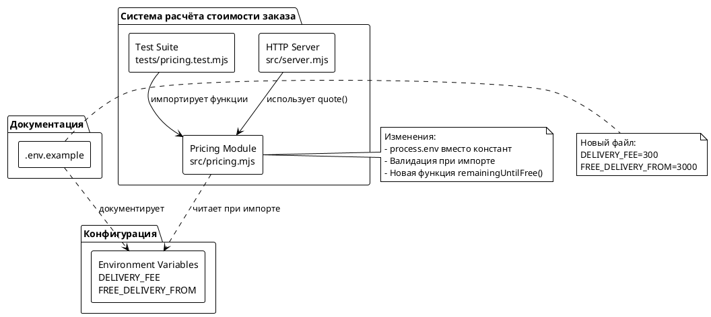
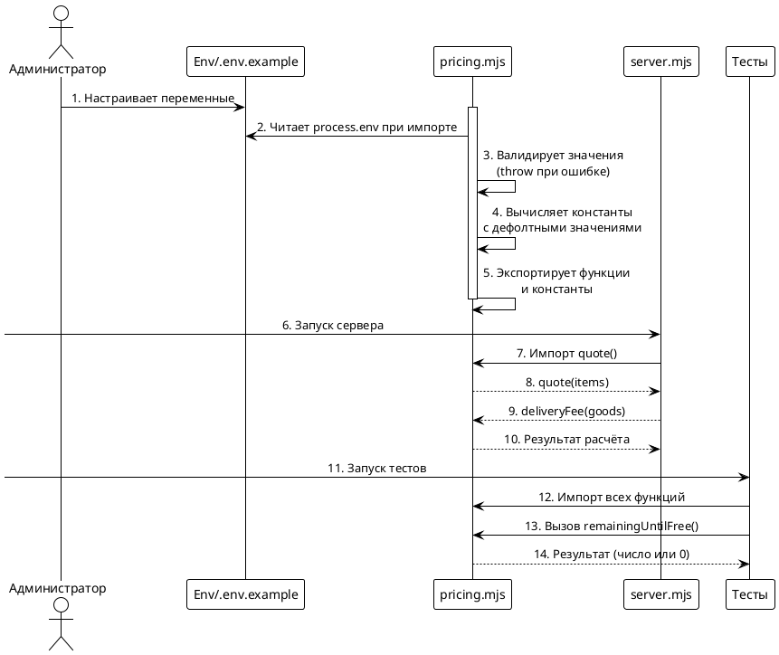

# Системные требования: FNR-1. Параметризация порога бесплатной доставки

## 1. Введение

### 1.1. Общая информация

| Поле | Значение |
|------|----------|
| **Проект** | poh-demo-checkout |
| **Задача** | FNR-1: Параметризация порога бесплатной доставки |
| **Версия** | 1.0 |
| **Статус** | Проектирование |
| **Автор** | System Analyst (fnr-system-requirements) |
| **Дата создания** | 2026-08-20 |
| **Источник** | concept.md (вердикт дебатов) |

### 1.2. Термины и определения

| Термин | Определение |
|--------|-------------|
| **DELIVERY_FEE** | Стоимость платной доставки в рублях |
| **FREE_DELIVERY_FROM** | Порог суммы заказа, начиная с которого доставка бесплатна |
| **remainingUntilFree** | Функция расчёта остатка до бесплатной доставки |
| **process.env** | Механизм параметризации через переменные окружения |

### 1.3. Связанные документы

| Документ | Расположение |
|----------|--------------|
| Постановка задачи | `sa_documentation/FNR/FNR_1/task.md` |
| Концепты решений | `sa_documentation/FNR/FNR_1/concept.md` |
| Исходный код | `src/pricing.mjs`, `tests/pricing.test.mjs` |

### 1.4. История изменений

| Версия | Дата | Автор | Изменение |
|--------|------|-------|-----------|
| 1.0 | 2026-08-20 | System Analyst | Первая версия |

---

## 2. Общее описание

### 2.1. Текущее состояние (As-Is)

#### Описание текущего поведения

В проекте `poh-demo-checkout` стоимость доставки рассчитывается в модуле `src/pricing.mjs` (строки 635-672). Константы жёстко заданы в коде:

```javascript
// src/pricing.mjs:635-640
export const DELIVERY_FEE = 300;
export const FREE_DELIVERY_FROM = 3000;
```

Функция расчёта доставки (строки 670-672):

```javascript
export function deliveryFee(amount) {
  return amount >= FREE_DELIVERY_FROM ? 0 : DELIVERY_FEE;
}
```

**Ключевые характеристики текущего решения:**

1. **Порог включительно** — комментарий в коде (строки 637-639) явно указывает:
   > «от 3000» в тексте оферты означает включительно, и расхождение здесь стоило бы дороже, чем читается.

2. **Отсутствие параметризации** — изменение значений требует модификации исходного кода и повторного деплоя.

3. **Отсутствие функции расчёта остатка** — нет способа определить, сколько осталось до бесплатной доставки.

4. **Единственная точка расчёта** — логика локализована в `pricing.mjs`, используется только `server.mjs` через импорт `quote`.

5. **Паттерн конфигурации уже используется** — `src/server.mjs:8` применяет `process.env.PORT || 8080` для параметризации порта.

#### Ограничения текущего решения

| Ограничение | Влияние |
|-------------|---------|
| Жёстко заданные константы | Изменение требует деплоя |
| Отсутствие параметризации | Невозможность A/B тестирования цен |
| Нет расчёта остатка | Не может быть показано на витрине корзины |

### 2.2. Архитектурное решение

Выбранный концепт: **Концепт 1 (Прагматичный)** с модификациями из вердикта дебатов.

**Решение:**
1. Заменить жёстко заданные константы на чтение из `process.env` с дефолтными значениями
2. Добавить минимальную валидацию значений при импорте модуля
3. Добавить функцию `remainingUntilFree(amount)` для расчёта остатка
4. Сохранить экспорт констант для обратной совместимости с тестами
5. Создать `.env.example` с документацией переменных

**Обоснование выбора:**
- Следует существующему паттерну проекта (`process.env.PORT`)
- Минимальные изменения = низкий риск поломки
- Дефолтные значения гарантируют обратную совместимость
- Усилия 2-3 часа против 4-6 часов у Концепта 2

### 2.3. Диаграмма компонентов



### 2.4. Схема последовательности



---

## 3. План миграции

### 3.1. Этапы внедрения

```plantuml
@startuml
!theme plain
skinparam activity {
  BackgroundColor #E3F2FD
  BorderColor #2196F3
}

start

:Этап 1: Подготовка;
note right
  Создаём .env.example
  с документацией переменных
end note

:Этап 2: Изменение pricing.mjs;
note right
  - Заменить константы на process.env
  - Добавить валидацию
  - Добавить remainingUntilFree()
end note

:Этап 3: Обновление тестов;
note right
  - Добавить тесты remainingUntilFree
  - Проверить существующие тесты
end note

:Этап 4: Проверка;
note right
  Прогон: node --test "tests/*.test.mjs"
end note

split
  :Тесты зелёные?;
  :Да → Готово к деплою;
else
  :Нет → Исправление ошибок;
  :Повторный прогон;
endif

end split

stop

@enduml
```

### 3.2. Таблица этапов

| № | Этап | Описание | Критерий готовности | Откат |
|---|------|----------|---------------------|-------|
| 1 | Подготовка .env.example | Создать файл с документацией переменных окружения | Файл существует и содержит `DELIVERY_FEE` и `FREE_DELIVERY_FROM` | Удалить файл |
| 2 | Модификация pricing.mjs | Заменить константы на `process.env`, добавить валидацию и `remainingUntilFree()` | Модуль импортируется без ошибок, валидация работает | `git checkout src/pricing.mjs` |
| 3 | Обновление тестов | Добавить тесты для новой функции, проверить обратную совместимость | Все тесты проходят (`node --test "tests/*.test.mjs"`) | `git checkout tests/pricing.test.mjs` |
| 4 | Верификация | Прогон полного тестового набора | CI зелёный | Весь откат этапов 1-3 |

---

## 4. Функциональные требования — Backend / БД / API

> **Примечание:** Проект не использует базу данных. Все изменения касаются серверного кода и тестов.

### 4.1. Задача 1: Параметризация констант доставки

| Поле | Значение |
|------|----------|
| **Ответственный за тех. реализацию** | Backend-разработчик |
| **Задача на разработку** | Заменить жёстко заданные константы на чтение из переменных окружения |
| **Jira-ссылка** | (будет создана) |
| **Статус** | Новая |

#### Описание

Заменить жёстко заданные константы `DELIVERY_FEE` и `FREE_DELIVERY_FROM` в файле `src/pricing.mjs` на чтение из переменных окружения с дефолтными значениями, равными текущим константам.

#### Обоснование

Текущие значения (300 и 3000) жёстко зашиты в код. Любое изменение требует модификации исходного кода и повторного деплоя. Параметризация через `process.env` соответствует существующему паттерну проекта (`PORT` в `server.mjs`).

#### Затрагиваемые компоненты

- `src/pricing.mjs` — строки 5, 10 (константы)

#### Критерии приёмки

1. Константы читаются из `process.env` с дефолтными значениями
2. Дефолтные значения равны текущим: `DELIVERY_FEE = 300`, `FREE_DELIVERY_FROM = 3000`
3. Константы продолжают экспортироваться для обратной совместимости
4. Существующие тесты проходят без модификации (кроме новых тестов)

#### Зависимости

Нет.

---

### 4.2. Задача 2: Добавление валидации значений

| Поле | Значение |
|------|----------|
| **Ответственный за тех. реализацию** | Backend-разработчик |
| **Задача на разработку** | Добавить валидацию значений при импорте модуля |
| **Jira-ссылка** | (будет создана) |
| **Статус** | Новая |

#### Описание

Добавить валидацию значений `DELIVERY_FEE` и `FREE_DELIVERY_FROM` сразу после чтения из `process.env`. При невалидных значениях модуль должен выбрасывать ошибку с описанием проблемы.

#### Обоснование

Согласно вердикту дебатов, отсутствие валидации — риск: при передаче невалидного значения (например, `"abc"`) функция `Number()` вернёт `NaN`, что сломает расчёт доставки.

#### Затрагиваемые компоненты

- `src/pricing.mjs` — блок валидации после констант

#### Критерии приёмки

1. При передаче нечислового значения выбрасывается `Error` с описанием
2. При передаче отрицательного значения выбрасывается `Error`
3. Валидация происходит при импорте модуля (ранний отказ)
4. Сообщение об ошибке содержит имя переменной

#### Нефункциональные требования

| Параметр | Значение |
|----------|----------|
| **Время валидации** | Мгновенно (при импорте) |
| **Тип ошибки** | `Error` с текстовым описанием |

#### Зависимости

Зависит от: Задача 1 (Параметризация констант доставки)

---

### 4.3. Задача 3: Добавление функции расчёта остатка

| Поле | Значение |
|------|----------|
| **Ответственный за тех. реализацию** | Backend-разработчик |
| **Задача на разработку** | Реализовать функцию `remainingUntilFree(amount)` |
| **Jira-ссылка** | (будет создана) |
| **Статус** | Новая |

#### Описание

Добавить чистую функцию `remainingUntilFree(amount)` для расчёта остатка суммы до бесплатной доставки.

#### Обоснование

Согласно постановке задачи, требуется добавить расчёт «сколько до бесплатной доставки» для отображения на витрине корзины (UI-задача отдельная).

#### Затрагиваемые компоненты

- `src/pricing.mjs` — новая функция

#### Критерии приёмки

1. Функция экспортируется из `pricing.mjs`
2. При `amount >= FREE_DELIVERY_FROM` возвращает `0`
3. При `amount < FREE_DELIVERY_FROM` возвращает положительную разницу
4. Функция следует паттерну чистых функций (без побочных эффектов)

#### Зависимости

Зависит от: Задача 1 (Параметризация констант доставки)

---

### 4.4. Задача 4: Создание .env.example

| Поле | Значение |
|------|----------|
| **Ответственный за тех. реализацию** | Backend-разработчик |
| **Задача на разработку** | Создать файл с документацией переменных окружения |
| **Jira-ссылка** | (будет создана) |
| **Статус** | Новая |

#### Описание

Создать файл `.env.example` в корне проекта с документацией поддерживаемых переменных окружения.

#### Обоснование

Согласно вердикту дебатов, отсутствие документации переменных окружения — риск: разработчик деплоя должен угадывать или читать код.

#### Затрагиваемые компоненты

- Корень проекта — новый файл `.env.example`

#### Критерии приёмки

1. Файл `.env.example` существует в корне проекта
2. Файл содержит переменную `DELIVERY_FEE` с комментарием и примером значения
3. Файл содержит переменную `FREE_DELIVERY_FROM` с комментарием и примером значения
4. Файл добавлен в `.gitignore` (если `.env` уже там есть)

#### Зависимости

Нет.

---

### 4.5. Задача 5: Добавление тестов для remainingUntilFree

| Поле | Значение |
|------|----------|
| **Ответственный за тех. реализацию** | Backend-разработчик |
| **Задача на разработку** | Написать тесты для новой функции |
| **Jira-ссылка** | (будет создана) |
| **Статус** | Новая |

#### Описание

Добавить тестовые случаи для функции `remainingUntilFree` в файл `tests/pricing.test.mjs`.

#### Обоснование

Согласно правилам проекта (`AGENTS.md`, `CLAUDE.md`), новая логика требует нового теста. Без теста изменение считается незавершённым.

#### Затрагиваемые компоненты

- `tests/pricing.test.mjs` — новые тесты

#### Критерии приёмки

1. Тест на платную доставку (остаток > 0) проходит
2. Тест на порог бесплатной доставки (остаток = 0) проходит
3. Тест на бесплатную доставку (остаток = 0) проходит
4. Все существующие тесты продолжают проходить
5. Прогон `node --test "tests/*.test.mjs"` завершается успешно

#### Нефункциональные требования

| Параметр | Значение |
|----------|----------|
| **Покрытие** | 100% новой функции |
| **Фреймворк** | `node:test` (существующий в проекте) |

#### Зависимости

Зависит от: Задача 3 (Добавление функции расчёта остатка)

---

### 4.6. Задача 6 (Опциональная): Валидация бизнес-правила DELIVERY_FEE <= FREE_DELIVERY_FROM

| Поле | Значение |
|------|----------|
| **Ответственный за тех. реализацию** | Backend-разработчик |
| **Задача на разработку** | Добавить проверку логического соотношения констант |
| **Jira-ссылка** | (будет создана) |
| **Статус** | Новая (опционально) |

#### Описание

Добавить дополнительную валидацию: `DELIVERY_FEE` не должен превышать `FREE_DELIVERY_FROM` (логическое несоответствие: доставка дороже порога бесплатной доставки).

#### Обоснование

Согласно вердикту дебатов, это бизнес-валидация, которую можно добавить позже. Указана в модификациях концепта как «рассмотреть».

#### Затрагиваемые компоненты

- `src/pricing.mjs` — блок валидации

#### Критерии приёмки

1. При `DELIVERY_FEE > FREE_DELIVERY_FROM` выбрасывается `Error`
2. Сообщение об ошибки объясняет бизнес-правило
3. Все тесты проходят

#### Зависимости

Зависит от: Задача 2 (Добавление валидации значений)

---

## 5. Требования к интерфейсам — Frontend / UI

**Не применимо.**

Согласно постановке задачи (`task.md`), изменения UI не входят в scope текущей задачи:

> **НЕ входит в scope:**
> - Изменение логики для корзин ниже порога (сохранить текущее поведение)
> - Добавление UI на витрину корзины (отдельная задача)

Функция `remainingUntilFree` создаётся для будущего использования в UI, но интеграция с витриной корзины — отдельная задача.

---

## 6. Ревью требований

| Роль | Имя | Статус | Дата | Комментарии |
|------|-----|--------|------|------------|
| Аналитик | System Analyst | ✅ Готово | 2026-08-20 | — |
| Разработчик Backend | — | ⏳ Ожидает | — | — |
| Разработчик Frontend | — | ⏸️ Не применимо | — | UI-изменения вне scope |
| Тестирование | — | ⏳ Ожидает | — | — |

---

## 7. Риски и ограничения

### 7.1. Таблица рисков

| ID | Риск | Вероятность | Влияние | Митигация |
|----|------|-------------|---------|-----------|
| R1 | Отсутствие переменных окружения в проде | Средняя | Средняя | Дефолтные значения равны текущим константам — обратная совместимость |
| R2 | Передача невалидного значения (NaN, отрицательное) | Низкая | Высокая | Валидация при импорте с `throw new Error` |
| R3 | DELIVERY_FEE > FREE_DELIVERY_FROM (логическая ошибка) | Низкая | Средняя | Опциональная валидация бизнес-правила (Задача 6) |
| R4 | Тесты зависят от окружения | Средняя | Низкая | Дефолтные значения в тестовом окружении |
| R5 | Разработчик деплоя не прочитает .env.example | Низкая | Средняя | Валидация с самодокументирующимся сообщением об ошибке |

### 7.2. Ограничения

1. **Отсутствие валидации типов** — `Number("abc")` вернёт `NaN` silently; требуется явная проверка `Number.isFinite()`.
2. **Глобальность переменных окружения** — `process.env` глобален для всего процесса; мульти-тенантность не поддерживается.
3. **Отсутствие hot-reload** — изменение значений требует перезапуска процесса.
4. **Ограниченная тестируемость** — валидация при импорте затрудняет тестирование сценариев с невалидными значениями.
5. **Отсутствие централизованной конфигурации** — только 2 параметра; отдельный модуль конфигурации избыточен.

---

## 8. Приложения

### 8.1. Шаблон .env.example

```bash
# Параметры доставки
# Стоимость доставки в рублях
DELIVERY_FEE=300

# Порог бесплатной доставки в рублях
# Заказы с суммой >= FREE_DELIVERY_FROM доставляются бесплатно
FREE_DELIVERY_FROM=3000
```

### 8.2. Пример реализации валидации

```javascript
// src/pricing.mjs — предлагаемая реализация
const DELIVERY_FEE = Number(process.env.DELIVERY_FEE || 300);
const FREE_DELIVERY_FROM = Number(process.env.FREE_DELIVERY_FROM || 3000);

// Валидация
if (!Number.isFinite(DELIVERY_FEE) || DELIVERY_FEE < 0) {
  throw new Error('DELIVERY_FEE должен быть числом >= 0');
}
if (!Number.isFinite(FREE_DELIVERY_FROM) || FREE_DELIVERY_FROM < 0) {
  throw new Error('FREE_DELIVERY_FROM должен быть числом >= 0');
}

// Опционально: бизнес-валидация
if (DELIVERY_FEE > FREE_DELIVERY_FROM) {
  throw new Error('DELIVERY_FEE не должен превышать FREE_DELIVERY_FROM');
}

// Экспорт для обратной совместимости
export { DELIVERY_FEE, FREE_DELIVERY_FROM };
```

### 8.3. Пример реализации remainingUntilFree

```javascript
// src/pricing.mjs — предлагаемая реализация
export function remainingUntilFree(amount) {
  const remaining = FREE_DELIVERY_FROM - amount;
  return remaining > 0 ? remaining : 0;
}
```

### 8.4. Примеры тестов для remainingUntilFree

```javascript
// tests/pricing.test.mjs — предлагаемые тесты
test('остаток до бесплатной доставки считается корректно', () => {
  assert.equal(remainingUntilFree(0), FREE_DELIVERY_FROM);
  assert.equal(remainingUntilFree(1000), FREE_DELIVERY_FROM - 1000);
  assert.equal(remainingUntilFree(2999), 1);
});

test('на пороге и выше остаток равен нулю', () => {
  assert.equal(remainingUntilFree(FREE_DELIVERY_FROM), 0);
  assert.equal(remainingUntilFree(FREE_DELIVERY_FROM + 1000), 0);
});
```

---

**Дата создания:** 2026-08-20
**Автор:** System Analyst (fnr-system-requirements)
**Версия:** 1.0

---
