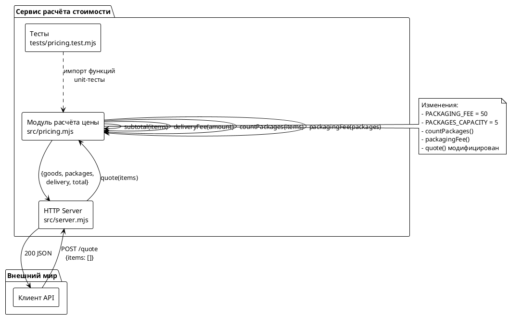
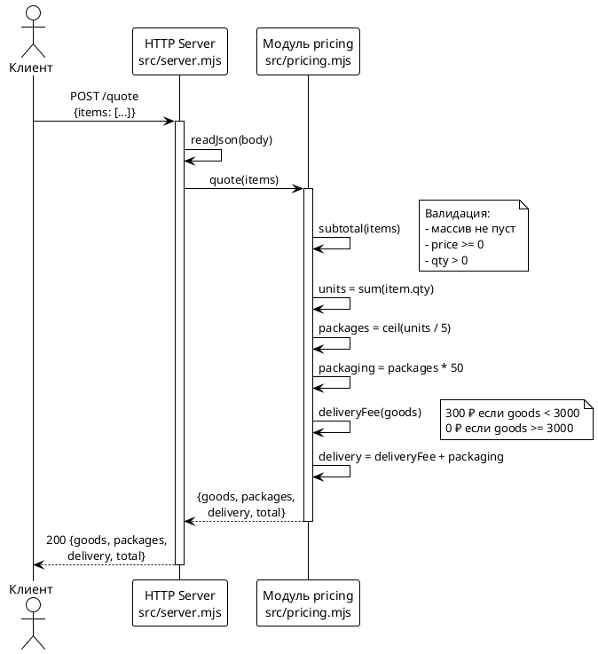

# Системные требования: FNR-1 — Плата за упаковку по числу посылок

## 1. Введение

### 1.1 Метаданные

| Поле | Значение |
|------|----------|
| **Название задачи** | Плата за упаковку по числу посылок в эндпоинте POST /quote |
| **FNR номер** | FNR-1 |
| **Issue** | #29 |
| **Статус** | В разработке |
| **Приоритет** | P3 |
| **Дата создания** | 2026-08-19 |
| **Ответственный аналитик** | Issue-Agent |
| **Ответственный за тех. реализацию** | OpenHands / Разработчик Backend |

### 1.2 Термины и определения

| Термин | Определение |
|--------|-------------|
| **Посылка** | Единица упаковки товара, вмещающая до 5 единиц товара (qty) |
| **Единица товара** | Одна позиция заказа с количеством qty = 1 |
| **Плата за упаковку** | Фиксированная ставка 50 ₽ за каждую посылку |
| **Базовая доставка** | Фиксированная ставка 300 ₽ или 0 при sum(goods) >= 3000 |
| **Цитата заказа (quote)** | Ответ эндпоинта POST /quote с расчётом стоимости |
| **Обратная совместимость** | Сохранение существующих полей и их смыслов в API |

### 1.3 Ссылки на связанные артефакты

| Артефакт | Расположение |
|----------|--------------|
| Задача (task.md) | `sa_documentation/FNR/FNR_1/task.md` |
| Концепты решений (concept.md) | `sa_documentation/FNR/FNR_1/concept.md` |
| Issue | #29 |
| CI конфигурация | `.github/workflows/ci.yml` |

### 1.4 История изменений

| Версия | Дата | Автор | Изменение |
|--------|------|-------|-----------|
| 1.0 | 2026-08-19 | Issue-Agent | Создание документа на основе концепта №2 |

---

## 2. Общее описание

### 2.1 Текущее состояние (As-Is)

#### 2.1.1 Описание текущего поведения

**Эндпоинт:** `POST /quote`

**Текущий файл реализации:** `src/pricing.mjs:48-52`

```javascript
export function quote(items) {
  const goods = subtotal(items);
  const delivery = deliveryFee(goods);
  return { goods, delivery, total: goods + delivery };
}
```

**Текущая структура ответа:**
```json
{
  "goods": <сумма товаров>,
  "delivery": <300 или 0>,
  "total": <goods + delivery>
}
```

**Ограничения текущего решения:**

1. **Отсутствует учёт количества посылок** — крупные заказы, требующие разбиения на несколько посылок, обрабатываются с затратами на одну посылку
2. **Не учитывается плата за упаковку** — расходы на упаковку каждой посылки не включаются в расчёт доставки
3. **Поле `packages` отсутствует** — клиент не получает информацию о количестве посылок

**Код-доказательства:**

- `src/pricing.mjs:609-614` — константы доставки (DELIVERY_FEE = 300, FREE_DELIVERY_FROM = 3000)
- `src/pricing.mjs:644-646` — функция deliveryFee возвращает 300 или 0
- `src/pricing.mjs:625-638` — subtotal валидирует и суммирует позиции
- `src/server.mjs:688-701` — HTTP-обёртка вызывает quote(body?.items)

#### 2.1.2 Затрагиваемые компоненты

| Компонент | Файл | Роль |
|-----------|------|------|
| Модуль расчёта цены | `src/pricing.mjs` | Основные изменения: добавление констант и функций |
| HTTP-сервер | `src/server.mjs` | Без изменений (проксирует quote) |
| Тесты | `tests/pricing.test.mjs` | Добавление тестовых сценариев |

### 2.2 Архитектурное решение

**Выбранный концепт:** Концепт 2 (Выделенные функции `countPackages()` и `packagingFee()`)

**Обоснование выбора (из вердикта дебатов):**

1. **Следует паттерну файла** — В `src/pricing.mjs` уже есть паттерн: мелкие чистые функции с понятными именами (`subtotal`, `deliveryFee`). Добавление `countPackages()` и `packagingFee()` продолжает эту традицию
2. **Тестируемость из коробки** — Новые функции можно проверить в изоляции
3. **Расширяемость без переписывания** — Если завтра появится правило "посылки с разными товарами считаются отдельно", мы изменим только `countPackages()`
4. **Без зависимостей** — Все изменения локальны в `pricing.mjs`

**Модификация концепта из дебатов:**
- Убран qualification "Прагматичное" — это "Консистентное с существующей структурой"
- Экспорт `countPackages` и `packagingFee` — intention для тестируемости

### 2.3 Диаграмма компонентов



### 2.4 Схема последовательности



---

## 3. План миграции

### 3.1 Этапы внедрения

```plantuml
@startuml
!theme plain
start

:Этап 1: Подготовка;
:Добавить константы\nPACKAGING_FEE, PACKAGES_CAPACITY;

ifКонстанты добавлены?then
  :Этап 2: Реализация функций;
  :Реализовать countPackages();
  :Реализовать packagingFee();

  ifФункции реализованы?then
    :Этап 3: Модификация quote();
    :Обновить quote()\nс вызовом новых функций;

    ifquote() обновлён?then
      :Этап 4: Тестирование;
      :Добавить тесты\nв pricing.test.mjs;
      :Запустить node --test;

      ifТесты проходят?then
        :Этап 5: Коммит и PR;
        :Коммит изменений;
        :Создать PR\nCloses #29;
        stop
      else
        :Исправить тесты/код;
        detach
      endif

    else
      :Откатить quote();
      detach
    endif

  else
    :Откатить функции;
    detach
  endif

else
  :Откатить константы;
  detach
endif

@enduml
```

### 3.2 Таблица этапов с откатами

| Этап | Описание | Действия | Критерий готовности | Откат |
|------|----------|----------|---------------------|-------|
| **1** | Подготовка констант | Добавить `PACKAGING_FEE = 50` и `PACKAGES_CAPACITY = 5` в `src/pricing.mjs` | Константы определены после `FREE_DELIVERY_FROM` | Удалить строки констант |
| **2** | Реализация функций | Добавить `countPackages()` и `packagingFee()` | Функции экспортируются и проходят базовый тест | Удалить функции |
| **3** | Модификация quote() | Обновить `quote()` для использования новых функций | `quote()` возвращает поле `packages` и обновлённый `delivery` | Откатить `quote()` к исходному виду |
| **4** | Тестирование | Добавить тесты в `tests/pricing.test.mjs` | `node --test "tests/*.test.mjs"` проходит без ошибок | Удалить новые тесты |
| **5** | Интеграция | Коммит, push, создание PR | PR открыт, тесты в CI зелёные | Закрыть PR, revert commit |

### 3.3 Критерии готовности

1. **Функциональные:**
   - Эндпоинт `POST /quote` возвращает поле `packages`
   - Поле `delivery` = базовая доставка + упаковка
   - Упаковка взимается даже при бесплатной доставке

2. **Тестовые:**
   - Все новые тесты проходят
   - Существующие тесты не сломаны

3. **Совместимость:**
   - Поле `goods` не изменилось
   - Поле `total` считается по формуле `goods + delivery`

---

## 4. Функциональные требования — Backend / БД / API

### 4.1 Задача 1: Добавление констант упаковки

**Метаданные:**

| Поле | Значение |
|------|----------|
| **Ответственный за тех. реализацию** | Разработчик Backend |
| **Задача на разработку** | FNR-1-T1 |
| **Jira-ссылка** | #29 |

**Описание:**

Добавить две экспортируемые константы в модуль `src/pricing.mjs`:
- `PACKAGING_FEE` — стоимость упаковки одной посылки (50 ₽)
- `PACKAGES_CAPACITY` — вместимость одной посылки (5 единиц товара)

Константы должны быть расположены после существующей константы `FREE_DELIVERY_FROM` (строка 614).

**Обоснование:**

Константы вынесены для:
1. Тестируемости — могут быть импортированы в тесты
2. Читаемости — имена описывают смысл значений
3. Расширяемости — изменение параметров в одном месте

**Затрагиваемые компоненты:**

- `src/pricing.mjs:8-10` (после строки 614)

**Критерии приёмки:**

1. Константа `PACKAGING_FEE` = 50
2. Константа `PACKAGES_CAPACITY` = 5
3. Обе константы экспортируются (`export const`)
4. Расположение в файле: после `FREE_DELIVERY_FROM`

**Зависимости:**

Нет (первая задача)

**Код:**

```javascript
// После строки 614 (FREE_DELIVERY_FROM)
export const PACKAGING_FEE = 50;
export const PACKAGES_CAPACITY = 5;
```

---

### 4.2 Задача 2: Реализация функции countPackages()

**Метаданные:**

| Поле | Значение |
|------|----------|
| **Ответственный за тех. реализацию** | Разработчик Backend |
| **Задача на разработку** | FNR-1-T2 |
| **Jira-ссылка** | #29 |

**Описание:**

Реализовать чистую функцию `countPackages(items)`, которая вычисляет количество посылок для набора позиций заказа.

**Логика:**
1. Вычислить общее количество единиц: `units = sum(item.qty)`
2. Посылки: `packages = ceil(units / PACKAGES_CAPACITY)`

**Обоснование:**

Функция выделена для:
1. Изоляции логики расчёта посылок
2. Независимого тестирования
3. Следования паттерну файла (мелкие чистые функции)

**Затрагиваемые компоненты:**

- `src/pricing.mjs` (новая функция, позиция ~46)

**Критерии приёмки:**

1. Функция экспортируется (`export function`)
2. JSDoc-комментарий с описанием и параметром
3. Расчёт соответствует формуле
4. Обрабатывает пустой массив (выбрасывает ошибку через `subtotal`)

**Зависимости:**

- FNR-1-T1 (константы должны быть определены)

**Код:**

```javascript
/**
 * Количество посылок для набора позиций.
 * @param {Item[]} items
 */
export function countPackages(items) {
  const units = items.reduce((sum, item) => sum + item.qty, 0);
  return Math.ceil(units / PACKAGES_CAPACITY);
}
```

---

### 4.3 Задача 3: Реализация функции packagingFee()

**Метаданные:**

| Поле | Значение |
|------|----------|
| **Ответственный за тех. реализацию** | Разработчик Backend |
| **Задача на разработку** | FNR-1-T3 |
| **Jira-ссылка** | #29 |

**Описание:**

Реализовать чистую функцию `packagingFee(packages)`, которая вычисляет стоимость упаковки для заданного количества посылок.

**Логика:**
- Стоимость = `packages * PACKAGING_FEE`

**Обоснование:**

Функция выделена для:
1. Изоляции логики расчёта стоимости
2. Независимого тестирования
3. Следования паттерну файла (аналог `deliveryFee`)

**Затрагиваемые компоненты:**

- `src/pricing.mjs` (новая функция, позиция ~52)

**Критерии приёмки:**

1. Функция экспортируется (`export function`)
2. JSDoc-комментарий с описанием и параметром
3. Расчёт соответствует формуле
4. Принимает число, возвращает число

**Зависимости:**

- FNR-1-T1 (константа `PACKAGING_FEE`)

**Код:**

```javascript
/**
 * Стоимость упаковки для числа посылок.
 * @param {number} packages
 */
export function packagingFee(packages) {
  return packages * PACKAGING_FEE;
}
```

---

### 4.4 Задача 4: Модификация функции quote()

**Метаданные:**

| Поле | Значение |
|------|----------|
| **Ответственный за тех. реализацию** | Разработчик Backend |
| **Задача на разработку** | FNR-1-T4 |
| **Jira-ссылка** | #29 |

**Описание:**

Модифицировать функцию `quote(items)` для:
1. Вычисления количества посылок через `countPackages()`
2. Вычисления стоимости упаковки через `packagingFee()`
3. Добавления упаковки к доставке
4. Возврата поля `packages` в ответе

**Новая структура ответа:**
```javascript
return { goods, packages, delivery, total: goods + delivery };
```

Где `delivery = deliveryFee(goods) + packagingFee(packages)`

**Обоснование:**

Функция `quote()` является точкой агрегации всех расчётов. Модификация позволяет включить упаковку в итоговую стоимость без нарушения обратной совместимости.

**Затрагиваемые компоненты:**

- `src/pricing.mjs:48-52` (текущая реализация `quote`)

**Критерии приёмки:**

1. Поле `goods` не изменилось (обратная совместимость)
2. Поле `packages` присутствует в ответе
3. Поле `delivery` включает упаковку
4. Поле `total` = `goods + delivery`
5. Валидация пустого заказа сохраняется (бросает ошибку)

**Зависимости:**

- FNR-1-T2 (функция `countPackages`)
- FNR-1-T3 (функция `packagingFee`)

**Код:**

```javascript
export function quote(items) {
  const goods = subtotal(items);
  const packages = countPackages(items);
  const delivery = deliveryFee(goods) + packagingFee(packages);
  return { goods, packages, delivery, total: goods + delivery };
}
```

---

### 4.5 Задача 5: Добавление тестов

**Метаданные:**

| Поле | Значение |
|------|----------|
| **Ответственный за тех. реализацию** | Разработчик Backend / QA |
| **Задача на разработку** | FNR-1-T5 |
| **Jira-ссылка** | #29 |

**Описание:**

Добавить тестовые сценарии в файл `tests/pricing.test.mjs` для покрытия новой функциональности.

**Сценарии для покрытия:**

| Сценарий | Входные данные | Ожидаемый результат |
|----------|----------------|---------------------|
| 1. 6 единиц → 2 посылки | `[{sku:"a",price:100,qty:6}]` | `packages: 2`, `delivery: 300+100=400` |
| 2. 5 единиц → 1 посылка | `[{sku:"a",price:100,qty:5}]` | `packages: 1`, `delivery: 300+50=350` |
| 3. 1 единица → 1 посылка | `[{sku:"a",price:100,qty:1}]` | `packages: 1`, `delivery: 300+50=350` |
| 4. Бесплатная доставка, упаковка платится | `[{sku:"a",price:5000,qty:1}]` | `packages: 1`, `delivery: 0+50=50` |
| 5. Несколько позиций | `[{sku:"a",price:100,qty:3},{sku:"b",price:200,qty:4}]` | `units: 7`, `packages: 2` |

**Обоснование:**

Тесты гарантируют корректность расчётов и защищают от регрессии. Расчёт — единственное, что может сломаться молча в этом сервисе.

**Затрагиваемые компоненты:**

- `tests/pricing.test.mjs`

**Критерии приёмки:**

1. Все 5+ сценариев покрыты тестами
2. Тесты используют новые константы (`PACKAGING_FEE`, `PACKAGES_CAPACITY`)
3. Тесты для новых функций (`countPackages`, `packagingFee`) присутствуют
4. Команда `node --test "tests/*.test.mjs"` проходит без ошибок

**Зависимости:**

- FNR-1-T1, FNR-1-T2, FNR-1-T3, FNR-1-T4 (код должен быть реализован)

**Пример теста:**

```javascript
test('плата за упаковку по числу посылок', () => {
  const result = quote([{ sku: 'a', price: 100, qty: 6 }]);
  assert.equal(result.packages, 2);
  assert.equal(result.delivery, 400); // 300 (база) + 100 (упаковка)
});
```

---

### 4.6 API: Изменения в эндпоинте POST /quote

**Описание изменений:**

Эндпоинт `POST /quote` меняет структуру ответа: добавляется поле `packages`, изменяется формула расчёта `delivery`.

**Перечень эндпоинтов:**

| Метод | Путь | Изменение |
|-------|------|-----------|
| POST | /quote | Добавлено поле `packages`, изменён `delivery` |

**Формат ответа (новый):**

```json
{
  "goods": <сумма товаров в рублях>,
  "packages": <количество посылок>,
  "delivery": <базовая доставка (300 или 0) + упаковка (50 * packages)>,
  "total": <goods + delivery>
}
```

**Примеры ответов:**

| Сценарий | Запрос | Ответ |
|----------|--------|-------|
| 6 единиц, платная доставка | `{"items":[{"sku":"a","price":100,"qty":6}]}` | `{"goods":600,"packages":2,"delivery":400,"total":1000}` |
| 1 единица, бесплатная доставка | `{"items":[{"sku":"a","price":5000,"qty":1}]}` | `{"goods":5000,"packages":1,"delivery":50,"total":5050}` |

**Статусы ответов:**

| Статус | Когда | Тело ответа |
|--------|-------|--------------|
| 200 | Успешный расчёт | `{goods, packages, delivery, total}` |
| 400 | Ошибка валидации | `{error: "<текст ошибки>"}` |
| 404 | Не тот эндпоинт | `{error: "не найдено"}` |

---

## 5. Требования к интерфейсам — Frontend / UI

**Статус:** Не применимо

**Обоснование:**

Задача затрагивает только backend-логику расчёта стоимости. Изменения в `src/server.mjs` не требуются — HTTP-обёртка прозрачно передаёт результат `quote()` в ответ. Клиенты API получат обновлённую структуру ответа с дополнительным полем `packages`, но это не требует изменений на frontend (если таковой имеется).

---

## 6. Ревью требований

| Роль | Имя | Статус | Комментарии |
|------|-----|--------|-------------|
| Аналитик | Issue-Agent | ✅ | Требования сформированы на основе концепта №2 с учётом вердикта дебатов |
| Разработчик Backend | — | ⏳ | На рассмотрении |
| Разработчик Frontend | — | N/A | Не применимо |
| Тестирование | — | ⏳ | На рассмотрении |

---

## 7. Риски и ограничения

### 7.1 Таблица рисков

| ID | Риск | Вероятность | Влияние | Митигация |
|----|------|-------------|---------|-----------|
| R1 | Ошибка в формуле расчёта посылок (деление вместо ceil) | Низкая | Высокая | Unit-тесты покрывают граничные случаи (5, 6 единиц) |
| R2 | Нарушение обратной совместимости поля `goods` | Низкая | Критическое | Тесты гарантируют неизменность существующих полей |
| R3 | Упаковка не взимается при бесплатной доставке | Средняя | Среднее | Тест-сценарий с крупным заказом (бесплатная доставка + упаковка) |
| R4 | Не учтено, что `qty` может быть 0 (в валидации) | Низкая | Среднее | Существующая валидация в `subtotal` проверяет `qty <= 0` |
| R5 | Изменение BREAKING для существующих клиентов | Средняя | Высокое | Поле `packages` добавлено, но не удалено ничего; клиенты игнорируют новые поля |

### 7.2 Ограничения

1. **Без внешних зависимостей** — новые зависимости не вводятся, все изменения в стандартном коде
2. **Чистые функции** — логика остаётся в `pricing.mjs`, сеть не используется
3. **Обратная совместимость** — поля `goods` и `total` сохраняют смысл, `delivery` расширяется (но не ломает существующие клиенты, которые его просто складывают с `goods`)
4. **Валидация** — заказ без позиций остаётся ошибкой (существующее поведение)
5. **Округление** — `Math.ceil` используется для расчёта посылок (всегда вверх)

---

## 8. Приложения

### 8.1 Сводка изменений в коде

**Файл: `src/pricing.mjs`**

| Позиция | Изменение |
|---------|-----------|
| После строки 614 | Добавить константы `PACKAGING_FEE` и `PACKAGES_CAPACITY` |
| ~46 (новая функция) | Добавить `countPackages(items)` |
| ~52 (новая функция) | Добавить `packagingFee(packages)` |
| 48-52 (quote) | Модифицировать `quote()` для использования новых функций |

**Файл: `tests/pricing.test.mjs`**

| Позиция | Изменение |
|---------|-----------|
| Конец файла | Добавить тесты для `countPackages`, `packagingFee`, `quote` с упаковкой |

### 8.2 Карты формул

**Расчёт до изменений:**
```
goods = sum(item.price * item.qty)
delivery = (goods < 3000) ? 300 : 0
total = goods + delivery
```

**Расчёт после изменений:**
```
goods = sum(item.price * item.qty)
units = sum(item.qty)
packages = ceil(units / 5)
packaging = packages * 50
delivery = ((goods < 3000) ? 300 : 0) + packaging
total = goods + delivery
```

### 8.3 Шпаргалка по тестированию

```bash
# Запуск тестов
node --test "tests/*.test.mjs"

# Ручная проверка эндпоинта
npm start
curl -sX POST localhost:8080/quote \
  -H 'content-type: application/json' \
  -d '{"items":[{"sku":"a","price":100,"qty":6}]}'
# Ожидаемый ответ: {"goods":600,"packages":2,"delivery":400,"total":1000}

# Проверка бесплатной доставки + упаковки
curl -sX POST localhost:8080/quote \
  -H 'content-type: application/json' \
  -d '{"items":[{"sku":"a","price":5000,"qty":1}]}'
# Ожидаемый ответ: {"goods":5000,"packages":1,"delivery":50,"total":5050}
```

---

**Документ согласован и готов к передаче на разработку.**

**Следующий шаг:** `/validate-doc sa_documentation/FNR/FNR_1/system_requirements.md`
