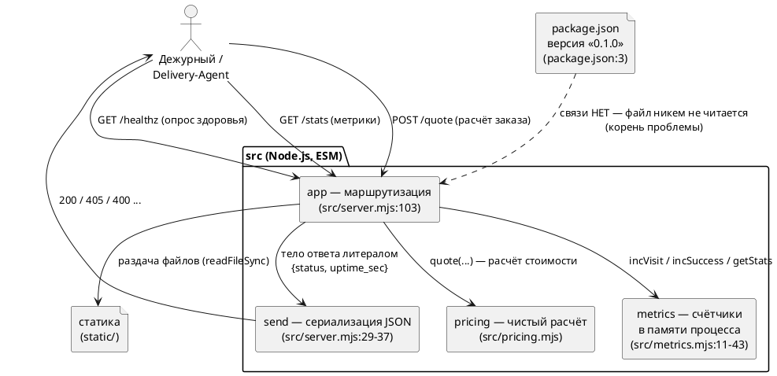
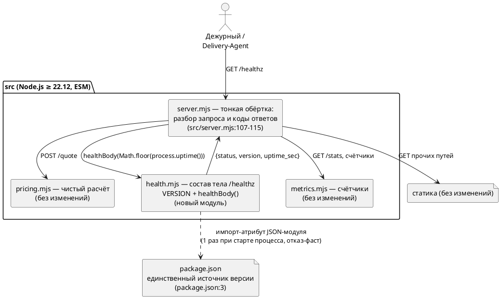
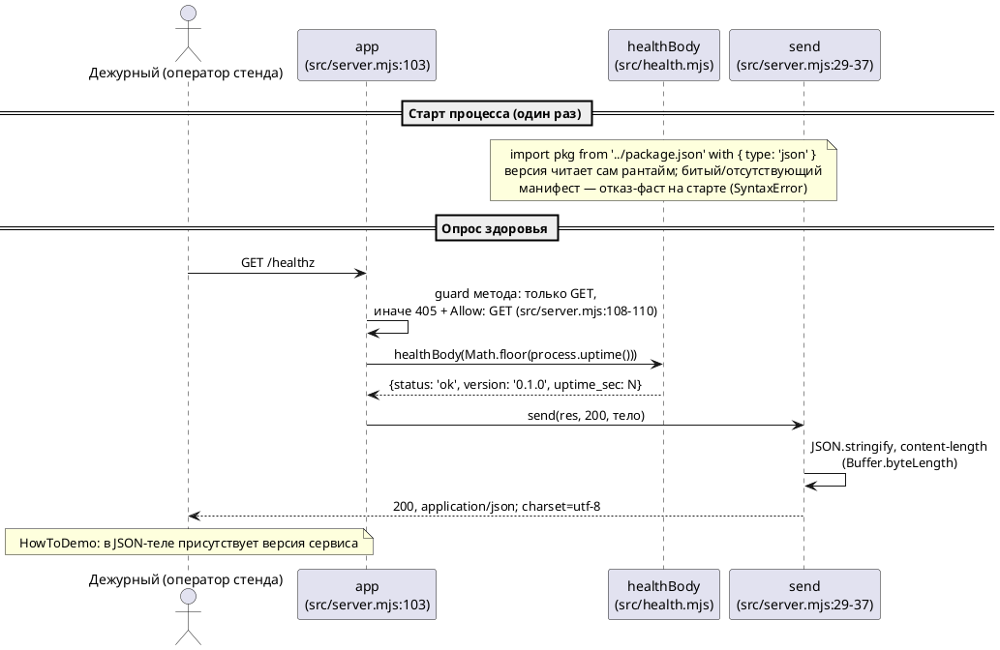
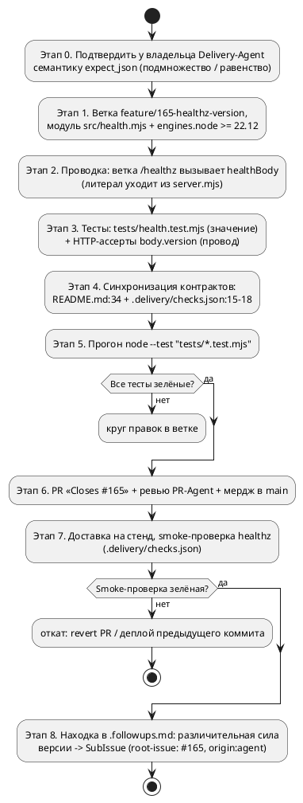

# FNR-1: Системные требования — версия сервиса в ответе `/healthz`

## 1. Введение

### 1.1 Общая информация

| Поле | Значение |
|---|---|
| Документ | Системные требования (System Requirements) |
| Номер FNR | FNR-1 |
| Дата | 2026-09-01 |
| Стадия пайплайна | Системные требования (вход — вердикт дебатов из `concept.md`) |
| Источник задачи | Issue `po-helper-org/poh-demo-checkout#165` (статус: открыт), приоритет P1 |
| Выбранный концепт | К1 «Правильное» — вынос состава тела `/healthz` в чистый модуль `src/health.mjs`, версия — импорт-атрибут JSON-модуля |
| Архитектурное решение | `sa_documentation/FNR/FNR_1/concept.md`, раздел «ВЕРДИКТ» (7 модификаций) |
| Постановка проблемы / As-Is | `sa_documentation/FNR/FNR_1/task.md` |
| Первичный источник кода | `sa_documentation/repomix-output.xml` + живой код репозитория |
| Стек | Node.js ≥ 22 (`package.json:11-12`), ES-модули (`package.json:5`), зависимостей нет |
| Ответственный за документ | Системный аналитик (стадия `/fnr-system-requirements`) |
| Граница задачи | Способ **хранения** версии не меняется — источник значения остаётся `package.json` (`task.md`, раздел 8); build-стадия, git SHA, дата сборки — вне границы |

БД в сервисе нет: единственное хранилище — память процесса (счётчики `visits`/`successes` в замыкании `src/metrics.mjs:11-43`, объявленное ограничение — `src/metrics.mjs:5-10`). Поэтому раздел 4 не содержит миграций БД; backend-часть — это код Node-сервиса, его тесты и delivery-контракт.

### 1.2 Термины и определения

| Термин | Определение |
|---|---|
| Компонент | Логическая единица системы: ES-модуль в `src/`, тестовый файл, документ, delivery-проверка |
| Хранилище | Место хранения данных: здесь — только память процесса (`src/metrics.mjs`) и файлы репозитория (`package.json`) |
| Интеграция | Взаимодействие между компонентами: HTTP-вызовы эндпоинтов сервиса, импорт модулей, чтение манифеста |
| Поток данных | Направленный путь данных: `package.json` → модуль `src/health.mjs` → тело ответа `/healthz` → потребитель |
| Зона воздействия | Полный набор компонентов, затрагиваемых изменением (код, тесты, документация, delivery-контракт — `task.md`, раздел 6) |
| Откат | Способ вернуть систему в состояние до изменения (revert PR / откат деплоя) |
| Якорь истины | Конкретный артефакт кода (`файл:строка`), подтверждающий утверждение документа |
| HowToDemo | Сценарий проверки готовности из issue: `GET /healthz` → в JSON-теле присутствует версия сервиса |
| Отказ-фаст | Поведение «упасть при старте» вместо молчивой деградации значения (вердикт дебатов, модификация 3) |

### 1.3 Ссылки

| № | Артефакт | Назначение |
|---|---|---|
| 1 | Issue `po-helper-org/poh-demo-checkout#165` (открыт) | БТ-1, ФТ-1, ФТ-2, HowToDemo, граница задачи |
| 2 | `sa_documentation/FNR/FNR_1/task.md` | Диагноз, As-Is, зона воздействия, конвенции, границы, открытые вопросы |
| 3 | `sa_documentation/FNR/FNR_1/concept.md` | Концепты К1–К5, дебаты, вердикт (выбран К1 + 7 модификаций) |
| 4 | `sa_documentation/repomix-output.xml` | Полный текст кода; `:42-74` — структура файлов (Dockerfile/build-стадии нет) |
| 5 | `CLAUDE.md` | Границы кода, правило «новая логика — новый тест», запрет зависимостей, SubIssue-дисциплина |
| 6 | `README.md:21-23` | Конвенция контура: подзадачи не заводятся, весь объём MVP — один прогон и один PR |
| 7 | `.delivery/checks.json` | Delivery-контракт: smoke-проверки, исполняемые Delivery-Agent'ом вне репо |
| 8 | `sa_documentation/FNR/FNR_1/repowise-dialog.md` | Метрики риска `src/server.mjs` (hotspot, со-изменения тестов) |

### 1.4 История изменений

| Версия | Дата | Автор | Изменение |
|---|---|---|---|
| 1.0 | 2026-09-01 | Системный аналитик | Первая редакция: As-Is из `task.md`, To-Be из вердикта по К1, декомпозиция на backend-задачи, план миграции, риски |

---

## 2. Общее описание

### 2.1 As-Is: текущее поведение с код-доказательствами

#### 2.1.1 Поток данных и ключевые компоненты

Сервис — один ES-модуль-обработчик `app` (единственный экспорт `src/server.mjs:103`), раздающий три маршрута и статику. Состав каждого JSON-ответа задаёт `send()` (`src/server.mjs:29-37`): `JSON.stringify` без преобразований, `content-type: application/json; charset=utf-8`, `content-length` через `Buffer.byteLength`.

1. **`GET /healthz`** — ветка `src/server.mjs:107-115`: guard метода (`:108-110`, не-GET → `405` + `Allow: GET`), затем литерал тела `{status: 'ok', uptime_sec: Math.floor(process.uptime())}` (`:111-114`). Это **единственное** место репо, определяющее состав ответа здоровья.
2. **`GET /stats`** — `src/server.mjs:117-122`, тело собирает `counters.getStats()` (`src/metrics.mjs:38-41`) — прецедент сборки тела **вне** обёртки.
3. **`POST /quote`** — `src/server.mjs:130-164`, расчёт в чистых функциях `src/pricing.mjs`.
4. **Статика** — `src/server.mjs:55-83`, `readFileSync` (`node:fs` импортирован `src/server.mjs:5` и используется только здесь, `:44`).
5. **`package.json`** — единственный источник версии (`package.json:3`, `"version": "0.1.0"`) — кодом **не читается и не импортируется**: упоминаний `package.json` в `src/`, `static/`, `tests/` нет; подстрока `version` по тем же каталогам даёт ноль совпадений (проверено grep по живому коду).

#### 2.1.2 Кто фиксирует состав ответа `/healthz` (зона воздействия)

| Категория | Артефакт | Что фиксирует | Доказательство |
|---|---|---|---|
| Код | `src/server.mjs:111-114` | Литерал тела `{status, uptime_sec}` | Живой код |
| Тесты | `tests/healthz.test.mjs:15-20` | Ответ **по полям**: `status` 200, `content-type`, `body.status`, `uptime_sec` — целое ≥ 0 | Живой код |
| Тесты | `tests/server.test.mjs:154-161` | То же по полям («200 с данными о состоянии») | Живой код |
| Тесты | `tests/server.test.mjs:184-189` | `/healthz` с query string — по полям | Живой код |
| Тесты | `tests/server.test.mjs:107-112`, `:146` | `/healthz` как «безобидный» запрос: не инкрементирует `visits` | Живой код |
| Документация | `README.md:34` | Пример тела `{"status":"ok","uptime_sec":123}`, коды `200, 405` | Живой код |
| Delivery-контракт | `.delivery/checks.json:10-19` | `expect_status: 200`, `expect_json: {"status":"ok"}` (`:15-17`), текстовое описание состава — `source` (`:18`) | Живой код |

Существенный факт о тестовом контракте: `deepEqual` на теле `/healthz` в репо **нет** (единственный `deepEqual` тела в серверных тестах — `/stats`, `tests/server.test.mjs:86`). Сегодняшние тесты допускают дополнительные поля, но **не требуют** их наличия — ассерта на версию нет нигде. HowToDemo из `plan`-артефакта описывает тело с многоточием (`{"status":"ok",...}` — `.harness/plan.md:222`) и правки не требует.

#### 2.1.3 Ограничения текущего решения

1. **Идентификатора сборки в ответе нет и взяться ему неоткуда.** Все обращения к `process.*` в сервере — три, ни одно не связано с версией: `process.env.PORT` (`src/server.mjs:27`), `process.uptime()` (`:113`), `process.argv[1]` (`:179`).
2. **`uptime_sec` — свойство процесса, а не сборки**: два деплоя одного коммита дают разные значения, один деплой через минуту — другое (`task.md`, раздел 3, шаг 1). Различителем процессов он не является.
3. **«Сборка» как артефакт отсутствует**: в структуре репо (`sa_documentation/repomix-output.xml:42-74`) нет ни `Dockerfile`, ни скрипта сборки; деплой — `node src/server.mjs` из исходников (`package.json:8`, `.delivery/checks.json:5`, образ `node:22-slim` — `.delivery/checks.json:7`).
4. **Файл-цель — хотспот**: `src/server.mjs` — самый нездоровый файл репо (health 5.45, hotspot 0.67, тренд increasing), идёт в паре со-изменений с `tests/server.test.mjs` (вес 6.88), у символа `app` — биомаркеры `complex_method`, `change_entropy`, `test_gap: true` (`sa_documentation/FNR/FNR_1/repowise-dialog.md:30-33`).
5. **Семантика `expect_json` в репо не определена** — код, исполняющий сравнение, живёт в Delivery-Agent вне репо (`.delivery/checks.json:2` — «агент не имеет права додумывать»). Вывод «подмножество, а не равенство» следует из того, что тело сегодня отвечает `{status, uptime_sec}` (`src/server.mjs:111-114`), а `expect_json` фиксирует только `status` (`.delivery/checks.json:15-17`) — при точном равенстве проверка была бы красной уже сейчас. Требует подтверждения владельца Delivery-Agent (этап 0 плана миграции).
6. **Версия не различает сборки**: значение `"0.1.0"` не менялось во всей видимой истории клона, тогда как `src/server.mjs` менялся минимум 10 раз в 2026-08-17 — 2026-08-28 (`task.md`, раздел 3, шаг 4). В границу задачи не входит — вынесено в SubIssue (раздел 3, этап 8).

### 2.2 Архитектурное решение (To-Be)

Решение зафиксировано вердиктом дебатов (`sa_documentation/FNR/FNR_1/concept.md`, раздел «ВЕРДИКТ»): **концепт К1 «Правильное»**.

1. Состав тела `/healthz` выносится из обработчика в чистый модуль **`src/health.mjs`**, который экспортирует константу `VERSION` и функцию `healthBody(uptimeSec)`.
2. Версия попадает в код **импорт-атрибутом JSON-модуля** — `import pkg from '../package.json' with { type: 'json' }`: значение читает сам рантайм, без `node:fs`, без ручного `JSON.parse`, без новых зависимостей.
3. `src/server.mjs` возвращает себя к собственной конвенции («только разбор запроса и коды ответов» — `src/server.mjs:1-2`, `CLAUDE.md` «Границы кода»): ветка `/healthz` вызывает `healthBody(...)`, литерал уходит из обёртки.

Модификации, обязательные по вердикту:

| № | Модификация | Следствие для требований |
|---|---|---|
| 1 | Имя поля — `version` | Задача 4.1; конфликтов имени нет ни в коде, ни в тестах, ни в `expect_json` (grep — пусто) |
| 2 | Разделить ответственность тестов: значение — чистым тестом, провод — HTTP | Задачи 4.3 (чистый `tests/health.test.mjs`) и 4.4 (HTTP-ассерты `body.version`) |
| 3 | Отказ-фаст: без `try/catch`-фолбэка `'unknown'` | Запрет зафиксирован в задачах 4.1/4.2 и в ограничениях (раздел 7.2, п. 6) |
| 4 | Синхронно обновить `.delivery/checks.json:15-18`; подтверждение семантики `expect_json` у владельца Delivery-Agent — обязательный шаг до мерджа | Этап 0 и задача 4.5 |
| 5 | Рекомендовать поднять `engines.node` с `>=22` до `>=22.12` (`package.json:11-12`) | Задача 4.1, подпункт b — фиксирует пол стабильности JSON-модулей |
| 6 | Верификация — один прогон `node --test "tests/*.test.mjs"` | Критерий приёмки каждой задачи, CI `ci.yml:28` |
| 7 | Различительная сила версии / штамп сборки — SubIssue `root-issue: #165`, метка `origin:agent` | Этап 8 плана миграции; в эту задачу не входит (`CLAUDE.md`, «MVP первым») |

Запасной ход (единственный случай: проблема с импорт-атрибутом в окружении стенда) — **К2**: чтение `package.json` одной строкой через уже импортированный `readFileSync` рядом с `STATIC_DIR` (`src/server.mjs:13`). Контракт тела идентичен; на требования документа замена К2↔К1 не влияет, меняется только задача 4.1 (см. приложение 8.4).

Отклонённые альтернативы (зачем зафиксированы — принцип Explicit Rejection):

| Альтернатива | Почему отклонена | Когда пересмотреть |
|---|---|---|
| К3 — `process.env.APP_VERSION \|\| '0.1.0'` | Нарушает ФТ-2 (значение не из `package.json`), второй источник правды врёт на инциденте; тест на значение невозможен | Если владельцы изменят требование ФТ-2 (правка issue) |
| К4 — `process.env.npm_package_version` | Работает только при запуске через `npm run`; стенд стартует `node src/server.mjs` (`.delivery/checks.json:5`) — `undefined` выбрасывается `JSON.stringify` (`src/server.mjs:30`), поле тихо исчезает | Никогда в текущем способе деплоя |
| К5 — версию в лог при старте, тело не менять | Не выполняет ФТ-1 (поля в JSON-теле нет) — не решение issue, а повод его переписать | Если тело контракта объявят неприкосновенным |
| Заголовок `X-App-Version` через `extraHeaders` (`src/server.mjs:29-37`) | Не выполняет ФТ-1 (версия должна быть в теле) | Вместе с правкой ФТ-1 |
| Фолбэк `version: 'unknown'` при нечитаемом манифесте | Поле, которое врёт, хуже отсутствующего; запрещено модификацией 3 вердикта | Нет — решение финальное |

### 2.3 Диаграмма компонентов — As-Is



### 2.4 Диаграмма компонентов — To-Be



### 2.5 Схема последовательности — To-Be



---

## 3. План миграции

### 3.1 Этапы внедрения



### 3.2 Таблица этапов с откатами

| Этап | Содержание | Артефакты | Откат |
|---|---|---|---|
| 0 | Подтверждение семантики `expect_json` (подмножество или точное равенство) у владельца Delivery-Agent — обязательный шаг до мерджа (модификация 4 вердикта) | Ответ владельца — комментарий в issue #165 | Не требуется (организационный шаг) |
| 1 | Ветка `feature/165-healthz-version` (`CLAUDE.md` «Ветка = Issue»); новый модуль `src/health.mjs` (+ `engines.node` → `>=22.12`) | `src/health.mjs`, `package.json:11-12` | Удаление ветки — в `main` ничего не попало |
| 2 | Проводка: импорт `healthBody` в `src/server.mjs:9-10`, вызов в ветке `/healthz` вместо литерала | `src/server.mjs:111-114` | Revert коммита в ветке |
| 3 | Тесты: новый чистый `tests/health.test.mjs`; HTTP-ассерты `body.version` в `tests/healthz.test.mjs` и `tests/server.test.mjs:154-161` | `tests/health.test.mjs`, `tests/healthz.test.mjs`, `tests/server.test.mjs` | Revert коммита в ветке |
| 4 | Синхронизация документации и delivery-контракта: пример тела в README, `version` в `expect_json` + переписанная строка `source` | `README.md:34`, `.delivery/checks.json:15-18` | Revert коммита в ветке |
| 5 | Прогон `node --test "tests/*.test.mjs"` локально в прогоне агента (верификация импорт-атрибута — модификация 6 вердикта) | Лог прогона — комментарий в issue #165 | Не требуется |
| 6 | PR с `Closes #165` в теле, ревью PR-Agent, мердж в `main` | PR `feature/165-healthz-version` → `main` | Revert merge-коммита в `main`: литерал тела возвращается в ветку `/healthz`, контракт README/delivery откатывается тем же коммитом |
| 7 | Доставка на стенд (`node src/server.mjs`, `.delivery/checks.json:5`), smoke-проверка `healthz` | Результат delivery-проверки | Деплой предыдущего коммита `main` |
| 8 | Находка «версия не различает сборки» → `.followups.md` → SubIssue с `root-issue: #165`, меткой `origin:agent` (создаёт контур — токена у агента нет, `CLAUDE.md` «MVP первым») | `.followups.md`, SubIssue | Не требуется |

### 3.3 Критерии готовности (Definition of Done)

1. `GET /healthz` отвечает `200`, в JSON-теле присутствует поле `version` (HowToDemo из issue #165).
2. Значение `version` равно полю `version` файла `package.json` и проверено тестом на равенство с независимо прочитанным манифестом (задача 4.3).
3. `node --test "tests/*.test.mjs"` — все тесты зелёные, включая существующие (`tests/healthz.test.mjs`, `tests/server.test.mjs`, `tests/pricing.test.mjs`, `tests/metrics.test.mjs`).
4. README и delivery-контракт описывают тот состав ответа, который исполняет код (4 артефакта зоны воздействия синхронны — раздел 2.1.2).
5. Smoke-проверка `healthz` в `.delivery/checks.json` зелёная на стенде.
6. Существующее поведение без изменений: `POST /quote`, `GET /stats`, раздача статики, коды `405`, инвариант «`/healthz` не инкрементирует `visits`».

---

## 4. Функциональные требования — Backend / БД / API

БД в сервисе нет (раздел 1.1) — миграции БД не планируются. Backend-часть — код Node-сервиса, тесты и delivery-контракт. Фронтенд-изменений нет — раздел 5 «Не применимо».

Конвенция контура: подзадачи в трекере **не заводятся** — весь объём MVP исполняет родительский issue #165 одним прогоном и одним PR (`README.md:21-23`, `CLAUDE.md` «Git-workflow»). Поэтому в графах «Задача на разработку» указан родительский issue; нумерация задач ниже — внутренняя идентификация требований настоящего документа.

### 4.1 Новый модуль `src/health.mjs` — состав тела `/healthz` и версия из манифеста

| Поле | Значение |
|---|---|
| ID задачи | SR-4.1 |
| Задача на разработку | Issue `po-helper-org/poh-demo-checkout#165` (открыт) — подзадача не заводится (`README.md:21-23`) |
| Ответственный за тех. реализацию | OpenHands (агент разработки контура), ревью — PR-Agent |
| Приоритет | P1 |
| Оценка | 0.5 дня |
| Зависимости | Нет (первая задача цепочки) |

**Описание функционала**

1. Создать модуль `src/health.mjs`, экспортирующий:
   1. `VERSION` — версию сервиса, прочитанную рантаймом импорт-атрибутом JSON-модуля: `import pkg from '../package.json' with { type: 'json' }`.
   2. `healthBody(uptimeSec)` — чистую функцию, возвращающую `{status: 'ok', version: VERSION, uptime_sec: uptimeSec}`.
2. Поднять `engines.node` с `>=22` до `>=22.12` в `package.json:11-12` (модификация 5 вердикта) — фиксирует пол стабильности импорт-атрибутов JSON-модулей; согласуется с рантаймами контура: CI `node-version: '22'` (плавающая мажорная, `.github/workflows/ci.yml:27`), стенд `node:22-slim` (`.delivery/checks.json:7`).
3. Запрещено (модификация 3 вердикта): `try/catch` вокруг чтения манифеста и фолбэк `version: 'unknown'` — молча врущее поле хуже отсутствующего.
4. Комментарий в шапке модуля — по образцу `src/pricing.mjs:1-3`: почему состав тела вынесен из обёртки (тело — контракт, проверяется тестом построчно, без сети).

**Обоснование**

1. Единственное место правды о составе тела: сегодня этот состав выводят из себя четыре артефакта (`src/server.mjs:111-114`, два тестовых файла, `README.md:34`, `.delivery/checks.json:15-18`), а в коде он держится на литерале внутри обработчика.
2. Прецедент в репо уже дважды: модуль ↔ свой тест без сети (`src/pricing.mjs` ↔ `tests/pricing.test.mjs`, `src/metrics.mjs:11-43` ↔ `tests/metrics.test.mjs:3-9`); тело соседнего ответа `/stats` тоже собирается вне обёртки — `counters.getStats()` (`src/metrics.mjs:38-41`, вызов `src/server.mjs:121`).
3. Чтение манифеста — механизм языка, а не написанный код: из репо уходят ручная сборка пути, `JSON.parse` и соблазн фолбэка. Требования к рантайму (Node ≥ 22) уже зафиксированы (`package.json:11-12`).
4. `healthBody` — чистая функция без I/O: тестируется `deepEqual` без поднятия сокета, «новая логика — новый тест» выполняется по смыслу, а не формально (`CLAUDE.md` «Проверки»).

**Затрагиваемые компоненты**

| Компонент | Тип изменения | Файл:строка |
|---|---|---|
| Новый модуль `health.mjs` | Создание | `src/health.mjs` (новый файл) |
| Манифест пакета | Правка `engines.node`: `>=22` → `>=22.12` | `package.json:11-12` |
| Источник версии | Читается впервые (импорт-атрибут), значение не меняется | `package.json:3` |
| `pricing.mjs`, `metrics.mjs` | Без изменений (защищённые) | `src/pricing.mjs:1-3`, `src/metrics.mjs:11-43` |

**Критерии приёмки**

1. `src/health.mjs` существует, экспортирует `VERSION` и `healthBody(uptimeSec)`.
2. `healthBody(42)` возвращает `{status: 'ok', version: '0.1.0', uptime_sec: 42}` — строго три поля, порядок значений соответствует телу ответа.
3. `VERSION` строкой равен значению `version` из `package.json` (`0.1.0`).
4. В модуле нет вызовов `node:fs`, `JSON.parse`, `try/catch` и обращений к `process.env`.
5. `engines.node` в `package.json` равен `>=22.12`.
6. `node --test "tests/*.test.mjs"` зелёный (тест модуля — задача 4.3).

### 4.2 Проводка модуля в обработчик `/healthz`

| Поле | Значение |
|---|---|
| ID задачи | SR-4.2 |
| Задача на разработку | Issue `po-helper-org/poh-demo-checkout#165` (открыт) — подзадача не заводится (`README.md:21-23`) |
| Ответственный за тех. реализацию | OpenHands (агент разработки контура), ревью — PR-Agent |
| Приоритет | P1 |
| Оценка | 0.5 дня |
| Зависимости | После SR-4.1 |

**Описание функционала**

1. Добавить импорт `import { healthBody } from './health.mjs';` к локальным импортам сервера.
2. Заменить литерал тела в ветке `/healthz` на `return send(res, 200, healthBody(Math.floor(process.uptime())));` — аргумент `uptimeSec` вычисляется в обёртке, сборка тела — в модуле.
3. Guard метода и код ответа не меняются: не-GET → `405` + `Allow: GET`.
4. Остальные ветки `app` (`/stats`, `/quote`, статика, `404`) не трогаются (защищённые компоненты).

**Обоснование**

1. Ветка `/healthz` (`src/server.mjs:107-115`) — единственное место репо, определяющее состав ответа; правка в одном месте закрывает ФТ-1 для всех потребителей.
2. Правка идёт в хотспот **против** тренда: литерал (5 строк) заменяется одной строкой вызова — файл уменьшается, место `complex_method`/`change_entropy` не разгружается, но и не отяжеляется (`sa_documentation/FNR/FNR_1/repowise-dialog.md:30-33`).
3. `send()` не меняется: сериализация, `content-type` и `content-length` общие для всех JSON-ответов (`src/server.mjs:29-37`) — `content-length` пересчитается автоматически.

**Затрагиваемые компоненты**

| Компонент | Тип изменения | Файл:строка |
|---|---|---|
| Ветка `/healthz` | Литерал тела → вызов `healthBody(...)` | `src/server.mjs:111-114` |
| Локальные импорты сервера | +1 импорт | `src/server.mjs:9-10` |
| Guard метода `/healthz` | Без изменений | `src/server.mjs:108-110` |
| `send()` | Без изменений | `src/server.mjs:29-37` |
| `/stats`, `/quote`, статика | Без изменений (защищённые) | `src/server.mjs:117-122`, `:130-164`, `:55-83` |

**Перечень эндпоинтов**

| Метод | Путь | Изменение | Коды ответов |
|---|---|---|---|
| GET | `/healthz` | Тело дополняется полем `version`; `status`, `uptime_sec` — без изменений | 200, 405 (без изменений) |
| GET | `/stats` | Без изменений | 200, 405 |
| POST | `/quote` | Без изменений | 200, 400, 404, 405, 413, 415 |

**Формат ответа**

As-Is (`src/server.mjs:111-114`):

```json
{
  "status": "ok",
  "uptime_sec": 123
}
```

To-Be (целевой, `version` — из `package.json:3`):

```json
{
  "status": "ok",
  "version": "0.1.0",
  "uptime_sec": 123
}
```

**Статусы**

| Код | Условие | Изменение |
|---|---|---|
| 200 | `GET /healthz` | Только состав тела: + поле `version` |
| 405 | не-GET на `/healthz` | Без изменений: `{error: "Method Not Allowed"}`, заголовок `Allow: GET` (`src/server.mjs:109`) |
| 404 | прочие пути | Без изменений (`src/server.mjs:174`) |

**Критерии приёмки**

1. `GET /healthz` → `200`, тело содержит ровно три поля: `status`, `version`, `uptime_sec`.
2. `body.version` — непустая строка, равная `version` из `package.json`.
3. `POST /healthz` → `405`, `Allow: GET`, тело ошибки без поля `version` (`tests/server.test.mjs:163-168` — без изменений).
4. `GET /healthz?probe=1` → `200` с тем же телом (`tests/server.test.mjs:184-189` — без изменений).
5. Инвариант метрик сохранён: `GET /healthz` не инкрементирует `visits` (`tests/server.test.mjs:107-112`).
6. `node --test "tests/*.test.mjs"` зелёный целиком, включая `/quote` и `/stats`.

### 4.3 Чистый тест значения тела — `tests/health.test.mjs`

| Поле | Значение |
|---|---|
| ID задачи | SR-4.3 |
| Задача на разработку | Issue `po-helper-org/poh-demo-checkout#165` (открыт) — подзадача не заводится (`README.md:21-23`) |
| Ответственный за тех. реализацию | OpenHands (агент разработки контура), ревью — PR-Agent |
| Приоритет | P1 |
| Оценка | 0.5 дня |
| Зависимости | После SR-4.1 (независимо от SR-4.2) |

**Описание функционала**

1. Новый файл `tests/health.test.mjs` по образцу `tests/metrics.test.mjs:1-3` — импорт модуля напрямую, без сети и без поднятия сокета:
   1. `assert.deepEqual(healthBody(42), {status: 'ok', version: '0.1.0', uptime_sec: 42})` — фиксирует **форму и значение** тела.
   2. Сверка `VERSION` с независимо прочитанным `package.json` (второй, независимый способ чтения манифеста в тесте) — ловит расхождение «модуль читает не тот файл».
2. Ответственность тестов разделена (модификация 2 вердикта): этот файл проверяет **значение**, HTTP-тесты (SR-4.4) — **провод**. Поднятая версия пакета не ломает HTTP-тесты, отвалившийся вызов `healthBody` ловят они.

**Обоснование**

1. Правило «новая логика — новый тест» (`CLAUDE.md` «Проверки»): расчёт здесь — единственное, что может сломаться молча; тело — контракт.
2. Сегодня единственный способ проверить состав тела — HTTP через реальный сокет (`tests/healthz.test.mjs:6-23`); чистый тест закрывает это по прецеденту `pricing`/`metrics`.
3. `deepEqual` на теле `/healthz` в репо нет (`tests/server.test.mjs:86` — только `/stats`): форма тела до сих пор не фиксировалась ни одним тестом.

**Затрагиваемые компоненты**

| Компонент | Тип изменения | Файл:строка |
|---|---|---|
| Новый тестовый файл | Создание | `tests/health.test.mjs` (новый файл) |
| `src/health.mjs` | Проверяемый объект | `src/health.mjs` |
| `package.json` | Независимый источник для сверки | `package.json:3` |
| Существующие тесты | Без изменений (защищённые) | `tests/pricing.test.mjs`, `tests/metrics.test.mjs` |

**Критерии приёмки**

1. `node --test tests/health.test.mjs` зелёный; тест не открывает сокет и не выполняет сетевых запросов.
2. При изменении `healthBody` (лишнее/пропавшее поле, неверный литерал `status`) тест краснеет.
3. При расхождении `VERSION` и `package.json:3` тест краснеет.
4. Полный набор `node --test "tests/*.test.mjs"` зелёный.

### 4.4 HTTP-ассерты провода — наличие `version` в ответе

| Поле | Значение |
|---|---|
| ID задачи | SR-4.4 |
| Задача на разработку | Issue `po-helper-org/poh-demo-checkout#165` (открыт) — подзадача не заводится (`README.md:21-23`) |
| Ответственный за тех. реализацию | OpenHands (агент разработки контура), ревью — PR-Agent |
| Приоритет | P1 |
| Оценка | 0.5 дня |
| Зависимости | После SR-4.1 и SR-4.2 |

**Описание функционала**

1. `tests/healthz.test.mjs` (сетевой тест на реальном сокете, `:6-23`) — дополнить ассертом: `body.version` — непустая строка. Конкретное значение здесь **не** проверяется (значение — зона SR-4.3).
2. `tests/server.test.mjs` (пара со-изменений сервера, вес 6.88 — `sa_documentation/FNR/FNR_1/repowise-dialog.md:30-33`), кейс «GET /healthz возвращает 200 с данными о состоянии» (`:154-161`) — тот же ассерт.
3. Существующие ассерты не переписываются: `status`, `content-type`, `uptime_sec` и кейс query string (`:184-189`) остаются как есть — они продолжают выполняться при расширении тела.

**Обоснование**

1. Чистый тест проверяет сборку тела, но не то, что ветка `/healthz` **вызывает** модуль: провод от обработчика к `healthBody` накрывается только HTTP-тестом — он и обязан появиться (`tests/healthz.test.mjs:4` импортирует `app`).
2. Ассерт «наличие непустой строки» устойчив к поднятию версии пакета: поднятие `version` в `package.json` не требует правки тестов.
3. Файлы в паре со-изменений с сервером меняются синхронно с `src/server.mjs` — иначе hotspot-пара расходится (`task.md:150-153`).

**Затрагиваемые компоненты**

| Компонент | Тип изменения | Файл:строка |
|---|---|---|
| Сетевой тест `/healthz` | +1 ассерт на `body.version` | `tests/healthz.test.mjs:15-20` (блок ассертов) |
| Серверный набор тестов | +1 ассерт в существующий кейс | `tests/server.test.mjs:154-161` |
| Кейс query string, 405-семейство, метрики | Без изменений (защищённые) | `tests/server.test.mjs:184-189`, `:163-182`, `:107-112`, `:146` |

**Критерии приёмки**

1. При удалении вызова `healthBody` из ветки `/healthz` (возврат литерала без `version`) HTTP-тесты краснеют — провод проверен.
2. При поднятии `version` в `package.json` HTTP-тесты остаются зелёными.
3. `node --test "tests/*.test.mjs"` зелёный целиком.

### 4.5 Синхронизация документации и delivery-контракта

| Поле | Значение |
|---|---|
| ID задачи | SR-4.5 |
| Задача на разработку | Issue `po-helper-org/poh-demo-checkout#165` (открыт) — подзадача не заводится (`README.md:21-23`) |
| Ответственный за тех. реализацию | OpenHands (агент разработки контура); подтверждение семантики — владелец Delivery-Agent (вне репо) |
| Приоритет | P1 (шаг этапа 0 — блокирующий для мерджа) |
| Оценка | 0.5 дня |
| Зависимости | После SR-4.2 (в одном PR с SR-4.1–SR-4.4) |

**Описание функционала**

1. `README.md:34` — пример тела для `GET /healthz` дополнить полем `version`: `{"status":"ok","version":"0.1.0","uptime_sec":123}`. Прочие строки таблицы маршрутов (`/stats` — `:35`, `/quote` — `:36`) не меняются.
2. `.delivery/checks.json:15-18`:
   1. В `expect_json` проверки `healthz` добавить `"version": "0.1.0"` (сейчас — `{"status": "ok"}`, `.delivery/checks.json:15-17`).
   2. Переписать строку `source` (`.delivery/checks.json:18`): «`src/server.mjs — /healthz отдаёт status и uptime_sec`» становится фактически неверной; новый текст — ссылка на `src/health.mjs` и состав из трёх полей.
   3. Блок `service` (`.delivery/checks.json:3-8`) не меняется: способ старта `node src/server.mjs` и образ `node:22-slim` — без изменений (совместимость с решением К1 подтверждается прогоном этапа 5).
3. `.harness/plan.md:222` не меняется: HowToDemo описывает тело с многоточием (`{"status":"ok",...}`).
4. `DEMO.md`, `static/` не меняются: упоминаний `healthz` там нет, фронтенд `/healthz` не опрашивает (`static/app.js:37` — единственный `fetch`, к `POST /quote`).

**Обоснование**

1. Репо отвечает за корректность описания контракта, Delivery-Agent исполняет его и не имеет права додумывать (`.delivery/checks.json:2`): расхождение «код отдаёт три поля, контракт ожидает два» — ошибка репозитория.
2. При семантике «подмножество» правка `expect_json` профилактическая, при «точном равенстве» — обязательная; строка `source` неверна в обоих случаях. Поэтому подтверждение семантики у владельца Delivery-Agent — обязательный шаг **до мерджа** (модификация 4 вердикта, этап 0).
3. Состав ответа, задокументированный в README, перестаёт соответствовать коду с момента мерджа задачи 4.2 — правки идут в том же PR, синхронно.

**Затрагиваемые компоненты**

| Компонент | Тип изменения | Файл:строка |
|---|---|---|
| Таблица маршрутов README | Пример тела `+ version` | `README.md:34` |
| Delivery-контракт | `expect_json` + `source` | `.delivery/checks.json:15-18` |
| Delivery-контракт, блок `service` | Без изменений (защищённый) | `.delivery/checks.json:3-8` |
| `DEMO.md`, `static/`, `.harness/plan.md` | Без изменений (защищённые) | `.harness/plan.md:222`, `static/app.js:37` |

**Критерии приёмки**

1. Пример тела в README и фактический ответ `GET /healthz` совпадают по составу полей.
2. `expect_json` проверки `healthz` содержит `status` и `version`; `source` ссылается на `src/health.mjs`.
3. В issue #165 есть комментарий владельца Delivery-Agent о семантике `expect_json` (этап 0 закрыт).
4. Smoke-проверка `healthz` зелёная на стенде (этап 7).

### 4.6 Нефункциональные требования (backend)

| ID | Требование | Критерий проверки (измеримый) |
|---|---|---|
| NFR-1 | В обработке запроса `/healthz` нет файлового I/O: чтение манифеста выполняется ровно один раз за жизнь процесса, на импорте модуля | В ветке `/healthz` (`src/server.mjs:107-115`) и в `healthBody` нет вызовов `fs.*`; VERSION — константа модуля. Проверка: код-ревью + grep |
| NFR-2 | Зависимости не добавляются | В `package.json` поле `dependencies` не появляется (`CLAUDE.md` «Границы кода»); импорт-атрибут — механизм языка, Node ≥ 22.12 |
| NFR-3 | Совместимость рантаймов контура: CI, стенд, локальная разработка | `engines.node = ">=22.12"`; CI ставит `node-version: '22'` (`.github/workflows/ci.yml:27`), стенд — `node:22-slim` (`.delivery/checks.json:7`); один прогон `node --test` зелёный на всех трёх (модификация 6 вердикта) |
| NFR-4 | Новый тест — без сети | `tests/health.test.mjs` не поднимает сокет и не делает сетевых запросов; полный набор проходит одной командой `node --test "tests/*.test.mjs"` без переменных окружения |
| NFR-5 | Обратная совместимость контракта для потребителей, сверяющих тело по полям | Коды ответов (`200`/`405`), поля `status` и `uptime_sec`, заголовки `content-type`/`Allow` — без изменений; существующие тесты (`tests/healthz.test.mjs:15-20`, `tests/server.test.mjs:154-161,184-189`) проходят без правок ассертов |
| NFR-6 | Отказ-фаст вместо деградации значения | При нечитаемом/битом `package.json` процесс не стартует (SyntaxError на импорте); поле `version` со значением `'unknown'` и пустой строкой в ответе не появляется ни при каком состоянии окружения |
| NFR-7 | Наблюдаемость доставки: состав ответа описан репозиторием, а не агентом | `.delivery/checks.json:15-18` синхронен коду; строка `source` ссылается на модуль-источник (`src/health.mjs`) |

---

## 5. Требования к интерфейсам — Frontend / UI

**Не применимо.**

Основания (код-доказательства):

1. Фронтенд `/healthz` не опрашивает: единственный `fetch` в статике — к `POST /quote` (`static/app.js:37`); версию интерфейс не показывает — литерала `0.1.0` в `static/` нет.
2. Расширение тела ответа ни один клиентский артефакт не читает: `static/app.js` разбирает только поля `goods`, `delivery`, `total`, `error` (`static/app.js:47-56`).
3. Ни один концепт (К1–К5, `concept.md`, раздел 4) не содержит правок в `static/`; задача 4.5 прямо фиксирует `static/` как защищённый компонент.
4. Микроразметка, SSR/CSR, клиентский роутинг в репо отсутствуют: статика раздаётся тремя файлами (`static/app.js`, `index.html`, `style.css` — `sa_documentation/repomix-output.xml:59-62`).

---

## 6. Ревью требования

| Роль | ФИО / роль в контуре | Согласование | Дата | Комментарий |
|---|---|---|---|---|
| Аналитик (автор документа) | Системный аналитик (стадия `/fnr-system-requirements`) | Согласовано | 2026-09-01 | Документ опирается на вердикт дебатов и код-доказательства |
| Разработка Backend | OpenHands (агент разработки) + ревью PR-Agent | Ожидается | — | Проверить выполнимость оценок и полноту критериев приёмки |
| Разработка Frontend | — | Не применимо | — | UI-изменений нет (раздел 5) |
| Тестирование | Прогон `node --test "tests/*.test.mjs"` (CI `ci.yml:28`) + Delivery-Agent (smoke, `.delivery/checks.json`) | Ожидается | — | Проверить критерии приёмки SR-4.3–SR-4.5 |
| Владелец Delivery-Agent | Вне репо | Ожидается (блокирует мердж) | — | Семантика `expect_json` — этап 0 плана миграции |

---

## 7. Риски и ограничения

### 7.1 Риски

| ID | Риск | Вероятность | Влияние | Митигация |
|---|---|---|---|---|
| R1 | Импорт-атрибут JSON-модуля не поддержан рантаймом стенда → `SyntaxError`, не стартует весь сервис, включая `/quote` | Низкая (JSON-модули стабильны с Node 22.12; CI `node-version: '22'` и стенд `node:22-slim` — свежие 22.x) | Высокое | Фиксация пола `engines.node >= 22.12` (SR-4.1); обязательный прогон `node --test` до мерджа (этап 5, `ci.yml:28`); запасной ход К2 — одна строка `readFileSync` рядом с `STATIC_DIR` (`src/server.mjs:13`), контракт тела не меняется (приложение 8.4) |
| R2 | Семантика `expect_json` — точное равенство → smoke-проверка `healthz` краснеет после доставки | Низкая/средняя (вывод «подмножество» не доказан из репо — код исполняющий сравнение, вне репо) | Среднее | Синхронная правка `.delivery/checks.json:15-18` в том же PR (SR-4.5); подтверждение семантики у владельца Delivery-Agent — обязательный шаг до мерджа (этап 0) |
| R3 | Потребитель `/healthz` вне репо сверяет тело целиком и ломается от нового поля | Низкая (в репо таких потребителей нет; индекс обслуживает один репозиторий — `task.md`, раздел 6.5) | Среднее | Существующие поля и коды не меняются (NFR-5); зелёная smoke-проверка на стенде до и после (этап 7); потребителей фиксирует владелец Delivery-Agent на этапе 0 |
| R4 | Битый/отсутствующий `package.json` при деплое → отказ-фаст на старте | Низкая (деплой — запуск из исходников вместе с манифестом, `.delivery/checks.json:5`) | Среднее | Отказ-фаст выбран осознанно и запрещает фолбэк `'unknown'` (модификация 3); красный старт виден в delivery-проверке сразу, поле, которое врёт, — нет |
| R5 | Поле появится, но не будет различать сборки (`0.1.0` не меняется от релиза к релизу) → БТ-1 открыта по смыслу при зелёном PR | Средняя (значение не менялось во всей видимой истории — `task.md`, раздел 3, шаг 4) | Среднее | Вне границы задачи; находка фиксируется в `.followups.md` → SubIssue `root-issue: #165`, метка `origin:agent` (этап 8, модификация 7 вердикта) |
| R6 | Правка в хотспоте ломает соседнее поведение `app` (со-изменения с `tests/server.test.mjs` весом 6.88) | Средняя | Низкое | Меняется ровно один литерал внутри одной ветки; полный набор тестов — обязательный критерий приёмки каждой задачи; защищённые ветки не трогаются (SR-4.2) |
| R7 | PR агента не порождает событий Actions → CI-прогон не случится автоматически | Средняя (PR от `GITHUB_TOKEN` событий не порождает — `README.md:137-142`) | Низкое | Обязательный локальный прогон `node --test` в прогоне агента (этап 5, модификация 6 вердикта) с логом в issue; ревью запускается вызовом из разработки (`pr-review.yml`) |
| R8 | Тихое исчезновение поля при возврате к способу запуска через npm-скрипты либо при переносе `package.json` (контейнеризация) | Низкая | Среднее | Симметрично ловится CI и delivery-проверкой раньше стенда; импорт-атрибут отказ-фаст — «пропавшее без ошибки» поле возможно только в отклонённом К4 (раздел 2.2) |

### 7.2 Ограничения

1. Способ **хранения** версии не меняется: источник значения — поле `version` файла `package.json` (граница из issue #165, `task.md` раздел 8, ФТ-2).
2. Build-стадия, git SHA, дата сборки, штамп сборки — вне границы задачи (в репо стадии сборки нет — `sa_documentation/repomix-output.xml:42-74`).
3. Зависимости сервиса не добавляются: в `package.json` нет поля `dependencies`, каждая новая требует обоснования рядом с кодом (`CLAUDE.md` «Границы кода»).
4. `src/server.mjs` — тонкая обёртка: только разбор запроса и коды ответов; логика выносится в модуль (`CLAUDE.md` «Границы кода», `src/server.mjs:1-2`).
5. Новая логика — новый тест; проверка — `node --test "tests/*.test.mjs"` (`CLAUDE.md` «Проверки», `package.json:9`).
6. Запрещена тихая деградация значения: `try/catch`-фолбэк `'unknown'` не допускается (модификация 3 вердикта, NFR-6).
7. Платформа: Node.js ≥ 22.12 (после SR-4.1), ES-модули (`package.json:5`), образ стенда `node:22-slim` (`.delivery/checks.json:7`).
8. Работы ведутся одной веткой `feature/165-healthz-version` и одним PR с `Closes #165` (`CLAUDE.md` «Git-workflow», `README.md:21-23`); значимые шаги — комментариями в issue #165.
9. Edge-кейсы, не блокирующие HowToDemo, в эту ветку не берутся — только `.followups.md` → SubIssue (`CLAUDE.md` «MVP первым»; здесь — R5).
10. Диаграммы документа — PlantUML; Mermaid не используется.

---

## 8. Приложения

### 8.1 Целевой вид `src/health.mjs` (из концепта К1, `concept.md` раздел 4)

```js
// Состав ответа /healthz. Вынесен из server.mjs по той же причине, что и
// pricing.mjs: тело — контракт, и проверяется тестом построчно, без сети.
// Версия — импорт-атрибут JSON-модуля (Node ≥ 22, package.json engines):
// значение читает сам рантайм, и прочесть его неправильно нельзя.
import pkg from '../package.json' with { type: 'json' };

export const VERSION = pkg.version;

/**
 * Тело ответа /healthz.
 * @param {number} uptimeSec — Math.floor(process.uptime())
 */
export function healthBody(uptimeSec) {
  return { status: 'ok', version: VERSION, uptime_sec: uptimeSec };
}
```

### 8.2 Целевой вид ветки `/healthz` в `src/server.mjs`

```js
import { quote } from './pricing.mjs';
import { counters } from './metrics.mjs';
import { healthBody } from './health.mjs';   // новое: локальные импорты, src/server.mjs:9-10

// ...
  if (pathname === '/healthz') {
    if (req.method !== 'GET') {
      return send(res, 405, { error: 'Method Not Allowed' }, { 'Allow': 'GET' });
    }
    // было: литерал {status, uptime_sec} (src/server.mjs:111-114)
    return send(res, 200, healthBody(Math.floor(process.uptime())));
  }
```

### 8.3 Целевой фрагмент `.delivery/checks.json`

```json
{
  "name": "healthz",
  "method": "GET",
  "path": "/healthz",
  "expect_status": 200,
  "expect_json": {
    "status": "ok",
    "version": "0.1.0"
  },
  "source": "src/health.mjs — /healthz отдаёт status, version (package.json:3) и uptime_sec"
}
```

### 8.4 Запасной ход К2 (только при проблеме импорт-атрибута в окружении стенда)

Замена ограничена задачей SR-4.1; контракт тела, тесты SR-4.3/SR-4.4 и правки SR-4.5 не меняются:

```js
// src/server.mjs, после STATIC_DIR (src/server.mjs:13):
const VERSION = JSON.parse(readFileSync(join(__dirname, '../package.json'), 'utf8')).version;
```

При этом ветка `/healthz` сохраняет вызов `healthBody(...)` (модуль `src/health.mjs` остаётся, меняется только способ получения `VERSION`) — конвенция «тонкой обёртки» в этом случае нарушается осознанно и фиксируется в PR как отступление с причиной.

### 8.5 Сверка четырёх артефактов зоны воздействия (единая таблица правок)

| Артефакт | As-Is | To-Be | Задача |
|---|---|---|---|
| `src/server.mjs:111-114` | Литерал `{status, uptime_sec}` | `send(res, 200, healthBody(...))` | SR-4.2 |
| `tests/healthz.test.mjs:15-20` | Ассерты по полям, без `version` | + ассерт непустого `body.version` (провод) | SR-4.4 |
| `tests/server.test.mjs:154-161` | Ассерты по полям, без `version` | + ассерт непустого `body.version` (провод) | SR-4.4 |
| `tests/health.test.mjs` | — (файла нет) | `deepEqual` тела + сверка `VERSION` с `package.json` (значение) | SR-4.3 |
| `README.md:34` | `{"status":"ok","uptime_sec":123}` | `{"status":"ok","version":"0.1.0","uptime_sec":123}` | SR-4.5 |
| `.delivery/checks.json:15-18` | `expect_json: {"status":"ok"}`, `source` про два поля | `expect_json: {"status":"ok","version":"0.1.0"}`, `source` про три поля и `src/health.mjs` | SR-4.5 |
| `package.json:11-12` | `"node": ">=22"` | `"node": ">=22.12"` | SR-4.1 |

---

## 9. Якоря истины

Сводная доказательная таблица: каждое утверждение документа подтверждено артефактом кода.

| № | Утверждение | Якорь (файл:строка) | Обоснование / контекст |
|---|---|---|---|
| 1 | Тело `/healthz` — литерал `{status, uptime_sec}` в ветке обработчика | `src/server.mjs:107-115` (тело `:111-114`) | Единственное место репо, определяющее состав ответа; As-Is для ФТ-1 |
| 2 | Guard метода: не-GET → `405` + `Allow: GET` | `src/server.mjs:108-110` | Защищаемое поведение, не меняется (SR-4.2, NFR-5) |
| 3 | Сериализация общая для всех JSON-ответов, `content-length` считается автоматически | `src/server.mjs:29-37` | `send()` не меняется — поле в теле само попадает в `content-length` |
| 4 | `uptime_sec` — `process.uptime()`, состояние процесса, а не сборки | `src/server.mjs:113` | Обоснование того, почему поле не идентифицирует деплой |
| 5 | Код не знает о версии; `package.json` не читается и не импортируется | grep `version` и `package.json` по `src/`, `static/`, `tests/` — пусто; `node:fs` импортирован `src/server.mjs:5`, используется только `:44` | Корень проблемы (task.md, раздел 4); обоснование SR-4.1 |
| 6 | Единственный источник версии — манифест | `package.json:3` (`"version": "0.1.0"`) | ФТ-2: значение для ответа берётся отсюда |
| 7 | Платформа: Node ≥ 22, ESM, старт `node src/server.mjs` | `package.json:5`, `:8`, `:11-12` | Рамки для импорт-атрибута и `engines` (SR-4.1) |
| 8 | Рантаймы контура: CI `node-version: '22'`, стенд `node:22-slim` | `.github/workflows/ci.yml:26-28`, `.delivery/checks.json:7` | NFR-3, риск R1 |
| 9 | Тесты фиксируют тело по полям; `deepEqual` тела `/healthz` нет | `tests/healthz.test.mjs:15-20`; `tests/server.test.mjs:154-161`, `:184-189`; `deepEqual` тела — только `/stats`, `:86` | Расширение тела существующие проверки не ломает; ассерт вводят SR-4.3/SR-4.4 |
| 10 | Инвариант «`/healthz` не инкрементирует `visits`» | `tests/server.test.mjs:107-112`, `:146` | Защищённое поведение (критерий приёмки SR-4.2) |
| 11 | 405-семейство `/healthz` фиксирует тело ошибки `{error}` | `tests/server.test.mjs:163-182` | Защищённое поведение; `version` в ошибке не появляется |
| 12 | Задокументированный пример тела | `README.md:34` | Правка SR-4.5; иначе документация описывает не тот контракт, который исполняется |
| 13 | Delivery-контракт: `expect_json` и `source` | `.delivery/checks.json:15-17`, `:18` | Правка SR-4.5; семантика сравнения вне репо — риск R2, этап 0 |
| 14 | Delivery стартует сервис не через npm; деплой — из исходников | `.delivery/checks.json:5` (`"start": "node src/server.mjs"`) | Отклонение К4; отсутствие build-стадии (ограничение 2) |
| 15 | Сборки как артефакта нет (нет Dockerfile/скрипта сборки) | `sa_documentation/repomix-output.xml:42-74` (структура файлов) | Ограничение 2; обоснование границы задачи |
| 16 | Фронтенд `/healthz` не опрашивает, версию не показывает | `static/app.js:37` — единственный `fetch`, к `/quote` | Раздел 5 «Не применимо» |
| 17 | Plan-артефакт описывает тело с многоточием | `.harness/plan.md:222` | Правка `.harness/plan.md` не требуется (SR-4.5, п. 3) |
| 18 | Прецедент «модуль → свой тест без сети» уже дважды; тело `/stats` собирается вне обёртки | `src/pricing.mjs:1-3` ↔ `tests/pricing.test.mjs`; `src/metrics.mjs:11-43` ↔ `tests/metrics.test.mjs:3-9`; `counters.getStats()` — `src/metrics.mjs:38-41`, вызов `src/server.mjs:121` | Обоснование SR-4.1/SR-4.3 — решение повторяет прецедент репо, а не растягивает его |
| 19 | Файл-цель — хотспот в паре со-изменений с `tests/server.test.mjs` | `sa_documentation/FNR/FNR_1/repowise-dialog.md:30-33`; `task.md:150-153` | Риск R6; синхронная правка тестов (SR-4.4) |
| 20 | Версия не различала сборки в видимой истории | `task.md`, раздел 3, шаг 4 (`task.md:103-109`) | Риск R5; этап 8 плана миграции (SubIssue) |
| 21 | Конвенции репо: границы кода, тест, зависимости, SubIssue-дисциплина | `CLAUDE.md` («Границы кода», «Проверки», «MVP первым») | Ограничения 3–6, 9; NFR-2, NFR-6 |
| 22 | Подзадачи не заводятся — один прогон и один PR | `README.md:21-23`; `CLAUDE.md` «Git-workflow» | Оформление задач раздела 4; ветка и PR (этапы 1, 6) |
| 23 | PR от `GITHUB_TOKEN` не порождает событий Actions | `README.md:137-142` | Риск R7; обязательный локальный прогон (этап 5) |
| 24 | Выбранный концепт и модификации | `sa_documentation/FNR/FNR_1/concept.md`, раздел «ВЕРДИКТ» | Раздел 2.2; запасной ход К2 — там же (приложение 8.4) |
