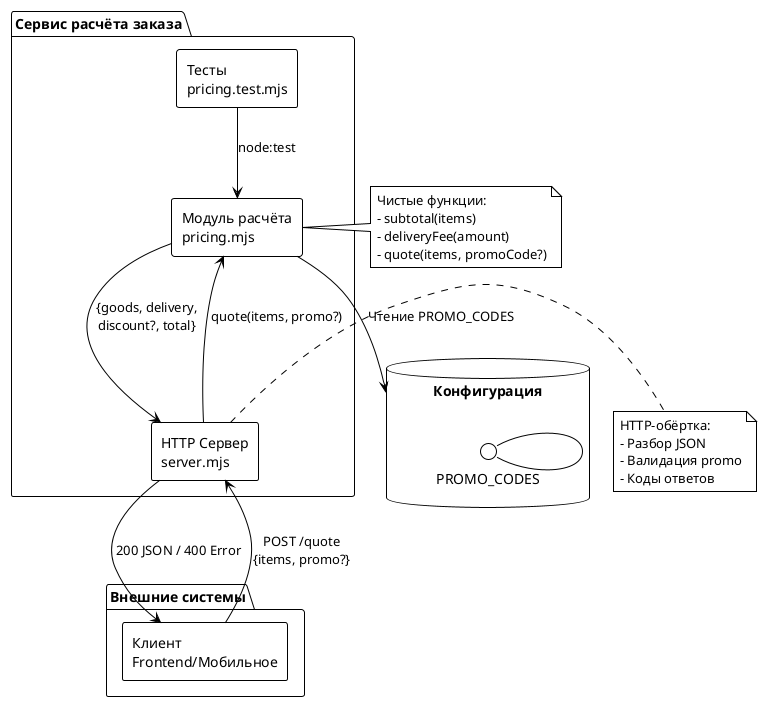
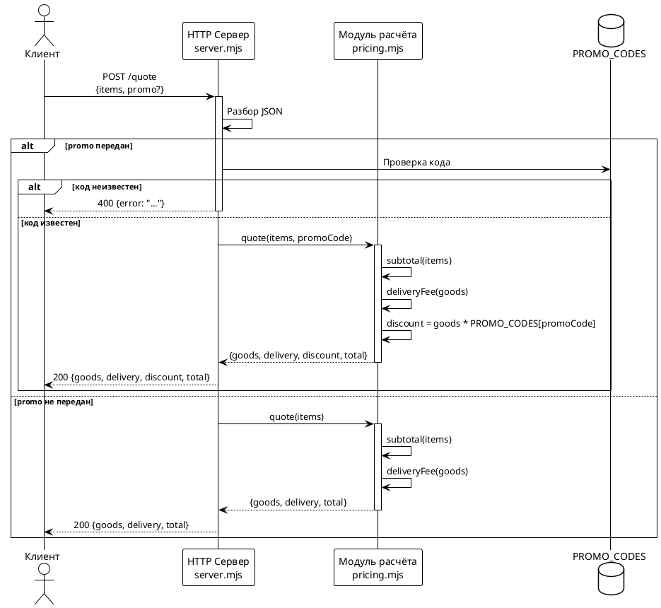
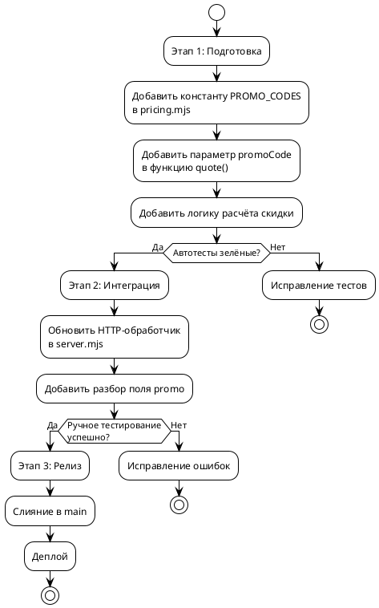

# FNR-1: Системные требования
## Поддержка промо-кодов в расчёте заказа

---

## 1. Введение

### 1.1. Метаданные

| Поле | Значение |
|------|----------|
| **Название документа** | Системные требования: Поддержка промо-кодов |
| **Статус** | Проект |
| **Версия** | 1.0 |
| **Дата создания** | 2025-08-18 |
| **Автор** | Системный аналитик |
| **Основан на** | [`concept.md`](concept.md) |
| **Связанные Issue** | #1 |
| **Зона воздействия** | `src/pricing.mjs`, `src/server.mjs`, `tests/pricing.test.mjs` |

### 1.2. Термины и определения

| Термин | Определение |
|--------|-------------|
| **Промо-код** | Кодовое слово, дающее право на скидку на заказ |
| **Скидка** | Вычитаемая из стоимости товаров сумма, выраженная в рублях |
| **Порог доставки** | Минимальная сумма товаров, при достижении которой доставка бесплатна (3000₽) |
| **goods** | Сумма стоимости всех позиций заказа без доставки и скидок |
| **delivery** | Стоимость доставки, вычисляемая от goods до применения скидки |
| **discount** | Сумма скидки, применённой по промо-коду |
| **total** | Итоговая сумма к оплате: goods + delivery – discount |

### 1.3. Ссылки на связанные документы

| Документ | Описание |
|----------|----------|
| [`task.md`](task.md) | Постановка задачи |
| [`concept.md`](concept.md) | Концепты решений и вердикт дебатов |

### 1.4. История изменений

| Версия | Дата | Автор | Изменение |
|--------|------|-------|-----------|
| 1.0 | 2025-08-18 | Системный аналитик | Первичная версия |

---

## 2. Общее описание

### 2.1. As-Is (текущее поведение)

#### Ключевые компоненты

**1. Модуль расчёта стоимости (`src/pricing.mjs`)**

Текущая реализация содержит три основные функции:

```javascript
// src/pricing.mjs:590-603
export function subtotal(items) {
  if (!Array.isArray(items) || items.length === 0) {
    throw new Error('заказ без позиций');
  }
  return items.reduce((sum, item) => {
    if (!Number.isFinite(item.price) || item.price < 0) {
      throw new Error(`некорректная цена в позиции ${item.sku}`);
    }
    if (!Number.isInteger(item.qty) || item.qty <= 0) {
      throw new Error(`некорректное количество в позиции ${item.sku}`);
    }
    return sum + item.price * item.qty;
  }, 0);
}
```

```javascript
// src/pricing.mjs:609-611
export function deliveryFee(amount) {
  return amount >= FREE_DELIVERY_FROM ? 0 : DELIVERY_FEE;
}
```

```javascript
// src/pricing.mjs:617-621
export function quote(items) {
  const goods = subtotal(items);
  const delivery = deliveryFee(goods);
  return { goods, delivery, total: goods + delivery };
}
```

**2. HTTP-обёртка (`src/server.mjs`)**

```javascript
// src/server.mjs:653-666
if (req.url === '/quote' && req.method === 'POST') {
  let body;
  try {
    body = await readJson(req);
  } catch {
    return send(res, 400, { error: 'тело запроса не разобралось как JSON' });
  }
  try {
    return send(res, 200, quote(body?.items));
  } catch (err) {
    return send(res, 400, { error: err.message });
  }
}
```

#### Ограничения текущего решения

1. **Отсутствует механизм скидок** — нет конфигурации промо-кодов и расчёта скидок
2. **Отсутствует поле `discount` в ответе** — контракт API не предусматривает скидку
3. **Поле `promo` игнорируется** — если клиент передаст промо-код, он будет проигнорирован
4. **Нет валидации промо-кодов** — неизвестный код не вызовет ошибку

---

### 2.2. Архитектурное решение

Выбранный концепт: **Прагматичное решение (Категория 2) с усилениями**

**Принципы:**
- Минимальные изменения в существующем коде
- Чистые функции в `pricing.mjs`, HTTP-обёртка в `server.mjs`
- Расширяемость через константу `PROMO_CODES` как точку будущего выноса в конфигурацию

**Модификации из дебатов:**
1. Явное условие вместо условного spread для читаемости
2. TODO-комментарий с критерием рефакторинга (>5 кодов или >2 типа скидок)
3. Константа `PROMO_CODES` как точка расширения
4. Тест для неизвестного промо-кода

---

### 2.3. Диаграмма компонентов



---

### 2.4. Схема последовательности



---

## 3. План миграции

### 3.1. Этапы внедрения



### 3.2. Таблица этапов

| Этап | Описание | Критерий готовности | Откат |
|------|----------|--------------------|-------|
| **1. Backend** | Добавление логики промо-кодов в `pricing.mjs` | `node --test "tests/*.test.mjs"` зелёный | `git checkout -- src/pricing.mjs tests/pricing.test.mjs` |
| **2. Integration** | Обновление HTTP-обработчика в `server.mjs` | HowToDemo проходит успешно | `git checkout -- src/server.mjs` |
| **3. Release** | Слияние в `main` и деплой | CI прошёл, сервис доступен | Откат предыдущего коммита |

---

## 4. Функциональные требования — Backend / БД / API

> **Примечание:** В данном документе отсутствуют требования к Frontend, так как все изменения касаются только серверной части. Раздел 5 не применим.

### Задача 4.1: Добавление конфигурации промо-кодов и логики скидок

| Метаданные | Значение |
|------------|----------|
| **Ответственный за тех. реализацию** | Backend-разработчик |
| **Задача на разработку** | TBD |
| **Jira-ссылка** | TBD |
| **Статус** | К выполнению |

#### Описание

Добавить в модуль `src/pricing.mjs`:

1. **Константу `PROMO_CODES`** — объект с известными промо-кодами и процентами скидки:

```javascript
// TODO: вынести в config при >5 кодов или >2 типов скидок
export const PROMO_CODES = {
  WELCOME10: 0.10,  // 10%
};
```

2. **Логику расчёта скидки** — модифицировать функцию `quote()`:

```javascript
/**
 * Итог заказа с учётом промо-кода.
 * @param {Item[]} items
 * @param {string} [promoCode] — опциональный промо-код
 */
export function quote(items, promoCode) {
  const goods = subtotal(items);
  const delivery = deliveryFee(goods);
  let discount = 0;

  if (promoCode !== undefined) {
    if (!(promoCode in PROMO_CODES)) {
      throw new Error(`неизвестный промо-код: ${promoCode}`);
    }
    discount = Math.floor(goods * PROMO_CODES[promoCode]);
  }

  // Явное условие для читаемости (вместо spread)
  const result = { goods, delivery };
  if (promoCode !== undefined) {
    result.discount = discount;
  }
  result.total = goods + delivery - discount;
  return result;
}
```

#### Обоснование

- **Чистые функции** — логика остаётся в `pricing.mjs`, следуя принципам репозитория
- **Тесты покрывают всё** — изменение изолировано и проверяется单元-тестами
- **Расширяемость** — константа `PROMO_CODES` может быть вынесена в env/config при росте числа кодов
- **Порог доставки от goods** — `deliveryFee(goods)` вызывается до расчёта скидки, соблюдая бизнес-требование

#### Затрагиваемые компоненты

- `src/pricing.mjs`
- `tests/pricing.test.mjs`

#### Критерии приёмки

1. Функция `quote()` принимает опциональный параметр `promoCode`
2. При передаче неизвестного кода выбрасывается ошибка с текстом `неизвестный промо-код: <код>`
3. При известном коде ответ содержит поле `discount`
4. Скидка рассчитывается как `Math.floor(goods * процент)` и округляется вниз до целых рублей
5. Порог доставки считается от `goods` до применения скидки
6. Поле `discount` включается в ответ только если был передан `promoCode`
7. Поле `total` = `goods + delivery - discount`

#### Зависимости

Нет зависимостей от других задач.

---

### Задача 4.2: Обновление HTTP-обработчика для поддержки промо-кодов

| Метаданные | Значение |
|------------|----------|
| **Ответственный за тех. реализацию** | Backend-разработчик |
| **Задача на разработку** | TBD |
| **Jira-ссылка** | TBD |
| **Статус** | К выполнению |

#### Описание

Обновить обработчик `POST /quote` в `src/server.mjs`:

```javascript
if (req.url === '/quote' && req.method === 'POST') {
  let body;
  try {
    body = await readJson(req);
  } catch {
    return send(res, 400, { error: 'тело запроса не разобралось как JSON' });
  }
  try {
    return send(res, 200, quote(body?.items, body?.promo));
  } catch (err) {
    return send(res, 400, { error: err.message });
  }
}
```

#### Обоснование

- **Тонкая HTTP-обёртка** — вся логика в `pricing.mjs`, сервер только передаёт параметры
- **Единая точка обработки ошибок** — и ошибки валидации, и ошибки расчёта возвращаются как 400
- **Сохранение контракта** — ответ без `promo` остаётся `{goods, delivery, total}`, обратно совместим

#### Затрагиваемые компоненты

- `src/server.mjs`

#### Критерии приёмки

1. Эндпоинт принимает дополнительное поле `promo` в теле запроса
2. Поле `promo` передаётся в функцию `quote()`
3. При неизвестном промо-коде возвращается 400 с `{error: "неизвестный промо-код: ..."}`
4. При известном коде ответ содержит поле `discount`

#### Зависимости

Зависит от задачи 4.1 (функция `quote()` должна принимать `promoCode`).

---

### Задача 4.3: Добавление тестов для промо-кодов

| Метаданные | Значение |
|------------|----------|
| **Ответственный за тех. реализацию** | Backend-разработчик |
| **Задача на разработку** | TBD |
| **Jira-ссылка** | TBD |
| **Статус** | К выполнению |

#### Описание

Добавить тесты в `tests/pricing.test.mjs`:

1. **Тест расчёта скидки с известным кодом:**

```javascript
test('промо-код WELCOME10 даёт 10% скидки на товары', () => {
  const result = quote([{ sku: 'a', price: 1000, qty: 2 }], 'WELCOME10');
  assert.equal(result.goods, 2000);
  assert.equal(result.discount, 200);  // 10% от 2000
  assert.equal(result.delivery, 300);   // доставка считается от goods
  assert.equal(result.total, 2100);      // 2000 + 300 - 200
});
```

2. **Тест неизвестного промо-кода:**

```javascript
test('неизвестный промо-код выбрасывает ошибку', () => {
  assert.throws(
    () => quote([{ sku: 'a', price: 1000, qty: 1 }], 'UNKNOWN'),
    /неизвестный промо-код: UNKNOWN/
  );
});
```

3. **Тест порога доставки до скидки:**

```javascript
test('порог доставки считается от суммы до скидки', () => {
  // goods = 3000 (доставка 0), скидка 10% = 300
  const result = quote([{ sku: 'a', price: 3000, qty: 1 }], 'WELCOME10');
  assert.equal(result.goods, 3000);
  assert.equal(result.discount, 300);
  assert.equal(result.delivery, 0);    // доставка 0 от goods=3000
  assert.equal(result.total, 2700);    // 3000 + 0 - 300
});
```

4. **Тест обратной совместимости (без промо-кода):**

```javascript
test('без промо-кода ответ не содержит discount', () => {
  const result = quote([{ sku: 'a', price: 1000, qty: 1 }]);
  assert.deepEqual(Object.keys(result), ['goods', 'delivery', 'total']);
  assert.equal(result.discount, undefined);
});
```

#### Обоснование

- **Покрытие всех веток** — известный код, неизвестный код, без кода
- **Проверка бизнес-логики** — порог доставки от goods до скидки
- **Обратная совместимость** — без `promo` ответ остаётся прежним

#### Затрагиваемые компоненты

- `tests/pricing.test.mjs`

#### Критерии приёмки

1. Все новые тесты проходят
2. Существующие тесты не ломаются
3. `node --test "tests/*.test.mjs"` возвращает успех

#### Зависимости

Зависит от задачи 4.1 (функция `quote()` должна поддерживать `promoCode`).

---

### 4.4. Спецификация API

#### Эндпоинт: `POST /quote`

| Параметр | Тип | Обязательный | Описание |
|----------|-----|--------------|----------|
| `items` | `Item[]` | Да | Массив позиций заказа |
| `promo` | `string` | Нет | Промо-код для скидки |

**Формат запроса:**

```json
{
  "items": [
    {"sku": "a", "price": 1000, "qty": 2}
  ],
  "promo": "WELCOME10"
}
```

**Формат ответа (успех, 200):**

С промо-кодом:
```json
{
  "goods": 2000,
  "delivery": 300,
  "discount": 200,
  "total": 2100
}
```

Без промо-кода:
```json
{
  "goods": 2000,
  "delivery": 300,
  "total": 2300
}
```

**Формат ответа (ошибка, 400):**

```json
{
  "error": "неизвестный промо-код: UNKNOWN"
}
```

#### Таблица статусов

| Код | Описание | Пример |
|-----|----------|--------|
| 200 | Успешный расчёт | `{"goods": 2000, "delivery": 300, "discount": 200, "total": 2100}` |
| 400 | Ошибка валидации или расчёта | `{"error": "неизвестный промо-код: BAD_CODE"}` |

---

## 5. Требования к интерфейсам — Frontend / UI

> **Не применимо** — Данный функционал не требует изменений на Frontend. Все изменения касаются только серверной части (Backend).

---

## 6. Ревью требований

| Роль | Имя | Дата | Статус | Комментарии |
|------|-----|------|--------|------------|
| Системный аналитик | — | 2025-08-18 | ✅ | — |
| Разработчик Backend | — | — | ⏳ | — |
| Разработчик Frontend | — | — | 🚫 | Не применимо |
| Тестировщик | — | — | ⏳ | — |

---

## 7. Риски и ограничения

### 7.1. Таблица рисков

| ID | Риск | Вероятность | Влияние | Митигация |
|----|------|-------------|---------|-----------|
| R1 | Рост количества промо-кодов (>10) сделает хардкод неудобным | Средняя | Низкая | TODO-комментарий с критерием рефакторинга; вынос в config при достижении порога |
| R2 | Потребность в других типах скидок (фиксированная сумма, "купон на X₽") | Низкая | Средняя | TODO-комментарий с критерием >2 типов; при достижении — рефакторинг на `applyPromo()` |
| R3 | Ошибка округления скидки (дробные рубли) | Низкая | Средняя | Использование `Math.floor()` для округления вниз до целых рублей |
| R4 | Нарушение обратной совместимости при изменении формата ответа | Низкая | Высокая | Поле `discount` включается только если передан `promoCode`; существующие клиенты не сломаются |

### 7.2. Ограничения

1. **Тип скидки** — только процент от суммы товаров; фиксированные суммы не поддерживаются в MVP
2. **Хранение промо-кодов** — хардкод в константе; нет возможности менять коды без перезапуска сервиса
3. **Аналитика** — нет истории использования промо-кодов; аналитика использования не собирается
4. **Персонализация** — скидка не зависит от пользователя, суммы заказа, категории товаров
5. **Комбинирование** — нельзя применить несколько промо-кодов к одному заказу

---

## 8. Приложения

### 8.1. Примеры расчётов

#### Пример 1: Заказ с промо-кодом

**Вход:**
```json
{
  "items": [
    {"sku": "A001", "price": 1000, "qty": 2},
    {"sku": "B002", "price": 500, "qty": 1}
  ],
  "promo": "WELCOME10"
}
```

**Расчёт:**
- `goods` = 1000×2 + 500×1 = 2500
- `delivery` = 300 (так как 2500 < 3000)
- `discount` = floor(2500 × 0.10) = 250
- `total` = 2500 + 300 – 250 = 2550

**Выход:**
```json
{
  "goods": 2500,
  "delivery": 300,
  "discount": 250,
  "total": 2550
}
```

#### Пример 2: Заказ на пороге доставки с промо-кодом

**Вход:**
```json
{
  "items": [
    {"sku": "A001", "price": 3000, "qty": 1}
  ],
  "promo": "WELCOME10"
}
```

**Расчёт:**
- `goods` = 3000×1 = 3000
- `delivery` = 0 (так как 3000 ≥ 3000)
- `discount` = floor(3000 × 0.10) = 300
- `total` = 3000 + 0 – 300 = 2700

**Выход:**
```json
{
  "goods": 3000,
  "delivery": 0,
  "discount": 300,
  "total": 2700
}
```

---

### 8.2. Критерии перехода на "Правильное решение"

При достижении любого из условий:
- Количество промо-кодов > 5
- Количество типов скидок > 2

...необходимо выполнить рефакторинг:
1. Выделить функцию `applyPromo(goodsAmount, promoCode)`
2. Вынести `PROMO_CODES` в конфигурацию (env/config)
3. Добавить поддержку разных типов скидок (процент, фиксированная сумма)

---

### 8.3. Код-сниппеты для быстрого старта

#### Добавление в `src/pricing.mjs`:

```javascript
// TODO: вынести в config при >5 кодов или >2 типов скидок
export const PROMO_CODES = {
  WELCOME10: 0.10,
};

/**
 * Итог заказа с учётом промо-кода.
 * @param {Item[]} items
 * @param {string} [promoCode]
 */
export function quote(items, promoCode) {
  const goods = subtotal(items);
  const delivery = deliveryFee(goods);
  let discount = 0;

  if (promoCode !== undefined) {
    if (!(promoCode in PROMO_CODES)) {
      throw new Error(`неизвестный промо-код: ${promoCode}`);
    }
    discount = Math.floor(goods * PROMO_CODES[promoCode]);
  }

  const result = { goods, delivery };
  if (promoCode !== undefined) {
    result.discount = discount;
  }
  result.total = goods + delivery - discount;
  return result;
}
```

#### Изменение в `src/server.mjs`:

```javascript
return send(res, 200, quote(body?.items, body?.promo));
```

---

## Конец документа

**Следующий шаг:** `/validate-doc sa_documentation/FNR/FNR_1/system_requirements.md`
