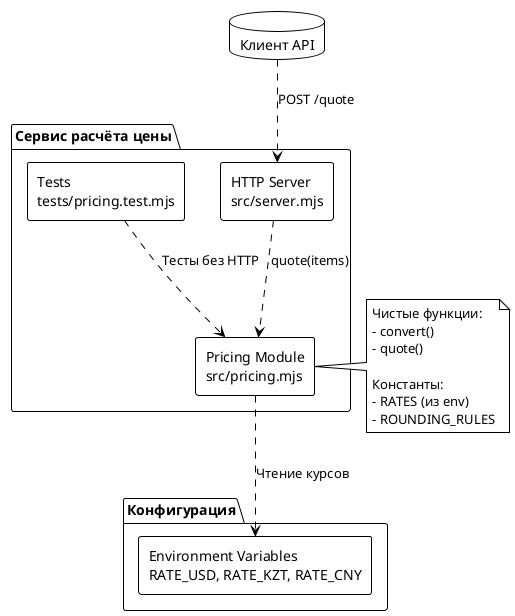
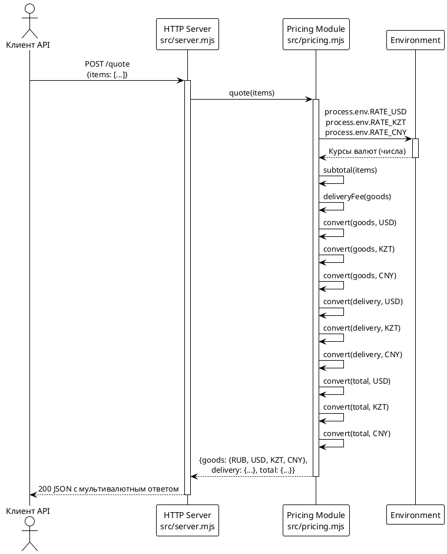

# Системные требования: Мультивалютный расчёт цены (FNR-1)

**Версия документа:** 1.0  
**Дата создания:** 2026-08-19  
**Статус:** черновик

---

## 1. Введение

### 1.1. Метаданные

| Поле | Значение |
|------|----------|
| Название задачи | Мультивалютный расчёт цены |
| Номер Issue | #11 |
| Номер FNR | FNR-1 |
| Ответственный аналитик | — |
| Ответственный за тех. реализацию | TBD |
| Версия целевого релиза | TBD |
| Приоритет | P3 (из Issue #11) |

### 1.2. Термины и определения

| Термин | Определение |
|--------|-------------|
| Базовая валюта (RUB) | Валюта по умолчанию, в которой выполняется исходный расчёт |
| Конвертация валют | Пересчёт денежной суммы из одной валюты в другую по курсу |
| Округление | Математическое округление до указанного количества знаков |
| Env-конфигурация | Параметризация через переменные окружения (`process.env`) |
| Чистая функция | Функция без побочных эффектов, возвращающая один и тот же результат при одинаковых входах |

### 1.3. Ссылки на связанные артефакты

| Артефакт | Расположение |
|----------|---------------|
| Task (постановка задачи) | `sa_documentation/FNR/FNR_1/task.md` |
| Concept (концепты решений) | `sa_documentation/FNR/FNR_1/concept.md` |
| Исходный код расчёта | `src/pricing.mjs` |
| HTTP-обёртка | `src/server.mjs` |
| Тесты | `tests/pricing.test.mjs` |
| Архитектурные правила | `CLAUDE.md`, `AGENTS.md` |

### 1.4. История изменений

| Версия | Дата | Автор | Описание изменений |
|---------|------|-------|-------------------|
| 1.0 | 2026-08-19 | System Analyst | Создание документа на основе вердикта архитектурных дебатов (Concept B+) |

---

## 2. Общее описание

### 2.1. Текущее состояние (As-Is)

#### 2.1.1. Ключевые компоненты текущего решения

**Модуль расчёта цены:** `src/pricing.mjs`

Текущая реализация функции расчёта (`src/pricing.mjs:639-643`):

```javascript
export function quote(items) {
  const goods = subtotal(items);
  const delivery = deliveryFee(goods);
  return { goods, delivery, total: goods + delivery };
}
```

**Характеристики:**
- Все значения — числа в рублях (подразумевается из констант)
- Валюта нигде не указывается явно
- Нет механизма конвертации
- Чистые функции без ввода-вывода
- Все суммы — в базовой валюте (RUB)

**HTTP-эндпоинт:** `src/server.mjs:675-688`

```javascript
if (req.url === '/quote' && req.method === 'POST') {
  // ...
  return send(res, 200, quote(body?.items));
}
```

#### 2.1.2. Ограничения текущего решения

| Ограничение | Следствие |
|-------------|-----------|
| Одновалютный расчёт | Невозможно показать цену в международных валютах |
| Отсутствие конвертации | Нет механизма пересчёта сумм |
| Фиксированный формат ответа | Нельзя расширить без ломающих изменений |
| Хардкодные курсы отсутствуют | Нет источника курсов валют |

### 2.2. Архитектурное решение

Ссылка на утверждённый концепт: `sa_documentation/FNR/FNR_1/concept.md`

**Выбранное решение:** Концепт B+ (Прагматичное с env-конфигурацией)

**Ключевые характеристики решения:**
1. Конвертация реализуется чистыми функциями в `src/pricing.mjs`
2. Курсы валют конфигурируются через переменные окружения
3. Формат ответа изменяется (ломающее изменение, обратная совместимость не гарантируется)
4. Округление параметризовано: 2 знака для USD/CNY, 0 знаков для KZT
5. Без внешних зависимостей (только стандартная библиотека)

### 2.3. Диаграмма компонентов



### 2.4. Схема последовательности



---

## 3. План миграции

### 3.1. Этапы внедрения

```plantuml
@startuml
!theme plain

start

:Этап 1: Подготовка\nбазовой инфраструктуры;
note right
  - Добавить константы курсов
  - Создать функцию convert()
  - Добавить правила округления
end note

if:Тесты проходят? then (нет)
  :Исправить ошибки;
else (да)
  :Этап 2: Модификация\nquote();
  note right
    - Изменить структуру возврата
    - Добавить конвертацию
  end note
  
  if:Формат ответа корректен? then (нет)
    :Исправить формат;
  else (да)
    :Этап 3: Покрытие тестами;
    note right
      - Тесты конвертации
      - Тесты мультивалютного ответа
      - Тесты округления
    end note
    
    if:Все тесты зелёные? then (нет)
      :Исправить ошибки;
    else (да)
      :Этап 4: Валидация;
      
      if:CI прошёл? then (нет)
        :Исправить ошибки;
      else (да)
        :Готово к разработке;
        
        stop
      endif
    endif
  endif
endif

@enduml
```

### 3.2. Таблица этапов с критериями и откатами

| Этап | Описание | Критерий готовности | Действия при откате |
|------|----------|---------------------|---------------------|
| 1. Базовая инфраструктура | Добавление констант курсов, функции convert(), правил округления в `src/pricing.mjs` | `node --test` проходит для базовых тестов конвертации | Удалить добавленный код из `src/pricing.mjs` |
| 2. Модификация quote() | Изменение структуры возврата функции quote() для мультивалютного формата | Ответ содержит структуру `{goods: {RUB, USD, KZT, CNY}, delivery: {...}, total: {...}}` | Откатить изменения в `quote()`, вернуть исходную структуру |
| 3. Покрытие тестами | Добавление тестов конвертации, мультивалютного ответа, округления в `tests/pricing.test.mjs` | Все тесты (включая новые) проходят | Удалить новые тесты |
| 4. Валидация | Проверка на CI, валидация документации | `node --test "tests/*.test.mjs"` проходит, CI зелёный | Откатить коммит, исправить документацию |

### 3.3. Критерии готовности к разработке

| Критерий | Проверка |
|----------|----------|
| Требования полностью определены | Документ подписан всеми участниками |
| API-контракты зафиксированы | Формат ответа описан в разделе 4.3 |
| Зависимости идентифицированы | Зависимости указаны для каждой задачи |
| Риски задокументированы | Раздел 7 заполнен |
| Тестовые сценарии описаны | Критерии приёмки для каждой задачи |

---

## 4. Функциональные требования — Backend / БД / API

### 4.1. Задача 4.1: Добавление env-конфигурации курсов валют

**Метаданные**

| Поле | Значение |
|------|----------|
| Ответственный за тех. реализацию | Backend-разработчик |
| Задача на разработку | TBD |
| Jira-ссылка | TBD |
| Статус | К разработке |

**Описание**

Добавить конфигурацию курсов валют через переменные окружения в `src/pricing.mjs`. Курсы должны использоваться для конвертации из RUB в целевые валюты.

**Обоснование**

Env-конфигурация выбрана в архитектурных дебатах как компромисс между хардкодом и сложными системами конфигурации. Это позволяет менять курсы без пересборки приложения.

**Затрагиваемые компоненты**

- `src/pricing.mjs`

**Требования**

1. Добавить константу `RATES` с чтением из `process.env`:
```javascript
const RATES = {
  USD: Number(process.env.RATE_USD) || 0.0105,
  KZT: Number(process.env.RATE_KZT) || 4.85,
  CNY: Number(process.env.RATE_CNY) || 0.076,
};
```

2. Дефолтные значения:
   - USD: 0.0105 (≈95 рублей за доллар)
   - KZT: 4.85 (≈0.21 рублей за тенге)
   - CNY: 0.076 (≈13.2 рублей за юань)

3. Значения должны быть числами, не равными 0

**Критерии приёмки**

- [ ] Константа `RATES` определена в `src/pricing.mjs`
- [ ] Все три валюты (USD, KZT, CNY) присутствуют
- [ ] Дефолтные значения корректны
- [ ] При чтении из `process.env` применяется `Number()` для преобразования
- [ ] При отсутствии переменной используется дефолтное значение

**Зависимости**

Нет внешних зависимостей.

**Нефункциональные требования**

Отсутствуют (конфигурация загружается при старте).

---

### 4.2. Задача 4.2: Добавление правил округления

**Метаданные**

| Поле | Значение |
|------|----------|
| Ответственный за тех. реализацию | Backend-разработчик |
| Задача на разработку | TBD |
| Jira-ссылка | TBD |
| Статус | К разработке |

**Описание**

Добавить параметризуемое округление для разных валют: 2 знака для USD/CNY, 0 знаков для KZT.

**Обоснование**

В дебатах определено, что разные валюты требуют разного количества знаков: тенге обычно округляются до целых, USD/CNY — до центов/фэнь.

**Затрагиваемые компоненты**

- `src/pricing.mjs`

**Требования**

1. Добавить константу `ROUNDING_RULES`:
```javascript
const ROUNDING_RULES = {
  RUB: 0,  // Рубли — целые (текущее поведение)
  USD: 2,  // Доллары — до центов
  KZT: 0,  // Тенге — до целых
  CNY: 2,  // Юани — до фэней
};
```

2. Создать вспомогательную функцию `roundByCurrency(amount, currency)`:
```javascript
function roundByCurrency(amount, currency) {
  const digits = ROUNDING_RULES[currency] || 0;
  const factor = Math.pow(10, digits);
  return Math.round(amount * factor) / factor;
}
```

**Критерии приёмки**

- [ ] Константа `ROUNDING_RULES` определена
- [ ] Функция `roundByCurrency()` реализована
- [ ] Для KZT округление до 0 знаков (целые)
- [ ] Для USD/CNY округление до 2 знаков
- [ ] Для неизвестной валюты используется 0 знаков

**Зависимости**

Нет внешних зависимостей.

---

### 4.3. Задача 4.3: Реализация функции конвертации валют

**Метаданные**

| Поле | Значение |
|------|----------|
| Ответственный за тех. реализацию | Backend-разработчик |
| Задача на разработку | TBD |
| Jira-ссылка | TBD |
| Статус | К разработке |

**Описание**

Создать чистую функцию конвертации суммы из RUB в целевую валюту с применением курса и округления.

**Обоснование**

Конвертация — core-функционал задачи. Чистая функция обеспечивает тестируемость без HTTP.

**Затрагиваемые компоненты**

- `src/pricing.mjs`

**Требования**

1. Функция `convert(amount, targetCurrency)`:
   - Вход: `amount` (number) — сумма в рублях, `targetCurrency` (string) — код валюты
   - Выход: число — сумма в целевой валюте с округлением

2. Реализация:
```javascript
function convert(amount, targetCurrency) {
  if (targetCurrency === 'RUB') {
    return roundByCurrency(amount, 'RUB');
  }
  
  const rate = RATES[targetCurrency];
  if (typeof rate !== 'number' || rate === 0) {
    throw new Error(`неизвестная валюта: ${targetCurrency}`);
  }
  
  return roundByCurrency(amount * rate, targetCurrency);
}
```

3. При неизвестной валюте выбрасывается `Error`

**Критерии приёмки**

- [ ] Функция `convert()` экспортируется (для тестов)
- [ ] Конвертация RUB → RUB возвращает округлённую исходную сумму
- [ ] Конвертация RUB → USD применяет курс и округляет до 2 знаков
- [ ] Конвертация RUB → KZT применяет курс и округляет до 0 знаков
- [ ] Конвертация RUB → CNY применяет курс и округляет до 2 знаков
- [ ] При неизвестной валюте выбрасывается `Error` с сообщением

**Зависимости**

- Зависит от: 4.1 (константа `RATES`)
- Зависит от: 4.2 (функция `roundByCurrency`)

**Нефункциональные требования**

- Функция должна быть чистой (без `process.env` доступа внутри, `RATES` замыкается)
- Производительность: < 1 мс на один вызов

---

### 4.4. Задача 4.4: Модификация функции quote() для мультивалютного ответа

**Метаданные**

| Поле | Значение |
|------|----------|
| Ответственный за тех. реализацию | Backend-разработчик |
| Задача на разработку | TBD |
| Jira-ссылка | TBD |
| Статус | К разработке |

**Описание**

Изменить функцию `quote()` для возврата мультивалютного ответа вместо одноклассного.

**Обоснование**

Требование Issue #11 — одновременный показ цены в четырёх валютах.

**Затрагиваемые компоненты**

- `src/pricing.mjs`
- `src/server.mjs` (клиенты, если есть)

**Требования**

1. Новая структура ответа:
```javascript
// Было:
// { goods: 1000, delivery: 300, total: 1300 }

// Стало:
{
  goods: {
    RUB: 1000,
    USD: 10.50,
    KZT: 4850,
    CNY: 76.00,
  },
  delivery: {
    RUB: 300,
    USD: 3.15,
    KZT: 1455,
    CNY: 22.80,
  },
  total: {
    RUB: 1300,
    USD: 13.65,
    KZT: 6305,
    CNY: 98.80,
  },
}
```

2. Реализация (внутри `quote()`):
```javascript
export function quote(items) {
  const goods = subtotal(items);
  const delivery = deliveryFee(goods);
  const total = goods + delivery;
  
  return toAllCurrencies({ goods, delivery, total });
}

function toAllCurrencies(breakdown) {
  const currencies = ['RUB', 'USD', 'KZT', 'CNY'];
  const result = {};
  
  for (const field of ['goods', 'delivery', 'total']) {
    result[field] = {};
    for (const currency of currencies) {
      result[field][currency] = convert(breakdown[field], currency);
    }
  }
  
  return result;
}
```

**API-контракт**

| Поле ответа | Тип | Описание |
|--------------|-----|----------|
| `goods` | object | Сумма позиций во всех валютах |
| `goods.RUB` | number | Сумма в рублях |
| `goods.USD` | number | Сумма в долларах |
| `goods.KZT` | number | Сумма в тенге |
| `goods.CNY` | number | Сумма в юанях |
| `delivery` | object | Стоимость доставки во всех валютах |
| `delivery.RUB` | number | Доставка в рублях |
| `delivery.USD` | number | Доставка в долларах |
| `delivery.KZT` | number | Доставка в тенге |
| `delivery.CNY` | number | Доставка в юанях |
| `total` | object | Итого во всех валютах |
| `total.RUB` | number | Итого в рублях |
| `total.USD` | number | Итого в долларах |
| `total.KZT` | number | Итого в тенге |
| `total.CNY` | number | Итого в юанях |

**Пример ответа (JSON)**

```json
{
  "goods": {
    "RUB": 2000,
    "USD": 21.00,
    "KZT": 9700,
    "CNY": 152.00
  },
  "delivery": {
    "RUB": 300,
    "USD": 3.15,
    "KZT": 1455,
    "CNY": 22.80
  },
  "total": {
    "RUB": 2300,
    "USD": 24.15,
    "KZT": 11155,
    "CNY": 174.80
  }
}
```

**Критерии приёмки**

- [ ] Ответ имеет структуру с вложенными объектами
- [ ] Четыре валюты присутствуют: RUB, USD, KZT, CNY
- [ ] Значения округлены правильно для каждой валюты
- [ ] Все поля (goods, delivery, total) присутствуют
- [ ] При вызове `quote()` с валидными `items` ответ соответствует контракту

**Зависимости**

- Зависит от: 4.3 (функция `convert`)
- Зависит от: 4.1 (константа `RATES`)
- Зависит от: 4.2 (правила округления)

**Влияние на обратную совместимость**

⚠️ **Ломающее изменение:** Клиенты, ожидающие плоскую структуру `{goods, delivery, total}` с числовыми значениями, получат вложенную структуру.

**Митигация:**

- Задокументировать изменение в release notes
- Для demo-стенда приемлемо (клиенты близки к разработчикам)
- В будущем: versioning API (`/quote/v2`)

---

### 4.5. Задача 4.5: Добавление тестов конвертации валют

**Метаданные**

| Поле | Значение |
|------|----------|
| Ответственный за тех. реализацию | Backend-разработчик |
| Задача на разработку | TBD |
| Jira-ссылка | TBD |
| Статус | К разработке |

**Описание**

Добавить тесты для функции конвертации и округления в `tests/pricing.test.mjs`.

**Обоснование**

Правило из `AGENTS.md`: новая логика — новый тест. Конвертация не должна сломаться молча.

**Затрагиваемые компоненты**

- `tests/pricing.test.mjs`

**Требуемые тесты**

1. Тест базовой конвертации:
```javascript
test('конвертация RUB → USD', () => {
  const result = convert(1000, 'USD');
  assert.equal(result, 10.50); // 1000 * 0.0105
});
```

2. Тест округления для разных валют:
```javascript
test('округление KZT до целых', () => {
  const result = convert(1000, 'KZT');
  assert.equal(result, 4850); // 1000 * 4.85, 0 знаков
});

test('округление USD до 2 знаков', () => {
  const result = convert(999, 'USD');
  assert.equal(result, 10.49); // 999 * 0.0105 = 10.4895 → 10.49
});
```

3. Тест неизвестной валюты:
```javascript
test('неизвестная валюта выбрасывает ошибку', () => {
  assert.throws(() => convert(1000, 'EUR'), /неизвестная валюта/);
});
```

4. Тест RUB → RUB (без конвертации):
```javascript
test('RUB → RUB без конвертации', () => {
  const result = convert(1234.56, 'RUB');
  assert.equal(result, 1235); // округление до целых
});
```

5. Тест нулевой суммы:
```javascript
test('нулевая сумма конвертируется корректно', () => {
  const result = convert(0, 'USD');
  assert.equal(result, 0);
});
```

**Критерии приёмки**

- [ ] Все 5+ тестов конвертации добавлены
- [ ] Все тесты проходят (`node --test`)
- [ ] Покрыты все основные сценарии: базовая конвертация, округление, ошибки, граничные случаи
- [ ] Тесты не требуют HTTP (чистые функции)

**Зависимости**

- Зависит от: 4.3 (функция `convert` должна быть реализована)

---

### 4.6. Задача 4.6: Добавление тестов мультивалютного ответа quote()

**Метаданные**

| Поле | Значение |
|------|----------|
| Ответственный за тех. реализацию | Backend-разработчик |
| Задача на разработку | TBD |
| Jira-ссылка | TBD |
| Статус | К разработке |

**Описание**

Добавить тесты для мультивалютного ответа функции `quote()`.

**Обоснование**

Проверить, что новая структура ответа соответствует контракту.

**Затрагиваемые компоненты**

- `tests/pricing.test.mjs`

**Требуемые тесты**

1. Тест структуры ответа:
```javascript
test('quote() возвращает мультивалютный ответ', () => {
  const result = quote([{ sku: 'a', price: 1000, qty: 1 }]);
  
  assert.ok(typeof result.goods === 'object');
  assert.ok('RUB' in result.goods);
  assert.ok('USD' in result.goods);
  assert.ok('KZT' in result.goods);
  assert.ok('CNY' in result.goods);
  
  assert.equal(typeof result.goods.RUB, 'number');
  assert.equal(typeof result.goods.USD, 'number');
});
```

2. Тест значений для known case:
```javascript
test('значения конвертированы корректно', () => {
  const result = quote([{ sku: 'a', price: 1000, qty: 2 }]);
  
  assert.equal(result.goods.RUB, 2000);
  assert.equal(result.delivery.RUB, 300);
  assert.equal(result.total.RUB, 2300);
  
  // Проверка USD (с округлением)
  assert.ok(Math.abs(result.goods.USD - 21.00) < 0.01);
});
```

3. Тест бесплатной доставки (от 3000 RUB):
```javascript
test('мультивалютный ответ при бесплатной доставке', () => {
  const result = quote([{ sku: 'a', price: 3500, qty: 1 }]);
  
  assert.equal(result.delivery.RUB, 0);
  assert.equal(result.goods.RUB, 3500);
  assert.equal(result.total.RUB, 3500);
  
  // Конвертация нулевой доставки
  assert.equal(result.delivery.USD, 0);
  assert.equal(result.delivery.KZT, 0);
  assert.equal(result.delivery.CNY, 0);
});
```

4. Тест округления для разных валют:
```javascript
test('округление для разных валют', () => {
  const result = quote([{ sku: 'a', price: 1000, qty: 1 }]);
  
  // USD и CNY — 2 знака
  assert.equal(result.goods.USD, Math.round(result.goods.USD * 100) / 100);
  assert.equal(result.goods.CNY, Math.round(result.goods.CNY * 100) / 100);
  
  // KZT — 0 знаков (целые)
  assert.equal(result.goods.KZT, Math.round(result.goods.KZT));
});
```

**Критерии приёмки**

- [ ] Все 4+ теста мультивалютного ответа добавлены
- [ ] Все тесты проходят (`node --test`)
- [ ] Покрыты сценарии: структура ответа, корректность значений, бесплатная доставка, округление
- [ ] Существующие тесты (если остались) не ломаются

**Зависимости**

- Зависит от: 4.4 (функция `quote()` должна быть модифицирована)

---

### 4.7. Задача 4.7: Добавление TODO-комментариев для будущего расширения

**Метаданные**

| Поле | Значение |
|------|----------|
| Ответственный за тех. реализацию | Backend-разработчик |
| Задача на разработку | TBD |
| Jira-ссылка | TBD |
| Статус | К разработке |

**Описание**

Добавить TODO-комментарии для документации рисков масштабирования, выявленных в архитектурных дебатах.

**Обоснование**

Фиксация архитектурных решений для будущих разработчиков. Из вердикта: «TODO-комментарий: параметризуемый реестр валют».

**Затрагиваемые компоненты**

- `src/pricing.mjs`

**Требования**

Добавить в `src/pricing.mjs` после констант:

```javascript
// TODO: при расширении на новые валюты — параметризуемый реестр валют
// TODO: при автоматическом обновлении курсов — внешний API, новая зависимость
// TODO: при нескольких клиентах с разными курсами — запрос с курсами от клиента
```

**Критерии приёмки**

- [ ] TODO-комментарии добавлены
- [ ] Комментарии ссылаются на вердикт архитектурных дебатов
- [ ] Комментарии расположены рядом с константами `RATES` и `ROUNDING_RULES`

**Зависимости**

Нет.

---

## 5. Требования к интерфейсам — Frontend / UI

**Не применимо**

Данный функционал не затрагивает клиентский код, верстку, UI-компоненты, микроразметку или клиентский роутинг. Изменения касаются только серверной логики расчёта и формата API-ответа.

---

## 6. Ревью требований

| Роль | ФИО | Дата | Комментарий |
|------|-----|------|-------------|
| Аналитик | — | — | TBD |
| Разработчик Backend | — | — | TBD |
| Разработчик Frontend | — | — | Н/A (frontend изменений нет) |
| Тестирование | — | — | TBD |

---

## 7. Риски и ограничения

### 7.1. Таблица рисков

| ID | Риск | Вероятность | Влияние | Митигация |
|----|------|-------------|---------|-----------|
| R1 | Обратная совместимость API нарушена | Высокая | Средняя | Задокументировать в release notes. Для demo-стенда приемлемо. В будущем: `/quote/v2` |
| R2 | Курсы валют устареют | Средняя | Низкая | Env-конфигурация позволяет обновление без пересборки. TODO на будущий API |
| R3 | Округление даёт `goods + delivery ≠ total` в конвертированных валютах | Средняя | Низкая | Зафиксировано в требованиях: не гарантировать равенство после конвертации |
| R4 | Добавление EUR требует нового кода | Низкая | Низкая | TODO на параметризуемый реестр валют |
| R5 | Разные клиенты захотят разные курсы | Низкая | Средняя | TODO на запрос с курсами от клиента |

### 7.2. Ограничения

1. **Валюты:** Реализация поддерживает только фиксированный набор валют (RUB, USD, KZT, CNY). Добавление новых валют потребует изменения кода.

2. **Источники курсов:** Курсы валют задаются через переменные окружения. Нет автоматического обновления курсов. Изменение курса требует перезапуска процесса.

3. **Округление:** Округление происходит отдельно для каждой составляющей (goods, delivery, total). Не гарантируется, что `goods + delivery = total` в конвертированных валютах.

4. **Обратная совместимость:** Формат ответа API изменяется. Старые клиенты, ожидающие плоскую структуру, перестанут работать.

5. **Без внешних зависимостей:** По архитектурным ограничениям (`AGENTS.md`) не добавляются npm-пакеты. Только стандартная библиотека Node.js.

6. **Конвертация только из RUB:** Реализация предполагает, что базовая валюта — RUB. Конвертация между другими валютами не поддерживается.

7. **Demo-стенд:** Решение спроектировано для demo-стенда контура производства. Для production-системы может потребоваться более сложная архитектура (API курсов, parameterization, кеширование).

---

## 8. Приложения

### 8.1. Справка: примеры расчётов

**Пример 1: Маленький заказ (с доставкой)**

Вход: `[{sku: "item1", price: 1000, qty: 2}]`

Расчёт:
- `goods = 1000 * 2 = 2000 RUB`
- `delivery = 300 RUB` (меньше порога 3000)
- `total = 2300 RUB`

Конвертация (при дефолтных курсах):
- `goods_USD = 2000 * 0.0105 = 21.00`
- `goods_KZT = 2000 * 4.85 = 9700`
- `goods_CNY = 2000 * 0.076 = 152.00`
- `delivery_USD = 300 * 0.0105 = 3.15`
- `delivery_KZT = 300 * 4.85 = 1455`
- `delivery_CNY = 300 * 0.076 = 22.80`
- `total_USD = 2300 * 0.0105 = 24.15`
- `total_KZT = 2300 * 4.85 = 11155`
- `total_CNY = 2300 * 0.076 = 174.80`

**Пример 2: Крупный заказ (бесплатная доставка)**

Вход: `[{sku: "item1", price: 3500, qty: 1}]`

Расчёт:
- `goods = 3500 RUB`
- `delivery = 0 RUB` (от 3000 включительно)
- `total = 3500 RUB`

Конвертация:
- `goods_USD = 3500 * 0.0105 = 36.75`
- `goods_KZT = 3500 * 4.85 = 16975`
- `goods_CNY = 3500 * 0.076 = 266.00`
- `delivery_* = 0` (для всех валют)

### 8.2. Справка: таблица округления

| Валюта | Знаков округления | Пример | Результат |
|--------|-------------------|--------|-----------|
| RUB | 0 | 1234.56 | 1235 |
| USD | 2 | 123.456 | 123.46 |
| KZT | 0 | 4850.9 | 4851 |
| CNY | 2 | 76.123 | 76.12 |

---

**Документ завершён.** Следующий шаг: `/validate-doc sa_documentation/FNR/FNR_1/system_requirements.md`
