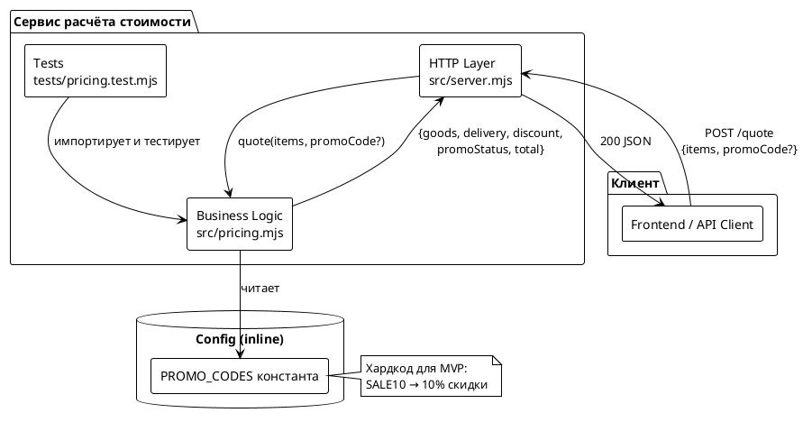
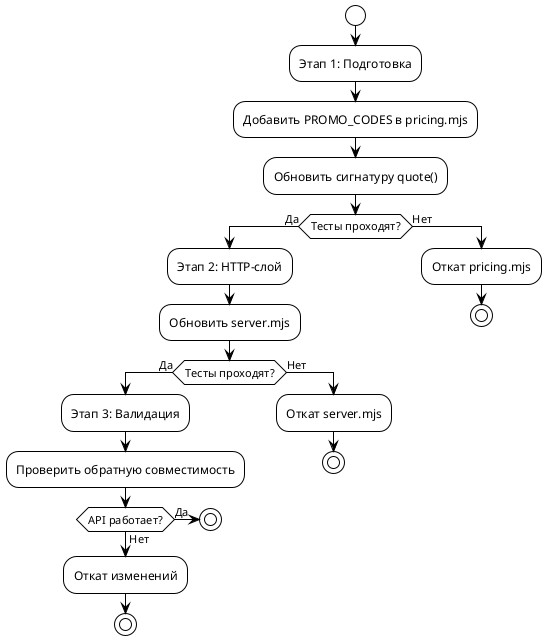

# Системные требования: Скидка по промокоду в корзине

## 1. Введение

### 1.1. Общая информация

| Поле | Значение |
|------|---------|
| **Название требования** | Скидка по промокоду в корзине |
| **Версия** | 1.0 |
| **Статус** | Проект |
| **Ответственный за тех. реализацию** | Backend-разработчик |
| **Jira-ссылка** | Closes #64 |
| **Дата создания** | 2026-08-20 |
| **Автор** | Issue-Agent (FNR pipeline) |

### 1.2. Термины и определения

| Термин | Определение |
|--------|-------------|
| **Промокод** | Кодовое слово, применяемое к заказу для получения скидки на сумму товаров |
| **Скидка** | Уменьшение суммы товаров на процентный коэффициент |
| **Товары (goods)** | Сумма позиций заказа без учёта доставки и скидок |
| **Доставка (delivery)** | Фиксированная плата за доставку, зависящая от суммы товаров |
| **Итог (total)** | Финальная сумма к оплате с учётом всех скидок и доставки |
| **Статус промокода (promoStatus)** | Результат применения промокода: `none` / `applied` / `unknown` |

### 1.3. Ссылки на связанные артефакты

| Артефакт | Ссылка |
|----------|--------|
| Постановка задачи | `task.md` |
| Концепты решений | `concept.md` |
| Исходный Issue | po-helper-org/poh-demo-checkout#64 |
| Текущий код | `src/pricing.mjs`, `src/server.mjs` |

### 1.4. История изменений

| Версия | Дата | Автор | Описание изменения |
|--------|------|-------|---------------------|
| 1.0 | 2026-08-20 | Issue-Agent | Первая версия системных требований |

---

## 2. Общее описание

### 2.1. Текущее поведение (As-Is)

#### 2.1.1. Ключевые компоненты

**Сервис расчёта стоимости заказа** `poh-demo-checkout` предоставляет эндпоинт `POST /quote`, который принимает массив товаров и возвращает структуру `{ goods, delivery, total }`.

**Архитектурное разделение:**
- Арифметика изолирована в `src/pricing.mjs` чистыми функциями
- HTTP-обёртка в `src/server.mjs` только разбирает запрос и отдаёт коды

**Доказательства кодом:**

```javascript
// src/pricing.mjs:678-682
export function quote(items) {
  const goods = subtotal(items);
  const delivery = deliveryFee(goods);
  return { goods, delivery, total: goods + delivery };
}
```

```javascript
// src/server.mjs:724
return send(res, 200, quote(body?.items));
```

#### 2.1.2. Ограничения текущего решения

1. **Отсутствует механизм применения промокодов** — поиск по кодовой базе (`discount`, `promo`, `coupon`, `SALE10`) не дал результатов
2. **Структура ответа API не содержит полей скидок** — только `{ goods, delivery, total }`
3. **HTTP-слой передаёт только `items`** — нет поля для промокода в теле запроса

### 2.2. Архитектурное решение

**Выбранный концепт:** Концепт 1 (Минимальное расширение API)

**Суть:** Расширить существующий контракт `quote()` вторым опциональным параметром `promoCode`, добавить в ответ поля `discount` и `promoStatus`. Логика промокодов — inline в `quote()` с вынесением константы `PROMO_CODES`.

**Обоснование:**
- Сохраняет архитектурное разделение (арифметика → pricing, HTTP → server)
- Обратная совместимость (promoCode опционален)
- Минимум изменений (3 файла)
- Технический долг ограничен — при росте промокодов вынос в модуль — тривиальный рефакторинг

### 2.3. Диаграмма компонентов



### 2.4. Схема последовательности

```plantuml
@startuml
!theme plain
skinparam sequenceMessageAlign center
skinparam NoteFontSize 10

actor Клиент as Client
participant HTTP as HTTP Layer\nsrc/server.mjs
participant Pricing as Business Logic\nsrc/pricing.mjs
participant Config as PROMO_CODES

Client -> HTTP: POST /quote\n{items, promoCode?}
HTTP -> HTTP: readJson(body)
HTTP -> Pricing: quote(items, promoCode?)

Pricing -> Pricing: subtotal(items) → goods
Pricing -> Pricing: deliveryFee(goods) → delivery

alt promoCode передан
  Pricing -> Config: PROMO_CODES[promoCode]
  alt промокод найден
    Config --> Pricing: {discount, description}
    Pricing -> Pricing: discount = goods * percent\npromoStatus = 'applied'
  else промокод не найден
    Config --> Pricing: undefined
    Pricing -> Pricing: discount = 0\npromoStatus = 'unknown'
  end
else promoCode не передан
  Pricing -> Pricing: discount = 0\npromoStatus = 'none'
end

Pricing -> Pricing: total = goods - discount + delivery
Pricing --> HTTP: {goods, delivery, discount,\npromoStatus, total}
HTTP --> Client: 200 JSON

note right of Pricing
  Скидка применяется только
  к товарам (goods), доставка
  не скидывается
end note

@enduml
```

---

## 3. План миграции

### 3.1. Этапы внедрения



### 3.2. Таблица этапов

| Этап | Описание | Откат | Критерии готовности |
|------|----------|-------|---------------------|
| **1. Бизнес-логика** | Добавить константу PROMO_CODES, обновить функцию quote() в `src/pricing.mjs` | `git checkout src/pricing.mjs` | Тесты для quote проходят, включая новые кейсы с промокодами |
| **2. HTTP-слой** | Обновить `src/server.mjs` для передачи promoCode из запроса | `git checkout src/server.mjs` | Тесты проходят, API отвечает с новыми полями |
| **3. Валидация** | Проверка обратной совместимости, ручное тестирование API | Откат на Этап 1 или 2 | Существующие клиенты работают, новый контракт корректен |

### 3.3. Критерии готовности к внедрению

1. ✅ Все тесты проходят (`node --test "tests/*.test.mjs"`)
2. ✅ Обратная совместимость сохранена (вызов без promoCode работает)
3. ✅ Валидный промокод SALE10 даёт 10% скидки на товары
4. ✅ Невалидный промокод возвращает `promoStatus: 'unknown'` и `discount: 0`
5. ✅ Доставка не скидывается (считается по goods ДО скидки)

---

## 4. Функциональные требования — Backend / БД / API

### Задача 4.1: Реализация логики промокодов в pricing.mjs

| Поле | Значение |
|------|---------|
| **Ответственный за тех. реализацию** | Backend-разработчик |
| **Задача на разработку** | Добавить механизм промокодов в модуль расчёта стоимости |
| **Jira-ссылка** | Closes #64 |

#### 4.1.1. Описание

Добавить в модуль `src/pricing.mjs`:
1. Константу `PROMO_CODES` с хардкодом промокода `SALE10` (10% скидки)
2. Обновить функцию `quote()` для принятия опционального параметра `promoCode`
3. Логику расчёта скидки и статуса промокода
4. Вернуть из `quote()` новые поля: `discount`, `promoStatus`, обновлённый `total`

#### 4.1.2. Обоснование

- Текущая архитектура предполагает чистые функции в `pricing.mjs` ([src/pricing.mjs:631-633](../src/pricing.mjs:631-633))
- Логика промокодов — это бизнес-логика расчёта, а не HTTP-концерн
- Вынесение константы `PROMO_CODES`准备 для будущего рефакторинга в отдельный модуль

#### 4.1.3. Затрагиваемые компоненты

| Компонент | Изменения |
|-----------|-----------|
| `src/pricing.mjs` | Добавить `PROMO_CODES`, обновить `quote()` |
| `tests/pricing.test.mjs` | Добавить тесты для промокодов |

#### 4.1.4. Детализация реализации

**Добавляемый код в `src/pricing.mjs`:**

```javascript
// Константа промокодов (готова к будущему выносу в отдельный модуль)
export const PROMO_CODES = {
  SALE10: { discount: 0.10, description: 'Скидка 10%' }
};

/**
 * Итог заказа: позиции, доставка, скидка по промокоду, сумма к оплате.
 * @param {Item[]} items
 * @param {string|null} promoCode — опциональный промокод
 */
export function quote(items, promoCode = null) {
  const goods = subtotal(items);
  const delivery = deliveryFee(goods);

  let discount = 0;
  let promoStatus = 'none';

  if (promoCode) {
    const promo = PROMO_CODES[promoCode];
    if (promo) {
      // Скидка только на товары, доставка не скидывается
      discount = goods * promo.discount;
      promoStatus = 'applied';
    } else {
      promoStatus = 'unknown';
    }
  }

  // total = товары - скидка + доставка
  return { goods, delivery, discount, promoStatus, total: goods - discount + delivery };
}
```

#### 4.1.5. Критерии приёмки

1. ✅ Константа `PROMO_CODES` экспортируется из `pricing.mjs`
2. ✅ Функция `quote()` принимает второй опциональный параметр `promoCode`
3. ✅ При вызове без `promoCode` поведение идентично текущему (обратная совместимость)
4. ✅ Промокод `SALE10` даёт 10% скидки на `goods`
5. ✅ `discount` включён в ответ
6. ✅ `promoStatus` принимает значения: `'none'`, `'applied'`, `'unknown'`
7. ✅ `total = goods - discount + delivery`
8. ✅ Доставка считается по `goods` ДО применения скидки (доставка не скидывается)

#### 4.1.6. Нефункциональные требования

| Требование | Значение |
|------------|----------|
| **Производительность** | O(n) где n — количество позиций (без изменений к текущему) |
| **Обратная совместимость** | Полная — существующие клиенты не ломаются |
| **Тестируемость** | Изолированные unit-тесты для всех веток логики |

#### 4.1.7. Зависимости

Нет внешних зависимостей.

---

### Задача 4.2: Обновление HTTP-обёртки в server.mjs

| Поле | Значение |
|------|---------|
| **Ответственный за тех. реализацию** | Backend-разработчик |
| **Задача на разработку** | Передавать поле promoCode из HTTP-запроса в функцию quote |
| **Jira-ссылка** | Closes #64 |

#### 4.2.1. Описание

Обновить модуль `src/server.mjs` для передачи поля `promoCode` из тела запроса в функцию `quote()`.

#### 4.2.2. Обоснование

- Текущий HTTP-слой передаёт только `body?.items` ([src/server.mjs:724](../src/server.mjs:724))
- Необходимо извлечь опциональное поле `promoCode` и передать его в `quote()`
- HTTP-слой остаётся тонкой обёрткой — логика промокодов в `pricing.mjs`

#### 4.2.3. Затрагиваемые компоненты

| Компонент | Изменения |
|-----------|-----------|
| `src/server.mjs` | Обновить вызов `quote(body?.items, body?.promoCode)` |

#### 4.2.4. Детализация реализации

**Изменяемый код в `src/server.mjs`:**

```javascript
// Было (строка 724):
return send(res, 200, quote(body?.items));

// Стало:
return send(res, 200, quote(body?.items, body?.promoCode));
```

#### 4.2.5. API-эндпоинты

| Метод | Путь | Описание |
|-------|-----|----------|
| POST | /quote | Расчёт стоимости заказа с опциональным промокодом |

#### 4.2.6. Формат запроса

```json
{
  "items": [
    { "sku": "ABC123", "price": 1000, "qty": 2 },
    { "sku": "DEF456", "price": 500, "qty": 1 }
  ],
  "promoCode": "SALE10"
}
```

#### 4.2.7. Формат ответа

```json
{
  "goods": 2500,
  "delivery": 300,
  "discount": 250,
  "promoStatus": "applied",
  "total": 2550
}
```

#### 4.2.8. Статусы промокода

| promoStatus | Описание | discount |
|--------------|----------|----------|
| `none` | Промокод не передан | 0 |
| `applied` | Промокод применён | > 0 |
| `unknown` | Неизвестный промокод | 0 |

#### 4.2.9. Критерии приёмки

1. ✅ Поле `promoCode` опционально — отсутствие не вызывает ошибку
2. ✅ При передаче `promoCode` значение передаётся в `quote()`
3. ✅ API возвращает новые поля: `discount`, `promoStatus`
4. ✅ Обратная совместимость — запросы без `promoCode` работают как раньше

#### 4.2.10. Нефункциональные требования

| Требование | Значение |
|------------|----------|
| **Обработка ошибок** | Невалидный JSON → 400, ошибки валидации → 400 с сообщением |
| **Кодировка** | UTF-8 |
| **Content-Type** | application/json; charset=utf-8 |

#### 4.2.11. Зависимости

- Зависит от **Задачи 4.1** (сигнатура `quote()` должна быть обновлена сначала)

---

### Задача 4.3: Добавление тестов для промокодов

| Поле | Значение |
|------|---------|
| **Ответственный за тех. реализацию** | Backend-разработчик |
| **Задача на разработку** | Добавить тестовые кейсы для логики промокодов |
| **Jira-ссылка** | Closes #64 |

#### 4.3.1. Описание

Добавить в `tests/pricing.test.mjs` тесты, покрывающие все ветки логики промокодов.

#### 4.3.2. Обоснование

- Текущий охват: 8 тестов для `subtotal`, `deliveryFee`, `quote` ([tests/pricing.test.mjs:742-795](../tests/pricing.test.mjs:742-795))
- Новая логика требует новых тестов для предотвращения регрессии
- Проектная конвенция: новая логика — новый тест ([AGENTS.md:623](../AGENTS.md:623))

#### 4.3.3. Затрагиваемые компоненты

| Компонент | Изменения |
|-----------|-----------|
| `tests/pricing.test.mjs` | Добавить 4-5 новых тестов |

#### 4.3.4. Детализация реализации

**Добавляемые тесты:**

```javascript
test('промокод не передан — статус none, скидка 0', () => {
  assert.deepEqual(quote([{ sku: 'a', price: 1000, qty: 1 }]), {
    goods: 1000,
    delivery: DELIVERY_FEE,
    discount: 0,
    promoStatus: 'none',
    total: 1300,
  });
});

test('валидный промокод SALE10 даёт 10% скидки', () => {
  assert.deepEqual(quote([{ sku: 'a', price: 1000, qty: 2 }], 'SALE10'), {
    goods: 2000,
    delivery: 0,
    discount: 200,
    promoStatus: 'applied',
    total: 1800,
  });
});

test('невалидный промокод — статус unknown, скидка 0', () => {
  assert.deepEqual(quote([{ sku: 'a', price: 1000, qty: 1 }], 'INVALID'), {
    goods: 1000,
    delivery: DELIVERY_FEE,
    discount: 0,
    promoStatus: 'unknown',
    total: 1300,
  });
});

test('доставка не скидывается при применении промокода', () => {
  // Товары на 2500, доставка 300. Скидка 10% = 250.
  // Итог: 2500 - 250 + 300 = 2550 (доставка платная, т.к. goods ДО скидки = 2500 < 3000)
  const result = quote([{ sku: 'a', price: 2500, qty: 1 }], 'SALE10');
  assert.equal(result.goods, 2500);
  assert.equal(result.discount, 250);
  assert.equal(result.delivery, 300); // доставка считается по goods ДО скидки
  assert.equal(result.total, 2550);
});
```

#### 4.3.5. Критерии приёмки

1. ✅ Тест покрывает кейс без промокода (обратная совместимость)
2. ✅ Тест покрывает кейс с валидным промокодом `SALE10`
3. ✅ Тест покрывает кейс с невалидным промокодом
4. ✅ Тест покрывает кейс проверки доставки (не скидывается)
5. ✅ Все тесты проходят (`node --test "tests/*.test.mjs"`)

#### 4.3.6. Нефункциональные требования

| Требование | Значение |
|------------|----------|
| **Фреймворк** | node:test (встроенный в Node.js 22+) |
| **Стиль** | assert из 'node:assert/strict' |

#### 4.3.7. Зависимости

- Зависит от **Задачи 4.1** (функция `quote()` должна быть обновлена)

---

## 5. Требования к интерфейсам — Frontend / UI

**Не применимо**

Данная задача касается только серверной части (Backend/API). UI для ввода промокода в корзине вынесен в **Out scope** ([task.md:98](task.md:98)).

**Примечание:** Frontend-интеграция будет добавлена в следующих итерациях после реализации Backend-части.

---

## 6. Ревью требований

| Роль | ФИО / Роль | Статус | Дата | Комментарии |
|------|------------|--------|------|-------------|
| Аналитик | Issue-Agent (FNR pipeline) | ✅ Готово | 2026-08-20 | Требования сгенерированы на основе утверждённого концепта |
| Разработчик Backend | — | ⏳ Ожидает | — | Требуется ревью технической реализуемости |
| Разработчик Frontend | — | ⏸️ Не применимо | — | Задача не содержит UI-изменений |
| Тестирование | — | ⏳ Ожидает | — | Требуется ревью критериев приёмки |

---

## 7. Риски и ограничения

### 7.1. Риски

| ID | Риск | Вероятность | Влияние | Митигация |
|----|------|-------------|---------|-----------|
| R1 | Изменение контракта `quote()` сломает существующих клиентов | Низкая | Высокое | `promoCode` — опциональный параметр со значением по умолчанию |
| R2 | Скидка рассчитывается на `goods` после применения промокода → нарушает требование "доставка не скидывается" | Низкая | Среднее | Доставка считать по `goods` ДО применения скидки (тест покрывает) |
| R3 | Отсутствие тестов → регрессия в будущем | Низкая | Среднее | Добавить тесты для всех веток (валидный, невалидный, без промокода) |
| R4 | Хардкод `SALE10` в коде → сложность управления промокодами | Средняя | Низкое | Для MVP допустимо; при росте числа промокодов — вынос в конфигурацию/БД |

### 7.2. Ограничения

1. **Только один тип скидки** — процентная скидка на сумму товаров. Фиксированная сумма, "2+1", бесплатная доставка — out scope ([task.md:100](task.md:100)).

2. **Один хардкодный промокод** — `SALE10` → 10%. Управление промокодами для маркетинга (admin panel, database) — out scope ([task.md:99](task.md:99)).

3. **Нет ограничений на промокод** — срок действия, минимальная сумма, однократность использования не проверяются.

4. **Нет кумулятивных промокодов** — применяется только один промокод за запрос.

5. **Нет UI** — поле ввода промокода в корзине реализуется отдельно (Frontend-задача).

6. **Поле `goods` в ответе** — показывает сумму до скидки (базовая стоимость), отдельно выводится `discount`.

---

## 8. Приложения

### 8.1. Примеры API-вызовов

#### 8.1.1. Запрос без промокода

```bash
curl -sX POST localhost:8080/quote \
  -H 'content-type: application/json' \
  -d '{"items":[{"sku":"ABC","price":1000,"qty":2}]}'
```

**Ответ:**
```json
{
  "goods": 2000,
  "delivery": 300,
  "discount": 0,
  "promoStatus": "none",
  "total": 2300
}
```

#### 8.1.2. Запрос с валидным промокодом

```bash
curl -sX POST localhost:8080/quote \
  -H 'content-type: application/json' \
  -d '{"items":[{"sku":"ABC","price":1000,"qty":2}],"promoCode":"SALE10"}'
```

**Ответ:**
```json
{
  "goods": 2000,
  "delivery": 300,
  "discount": 200,
  "promoStatus": "applied",
  "total": 2100
}
```

#### 8.1.3. Запрос с невалидным промокодом

```bash
curl -sX POST localhost:8080/quote \
  -H 'content-type: application/json' \
  -d '{"items":[{"sku":"ABC","price":1000,"qty":2}],"promoCode":"WRONG"}'
```

**Ответ:**
```json
{
  "goods": 2000,
  "delivery": 300,
  "discount": 0,
  "promoStatus": "unknown",
  "total": 2300
}
```

#### 8.1.4. Проверка: доставка не скидывается

```bash
curl -sX POST localhost:8080/quote \
  -H 'content-type: application/json' \
  -d '{"items":[{"sku":"ABC","price":2500,"qty":1}],"promoCode":"SALE10"}'
```

**Ответ:**
```json
{
  "goods": 2500,
  "delivery": 300,
  "discount": 250,
  "promoStatus": "applied",
  "total": 2550
}
```
*Доставка = 300, т.к. goods (2500) < FREE_DELIVERY_FROM (3000) даже после скидки*

### 8.2. SQL-скрипты

**Не применимо** — проект не использует БД.

### 8.3. Маппинги

| Концепт | Реализация | Файл |
|---------|-------------|------|
| PROMO_CODES | `export const PROMO_CODES = { SALE10: { discount: 0.10, description: 'Скидка 10%' } }` | `src/pricing.mjs` |
| Статус none | `promoCode = null` → `promoStatus = 'none'` | `src/pricing.mjs` |
| Статус applied | Промокод найден в `PROMO_CODES` | `src/pricing.mjs` |
| Статус unknown | Промокод не найден в `PROMO_CODES` | `src/pricing.mjs` |

---

**Документ подготовлен:** 2026-08-20
**Следующий шаг:** `/validate-doc sa_documentation/FNR/FNR_1/system_requirements.md`
