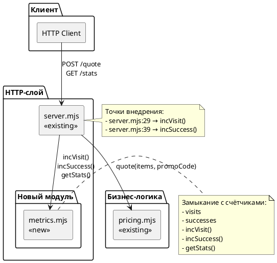
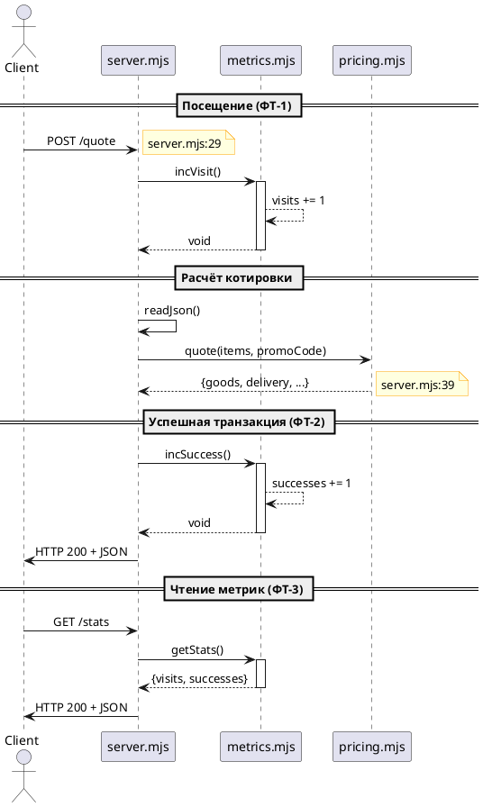

# Системные требования: Счётчик посещений и успешных транзакций

## 1. Введение

### 1.1. Метаданные

| Поле | Значение |
|------|----------|
| **Документ** | Системные требования (System Requirements) |
| **Проект** | poh-demo-checkout |
| **Issue** | #90 |
| **Версия** | 1.0 |
| **Дата создания** | 2026-08-21 |
| **Статус** | Черновик |
| **Автор** | System Analyst |
| **Approver** | — |

### 1.2. Термины и определения

| Термин | Определение |
|--------|-------------|
| **Посещение** | HTTP-запрос методом POST к эндпоинту `/quote` |
| **Успешная транзакция** | Запрос `/quote`, завершившийся ответом HTTP 200 |
| **Метрика** | Измеряемая характеристика эксплуатации сервиса |
| **Замыкание** | Closure — функция с доступом к переменным из внешней области видимости |
| **SRP** | Single Responsibility Principle — принцип единственной ответственности |

### 1.3. Связанные документы

| Документ | Расположение |
|----------|--------------|
| Постановка задачи | `sa_documentation/FNR/FNR_1/task.md` |
| Концепты решений | `sa_documentation/FNR/FNR_1/concept.md` |
| Исходный Issue | [#90](https://github.com/po-helper-org/poh-demo-checkout/issues/90) |

### 1.4. История изменений

| Версия | Дата | Автор | Описание изменений |
|--------|------|-------|-------------------|
| 1.0 | 2026-08-21 | System Analyst | Initial release |

---

## 2. Общее описание

### 2.1. As-Is: Текущее состояние

#### 2.1.1. Архитектура HTTP-слоя

Текущая реализация HTTP-сервера находится в `src/server.mjs` и представляет собой тонкую обёртку вокруг бизнес-логики:

```javascript
// src/server.mjs:26-46
export const app = async (req, res) => {
  if (req.url === '/healthz') return send(res, 200, { ok: true });

  if (req.url === '/quote' && req.method === 'POST') {
    let body;
    try {
      body = await readJson(req);
    } catch {
      return send(res, 400, { error: 'тело запроса не разобралось как JSON' });
    }
    try {
      return send(res, 200, quote(body?.items, body?.promoCode));
    } catch (err) {
      return send(res, 400, { error: err.message });
    }
  }

  return send(res, 404, { error: 'не найдено' });
};
```

**Ключевые компоненты:**
- **Роутинг:** статическая проверка `req.url` и `req.method` (строки 27, 29)
- **Разбор JSON:** `readJson()` с обработкой исключений (строки 31-37)
- **Бизнес-логика:** вызов `quote()` из `pricing.mjs` (строка 39)
- **Коды ответов:** 200 (успех), 400 (ошибка клиента), 404 (не найдено)

#### 2.1.2. Точки внедрения счётчиков

| Точка | Место | Что считать |
|-------|-------|-------------|
| **Точка 1** | `server.mjs:29` — начало обработки `/quote` | Посещение |
| **Точка 2** | `server.mjs:39` — успешный вызов `quote()` | Успешная транзакция |
| **Исключение** | `server.mjs:27` — `/healthz` | Не считается |

**Доказательство:** health-check обрабатывается раньше роутинга `/quote` и возвращает сразу (строка 27).

#### 2.1.3. Ограничения текущего решения

| Ограничение | Доказательство |
|-------------|----------------|
| **Нет телеметрии** | Отсутствуют счётчики, логирование только при старте (строка 52) |
| **Нет видимости нагрузки** | Нельзя узнать количество запросов |
| **Нет метрик успеха** | Нельзя отделить успешные запросы от ошибок |
| **Только stdlib** | `package.json` не содержит зависимостей |

### 2.2. Архитектурное решение

Выбранный концепт: **Концепт 1 (Separated Metrics Module)** — выделение метрик в отдельный модуль с замыканием.

**Обоснование выбора (из вердикта дебатов):**
1. **Тестируемость:** метрики тестируются изолированно, как `pricing.mjs`
2. **Чистая архитектура:** явное разделение ответственности с первого дня
3. **Расширяемость:** готовность к росту требований без рефакторинга
4. **Соответствие проекту:** следует паттерну `pricing.mjs` (чистый модуль)

### 2.3. Диаграмма компонентов



### 2.4. Схема последовательности



---

## 3. План миграции

### 3.1. Этапы внедрения (Activity Diagram)

```plantuml
@startuml
start

:Этап 1: Создание модуля метрик;
:src/metrics.mjs\n- Замыкание с счётчиками\n- incVisit(), incSuccess()\n- getStats();

if модуль создан? then (да)
  :Этап 2: Интеграция в server.mjs;
  note right
    server.mjs:29 → incVisit()
    server.mjs:39 → incSuccess()
  end note
  
  if интеграция завершена? then (да)
    :Этап 3: Новый эндпоинт /stats;
    :GET /stats → getStats() → JSON;
    
    if эндпоинт работает? then (да)
      :Этап 4: Тестирование;
      :tests/metrics.test.mjs\n- Unit-тесты метрик\n- Интеграционные тесты;
      
      if тесты проходят? then (да)
        :Этап 5: Валидация;
        :Проверка ФТ-1, ФТ-2, ФТ-3\nПроверка НФТ-1, НФТ-2, НФТ-3;
        
        if валидация пройдена? then (да)
          :ГОТОВО К РЕЛИЗУ;
          stop
        else (нет)
          :Исправление находок;
          -> Этап 4;
        endif
      else (нет)
        :Исправление тестов;
        -> Этап 4;
      endif
    else (нет)
      :Отладка эндпоинта;
      -> Этап 3;
    endif
  else (нет)
    :Отладка интеграции;
    -> Этап 2;
  endif
else (нет)
  :Исправление модуля;
  -> Этап 1;
endif

@enduml
```

### 3.2. Таблица этапов

| Этап | Описание | Откат | Критерий готовности |
|------|----------|-------|-------------------|
| **1. Создание модуля метрик** | Создать `src/metrics.mjs` с замыканием и функциями `incVisit()`, `incSuccess()`, `getStats()` | Удалить `src/metrics.mjs` | Модуль импортируется без ошибок, функции доступны |
| **2. Интеграция в server.mjs** | Добавить импорт и вызовы `incVisit()` (строка 29) и `incSuccess()` (строка 39) | Revert изменений в `server.mjs` | Сервер стартует, эндпоинт `/quote` работает |
| **3. Эндпоинт /stats** | Добавить роутинг `GET /stats` → `getStats()` | Revert изменений в `server.mjs` | `GET /stats` возвращает JSON с полями `visits` и `successes` |
| **4. Тестирование** | Создать `tests/metrics.test.mjs` с unit-тестами метрик | Удалить `tests/metrics.test.mjs` | Все тесты проходят (`node --test`) |
| **5. Валидация** | Проверка выполнения ФТ-1, ФТ-2, ФТ-3 и НФТ-1, НФТ-2, НФТ-3 | — | Все требования выполнены |

### 3.3. Критерии готовности к релизу

1. **Функциональные требования:**
   - ФТ-1: счётчик посещений инкрементируется на каждом POST `/quote`
   - ФТ-2: счётчик успешных транзакций инкрементируется на каждом HTTP 200
   - ФТ-3: эндпоинт `GET /stats` возвращает текущие значения

2. **Нефункциональные требования:**
   - НФТ-1: используется только Node.js stdlib
   - НФТ-2: логика счётчиков в `server.mjs`, `pricing.mjs` не затронут
   - НФТ-3: `/healthz` не влияет на счётчики

3. **Качество кода:**
   - Все тесты проходят
   - JSDoc на все функции `metrics.mjs`
   - Код следует стилю проекта

---

## 4. Функциональные требования — Backend / БД / API

> **Примечание:** Данный документ содержит только backend-изменения. Frontend-требования отсутствуют — раздел 5 не применим.

### 4.1. Задача 1: Создание модуля метрик

#### 4.1.1. Метаданные

| Поле | Значение |
|------|----------|
| **ID задачи** | FNR-1.1 |
| **Название** | Создание модуля метрик (metrics.mjs) |
| **Ответственный за тех. реализацию** | Backend Developer |
| **Задача на разработку** | — |
| **Статус Jira** | — |

#### 4.1.2. Описание

Создать новый модуль `src/metrics.mjs`, экспортирующий замыкание с тремя функциями:
- `incVisit()` — инкремент счётчика посещений
- `incSuccess()` — инкремент счётчика успешных транзакций
- `getStats()` — получение текущих значений

**Структура модуля:**

```javascript
// src/metrics.mjs
export const counters = (() => {
  let visits = 0;
  let successes = 0;

  return {
    /**
     * Инкремент счётчика посещений.
     * Вызывается при каждом POST /quote.
     */
    incVisit: () => {
      visits += 1;
    },

    /**
     * Инкремент счётчика успешных транзакций.
     * Вызывается при каждом успешном quote() (HTTP 200).
     */
    incSuccess: () => {
      successes += 1;
    },

    /**
     * Получение текущих значений счётчиков.
     * @returns {{visits: number, successes: number}}
     */
    getStats: () => ({
      visits,
      successes
    })
  };
})();
```

#### 4.1.3. Обоснование

- **Разделение ответственности:** метрики изолированы в отдельном модуле
- **Тестируемость:** замыкание можно импортировать и тестировать изолированно
- **Расширяемость:** при росте требований легко добавить новые метрики
- **Следует паттерну проекта:** аналогично `pricing.mjs` — чистый модуль с экспортами

#### 4.1.4. Затрагиваемые компоненты

| Компонент | Изменение | Доказательство |
|-----------|-----------|----------------|
| `src/metrics.mjs` | Новый файл | Создаётся заново |
| `src/pricing.mjs` | Не затрагивается | — |

#### 4.1.5. Критерии приёмки

1. Модуль `src/metrics.mjs` создан и экспортирует объект `counters`
2. Объект `counters` содержит методы `incVisit`, `incSuccess`, `getStats`
3. Вызов `incVisit()` инкрементирует внутренний счётчик `visits`
4. Вызов `incSuccess()` инкрементирует внутренний счётчик `successes`
5. Вызов `getStats()` возвращает объект `{ visits: number, successes: number }`
6. Все функции имеют JSDoc-комментарии

#### 4.1.6. Нефункциональные требования

| ID | Категория | Требование |
|----|-----------|------------|
| НФТ-1.1 | Производительность | Инкремент счётчика — O(1), не блокирует event loop |
| НФТ-1.2 | Память | Хранение в памяти, без персистентности |
| НФТ-1.3 | Зависимости | Только stdlib, без внешних пакетов |

#### 4.1.7. Зависимости

Нет зависимостей от других задач — может выполняться параллельно с остальными.

---

### 4.2. Задача 2: Интеграция счётчиков в server.mjs

#### 4.2.1. Метаданные

| Поле | Значение |
|------|----------|
| **ID задачи** | FNR-1.2 |
| **Название** | Интеграция счётчиков в server.mjs |
| **Ответственный за тех. реализацию** | Backend Developer |
| **Задача на разработку** | — |
| **Статус Jira** | — |
| **Зависимости** | FNR-1.1 (создание модуля метрик) |

#### 4.2.2. Описание

Интегрировать модуль метрик в HTTP-слой (`src/server.mjs`):
1. Добавить импорт `counters` из `./metrics.mjs`
2. Добавить вызов `counters.incVisit()` в точке обработки `/quote` (строка 29)
3. Добавить вызов `counters.incSuccess()` после успешного вызова `quote()` (строка 39)

**Изменения в server.mjs:**

```javascript
// src/server.mjs (пример изменений)

import { createServer } from 'node:http';
import { quote } from './pricing.mjs';
import { counters } from './metrics.mjs';  // <-- Новый импорт

const PORT = Number(process.env.PORT || 8080);

function send(res, code, body) {
  // ... без изменений
}

async function readJson(req) {
  // ... без изменений
}

export const app = async (req, res) => {
  if (req.url === '/healthz') return send(res, 200, { ok: true });

  if (req.url === '/quote' && req.method === 'POST') {
    counters.incVisit();  // <-- Точка 1: фиксация посещения

    let body;
    try {
      body = await readJson(req);
    } catch {
      return send(res, 400, { error: 'тело запроса не разобралось как JSON' });
    }
    try {
      const result = quote(body?.items, body?.promoCode);
      counters.incSuccess();  // <-- Точка 2: фиксация успешной транзакции
      return send(res, 200, result);
    } catch (err) {
      return send(res, 400, { error: err.message });
    }
  }

  return send(res, 404, { error: 'не найдено' });
};

// ... запуск сервера без изменений
```

#### 4.2.3. Обоснование

- **ФТ-1:** вызов `incVisit()` на входе `/quote` фиксирует каждое посещение
- **ФТ-2:** вызов `incSuccess()` после успешного `quote()` фиксирует каждую успешную транзакцию
- **НФТ-2:** логика счётчиков в `server.mjs`, `pricing.mjs` остаётся нетронутым
- **НФТ-3:** `/healthz` обрабатывается раньше и не вызывает `incVisit()`

#### 4.2.4. Затрагиваемые компоненты

| Компонент | Изменение | Доказательство |
|-----------|-----------|----------------|
| `src/server.mjs` | Добавление импорта и 2 вызова | Строки 6, 30, 40 (пример) |
| `src/pricing.mjs` | Не затрагивается | — |
| `src/metrics.mjs` | Не изменяется | Создан в FNR-1.1 |

#### 4.2.5. Критерии приёмки

1. Сервер стартует без ошибок
2. При каждом POST `/quote` счётчик `visits` инкрементируется
3. При каждом успешном `quote()` (HTTP 200) счётчик `successes` инкрементируется
4. При ошибке (HTTP 400, 404) счётчик `successes` НЕ инкрементируется
5. `/healthz` НЕ влияет на счётчик `visits`

#### 4.2.6. Нефункциональные требования

| ID | Категория | Требование |
|----|-----------|------------|
| НФТ-2.1 | Обратная совместимость | Существующие эндпоинты работают без изменений |
| НФТ-2.2 | Производительность | Инкремент не добавляет задержку > 1ms |
| НФТ-2.3 | Изоляция | Ошибки в метриках не ломают HTTP-обработку |

#### 4.2.7. Зависимости

- **FNR-1.1** — модуль `metrics.mjs` должен быть создан первым

---

### 4.3. Задача 3: Эндпоинт GET /stats

#### 4.3.1. Метаданные

| Поле | Значение |
|------|----------|
| **ID задачи** | FNR-1.3 |
| **Название** | Эндпоинт GET /stats для чтения метрик |
| **Ответственный за тех. реализацию** | Backend Developer |
| **Задача на разработку** | — |
| **Статус Jira** | — |
| **Зависимости** | FNR-1.1, FNR-1.2 |

#### 4.3.2. Описание

Добавить новый эндпоинт `GET /stats` для чтения текущих значений счётчиков.

**Маршрутизация:**

| Метод | Путь | Описание |
|-------|------|----------|
| GET | /stats | Чтение метрик |

**Изменения в server.mjs:**

```javascript
export const app = async (req, res) => {
  if (req.url === '/healthz') return send(res, 200, { ok: true });

  if (req.url === '/stats' && req.method === 'GET') {  // <-- Новый роут
    return send(res, 200, counters.getStats());
  }

  if (req.url === '/quote' && req.method === 'POST') {
    // ... без изменений
  }

  return send(res, 404, { error: 'не найдено' });
};
```

#### 4.3.3. Обоснование

- **ФТ-3:** система предоставляет доступ к значениям счётчиков
- **RESTful дизайн:** GET для чтения данных без side-effect
- **Единообразие:** используется та же функция `send()` и формат JSON

#### 4.3.4. Затрагиваемые компоненты

| Компонент | Изменение | Доказательство |
|-----------|-----------|----------------|
| `src/server.mjs` | Добавление роута `/stats` | Строка 28-29 (пример) |
| `src/metrics.mjs` | Не изменяется | Используется существующий `getStats()` |

#### 4.3.5. Критерии приёмки

1. Эндпоинт `GET /stats` отвечает с HTTP 200
2. Ответ содержит JSON с полями `visits` и `successes`
3. Значения соответствуют количеству вызовов `/quote`
4. Эндпоинт не влияет на счётчики (только чтение)

#### 4.3.6. API-спецификация

**Эндпоинты:**

| Метод | Путь | Описание | Параметры |
|-------|------|----------|-----------|
| GET | /stats | Чтение метрик | Нет |

**Формат ответа (успех):**

```json
{
  "visits": 42,
  "successes": 37
}
```

**Коды ответа:**

| Код | Описание | Тело ответа |
|-----|----------|--------------|
| 200 | Успех | `{ "visits": number, "successes": number }` |

#### 4.3.7. Нефункциональные требования

| ID | Категория | Требование |
|----|-----------|------------|
| НФТ-3.1 | Производительность | Ответ < 10ms |
| НФТ-3.2 | Надёжность | Эндпоинт всегда доступен (не зависит от состояния `/quote`) |

#### 4.3.8. Зависимости

- **FNR-1.1** — модуль `metrics.mjs` с функцией `getStats()`
- **FNR-1.2** — интеграция в `server.mjs` для корректных значений

---

### 4.4. Задача 4: Тестирование модуля метрик

#### 4.4.1. Метаданные

| Поле | Значение |
|------|----------|
| **ID задачи** | FNR-1.4 |
| **Название** | Unit-тесты для модуля метрик |
| **Ответственный за тех. реализацию** | Backend Developer |
| **Задача на разработку** | — |
| **Статус Jira** | — |
| **Зависимости** | FNR-1.1 |

#### 4.4.2. Описание

Создать файл `tests/metrics.test.mjs` с unit-тестами для модуля `metrics.mjs`.

**Структура тестов:**

```javascript
// tests/metrics.test.mjs
import assert from 'node:assert/strict';
import { test } from 'node:test';
import { counters } from '../src/metrics.mjs';

test('начальное состояние — нули', () => {
  const stats = counters.getStats();
  assert.equal(stats.visits, 0);
  assert.equal(stats.successes, 0);
});

test('incVisit инкрементирует visits', () => {
  const before = counters.getStats().visits;
  counters.incVisit();
  const after = counters.getStats().visits;
  assert.equal(after, before + 1);
});

test('incSuccess инкрементирует successes', () => {
  const before = counters.getStats().successes;
  counters.incSuccess();
  const after = counters.getStats().successes;
  assert.equal(after, before + 1);
});

test('getStats возвращает объект с числами', () => {
  counters.incVisit();
  counters.incSuccess();
  const stats = counters.getStats();
  assert.equal(typeof stats.visits, 'number');
  assert.equal(typeof stats.successes, 'number');
});
```

#### 4.4.3. Обоснование

- **Качество кода:** следует паттерну проекта — тесты для каждой функции
- **Изоляция:** unit-тесты тестируют метрики без HTTP-слоя
- **Регрессия:** защищает от изменений в логике счётчиков

#### 4.4.4. Затрагиваемые компоненты

| Компонент | Изменение | Доказательство |
|-----------|-----------|----------------|
| `tests/metrics.test.mjs` | Новый файл | Создаётся заново |
| `src/metrics.mjs` | Тестируется | Объект `counters` |

#### 4.4.5. Критерии приёмки

1. Файл `tests/metrics.test.mjs` создан
2. Все тесты проходят (`node --test tests/*.test.mjs`)
3. Покрытие: все функции `metrics.mjs` протестированы

#### 4.4.6. Зависимости

- **FNR-1.1** — модуль `metrics.mjs` должен быть создан

---

### 4.5. Задача 5: Интеграционные тесты

#### 4.5.1. Метаданные

| Поле | Значение |
|------|----------|
| **ID задачи** | FNR-1.5 |
| **Название** | Интеграционные тесты для эндпоинтов |
| **Ответственный за тех. реализацию** | Backend Developer |
| **Задача на разработку** | — |
| **Статус Jira** | — |
| **Зависимости** | FNR-1.1, FNR-1.2, FNR-1.3 |

#### 4.5.2. Описание

Добавить интеграционные тесты в `tests/server.test.mjs` (или расширить существующий) для проверки:
1. Эндпоинт `/stats` возвращает корректные значения
2. Посещение `/quote` инкрементирует `visits`
3. Успешный `/quote` инкрементирует `successes`
4. `/healthz` НЕ инкрементирует `visits`

**Пример тестов:**

```javascript
// tests/server.test.mjs (пример)
import assert from 'node:assert/strict';
import { test } from 'node:test';
import { app } from '../src/server.mjs';
import { counters } from '../src/metrics.mjs';

// Вспомогательная функция для HTTP-запросов
async function request(url, method = 'GET', body = null) {
  // ... реализация мок-запроса
}

test('GET /stats возвращает начальные нули', async () => {
  const res = await request('/stats');
  assert.equal(res.statusCode, 200);
  assert.deepEqual(res.body, { visits: 0, successes: 0 });
});

test('POST /quote инкрементирует visits', async () => {
  const before = counters.getStats().visits;
  await request('/quote', 'POST', { items: [{ sku: 'a', price: 1000, qty: 1 }] });
  const after = counters.getStats().visits;
  assert.equal(after, before + 1);
});

test('GET /healthz не инкрементирует visits', async () => {
  const before = counters.getStats().visits;
  await request('/healthz');
  const after = counters.getStats().visits;
  assert.equal(after, before);
});
```

#### 4.5.3. Обоснование

- **ФТ-1, ФТ-2, ФТ-3:** проверка выполнения функциональных требований
- **НФТ-3:** проверка изоляции `/healthz`
- **Энд-то-енд:** проверка полной цепочки: HTTP → метрики

#### 4.5.4. Затрагиваемые компоненты

| Компонент | Изменение | Доказательство |
|-----------|-----------|----------------|
| `tests/server.test.mjs` | Новый файл или расширение | Создаётся/расширяется |
| `src/server.mjs` | Тестируется через HTTP | Функция `app()` |
| `src/metrics.mjs` | Тестируется косвенно | Через счётчики |

#### 4.5.5. Критерии приёмки

1. Тесты проверяют все ФТ и НФТ
2. Все тесты проходят
3. Тесты изолированы (не зависят от порядка выполнения)

#### 4.5.6. Нефункциональные требования

| ID | Категория | Требование |
|----|-----------|------------|
| НФТ-5.1 | Скорость | Все тесты проходят < 5 секунд |

#### 4.5.7. Зависимости

- **FNR-1.1** — модуль `metrics.mjs`
- **FNR-1.2** — интеграция в `server.mjs`
- **FNR-1.3** — эндпоинт `/stats`

---

## 5. Требования к интерфейсам — Frontend / UI

**Не применимо**

Данный документ содержит только backend-изменения. Frontend-требования отсутствуют.

---

## 6. Ревью требований

| Роль | Имя | Статус | Дата | Комментарии |
|------|-----|--------|------|-------------|
| **Аналитик** | — | — | — | — |
| **Разработчик Backend** | — | — | — | — |
| **Разработчик Frontend** | — | — | — | — |
| **Тестирование** | — | — | — | — |

---

## 7. Риски и ограничения

### 7.1. Риски

| ID | Риск | Вероятность | Влияние | Митигация |
|----|------|-------------|---------|-----------|
| **R-1** | Потеря состояния при hot-reload в dev-режиме | Средняя | Низкая | Документировать поведение, состояние сбрасывается при рестарте |
| **R-2** | Race condition при fork/cluster deployment | Низкая | Средняя | Документировать ограничение: однопроцессный режим |
| **R-3** | Переполнение счётчика при длительной работе | Низкая | Низкая | Number.MAX_SAFE_INTEGER ≈ 9 quadrillion — практически невозможно |
| **R-4** | Отсутствие персистентности при рестарте | Высокая | Низкая | Документировать: in-memory storage, сброс при рестарте |

### 7.2. Ограничения

1. **Хранение:** счётчики хранятся в памяти приложения, без персистентности
2. **Deployment:** решение рассчитано на однопроцессный режим (не fork/cluster)
3. **Детализация:** только aggregate-счётчики, без разбивки по кодам ошибок
4. **Накопление:** счётчики накапливаются между рестартами, сброс только при рестарте
5. **Погрешность:** при ошибках валидации (HTTP 400) `visits` инкрементируется, `successes` — нет

---

## 8. Приложения

### 8.1. SQL-скрипты

Не применимо — без БД.

### 8.2. Маппинги

| Функциональное требование | Техническая реализация |
|---------------------------|------------------------|
| ФТ-1 (посещение) | `counters.incVisit()` в `server.mjs:30` |
| ФТ-2 (успешная транзакция) | `counters.incSuccess()` в `server.mjs:40` |
| ФТ-3 (доступ к значениям) | `GET /stats` → `counters.getStats()` |

### 8.3. Шпаргалка по тестированию

**Проверка ФТ-1 (посещение):**

```bash
# До запроса
curl http://localhost:8080/stats  # {"visits": 0, "successes": 0}

# Посещение
curl -X POST http://localhost:8080/quote \
  -H "Content-Type: application/json" \
  -d '{"items": [{"sku": "a", "price": 1000, "qty": 1}]}'

# После запроса
curl http://localhost:8080/stats  # {"visits": 1, "successes": 1}
```

**Проверка НФТ-3 (изоляция /healthz):**

```bash
# До запроса
curl http://localhost:8080/stats  # {"visits": 0, "successes": 0}

# Health check
curl http://localhost:8080/healthz  # {"ok": true}

# После запроса
curl http://localhost:8080/stats  # {"visits": 0, "successes": 0}  # Без изменений
```

**Проверка ошибок (visits инкрементируется, successes — нет):**

```bash
# До запроса
curl http://localhost:8080/stats  # {"visits": 0, "successes": 0}

# Невалидный запрос (битый JSON)
curl -X POST http://localhost:8080/quote \
  -H "Content-Type: application/json" \
  -d '{invalid json}'

# После запроса
curl http://localhost:8080/stats  # {"visits": 1, "successes": 0}  # visits += 1, successes без изменений
```

---

## 9. Следующий шаг

**Генерация системных требований завершена.**

**Рекомендуется:** `/validate-doc sa_documentation/FNR/FNR_1/system_requirements.md`

---

*Документ создан: 2026-08-21*
*Версия: 1.0*
*Автор: System Analyst*
