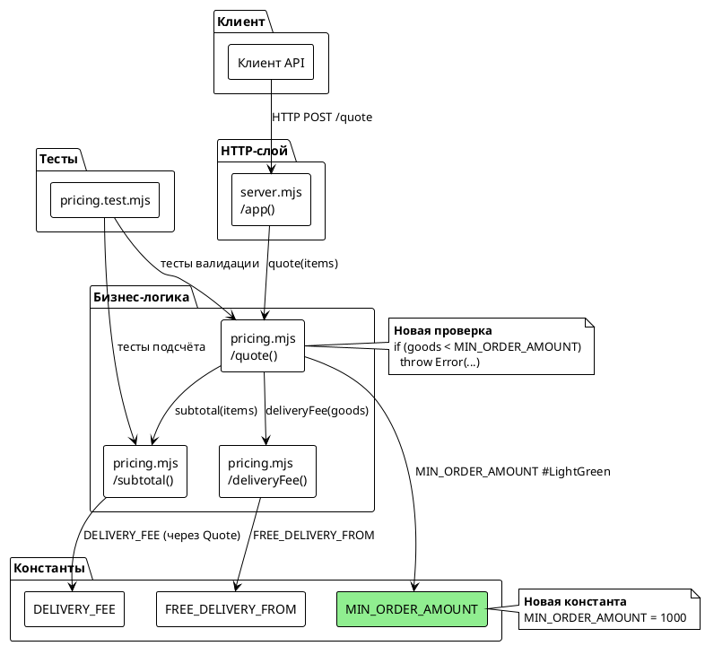
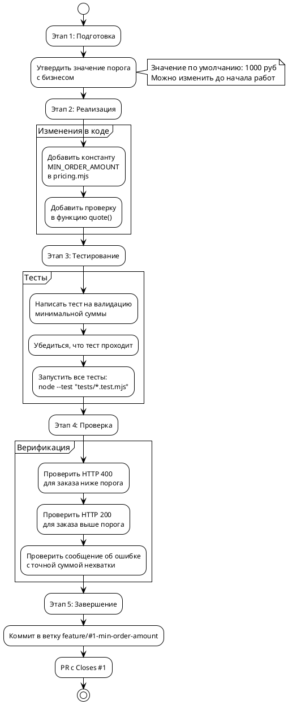

# FNR-1: Системные требования
## Минимальная сумма заказа для оформления

---

## 1. Введение

### 1.1. Метаданные

| Поле | Значение |
|------|----------|
| **Название требования** | Минимальная сумма заказа для оформления |
| **Идентификатор** | FNR-1 |
| **Статус** | Черновик |
| **Версия** | 1.0 |
| **Дата создания** | 2026-08-20 |
| **Автор** | System Analyst (AI Agent) |
| **Источник** | concept.md (Концепт 1 — Базовая константа) |
| **Связанные задачи** | task.md — Минимальная сумма заказа для оформления |

### 1.2. Термины и определения

| Термин | Определение |
|--------|-------------|
| **Минимальная сумма заказа** | Установленный порог стоимости товаров, ниже которого оформление заказа невозможно |
| **Сумма товаров (goods)** | Сумма цен всех позиций заказа без учёта стоимости доставки |
| **Сумма заказа (total)** | Сумма товаров плюс стоимость доставки |
| **Константа** | Жёстко заданное значение в коде, для изменения требуется пересборка и деплой |
| **Валидация** | Проверка входных данных или состояния на соответствие бизнес-правилам |

### 1.3. Ссылки

| Артефакт | Расположение |
|----------|--------------|
| Постановка задачи | `sa_documentation/FNR/FNR_1/task.md` |
| Концепты решений | `sa_documentation/FNR/FNR_1/concept.md` |
| Диалог с Repowise | `sa_documentation/FNR/FNR_1/repowise-dialog.md` |
| Целевой модуль арифметики | `src/pricing.mjs` |
| HTTP-обёртка | `src/server.mjs` |
| Тесты | `tests/pricing.test.mjs` |
| Конвенции проекта | `CLAUDE.md` |

### 1.4. История изменений

| Версия | Дата | Автор | Изменение |
|--------|------|-------|-----------|
| 1.0 | 2026-08-20 | System Analyst | Первичная версия системных требований |

---

## 2. Общее описание

### 2.1. As-Is (Текущее состояние)

#### 2.1.1. Описание текущего поведения

Система расчёта стоимости заказа **не блокирует** оформление заказов с любой суммой товаров. Endpoint `/quote` принимает запросы с суммой товаров меньше установленного порога и успешно возвращает расчёт стоимости включая доставку.

**Код-доказательство:**

```javascript
// src/pricing.mjs:48-52
export function quote(items) {
  const goods = subtotal(items);
  const delivery = deliveryFee(goods);
  return { goods, delivery, total: goods + delivery };
}
```

Функция `quote()` вычисляет сумму товаров (`goods`) через `subtotal()`, затем стоимость доставки (`delivery`) через `deliveryFee()`, но **не выполняет проверку** минимального порога суммы товаров.

#### 2.1.2. Ключевые компоненты

| Компонент | Файл | Ответственность | Доказательство |
|-----------|------|-----------------|----------------|
| **Арифметика расчёта** | `src/pricing.mjs` | Чистые функции: `subtotal()`, `deliveryFee()`, `quote()` | `src/pricing.mjs:1-52` |
| **HTTP-обработка** | `src/server.mjs` | Разбор запроса, вызов `quote()`, возврат HTTP-кодов | `src/server.mjs:26-46` |
| **Валидация позиций** | `src/pricing.mjs` | Проверка: массив не пуст, цена корректна, количество целое | `src/pricing.mjs:21-34` |
| **Константы** | `src/pricing.mjs` | `DELIVERY_FEE = 300`, `FREE_DELIVERY_FROM = 3000` | `src/pricing.mjs:5, 10` |

#### 2.1.3. Ограничения текущего решения

1. **Отсутствие проверки минимальной суммы** — система принимает убыточные мелкие заказы
2. **Жёстко захардкоженные константы** — все значения (`DELIVERY_FEE`, `FREE_DELIVERY_FROM`) заданы в коде
3. **Паттерн обработки ошибок** — ошибки выбрасываются как `Error` с текстовым сообщением на русском

**Код-доказательство паттерна ошибок:**

```javascript
// src/pricing.mjs:23-28
throw new Error('заказ без позиций');
throw new Error(`некорректная цена в позиции ${item.sku}`);
throw new Error(`некорректное количество в позиции ${item.sku}`);
```

#### 2.1.4. Существующая HTTP-интеграция

HTTP-слой **уже поддерживает** обработку ошибок без изменений:

```javascript
// src/server.mjs:42-45
try {
  return send(res, 200, quote(body?.items));
} catch (err) {
  return send(res, 400, { error: err.message });
}
```

Любой `Error`, выброшенный в `quote()`, автоматически превращается в HTTP 400 с `{ error: err.message }`.

### 2.2. Архитектурное решение

**Выбранный концепт:** Концепт 1 — Базовая константа (по вердикту архитектурных дебатов).

**Суть решения:** Добавить константу `MIN_ORDER_AMOUNT` и проверку в функцию `quote()` после вычисления `goods` и до вычисления `delivery`.

**Обоснование выбора:**
1. Следует существующему паттерну констант (`DELIVERY_FEE`, `FREE_DELIVERY_FROM`)
2. Минимальные изменения — только один файл (`src/pricing.mjs`)
3. Автоматическая HTTP-интеграция через существующий catch в `server.mjs`
4. Легкость тестирования по аналогии с существующими тестами валидации
5. Для демо-стенда простота важнее преждевременной гибкости

**Условия принятия (из вердикта дебатов):**
- Значение порога должно быть утверждено бизнесом до начала разработки
- Если бизнес потребует частой изменчивости — переход на Концепт 2 (env-переменная)

### 2.3. Диаграмма компонентов



### 2.4. Схема последовательности

```plantuml
@startuml
!theme plain
skinparammaxmessagesize 200

actor Клиент
participant "server.mjs\n/app()" as Server
participant "pricing.mjs\n/quote()" as Quote
participant "pricing.mjs\n/subtotal()" as Subtotal
participant "pricing.mjs\n/deliveryFee()" as Delivery
participant Константы as Const

Клиент -> Server: HTTP POST /quote\n{items: [...]}
Server -> Quote: quote(items)

Quote -> Subtotal: subtotal(items)
Subtotal -> Subtotal: Валидация: массив не пуст
Subtotal -> Subtotal: Валидация: цена корректна
Subtotal -> Subtotal: Валидация: количество целое
Subtotal --> Quote: goods (сумма товаров)

alt goods < MIN_ORDER_AMOUNT (новое)
    Quote -> Const: MIN_ORDER_AMOUNT
    Quote --> Quote: throw Error\n"минимальная сумма заказа N,\nне хватает X"
    Quote --> Server: Error
    Server --> Клиент: HTTP 400\n{error: "минимальная сумма..."}
else goods >= MIN_ORDER_AMOUNT
    Quote -> Delivery: deliveryFee(goods)
    Delivery -> Const: FREE_DELIVERY_FROM
    Delivery --> Quote: delivery (0 или 300)
    Quote --> Quote: total = goods + delivery
    Quote --> Server: {goods, delivery, total}
    Server --> Клиент: HTTP 200\n{goods, delivery, total}
end

@enduml
```

---

## 3. План миграции

### 3.1. Этапы внедрения



### 3.2. Таблица этапов

| Этап | Действие | Откат | Критерий готовности |
|------|----------|-------|---------------------|
| **1. Подготовка** | Утвердить значение `MIN_ORDER_AMOUNT` с бизнесом | — | Значение зафиксировано (по умолчанию 1000 руб) |
| **2. Реализация** | Добавить константу и проверку в `src/pricing.mjs` | `git checkout -- src/pricing.mjs` | Код компилируется, структура соответствует шаблону |
| **3. Тестирование** | Добавить тест в `tests/pricing.test.mjs` | Удалить новый тест | `node --test "tests/*.test.mjs"` проходит |
| **4. Верификация** | Ручная проверка HTTP-ответов | Восстановить код из git | Endpoint `/quote` возвращает 400/200 корректно |
| **5. Завершение** | PR с `Closes #1` | Закрыть PR без слияния | PR готов к ревью и слиянию |

### 3.3. Критерии готовности

1. **Функциональные:**
   - Заказы с суммой товаров ниже `MIN_ORDER_AMOUNT` отклоняются с HTTP 400
   - Сообщение об ошибке содержит точную сумму нехватки
   - Заказы с суммой товаров выше или равно `MIN_ORDER_AMOUNT` обрабатываются normally

2. **Нефункциональные:**
   - Все существующие тесты проходят
   - Новый тест покрывает позитивный и негативный кейсы
   - Код следует паттерну существующих валидаций

3. **Процессные:**
   - Изменения изолированы в `src/pricing.mjs`
   - `src/server.mjs` не требует изменений
   - Время внедрения ~30 минут

---

## 4. Функциональные требования — Backend / БД / API

> **Примечание:** Данный документ содержит только Backend-требования. Frontend/UI изменения отсутствуют — раздел 5 опускается как «Не применимо».

### 4.1. Задача 1: Добавление константы минимальной суммы заказа

| Поле метаданных | Значение |
|-----------------|----------|
| **Ответственный за тех. реализацию** | Backend Developer |
| **Задача на разработку** | TBD (будет создана при старте разработки) |
| **Jira-ссылка** | — |
| **Приоритет** | High (блокирует принятие убыточных заказов) |

#### 4.1.1. Описание

Добавить константу `MIN_ORDER_AMOUNT` в файл `src/pricing.mjs` по аналогии с существующими константами `DELIVERY_FEE` и `FREE_DELIVERY_FROM`.

**Код-доказательство существующего паттерна:**

```javascript
// src/pricing.mjs:5, 10
export const DELIVERY_FEE = 300;
export const FREE_DELIVERY_FROM = 3000;
```

**Требуемое изменение:**

```javascript
// src/pricing.mjs: после FREE_DELIVERY_FROM
export const MIN_ORDER_AMOUNT = 1000; // минимальная сумма заказа в рублях
```

#### 4.1.2. Обоснование

1. **Следует паттерну проекта** — константы уже определены как `export const` в начале файла
2. **Легко тестировать** — значение можно менять в тестах через импорт
3. **Легко заменить** — при необходимости перехода на env-переменную достаточно заменить одну строку
4. **Явное значение** — 1000 руб выбрано как разумное среднее между 500 и 1500

#### 4.1.3. Затрагиваемые компоненты

| Компонент | Файл | Тип изменения |
|-----------|------|----------------|
| Модуль арифметики | `src/pricing.mjs` | Добавление одной строки (константа) |

#### 4.1.4. Критерии приёмки

1. Константа определена как `export const MIN_ORDER_AMOUNT = 1000;`
2. Константа расположена после `FREE_DELIVERY_FROM` и до функции `subtotal()`
3. Значение константы — положительное целое число
4. Комментарий объясняет назначение константы

#### 4.1.5. Зависимости

Нет — это независимое изменение, которое можно выполнить отдельно.

---

### 4.2. Задача 2: Добавление проверки минимальной суммы в quote()

| Поле метаданных | Значение |
|-----------------|----------|
| **Ответственный за тех. реализацию** | Backend Developer |
| **Задача на разработку** | TBD (будет создана при старте разработки) |
| **Jira-ссылка** | — |
| **Приоритет** | High (блокирует приём убыточных заказов) |

#### 4.2.1. Описание

Добавить проверку минимальной суммы в функцию `quote()` после вычисления `goods = subtotal(items)` и до вычисления `delivery = deliveryFee(goods)`.

**Код-доказательство текущего состояния:**

```javascript
// src/pricing.mjs:48-52
export function quote(items) {
  const goods = subtotal(items);
  const delivery = deliveryFee(goods);
  return { goods, delivery, total: goods + delivery };
}
```

**Требуемое изменение:**

```javascript
// src/pricing.mjs: внутри quote()
export function quote(items) {
  const goods = subtotal(items);
  if (goods < MIN_ORDER_AMOUNT) {
    throw new Error(`минимальная сумма заказа ${MIN_ORDER_AMOUNT}, не хватает ${MIN_ORDER_AMOUNT - goods}`);
  }
  const delivery = deliveryFee(goods);
  return { goods, delivery, total: goods + delivery };
}
```

#### 4.2.2. Обоснование

1. **Правильное место проверки** — стоимость доставки (`delivery`) не должна учитываться в пороге
2. **Следует паттерну ошибок** — выброс `Error` с сообщением на русском (аналогично `subtotal()`)
3. **Информативное сообщение** — пользователь видит точную сумму нехватки
4. **Автоматическая HTTP-интеграция** — существующий catch в `server.mjs` превратит Error в HTTP 400

**Код-доказательство существующей HTTP-интеграции:**

```javascript
// src/server.mjs:42-45
try {
  return send(res, 200, quote(body?.items));
} catch (err) {
  return send(res, 400, { error: err.message });
}
```

#### 4.2.3. Затрагиваемые компоненты

| Компонент | Файл | Тип изменения |
|-----------|------|----------------|
| Модуль арифметики | `src/pricing.mjs` | Модификация функции `quote()` (добавление 3 строк) |

#### 4.2.4. Критерии приёмки

1. Проверка добавлена в `quote()` после `const goods = subtotal(items)`
2. Проверка выбрасывает `Error` с сообщением `"минимальная сумма заказа N, не хватает X"`
3. Значение `N` — это `MIN_ORDER_AMOUNT`
4. Значение `X` — это `MIN_ORDER_AMOUNT - goods`
5. При `goods >= MIN_ORDER_AMOUNT` выполнение продолжается normally

#### 4.2.5. Зависимости

- **Зависит от:** Задачи 1 (добавление константы `MIN_ORDER_AMOUNT`)
- **Блокирующая для:** Задачи 3 (тестирование)

---

### 4.3. Задача 3: Добавление теста на валидацию минимальной суммы

| Поле метаданных | Значение |
|-----------------|----------|
| **Ответственный за тех. реализацию** | Backend Developer |
| **Задача на разработку** | TBD (будет создана при старте разработки) |
| **Jira-ссылка** | — |
| **Приоритет** | High (покрытие новой логики тестами) |

#### 4.3.1. Описание

Добавить тест в `tests/pricing.test.mjs` для проверки валидации минимальной суммы заказа по аналогии с существующими тестами валидации.

**Код-доказательство существующего паттерна тестов:**

```javascript
// tests/pricing.test.mjs:11-13
test('заказ без позиций — ошибка, а не ноль', () => {
  assert.throws(() => subtotal([]), /без позиций/);
});
```

**Требуемый тест:**

```javascript
// tests/pricing.test.mjs: новый тест
test('заказ ниже минимальной суммы — ошибка с точной суммой нехватки', () => {
  // Заказ на 500 руб при пороге 1000
  assert.throws(() => quote([{ sku: 'a', price: 500, qty: 1 }]), /минимальная сумма/);
});

test('заказ ровно на минимальной сумме — принимается', () => {
  // Заказ ровно 1000 руб
  assert.deepEqual(quote([{ sku: 'a', price: 1000, qty: 1 }]), {
    goods: 1000,
    delivery: DELIVERY_FEE,
    total: 1300,
  });
});
```

#### 4.3.2. Обоснование

1. **Следует паттерну** — тесты валидации уже используют `assert.throws()`
2. **Покрывает edge-кейсы** — граница ровно на пороге (1000 руб)
3. **Проверяет сообщение** — тест убеждается, что сообщение содержит "минимальная сумма"
4. **Автоматическая проверка** — `node --test "tests/*.test.mjs"` гарантирует работоспособность

#### 4.3.3. Затрагиваемые компоненты

| Компонент | Файл | Тип изменения |
|-----------|------|----------------|
| Тесты | `tests/pricing.test.mjs` | Добавление 1-2 новых тестов |

#### 4.3.4. Критерии приёмки

1. Добавлен тест на негативный кейс (`goods < MIN_ORDER_AMOUNT`)
2. Добавлен тест на граничный кейс (`goods == MIN_ORDER_AMOUNT`)
3. Тест использует `assert.throws()` с regex на сообщение об ошибке
4. Все тесты проходят: `node --test "tests/*.test.mjs"`

#### 4.3.5. Зависимости

- **Зависит от:** Задачи 2 (реализация проверки в `quote()`)
- **Блокирующая для:** Этап верификации (ручная проверка HTTP)

---

### 4.4. API-эндпоинты

| Метод | Путь | Описание | Изменения |
|-------|------|----------|-----------|
| POST | `/quote` | Расчёт стоимости заказа | Добавлена валидация минимальной суммы |

#### 4.4.1. Формат запроса (без изменений)

```json
{
  "items": [
    { "sku": "A123", "price": 500, "qty": 1 }
  ]
}
```

#### 4.4.2. Формат ответа (успех — без изменений)

**HTTP 200:**

```json
{
  "goods": 1000,
  "delivery": 300,
  "total": 1300
}
```

#### 4.4.3. Формат ответа (ошибка — новый)

**HTTP 400:**

```json
{
  "error": "минимальная сумма заказа 1000, не хватает 500"
}
```

#### 4.4.4. Статусы

| Код | Сценарий | Тело ответа |
|-----|----------|-------------|
| 200 | Успешный расчёт (`goods >= MIN_ORDER_AMOUNT`) | `{goods, delivery, total}` |
| 400 | Сумма товаров ниже порога (`goods < MIN_ORDER_AMOUNT`) | `{error: "минимальная сумма..."}` |
| 400 | Другие ошибки валидации (пустой массив, некорректная цена и т.д.) | `{error: "..."}` |

---

### 4.5. Нефункциональные требования

| Требование | Значение | Обоснование |
|-------------|----------|--------------|
| **Производительность** | Проверка не должна замедлять расчёт | Простое сравнение чисел — O(1) |
| **Надёжность** | При некорректном значении константы старт падает | Константа проверяется на валидность в коде |
| **Совместимость** | Не должно ломать существующие интеграции | Ошибка уже обрабатывается в `server.mjs` |
| **Тестируемость** | Логика должна быть покрыта тестами | Добавляется 1-2 новых теста |

---

## 5. Требования к интерфейсам — Frontend / UI

**Не применимо.**

Документ содержит только Backend-требования. Изменения не затрагивают клиентский код, верстку или UI-логику. API-интерфейс остаётся прежним, добавляется только новый сценарий ошибки (HTTP 400), который уже поддерживается существующей обработкой ошибок на HTTP-слое.

---

## 6. Ревью требований

| Роль | Имя | Статус | Комментарии |
|------|-----|--------|-------------|
| **Аналитик** | — | Требуется | Утвердить значение порога с бизнесом |
| **Разработчик Backend** | — | Требуется | Проверить реализуемость и усилия |
| **Разработчик Frontend** | — | Н/А | Frontend-изменения отсутствуют |
| **Тестирование** | — | Требуется | Проверить полноту тестов |

---

## 7. Риски и ограничения

### 7.1. Таблица рисков

| ID | Риск | Вероятность | Влияние | Митигация |
|----|------|-------------|----------|-----------|
| R1 | Неверное значение порога при первом коммите | Средняя | Средняя | Утвердить значение с бизнесом перед разработкой |
| R2 | Возможная регрессия в расчётах | Низкая | Высокая | Все существующие тесты должны пройти |
| R3 | Непонятное сообщение об ошибке | Низкая | Низкая | Следовать паттерну существующих сообщений |
| R4 | Потребность в частой изменчивости порога | Средняя | Средняя | Мониторить запросы на изменение, перейти на env при необходимости |

### 7.2. Ограничения

1. **Порог захардкожен** — изменение значения требует пересборки и деплоя (~30 минут)
2. **Единое значение для всех окружений** — dev/stage/prod используют один порог (нет конфигурируемости)
3. **Значение не утверждено бизнесом** — в документе используется 1000 руб как разумное значение по умолчанию
4. **Отсутствует A/B тестирование** — невозможно тестировать разные пороги одновременно
5. **Нет веб-интерфейса для изменения** — только изменение в коде

---

## 8. Приложения

### 8.1. Шпаргалка по изменениям

**Файл:** `src/pricing.mjs`

```diff
+ // Минимальная сумма заказа в рублях
+ export const MIN_ORDER_AMOUNT = 1000;

export function quote(items) {
  const goods = subtotal(items);
+  if (goods < MIN_ORDER_AMOUNT) {
+    throw new Error(`минимальная сумма заказа ${MIN_ORDER_AMOUNT}, не хватает ${MIN_ORDER_AMOUNT - goods}`);
+  }
  const delivery = deliveryFee(goods);
  return { goods, delivery, total: goods + delivery };
}
```

**Файл:** `tests/pricing.test.mjs`

```diff
+ test('заказ ниже минимальной суммы — ошибка с точной суммой нехватки', () => {
+   assert.throws(() => quote([{ sku: 'a', price: 500, qty: 1 }]), /минимальная сумма/);
+ });
+
+ test('заказ ровно на минимальной сумме — принимается', () => {
+   assert.deepEqual(quote([{ sku: 'a', price: 1000, qty: 1 }]), {
+     goods: 1000,
+     delivery: DELIVERY_FEE,
+     total: 1300,
+   });
+ });
```

### 8.2. Команды для проверки

```bash
# Запуск тестов
node --test "tests/*.test.mjs"

# Запуск сервера (для ручной проверки)
node src/server.mjs

# Пример curl-запроса (должен вернуть 400)
curl -X POST http://localhost:8080/quote \
  -H "Content-Type: application/json" \
  -d '{"items": [{"sku": "A123", "price": 500, "qty": 1}]}'

# Пример curl-запроса (должен вернуть 200)
curl -X POST http://localhost:8080/quote \
  -H "Content-Type: application/json" \
  -d '{"items": [{"sku": "A123", "price": 1000, "qty": 1}]}'
```

---

**Конец документа**

---

## Следующий шаг

После утверждения этих требований:

1. Получить утверждение значения порога с бизнесом (email/чат)
2. Если утверждено → создать Issue и ветку `feature/#1-min-order-amount`
3. Начать разработку по задачам 1-3
4. После прохождения тестов → PR с `Closes #1`

*Примечание: если бизнес потребует конфигурируемости порога — перейти на Концепт 2 (env-переменная) и обновить системные требования.*
