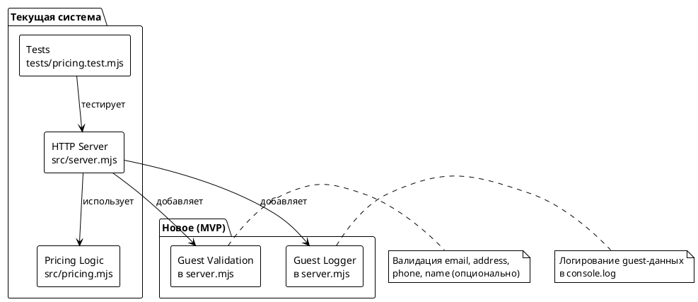
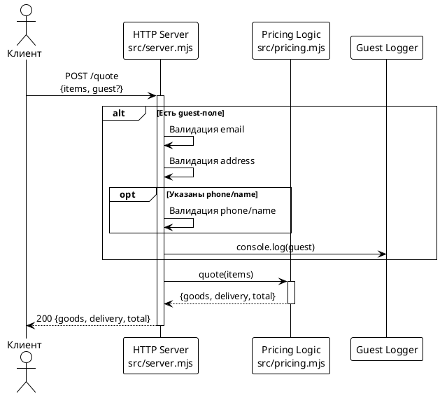
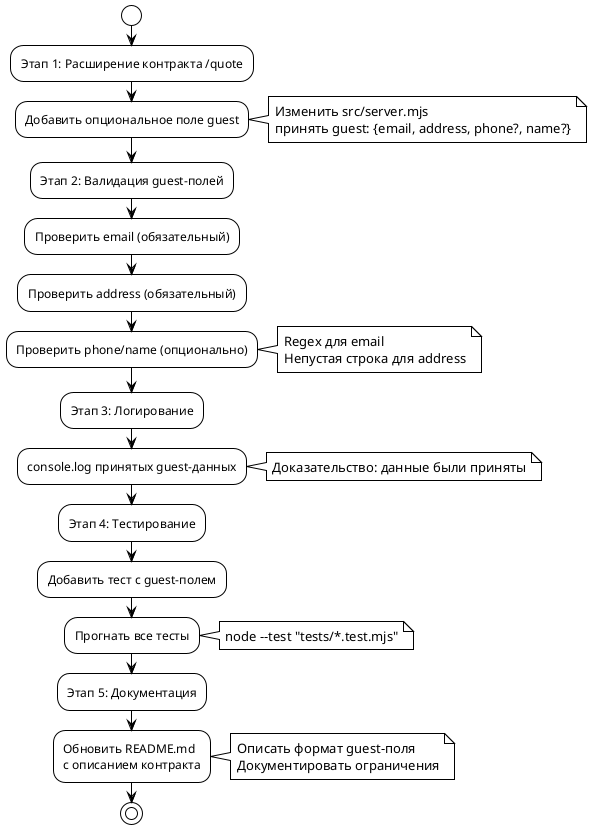

# Системные требования — FNR-1: Гостевой заказ без регистрации

| Поле | Значение |
|------|----------|
| Статус | Черновик |
| Версия | 1.0 |
| Автор | System Analyst (автоматически) |
| Дата | 2025-08-19 |
| Основание для разработки | Issue #43, FNR_1 concept.md (вердикт дебатов) |
| Выбранный концепт | #3 (Быстрый костыль) — Proof-of-Concept API-контракта |

---

## 1. Введение

### 1.1. Общая информация

Документ описывает системные требования для реализации возможности оформления заказа без обязательной регистрации пользователя. Выбранный подход — **концепт #3 (Быстрый костыль)**: минимальное расширение текущего API-контракта для демонстрации формы гостевого оформления без реальной функциональности сохранения заказов и email-отправки.

**Назначение репозитория:** Демо-стенд контура производства, а не реальный e-commerce (README.md:3-6).

### 1.2. Термины и определения

| Термин | Определение |
|--------|-------------|
| Гостевой заказ | Оформление заказа без создания учётной записи пользователя |
| API-контракт | Структура входных и выходных данных HTTP-endpoint'а |
| Proof-of-Concept | Прототип для демонстрации и обсуждения, не готовый к продакшену |
| Backward compatibility | Обратная совместимость — старые клиенты продолжают работать |

### 1.3. Связанные документы

| Артефакт | Расположение |
|----------|--------------|
| Постановка задачи | `sa_documentation/FNR/FNR_1/task.md` |
| Концепты решений | `sa_documentation/FNR/FNR_1/concept.md` |
| Issue исходного запроса | Issue #43 |
| GitHub Actions CI | `.github/workflows/ci.yml` |

### 1.4. История изменений

| Версия | Дата | Изменение | Автор |
|--------|------|-----------|-------|
| 1.0 | 2025-08-19 | Первая версия документа | System Analyst |

---

## 2. Общее описание

### 2.1. As-Is: Текущее поведение

**Текущая реализация (`src/server.mjs:714-728`):**

```javascript
if (req.url === '/quote' && req.method === 'POST') {
  let body;
  try {
    body = await readJson(req);
  } catch {
    return send(res, 400, { error: 'тело запроса не разобралось как JSON' });
  }
  try {
    return send(res, 200, quote(body?.items));
  } catch (err) {
    return send(res, 400, { error: err.message });
  }
}
```

**Контракт endpoint'а:**

- **URL:** `POST /quote`
- **Вход:** `{ items: [{sku, price, qty}] }`
- **Выход:** `{ goods, delivery, total }`

**Ключевые компоненты:**

| Компонент | Файл | Ответственность |
|-----------|-------|------------------|
| Расчёт стоимости | `src/pricing.mjs` | Арифметика заказа: сумма позиций, доставка, итог |
| HTTP-обёртка | `src/server.mjs` | Endpoints: `/healthz`, `POST /quote` — разбор JSON, коды ответов |
| Тесты | `tests/pricing.test.mjs` | Проверка расчёта (8 тестов) |

**Ограничения текущего решения:**

1. Нет обработки гостевых данных (email, адрес, телефон, ФИО)
2. Нет валидации формата email
3. Нет логирования принятых данных
4. Контракт не предусматривает опциональные поля

### 2.2. Архитектурное решение

**Выбранный подход:** Концепт #3 (Быстрый костыль) — минимальное расширение контракта `/quote` с опциональным полем `guest` для демонстрации API-контракта гостевого оформления.

**Обоснование выбора (из concept.md:454-478):**

1. **Честный подход:** Явно декларирует ограниченное назначение — proof-of-concept, а не реальная функциональность
2. **Соответствие scope демо-репо:** Не требует БД, email-сервиса, профилей
3. **Быстрая обратная связь:** 2-4 часа работы vs 1-2 недели на новый репо
4. **Минимальные риски:** Изменение обратно совместимо, никаких новых зависимостей

**Ограничения концепта (документировать):**

- ❌ Нет реального сохранения заказов
- ❌ Нет реальной email-отправки
- ❌ Нет привязки к профилю
- ✅ API-контракт определён и протестирован

### 2.3. Диаграмма компонентов



### 2.4. Схема последовательности



---

## 3. План миграции

### 3.1. Этапы внедрения



### 3.2. Таблица этапов

| № | Этап | Описание | Критерий готовности | Откат |
|---|------|----------|---------------------|-------|
| 1 | Расширение контракта | Добавить обработку `guest` поля в `/quote` | Endpoint принимает `guest` без ошибок | Удалить код обработки `guest` |
| 2 | Валидация | Добавить валидацию email, address, phone, name | Некорректные данные возвращают 400 | Удалить валидацию |
| 3 | Логирование | Добавить `console.log` для guest-данных | Лог появляется при запросе с `guest` | Удалить логирование |
| 4 | Тестирование | Добавить тест с `guest`-полем | Все тесты проходят (9 вместо 8) | Удалить новый тест |
| 5 | Документация | Обновить README.md с контрактом | README описывает новый формат | Откатить README |

### 3.3. Критерии готовности MVP

1. ✅ Endpoint `POST /quote` принимает опциональное поле `guest`
2. ✅ Валидация email (обязательный) и address (обязательный)
3. ✅ Валидация phone и name (опционально)
4. ✅ Логирование принятых guest-данных
5. ✅ Тест проверяет новый формат
6. ✅ README.md описывает контракт и ограничения
7. ✅ Все существующие тесты продолжают проходить (backward compatibility)

---

## 4. Функциональные требования — Backend

### 4.1. Расширение контракта POST /quote

| Метаданные | Значение |
|------------|----------|
| Ответственный за тех. реализацию | Backend Developer |
| Задача на разработку | JIRA: TBD (из Issue #43) |
| Статус | Новая |

**Описание:**

Расширить существующий endpoint `POST /quote` для принятия опционального объекта `guest` с данными гостевого оформления. Поле `guest` не является обязательным — сохраняется обратная совместимость с существующими клиентами.

**Новое поле в запросе:**

```json
{
  "items": [{"sku": "a", "price": 1000, "qty": 2}],
  "guest": {
    "email": "user@example.com",
    "address": "г. Москва, ул. Примерная, д. 1",
    "phone": "+79001234567",
    "name": "Иванов Иван"
  }
}
```

**Обоснование:**

Текущий контракт не предусматривает передачу данных гостевого оформления. Расширение позволяет демонстрировать форму гостевого оформления без реализации реальной функциональности (сохранение, email, профили).

**Затрагиваемые компоненты:**

- `src/server.mjs:714-728` — обработчик `/quote`

**Критерии приёмки:**

1. Endpoint принимает запросы без поля `guest` (backward compatibility)
2. Endpoint принимает запросы с полем `guest`
3. Некорректный JSON в `guest` возвращает 400
4. Существующие тесты продолжают проходить

**Зависимости:**

Нет

---

### 4.2. Валидация guest-полей

| Метаданные | Значение |
|------------|----------|
| Ответственный за тех. реализацию | Backend Developer |
| Задача на разработку | JIRA: TBD (из Issue #43) |
| Статус | Новая |

**Описание:**

Добавить валидацию полей объекта `guest`:

- `email` — обязательный, должен соответствовать формату email
- `address` — обязательный, непустая строка
- `phone` — опциональный, если указан — непустая строка
- `name` — опциональный, если указан — непустая строка

**Правила валидации:**

| Поле | Обязательное | Формат | Ошибка |
|------|--------------|--------|--------|
| `guest.email` | Да | RFC 5322 (упрощённый regex) | "некорректный email" |
| `guest.address` | Да | Непустая строка | "адрес обязателен" |
| `guest.phone` | Нет | Непустая строка, если указан | "телефон не может быть пустым" |
| `guest.name` | Нет | Непустая строка, если указан | "имя не может быть пустым" |

**Обоснование:**

Валидация на уровне API обеспечивает раннее обнаружение ошибок и демонстрирует контракт гостевого оформления. Regex для email — упрощённый (стандартная библиотека Node.js не содержит валидатора).

**Затрагиваемые компоненты:**

- `src/server.mjs:714-728` — добавление валидации

**Критерии приёмки:**

1. Отсутствие `guest.email` возвращает 400 с ошибкой "email обязателен"
2. Некорректный email возвращает 400 с ошибкой "некорректный email"
3. Отсутствие `guest.address` возвращает 400 с ошибкой "адрес обязателен"
4. Пустой `guest.phone` возвращает 400 (если указан)
5. Валидные данные проходят успешно

**Зависимости:**

Зависит от: 4.1 (Расширение контракта)

---

### 4.3. Логирование guest-данных

| Метаданные | Значение |
|------------|----------|
| Ответственный за тех. реализацию | Backend Developer |
| Задача на разработку | JIRA: TBD (из Issue #43) |
| Статус | Новая |

**Описание:**

Добавить логирование принятых guest-данных через `console.log` для доказательства того, что данные были приняты сервером.

**Формат лога:**

```
[guest checkout] email=user@example.com address="г. Москва, ул. Примерная, д. 1" phone=+79001234567 name="Иванов Иван"
```

**Обоснование:**

Реальное сохранение заказов не входит в scope концепта #3. Логирование предоставляет доказательство приёмки данных без персистентности.

**Затрагиваемые компоненты:**

- `src/server.mjs:714-728` — добавление `console.log`

**Критерии приёмки:**

1. При запросе с валидным `guest` в логах появляется строка `[guest checkout]`
2. Лог содержит все переданные поля guest
3. Лог не появляется при запросе без `guest`

**Зависимости:**

Зависит от: 4.2 (Валидация guest-полей)

---

### 4.4. Тестирование нового формата

| Метаданные | Значение |
|------------|----------|
| Ответственный за тех. реализацию | Backend Developer |
| Задача на разработку | JIRA: TBD (из Issue #43) |
| Статус | Новая |

**Описание:**

Добавить тест в `tests/pricing.test.mjs` для проверки нового формата с полем `guest`. Тест проверяет, что endpoint принимает валидные guest-данные и возвращает корректный расчёт.

**Сценарии теста:**

1. Запрос с валидным `guest` возвращает 200 и корректный расчёт
2. Запрос без `guest` возвращает 200 (backward compatibility)
3. Запрос с некорректным email возвращает 400
4. Запрос без `guest.email` возвращает 400
5. Запрос без `guest.address` возвращает 400

**Обоснование:**

Новая логика требует тестирования (CLAUDE.md:57). Добавление одного теста соответствует концепту #3 (минимальные изменения).

**Затрагиваемые компоненты:**

- `tests/pricing.test.mjs` — новый тест

**Критерии приёмки:**

1. Новый тест проверяет валидный guest-формат
2. Все 9 тестов (8 существующих + 1 новый) проходят
3. `node --test "tests/*.test.mjs"` завершается успешно

**Зависимости:**

Зависит от: 4.3 (Логирование guest-данных)

---

### 4.5. Документация контракта в README

| Метаданные | Значение |
|------------|----------|
| Ответственный за тех. реализацию | Backend Developer |
| Задача на разработку | JIRA: TBD (из Issue #43) |
| Статус | Новая |

**Описание:**

Обновить README.md с описанием нового контракта endpoint'а `/quote` и documented ограничений концепта #3.

**Содержимое обновления:**

1. Пример curl-запроса с полем `guest`
2. Описание структуры `guest`-поля
3. Раздел "Ограничения" с чётким указанием:
   - Нет реального сохранения заказов
   - Нет реальной email-отправки
   - Нет привязки к профилю
   - Это proof-of-concept для демонстрации API

**Обоснование:**

Честный подход (concept.md:462) требует явного документирования ограничений. Stakeholders должны понимать, что это прототип, а не продакшн-решение.

**Затрагиваемые компоненты:**

- `README.md` — добавление раздела о гостевом оформлении

**Критерии приёмки:**

1. README содержит пример запроса с `guest`
2. README описывает все поля `guest`
3. README содержит раздел "Ограничения"
4. Раздел "Ограничения" явно указывает на отсутствие реальной функциональности

**Зависимости:**

Зависит от: 4.4 (Тестирование нового формата)

---

## 5. Требования к интерфейсам — Frontend / UI

**Статус:** Не применимо

Текущий репозиторий `poh-demo-checkout` является backend-сервисом расчёта стоимости и не содержит frontend-компонентов. Выбранный концепт #3 не предполагает разработку UI — только расширение API-контракта.

**Примечание:** В реальном e-commerce потребовалась бы разработка формы гостевого оформления на frontend, но это выходит за scope демо-репозитория.

---

## 6. Ревью требований

| Роль | Имя | Статус | Комментарий |
|------|-----|--------|-------------|
| Аналитик | System Analyst | ✅ | Требования сгенерированы на basis вердикта дебатов |
| Разработчик Backend | TBD | ⏳ | Ожидает назначения |
| Разработчик Frontend | N/A | N/A | Не применимо (нет frontend) |
| Тестирование | TBD | ⏳ | Ожидает назначения |

---

## 7. Риски и ограничения

### 7.1. Риски

| ID | Риск | Вероятность | Влияние | Митигация |
|----|------|-------------|---------|-----------|
| R1 | Демо создаёт ложные ожидания у stakeholders | Средняя | Высокая | Явная документация ограничений в README и issue |
| R2 | Regex для email недостаточно строгий | Низкая | Низкая | Упрощённый regex допустим для демо, документировать |
| R3 | Отсутствие реальной функциональности | Определённо | Средняя | Чёткое обозначение концепта #3 как PoC |
| R4 | Изменение сломает существующих клиентов | Низкая | Средняя | Backward compatibility: поле `guest` опционально |

### 7.2. Ограничения

1. **Нет персистентности:** Заказы не сохраняются, данные теряются при рестарте сервера
2. **Нет email-отправки:** Письма со статусом заказа не отправляются
3. **Нет профилей:** Привязка заказов к профилю не реализована
4. **Нет UI:** Форма гостевого оформления не разрабатывается
5. **Scope демо-репо:** Репозиторий является демонстрационным стендом, а не реальным e-commerce
6. **Зависимости:** Добавление новых зависимостей запрещено (CLAUDE.md:66-67)

---

## 8. Приложения

### 8.1. Пример curl-запроса с guest-полем

```bash
curl -sX POST localhost:8080/quote \
  -H 'content-type: application/json' \
  -d '{
    "items": [{"sku": "a", "price": 1000, "qty": 2}],
    "guest": {
      "email": "user@example.com",
      "address": "г. Москва, ул. Примерная, д. 1",
      "phone": "+79001234567",
      "name": "Иванов Иван"
    }
  }'
# Ожидаемый ответ:
# {"goods":2000,"delivery":300,"total":2300}
# Логи сервера:
# [guest checkout] email=user@example.com address="г. Москва, ул. Примерная, д. 1" phone=+79001234567 name="Иванов Иван"
```

### 8.2. Regex для валидации email

```javascript
// Упрощённый regex для демо (не RFC 5322 compliant)
const EMAIL_REGEX = /^[^\s@]+@[^\s@]+\.[^\s@]+$/;
```

### 8.3. Шпаргалка по изменению файлов

| Файл | Изменение | Строки |
|------|-----------|--------|
| `src/server.mjs` | Добавить обработку `guest` | ~714-728 |
| `src/server.mjs` | Добавить валидацию | +20-30 строк |
| `src/server.mjs` | Добавить логирование | +3-5 строк |
| `tests/pricing.test.mjs` | Добавить тест | +15-20 строк |
| `README.md` | Документировать контракт | +20-30 строк |

---

**Следующий шаг:** После согласования требований — `/validate-doc sa_documentation/FNR/FNR_1/system_requirements.md` для глубокой проверки документации.

---

*Документ сгенерирован автоматически на основе concept.md (вердикт дебатов, концепт #3)*
