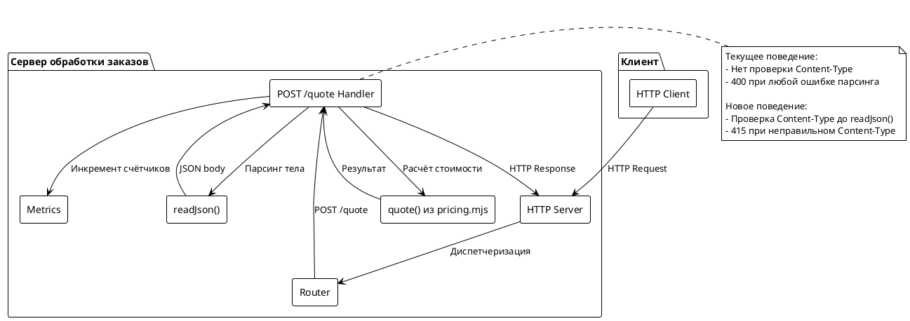
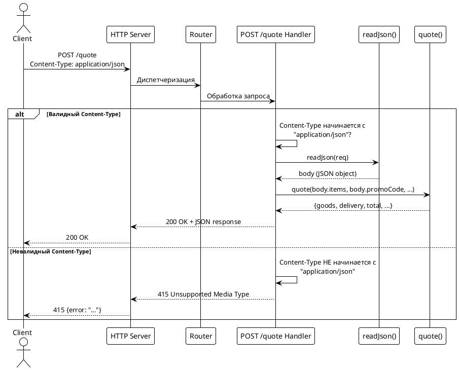
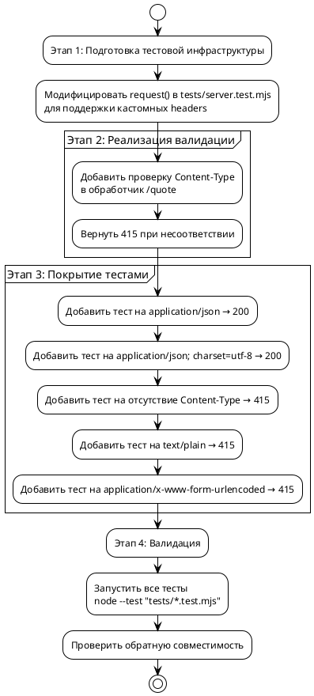

# Системные требования: Валидация Content-Type для POST /quote

## 1. Введение

### 1.1. Метаданные

| Поле | Значение |
|------|----------|
| **Проект** | poh-demo-checkout |
| **Документ** | Системные требования (Functional Requirements) |
| **Версия** | 1.0 |
| **Дата** | 2026-08-25 |
| **Автор** | Системный аналитик |
| **Статус** | Черновик |
| **Related JIRA** | FNR-1 |
| **Related Issue** | po-helper-org/poh-demo-checkout#126 |

### 1.2. Термины и определения

| Термин | Определение |
|--------|-------------|
| Content-Type | Заголовок HTTP, указывающий тип медиа-контента тела запроса |
| 415 Unsupported Media Type | HTTP статусный код, возвращаемый когда сервер отказывается обрабатывать запрос с неподдерживаемым форматом данных |
| 400 Bad Request | HTTP статусный код, возвращаемый при некорректном синтаксисе запроса |
| Инлайн-проверка | Проверка, выполняемая непосредственно в теле функции-обработчика без вынесения в отдельную функцию |

### 1.3. Ссылки на связанные документы

| Документ | Описание |
|----------|----------|
| [task.md](./task.md) | Постановка задачи с критериями готовности |
| [concept.md](./concept.md) | Концепты решений и вердикт архитектурных дебатов |
| [RFC 9110 Section 8.3](https://www.rfc-editor.org/rfc/rfc9110.html#section-8.3) | HTTP Semantic: 415 Unsupported Media Type |

### 1.4. История изменений

| Версия | Дата | Автор | Изменения |
|--------|------|-------|-----------|
| 1.0 | 2026-08-25 | Системный аналитик | Первичная версия |

---

## 2. Общее описание

### 2.1. As-Is: Текущее поведение

Текущая реализация эндпоинта `POST /quote` не выполняет проверку заголовка `Content-Type` перед попыткой парсинга JSON-тела запроса.

**Код-доказательства (src/server.mjs):**

```javascript
// Строки 20-25: функция readJson() парсит JSON без проверки Content-Type
async function readJson(req) {
  const chunks = [];
  for await (const chunk of req) chunks.push(chunk);
  if (chunks.length === 0) return null;
  return JSON.parse(Buffer.concat(chunks).toString('utf8'));
}

// Строки 37-46: обработчик /quote не проверяет Content-Type
if (req.url === '/quote' && req.method === 'POST') {
  counters.incVisit();
  let body;
  try {
    body = await readJson(req);  // ← проверка Content-Type отсутствует
  } catch {
    return send(res, 400, { error: 'тело запроса не разобралось как JSON' });
  }
  // ...
}
```

**Проблема:** При отправке запроса с неправильным Content-Type (например, `text/plain`, `application/x-www-form-urlencoded`) сервер возвращает статус 400 вместо корректного 415, нарушая HTTP-семантику.

### 2.2. Архитектурное решение

Принятый концепт: **Концепт 2 — Инлайн-проверка в обработчике**

**Обоснование:**
- Минимальные изменения (3-4 строки кода)
- Логика видна непосредственно в месте использования
- Сохраняется обратная совместимость
- Усилия реализации: 30-45 минут

**Архитектурное решение:** [concept.md](./concept.md)

### 2.3. Диаграмма компонентов



### 2.4. Схема последовательности



---

## 3. План миграции

### 3.1. Этапы внедрения



### 3.2. Таблица этапов

| Этап | Описание | Действия | Критерии готовности | Откат |
|------|----------|----------|---------------------|-------|
| **1** | Подготовка тестовой инфраструктуры | Модифицировать `request()` в `tests/server.test.mjs` для поддержки параметра `headers` | Существующие тесты продолжают проходить | `git checkout tests/server.test.mjs` |
| **2** | Реализация валидации Content-Type | Добавить 3-4 строки проверки в `src/server.mjs:37-61` перед вызовом `readJson()` | Новый тест на неправильный Content-Type возвращает 415 | `git checkout src/server.mjs` |
| **3** | Покрытие тестами | Добавить 5 новых тестов в `tests/server.test.mjs` | Все 5 новых тестов проходят | `git checkout tests/server.test.mjs` |
| **4** | Валидация | Запустить полный тестовый набор, проверить обратную совместимость | `node --test "tests/*.test.mjs"` — все тесты проходят | `git checkout .` |

### 3.3. Критерии готовности к релизу

1. Все существующие тесты проходят без изменений
2. Все 5 новых тестов для валидации Content-Type проходят
3. Запросы с `Content-Type: application/json` обрабатываются корректно
4. Запросы с `Content-Type: application/json; charset=utf-8` обрабатываются корректно
5. Запросы с неправильным Content-Type возвращают 415
6. Отсутствие Content-Type возвращает 415

---

## 4. Функциональные требования — Backend

### 4.1. Модификация тестового helper (Задача 1)

**Метаданные**

| Поле | Значение |
|------|----------|
| **Ответственный за тех. реализацию** | Backend-разработчик |
| **Задача на разработку** | FNR-1-T1 |
| **Jira-ссылка** | — |
| **Статус** | К выполнению |

**Описание**

Модифицировать helper-функцию `request()` в файле `tests/server.test.mjs` для поддержки передачи кастомных HTTP-заголовков. Текущая реализация жёстко задаёт `'content-type': 'application/json'` (строка 14).

**Обоснование**

Для тестирования различных сценариев валидации Content-Type необходимо ability отправлять запросы с разными значениями заголовка Content-Type.

**Затрагиваемые компоненты**

- `tests/server.test.mjs:10-70` — функция `request()`

**Критерии приёмки**

1. Функция `request()` принимает дополнительный параметр `headers` (опциональный)
2. Если переданы кастомные headers, они мёржатся с дефолтными
3. Существующие тесты продолжают работать без изменений

**Зависимости**

Нет

---

### 4.2. Реализация валидации Content-Type (Задача 2)

**Метаданные**

| Поле | Значение |
|------|----------|
| **Ответственный за тех. реализацию** | Backend-разработчик |
| **Задача на разработку** | FNR-1-T2 |
| **Jira-ссылка** | — |
| **Статус** | К выполнению |

**Описание**

Добавить инлайн-проверку заголовка `Content-Type` в обработчике `POST /quote` (файл `src/server.mjs`, строки 37-61). Проверка должна выполняться **до** вызова `readJson()`.

При несоответствии Content-Type возвращать HTTP статус 415 с сообщением об ошибке.

**Обоснование**

Текущее поведение возвращает 400 при любой ошибке парсинга, включая случаи когда Content-Type не application/json. Это нарушает HTTP-семантику (RFC 9110).

**Затрагиваемые компоненты**

- `src/server.mjs:37-61` — обработчик `/quote`

**Требуемая логика**

```javascript
if (req.url === '/quote' && req.method === 'POST') {
  counters.incVisit();
  
  // === НОВАЯ ПРОВЕРКА ===
  const contentType = req.headers['content-type'];
  if (!contentType || !contentType.startsWith('application/json')) {
    return send(res, 415, { error: 'ожидается Content-Type: application/json' });
  }
  // === КОНЕЦ НОВОЙ ПРОВЕРКИ ===
  
  let body;
  try {
    body = await readJson(req);
  } catch {
    return send(res, 400, { error: 'тело запроса не разобралось как JSON' });
  }
  // ... остальная логика без изменений
}
```

**Критерии приёмки**

1. Проверка Content-Type выполняется до вызова `readJson()`
2. Используется проверка `contentType.startsWith('application/json')` (для поддержки charset)
3. При отсутствии Content-Type возвращается 415
4. При Content-Type не начинающемся с "application/json" возвращается 415
5. Тело ответа содержит `{ error: 'ожидается Content-Type: application/json' }`
6. Существующие валидные запросы продолжают работать

**Зависимости**

- FNR-1-T1 (тестовый helper должен быть модифицирован первым)

---

### 4.3. Покрытие тестами сценариев валидации (Задача 3)

**Метаданные**

| Поле | Значение |
|------|----------|
| **Ответственный за тех. реализацию** | Backend-разработчик |
| **Задача на разработку** | FNR-1-T3 |
| **Jira-ссылка** | — |
| **Статус** | К выполнению |

**Описание**

Добавить 5 новых тестов в `tests/server.test.mjs` для покрытия всех сценариев валидации Content-Type.

**Обоснование**

Обеспечение гарантии корректности реализации и предотвращение регрессий.

**Затрагиваемые компоненты**

- `tests/server.test.mjs` — новые тесты

**Перечень тестов**

| # | Название теста | Content-Type | Ожидаемый статус | Описание |
|---|----------------|--------------|------------------|----------|
| 1 | Валидный Content-Type | `application/json` | 200 | Базовый сценарий — должен проходить |
| 2 | Content-Type с charset | `application/json; charset=utf-8` | 200 | Поддержка параметров Content-Type |
| 3 | Отсутствие Content-Type | (отсутствует) | 415 | Заголовок не передан |
| 4 | text/plain | `text/plain` | 415 | Неправильный тип контента |
| 5 | application/x-www-form-urlencoded | `application/x-www-form-urlencoded` | 415 | Форм-дата вместо JSON |

**Критерии приёмки**

1. Все 5 тестов проходят
2. Тесты используют модифицированный `request()` с параметром `headers`
3. Тесты проверяют и статусный код, и тело ответа

**Зависимости**

- FNR-1-T2 (валидация должна быть реализована)

---

### 4.4. API: Эндпоинт POST /quote (Задача 4)

**Метаданные**

| Поле | Значение |
|------|----------|
| **Ответственный за тех. реализацию** | Backend-разработчик |
| **Задача на разработку** | FNR-1-T4 |
| **Jira-ссылка** | — |
| **Статус** | К выполнению |

**Описание**

Документирование изменённого поведения эндпоинта `POST /quote` в части валидации Content-Type.

**Обоснование**

API должен иметь чётко задокументированное поведение для потребителей.

**Затрагиваемые компоненты**

- `src/server.mjs:37-61` — обработчик `/quote`

**Перечень эндпоинтов**

| Метод | Путь | Описание |
|------|------|----------|
| POST | /quote | Расчёт стоимости заказа с валидацией Content-Type |

**Формат запроса**

```http
POST /quote HTTP/1.1
Host: localhost:8080
Content-Type: application/json
Content-Length: <length>

{
  "items": [
    { "sku": "string", "price": 1000, "qty": 1 }
  ],
  "promoCode": "string",
  "paymentMethod": "string"
}
```

**Формат ответа (успех)**

```json
{
  "goods": 1000,
  "delivery": 300,
  "discount": 0,
  "promoStatus": "none",
  "total": 1300,
  "payment": null,
  "paymentStatus": "none"
}
```

**Формат ответа (ошибка Content-Type)**

```json
{
  "error": "ожидается Content-Type: application/json"
}
```

**Статусы ответа**

| Код | Описание | Когда возвращается |
|-----|----------|-------------------|
| 200 | OK | Валидный JSON и корректные данные |
| 400 | Bad Request | Валидный Content-Type, но некорректный JSON или данные заказа |
| 415 | Unsupported Media Type | Content-Type отсутствует или не application/json |
| 404 | Not Found | Эндпоинт не найден |

**Критерии приёмки**

1. Документация соответствует реализованному поведению
2. Все статусные коды и форматы ответов задокументированы

**Зависимости**

- FNR-1-T2, FNR-1-T3 (реализация и тесты должны быть завершены)

---

## 5. Требования к интерфейсам — Frontend / UI

**Не применимо**

Документ содержит только backend-изменения. Frontend/UI не затрагивается.

---

## 6. Ревью требований

| Роль | Имя | Дата | Статус | Комментарии |
|------|-----|------|--------|-------------|
| Системный аналитик | — | 2026-08-25 | ✅ Готово к рецензии | — |
| Разработчик Backend | — | — | ⏳ На рецензии | — |
| Разработчик Frontend | — | — | ⏸️ Не применимо | — |
| Тестирование | — | — | ⏳ На рецензии | — |

---

## 7. Риски и ограничения

### 7.1. Таблица рисков

| ID | Риск | Вероятность | Влияние | Митигация |
|----|------|-------------|---------|-----------|
| R1 | Существующие клиенты не отправляют Content-Type | Низкая | Средняя | Проверить логи/метрики перед релизом. 415 вместо 400 — корректное поведение по HTTP-спеке. |
| R2 | Content-Type с параметрами не распознаётся | Низкая | Высокая | Использовать `startsWith('application/json')` для поддержки charset и других параметров. |
| R3 | Регрессия существующих тестов | Низкая | Средняя | Все существующие тесты должны проходить без изменений. |
| R4 | Изменение порядка валидации влияет на поведение | Низкая | Низкая | Content-Type проверяется ДО парсинга — это правильный порядок по HTTP. |

### 7.2. Ограничения

1. **Scope:** Валидация Content-Type только для эндпоинта `POST /quote`. Другие эндпоинты (`/healthz`, `/stats`) не затрагиваются.
2. **Зависимости:** Новые зависимости не заводятся.
3. **Совместимость:** Обратная совместимость обязательна — существующие валидные запросы должны продолжать работать.
4. **Бизнес-логика:** `src/pricing.mjs` не изменяется.
5. **Будущее расширение:** Если в ближайшие 3 месяца появится второй JSON-эндпоинт, рассмотреть рефактор на выделенную функцию валидации.

---

## 8. Приложения

### 8.1. Сценарии тестирования

| Сценарий | Content-Type заголовок | Тело запроса | Ожидаемый статус | Ожидаемое тело |
|----------|------------------------|---------------|------------------|----------------|
| 1 | `application/json` | Валидный JSON | 200 | `{goods, delivery, total, ...}` |
| 2 | `application/json; charset=utf-8` | Валидный JSON | 200 | `{goods, delivery, total, ...}` |
| 3 | (отсутствует) | Любое | 415 | `{error: "..."}` |
| 4 | `text/plain` | Валидный JSON | 415 | `{error: "..."}` |
| 5 | `application/x-www-form-urlencoded` | Форм-дата | 415 | `{error: "..."}` |
| 6 | `application/json` | Невалидный JSON | 400 | `{error: "тело запроса не разобралось как JSON"}` |

### 8.2. Примеры curl-команд для тестирования

```bash
# Валидный запрос
curl -X POST http://localhost:8080/quote \
  -H "Content-Type: application/json" \
  -d '{"items":[{"sku":"a","price":1000,"qty":1}]}'

# Content-Type с charset
curl -X POST http://localhost:8080/quote \
  -H "Content-Type: application/json; charset=utf-8" \
  -d '{"items":[{"sku":"a","price":1000,"qty":1}]}'

# Неправильный Content-Type
curl -X POST http://localhost:8080/quote \
  -H "Content-Type: text/plain" \
  -d '{"items":[{"sku":"a","price":1000,"qty":1}]}'

# Отсутствие Content-Type
curl -X POST http://localhost:8080/quote \
  -d '{"items":[{"sku":"a","price":1000,"qty":1}]}'
```

---

**Конец документа**
