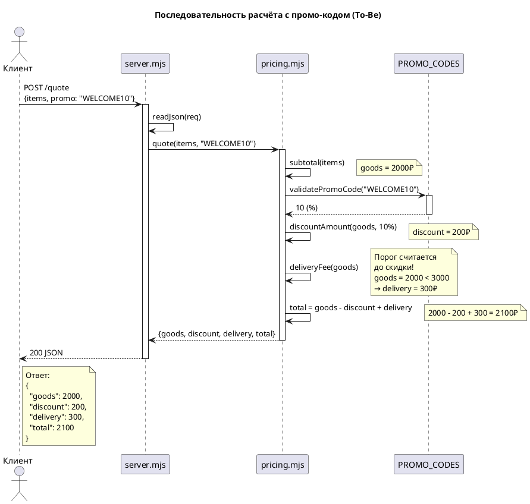
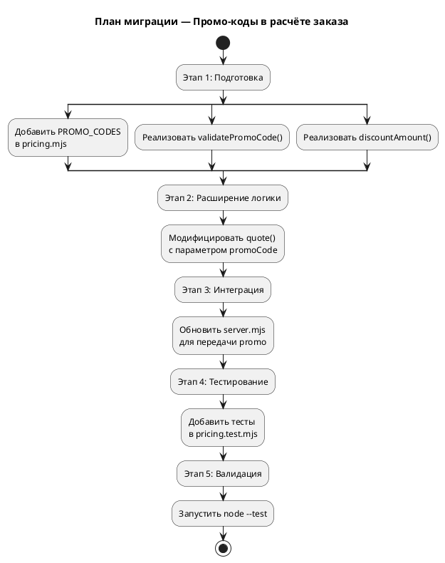

# FNR-1: Системные требования — Промо-код в расчёте заказа

## 1. Введение

### 1.1. Общая информация

| Метаданные | Значение |
|------------|----------|
| **Название требования** | Поддержка промо-кодов в расчёте стоимости заказа |
| **Номер FNR** | FNR-1 |
| **Статус** | Проект |
| **Приоритет** | P3 |
| **Версия** | 1.0 |
| **Дата создания** | 2026-08-18 |
| **Автор требования** | Issue-Agent |
| **Ответственный за реализацию** | OpenHands / Backend-разработчик |
| **Источник требования** | Issue #1 (po-helper-org/poh-demo-checkout) |

### 1.2. Термины и определения

| Термин | Определение |
|--------|-------------|
| **Промо-код** | Строковый код, дающий право на процентную скидку от суммы товаров |
| **Скидка (discount)** | Сумма в рублях, вычитаемая из стоимости товаров |
| **Порог бесплатной доставки** | Сумма товаров (3000₽), при достижении которой доставка становится бесплатной |
| **As-Is** | Текущее поведение системы до внесения изменений |
| **To-Be** | Целевое поведение системы после реализации требований |

### 1.3. Связанные документы

| Документ | Ссылка |
|----------|--------|
| Постановка задачи | `sa_documentation/FNR/FNR_1/task.md` |
| Концепты решений | `sa_documentation/FNR/FNR_1/concept.md` |
| Исходный код | `src/pricing.mjs`, `src/server.mjs` |
| Тесты | `tests/pricing.test.mjs` |

### 1.4. История изменений

| Версия | Дата | Автор | Изменение |
|--------|------|-------|-----------|
| 1.0 | 2026-08-18 | Issue-Agent | Первая версия системных требований |

---

## 2. Общее описание

### 2.1. As-Is — Текущее поведение системы

#### 2.1.1. Ключевая проблема

Эндпоинт `POST /quote` не поддерживает промо-коды. Расчёт ведётся только по ценам товаров без скидок, что приводит к расхождениям между суммой в чате и фактической оплатой.

#### 2.1.2. Код-доказательства

**Обработка запроса в `src/server.mjs:656-669`:**

```javascript
if (req.url === '/quote' && req.method === 'POST') {
  let body;
  try {
    body = await readJson(req);
  } catch {
    return send(res, 400, { error: 'тело запроса не разобралось как JSON' });
  }
  try {
    return send(res, 200, quote(body?.items));  // ← Только items, без promo
  } catch (err) {
    return send(res, 400, { error: err.message });
  }
}
```

**Функция расчёта в `src/pricing.mjs:620-624`:**

```javascript
export function quote(items) {
  const goods = subtotal(items);
  const delivery = deliveryFee(goods);
  return { goods, delivery, total: goods + delivery };  // ← Нет discount
}
```

#### 2.1.3. Ограничения текущего решения

1. **Отсутствие поля `promo`** — запрос не принимает промо-код
2. **Нет расчёта скидки** — ответ не содержит поле `discount`
3. **Жёсткая логика** — нет гибкости для добавления новых кодов без деплоя

### 2.2. Архитектурное решение

**Выбранный концепт:** Концепт 1 (Прагматичное решение) с модификациями из дебатов.

**Суть решения:**
- Хранить промо-коды локальным объектом `PROMO_CODES` в `src/pricing.mjs`
- Добавить поле `activeUntil` для срока действия кодов
- Расширить функцию `quote` опциональным параметром `promoCode`
- Добавить валидацию при старте сервера

**Обоснование выбора из `concept.md:420-432`:**
- ✓ Соответствует архитектурным ограничениям (чистые функции, без зависимостей)
- ✓ Покрывает требования HowToDemo полностью
- ✓ Усилия 2-4 часа приемлемы для MVP
- ✓ Легко мигрировать к внешнему хранению при необходимости

### 2.3. Диаграмма компонентов

```plantuml
@startuml
title Компоненты системы (To-Be)

package "HTTP Layer" {
  [server.mjs\nHTTP-обёртка] as Server
}

package "Business Logic" {
  [pricing.mjs\nРасчёт стоимости] as Pricing
  [PROMO_CODES\nКонфигурация кодов] as Config
  [subtotal()\nСумма позиций] as Subtotal
  [deliveryFee()\nСтоимость доставки] as Delivery
  [discountAmount()\nРасчёт скидки] as Discount
  [quote()\nИтог расчёта] as Quote
}

package "Tests" {
  [pricing.test.mjs\nТесты расчёта] as Tests
}

package "External" {
  [Клиент API] as Client
}

Client --> Server : POST /quote\n{items, promo?}
Server --> Pricing : quote(items, promo?)

Pricing --> Subtotal
Pricing --> Config : validatePromoCode()
Pricing --> Discount
Pricing --> Delivery
Pricing --> Quote

Config ..> Pricing : PROMO_CODES\nconst object

Tests --> Pricing : node:test

note right of Config
  Локальное хранение:
  - WELCOME10: 10%
  - SUMMER20: 20%
  - FALL15: 15%
  + activeUntil
end note

note right of Server
  Разбор JSON
  и коды ответов
end note

note right of Pricing
  Чистые функции
  без I/O
end note

@enduml
```

### 2.4. Схема последовательности



---

## 3. План миграции

### 3.1. Этапы внедрения



### 3.2. Таблица этапов

| Этап | Действие | Критерий готовности | Возможность отката |
|------|----------|---------------------|-------------------|
| 1. Подготовка | Добавить `PROMO_CODES`, `validatePromoCode()`, `discountAmount()` в `pricing.mjs` | Функции экспортируются, не ломают существующие тесты | Удалить новые функции из `pricing.mjs` |
| 2. Расширение логики | Модифицировать `quote()` с опциональным параметром `promoCode` | Существующие тесты проходят, новая сигнатура работает | Вернуть исходную сигнатуру `quote(items)` |
| 3. Интеграция | Обновить `server.mjs` для передачи `body?.promo` в `quote()` | Эндпоинт принимает поле `promo`, не ломается без него | Вернуть вызов `quote(body?.items)` |
| 4. Тестирование | Добавить тесты для промо-кодов в `pricing.test.mjs` | `node --test "tests/*.test.mjs"` проходит | Удалить новые тесты |
| 5. Валидация | Запустить полную проверку | CI проходит, все тесты зелёные | N/A |

### 3.3. Критерии готовности к релизу

1. ✓ `POST /quote` принимает поле `promo` и обрабатывает его
2. ✓ Известные коды дают процент скидки от товаров
3. ✓ Неизвестный код → HTTP 400 с текстом ошибки
4. ✓ Ответ содержит `discount` и обновлённый `total`
5. ✓ Порог бесплатной доставки считается от суммы товаров ДО скидки
6. ✓ Расчёт скидки — чистая функция в `src/pricing.mjs`
7. ✓ `node --test "tests/*.test.mjs"` проходит без ошибок

---

## 4. Функциональные требования — Backend / БД / API

> **Примечание:** Данный проект не использует БД и внешние сервисы. Все изменения локализованы в `src/pricing.mjs` и `src/server.mjs`.

### 4.1. Задача 1: Добавление конфигурации промо-кодов

| Метаданные | Значение |
|------------|----------|
| **Ответственный за тех. реализацию** | Backend-разработчик |
| **Задача на разработку** | TBD / Jira-link (если есть) |
| **Статус Jira** | Новая |

#### 4.1.1. Описание

Добавить в `src/pricing.mjs` константу `PROMO_CODES` — объект отображения промо-кодов на их конфигурацию (процент скидки и срок действия).

#### 4.1.2. Обоснование

- Требование из `task.md:54-58`: валидация промо-кода и расчёт процента скидки
- Решение из `concept.md:373-383`: локальный объект с полем `activeUntil`

#### 4.1.3. Затрагиваемые компоненты

- `src/pricing.mjs` — добавление константы

#### 4.1.4. Критерии приёмки

1. `PROMO_CODES` экспортируется как `const`
2. Каждый код содержит поля `percent` и `activeUntil`
3. `activeUntil` может быть `null` (бессрочный код) или датой в формате ISO 8601

#### 4.1.5. Зависимости

Нет (первая задача в цепочке)

#### 4.1.6. Пример реализации

```javascript
export const PROMO_CODES = {
  'WELCOME10': { percent: 10, activeUntil: null },
  'SUMMER20': { percent: 20, activeUntil: '2025-09-01' },
  'FALL15': { percent: 15, activeUntil: '2025-12-01' },
};
```

---

### 4.2. Задача 2: Валидация промо-кода

| Метаданные | Значение |
|------------|----------|
| **Ответственный за тех. реализацию** | Backend-разработчик |
| **Задача на разработку** | TBD / Jira-link (если есть) |
| **Статус Jira** | Новая |

#### 4.2.1. Описание

Реализовать функцию `validatePromoCode(code, now)` в `src/pricing.mjs`, которая проверяет:
1. Существует ли код в `PROMO_CODES`
2. Не истёк ли срок действия (`activeUntil`)

#### 4.2.2. Обоснование

- Требование из `task.md:57`: неизвестный код → HTTP 400
- Решение из `concept.md:378-383`: проверка срока действия в рантайме

#### 4.2.3. Затрагиваемые компоненты

- `src/pricing.mjs` — добавление функции

#### 4.2.4. Критерии приёмки

1. Функция принимает `code` (строка) и опциональный `now` (Date)
2. Возвращает процент скидки (number) или `null` для невалидного кода
3. Код отсутствует в `PROMO_CODES` → возвращает `null`
4. Код истёк (`activeUntil < now`) → возвращает `null`
5. Чистая функция (без побочных эффектов)

#### 4.2.5. Зависимости

Зависит от задачи 4.1 (`PROMO_CODES` должен существовать)

#### 4.2.6. Пример реализации

```javascript
function validatePromoCode(code, now = new Date()) {
  const config = PROMO_CODES[code];
  if (!config) return null;
  if (config.activeUntil && new Date(config.activeUntil) < now) return null;
  return config.percent;
}
```

---

### 4.3. Задача 3: Расчёт суммы скидки

| Метаданные | Значение |
|------------|----------|
| **Ответственный за тех. реализацию** | Backend-разработчик |
| **Задача на разработку** | TBD / Jira-link (если есть) |
| **Статус Jira** | Новая |

#### 4.3.1. Описание

Реализовать функцию `discountAmount(goods, promoCode)` в `src/pricing.mjs`, которая считает сумму скидки в рублях.

#### 4.3.2. Обоснование

- Требование из `task.md:58`: добавить поле `discount` — сумма скидки в рублях
- Архитектурное ограничение: арифметика — чистыми функциями

#### 4.3.3. Затрагиваемые компоненты

- `src/pricing.mjs` — добавление функции

#### 4.3.4. Критерии приёмки

1. Функция принимает `goods` (число) и `promoCode` (строка или `null`)
2. Если `promoCode` не передан → возвращает `0`
3. Если код невалиден → выбрасывает `Error` с сообщением `'неизвестный промо-код'`
4. Если код валиден → возвращает `goods * percent / 100`
5. Чистая функция

#### 4.3.5. Зависимости

Зависит от задачи 4.2 (`validatePromoCode` должна существовать)

#### 4.3.6. Пример реализации

```javascript
export function discountAmount(goods, promoCode) {
  if (!promoCode) return 0;
  const percent = validatePromoCode(promoCode);
  if (percent === null) {
    throw new Error('неизвестный промо-код');
  }
  return goods * percent / 100;
}
```

---

### 4.4. Задача 4: Модификация функции quote

| Метаданные | Значение |
|------------|----------|
| **Ответственный за тех. реализацию** | Backend-разработчик |
| **Задача на разработку** | TBD / Jira-link (если есть) |
| **Статус Jira** | Новая |

#### 4.4.1. Описание

Расширить функцию `quote(items, promoCode)` в `src/pricing.mjs` для поддержки промо-кодов. Изменить структуру возвращаемого объекта.

#### 4.4.2. Обоснование

- Требование из `task.md:59`: обновлённый `total` с учётом скидки
- Требование из `task.md:60`: порог доставки считается ДО скидки

#### 4.4.3. Затрагиваемые компоненты

- `src/pricing.mjs:620-624` — модификация функции

#### 4.4.4. Критерии приёмки

1. Функция принимает `items` и опциональный `promoCode` (по умолчанию `null`)
2. Возвращает объект с полями: `{ goods, discount, delivery, total }`
3. `goods` — сумма товаров (без изменений)
4. `discount` — сумма скидки (новое поле)
5. `delivery` — считается от `goods` (ДО скидки!)
6. `total = goods - discount + delivery`
7. Обратная совместимость: без `promoCode` работает как раньше

#### 4.4.5. Зависимости

Зависит от задачи 4.3 (`discountAmount` должна существовать)

#### 4.4.6. Пример реализации

```javascript
export function quote(items, promoCode = null) {
  const goods = subtotal(items);
  const discount = discountAmount(goods, promoCode);
  const delivery = deliveryFee(goods); // Порог считается ДО скидки
  return { goods, discount, delivery, total: goods - discount + delivery };
}
```

---

### 4.5. Задача 5: Интеграция с HTTP-эндпоинтом

| Метаданные | Значение |
|------------|----------|
| **Ответственный за тех. реализацию** | Backend-разработчик |
| **Задача на разработку** | TBD / Jira-link (если есть) |
| **Статус Jira** | Новая |

#### 4.5.1. Описание

Обновить обработчик `POST /quote` в `src/server.mjs` для передачи поля `promo` из запроса в функцию `quote`.

#### 4.5.2. Обоснование

- Требование из `task.md:54`: новый параметр запроса `promo`

#### 4.5.3. Затрагиваемые компоненты

- `src/server.mjs:666` — изменение вызова `quote`

#### 4.5.4. Критерии приёмки

1. Обработчик читает `body?.promo` из запроса
2. Значение передаётся в `quote(body?.items, body?.promo)`
3. Если поле `promo` отсутствует → передаётся `undefined` (работает как раньше)
4. Ошибка расчёта (неизвестный код) → HTTP 400 с текстом ошибки

#### 4.5.5. Зависимости

Зависит от задачи 4.4 (новая сигнатура `quote` должна существовать)

#### 4.5.6. Пример реализации

```javascript
return send(res, 200, quote(body?.items, body?.promo));
```

---

### 4.6. Задача 6: Тестирование новой логики

| Метаданные | Значение |
|------------|----------|
| **Ответственный за тех. реализацию** | Backend-разработчик |
| **Задача на разработку** | TBD / Jira-link (если есть) |
| **Статус Jira** | Новая |

#### 4.6.1. Описание

Добавить тесты для промо-кодов в `tests/pricing.test.mjs`.

#### 4.6.2. Обоснование

- Требование из `task.md:83`: новая логика должна быть покрыта тестами
- Архитектурное ограничение: расчёт — единственное, что может сломаться молча

#### 4.6.3. Затрагиваемые компоненты

- `tests/pricing.test.mjs` — добавление тестов

#### 4.6.4. Критерии приёмки

1. Тест на валидный код (проверка скидки и `total`)
2. Тест на неизвестный код (проверка ошибки)
3. Тест на истёкший код (проверка ошибки)
4. Тест на порог доставки (с учётом, что порог считается ДО скидки)
5. Тест на обратную совместимость (без `promo`)
6. `node --test "tests/*.test.mjs"` проходит

#### 4.6.5. Зависимости

Зависит от задач 4.1–4.5 (вся логика должна быть реализована)

#### 4.6.6. Пример тест-кейсов

```javascript
test('промо-код даёт скидку от товаров', () => {
  const result = quote(
    [{ sku: 'a', price: 1000, qty: 2 }],
    'WELCOME10'
  );
  assert.equal(result.goods, 2000);
  assert.equal(result.discount, 200);
  assert.equal(result.delivery, 300); // Порог не достигнут (2000 < 3000)
  assert.equal(result.total, 2100);
});

test('неизвестный промо-код — ошибка', () => {
  assert.throws(
    () => quote([{ sku: 'a', price: 1000, qty: 1 }], 'UNKNOWN'),
    /неизвестный промо-код/
  );
});

test('без промо-кода работает как раньше', () => {
  const result = quote([{ sku: 'a', price: 1000, qty: 1 }]);
  assert.equal(result.goods, 1000);
  assert.equal(result.discount, 0);
  assert.equal(result.delivery, 300);
  assert.equal(result.total, 1300);
});
```

---

### 4.7. Спецификация API

#### 4.7.1. Эндпоинт расчёта заказа

| Метод | Путь | Описание |
|-------|------|----------|
| POST | /quote | Расчёт стоимости заказа с опциональным промо-кодом |

#### 4.7.2. Формат запроса

```json
{
  "items": [
    {
      "sku": "string",
      "price": number,
      "qty": number
    }
  ],
  "promo": "string (optional)"
}
```

#### 4.7.3. Формат ответа (успех)

```json
{
  "goods": number,
  "discount": number,
  "delivery": number,
  "total": number
}
```

**Пример из HowToDemo:**

Запрос:
```bash
curl -sX POST localhost:8080/quote \
  -H 'content-type: application/json' \
  -d '{"items":[{"sku":"a","price":1000,"qty":2}],"promo":"WELCOME10"}'
```

Ответ:
```json
{
  "goods": 2000,
  "discount": 200,
  "delivery": 300,
  "total": 2100
}
```

#### 4.7.4. Статусы ответа

| Код | Описание | Тело ответа |
|-----|----------|-------------|
| 200 | Успешный расчёт | `{ goods, discount, delivery, total }` |
| 400 | Ошибка валидации | `{ "error": "текст ошибки" }` |
| 404 | Эндпоинт не найден | `{ "error": "не найдено" }` |

**Возможные тексты ошибок (400):**
- `"тело запроса не разобралось как JSON"` — битый JSON
- `"неизвестный промо-код"` — код отсутствует или истёк
- `"заказ без позиций"` — пустой массив `items`
- `"некорректная цена в позиции X"` — отрицательная или NaN цена
- `"некорректное количество в позиции X"` — нецелое или ≤ 0 количество

---

## 5. Требования к интерфейсам — Frontend / UI

### 5.1. Статус раздела

**Не применимо** — данный документ описывает только backend-изменения. UI-компоненты не затрагиваются.

---

## 6. Ревью требований

| Роль | Имя | Статус | Комментарии |
|------|-----|--------|-------------|
| Аналитик | Issue-Agent | ✅ Готово | Требования соответствуют концепту |
| Разработчик Backend | TBD | ⏳ На рассмотрении | |
| Разработчик Frontend | N/A | N/A | Не применимо |
| Тестирование | TBD | ⏳ На рассмотрении | |

---

## 7. Риски и ограничения

### 7.1. Таблица рисков

| ID | Риск | Вероятность | Влияние | Митигация |
|----|------|-------------|---------|-----------|
| R1 | Добавление нового кода требует деплоя | Средняя | Низкое | Для демо-стенда приемлемо. В будущем — миграция на внешнее хранение (Концепт 2b) |
| R2 | Нет истории использования промо-кодов | Средняя | Низкое | Для демо-стенда не требуется. При необходимости — интеграция с аналитикой |
| R3 | Конфликт namaing при одновременной разработке | Низкая | Среднее | Использовать Git-workflow с feature-ветками |
| R4 | Обратная совместимость сломана | Низкая | Высокое | Поле `promo` опциональное, без него поведение сохраняется |

### 7.2. Ограничения

1. **Только процентные скидки** — фиксированная сумма скидки не поддерживается
2. **Нет ограничений по использованию** — один код может быть использован сколько угодно раз
3. **Нет персонализации** — скидка одинакова для всех клиентов
4. **Локальное хранение** — изменение кодов требует деплоя
5. **Дата истечения захардкожена** — нужна при модификации кода

---

## 8. Приложения

### 8.1. Константы проекта

| Константа | Значение | Описание |
|-----------|----------|----------|
| `DELIVERY_FEE` | 300 | Стоимость доставки в рублях |
| `FREE_DELIVERY_FROM` | 3000 | Порог бесплатной доставки в рублях |

### 8.2. Промо-коды для MVP

| Код | Процент | Срок действия |
|-----|---------|---------------|
| WELCOME10 | 10% | Бессрочный |
| SUMMER20 | 20% | До 2025-09-01 |
| FALL15 | 15% | До 2025-12-01 |

### 8.3. Криптография

**Не применимо** — протокол HTTP, без TLS. Для демо-стенда допустимо.

---

## 9. Следующий шаг

После утверждения этих требований:

1. Запуск разработки: `ready-for-dev` → метка `fix-me` или диспатч
2. OpenHands реализует задачи по этим требованиям
3. PR-Agent проводит ревью кода
4. Merge в `main`

---

**Документ подготовлен:** Issue-Agent (автоматическая генерация на основе `concept.md` и `task.md`)
