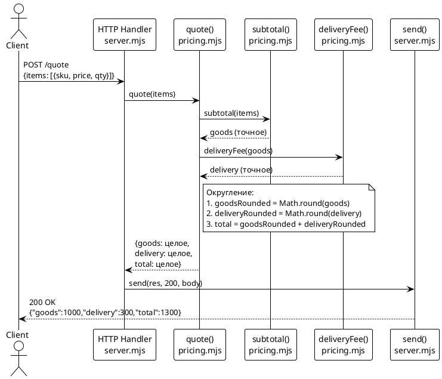

# Системные требования: Округление итогов в ответе /quote до целых рублей

**Зона воздействия:** `src/pricing.mjs`, `src/server.mjs`, `tests/pricing.test.mjs`

---

## 1. Введение

### 1.1 Метаданные

| Поле | Значение |
|------|----------|
| **Проект** | poh-demo-checkout |
| **Задача** | FNR-1: Округление итогов в ответе /quote |
| **Родительский Issue** | [#10](https://github.com/po-helper-org/poh-demo-checkout/issues/10) |
| **Дата создания** | 2026-08-18 |
| **Версия** | 1.0 |
| **Статус** | Утверждено (concept.md, вердикт дебатов) |
| **Автор требования** | Системный аналитик |

### 1.2 Термины и определения

| Термин | Определение |
|--------|-------------|
| **Domain-слой** | Модуль `src/pricing.mjs`, содержащий чистые функции арифметики расчёта |
| **Boundary** | HTTP-обработчик в `src/server.mjs`, разделяющий запрос/ответ от domain-логики |
| **Округление** | Арифметическая операция `Math.round()`, приводящая дробное значение к целому |
| **API-контракт** | Структура ответа эндпоинта `/quote`: `{goods, delivery, total}` |
| **Согласованность** | Свойство `total === goods + delivery` после округления |

### 1.3 Связанные документы

| Артефакт | Путь |
|----------|------|
| Постановка задачи | `sa_documentation/FNR/FNR_1/task.md` |
| Концепты решений | `sa_documentation/FNR/FNR_1/concept.md` |
| Кодовая база | `sa_documentation/repomix-output.xml` |

### 1.4 История изменений

| Версия | Дата | Изменение | Автор |
|---------|------|-----------|-------|
| 1.0 | 2026-08-18 | Первая версия системных требований | Системный аналитик |

---

## 2. Общее описание

### 2.1 As-Is: Текущее поведение

#### 2.1.1 Поток данных

```text
POST /quote (JSON)
  → server.mjs: readJson()
  → server.mjs: quote(body?.items)
  → pricing.mjs: quote(items)
    → pricing.mjs: subtotal(items) → goods
    → pricing.mjs: deliveryFee(goods) → delivery
    → pricing.mjs: return {goods, delivery, total}
  → server.mjs: send(res, 200, result)
  → JSON.stringify(result)
  → HTTP-ответ
```

#### 2.1.2 Ключевые компоненты

| Компонент | Файл:строки | Ответственность |
|-----------|--------------|-----------------|
| `quote()` | `src/pricing.mjs:639-643` | Главный оркестратор: сумма товаров, доставка, итог |
| `subtotal()` | `src/pricing.mjs:612-625` | Сумма позиций с валидацией цены и количества |
| `deliveryFee()` | `src/pricing.mjs:631-633` | Стоимость доставки по порогу `FREE_DELIVERY_FROM` |
| HTTP-обработчик | `src/server.mjs:675-688` | Разбор JSON, вызов `quote()`, сериализация |
| `send()` | `src/server.mjs:656-663` | JSON-сериализация и HTTP-ответ |

#### 2.1.3 Ограничения текущего решения

**Код-доказательства:**

1. **Отсутствие округления в `quote()`** (`src/pricing.mjs:639-643`):
   ```javascript
   export function quote(items) {
     const goods = subtotal(items);
     const delivery = deliveryFee(goods);
     return { goods, delivery, total: goods + delivery };
   }
   ```
   Функция возвращает точные значения без нормализации.

2. **Прямая передача в API** (`src/server.mjs:685`):
   ```javascript
   return send(res, 200, quote(body?.items));
   ```
   HTTP-обработчик не модифицирует результат `quote()`.

3. **Отсутствие округления в сериализации** (`src/server.mjs:656-663`):
   Функция `send()` использует стандартный `JSON.stringify()` без форматирования чисел.

**Следствие:** При дробных ценах (например, `price: 333.33, qty: 3`) API возвращает:
```json
{"goods": 999.99, "delivery": 300, "total": 1299.99}
```

Фронтенд отображает только целые рубли → визуальное расхождение данных.

#### 2.1.4 Пограничный случай: несогласованность total

При независимом округлении компонентов:
```
goods: 1000.50 → 1001
delivery: 299.50 → 300
total: 1300.00 → 1300
```
Но `1001 + 300 = 1301 ≠ 1300`

Это математическое несоответствие будет устранено в To-Be.

---

### 2.2 Архитектурное решение

**Выбранный концепт:** #1 (округление в domain-слое) с модификациями из дебатов.

**Обоснование из вердикта дебатов:**

1. Соответствие архитектурным принципам (`CLAUDE.md:895-897`):
   > Арифметика — в `src/pricing.mjs`, чистыми функциями.

   Округление — арифметическая операция, место ей в domain-слое.

2. Автоматическое покрытие существующими тестами.
3. Централизация логики (все callers `quote()` получают округлённые значения).
4. Минимальные усилия (30 минут).

**Модификации из дебатов:**

1. `total` вычисляется из округлённых компонентов для согласованности.
2. Добавляется JSDoc документация округления.
3. Добавляются тесты для пограничных случаев (`.5`, нули, крупные суммы).

**Отклонённые альтернативы:**

- **Концепт #2 (API-граница):** Отклонён из-за необходимости HTTP-тестов и отсутствия автоматического покрытия.
- **Концепт #3 (Сериализация):** Отклонён из-за неявного поведения и риска случайного округления других полей.
- **Концепт #4 (Не трогать):** Отклонён как не решающий исходную проблему.
- **Концепт #5 (Две функции):** Отклонён из-за YAGNI (нет текущих требований для точных значений).

---

### 2.3 Диаграмма компонентов (To-Be)

```plantuml
@startuml
!theme plain
skinparam componentStyle rectangle

package "HTTP Layer" {
  [HTTP Handler\nsrc/server.mjs:675-688] as HTTP
  [send()\nsrc/server.mjs:656-663] as Send
}

package "Domain Layer" {
  [quote()\nsrc/pricing.mjs:639-643] as Quote
  [subtotal()\nsrc/pricing.mjs:612-625] as Subtotal
  [deliveryFee()\nsrc/pricing.mjs:631-633] as Delivery
}

package "Tests" {
  [pricing.test.mjs] as Tests
}

database "Client" as Client

HTTP ..> Quote : вызывает
Quote ..> Subtotal : вычисляет goods
Quote ..> Delivery : вычисляет delivery
Quote --> Quote : Math.round()\nнормализация
HTTP ..> Send : сериализация
Send --> Client : JSON ответ\n(целые значения)
Tests ..> Quote : проверяет

note right of Quote
  Округление:
  - goodsRounded = Math.round(goods)
  - deliveryRounded = Math.round(delivery)
  - total = goodsRounded + deliveryRounded
end note

@enduml
```

---

### 2.4 Схема последовательности (To-Be)



---

## 3. План миграции

### 3.1 Этапы внедрения

```plantuml
@startuml
!theme plain

start

:Этап 1: Изменение domain-слоя;
note right
  src/pricing.mjs:639-643
  - Добавить Math.round()
  - Вычислить total из округлённых
  - Добавить JSDoc
end note

if烟Изменения прошли?} then (Нет)
:Откат;
stop
else (Да)
partition "Этап 2: Обновление тестов" {
  :Добавить тесты для дробных значений;
  :Добавить тест для .5;
  :Добавить тест согласованности;
}
endif

if烟Тесты прошли?} then (Нет)
:Откат изменений в domain-слое;
stop
else (Да)
  :Этап 3: Проверка прогона CI;
  note right
    node --test "tests/*.test.mjs"
  end note

  if烟CI прошёл?} then (Нет)
  :Откат изменений в domain-слое;
  stop
  else (Да)
    :Этап 4: Проверка API вручную;
    note right
      curl localhost:8080/quote
    end note

    if烟API возвращает целые?} then (Нет)
    :Откат изменений;
    stop
    else (Да)
      :Готово к коммиту;
      stop
    endif
  endif
endif

@enduml
```

### 3.2 Таблица этапов с откатами

| Этап | Действие | Критерий успеха | Способ отката |
|------|----------|-----------------|---------------|
| 1 | Изменить `quote()` в `src/pricing.mjs` | Код компилируется | `git checkout src/pricing.mjs` |
| 2 | Добавить тесты в `tests/pricing.test.mjs` | Все тесты проходят | `git checkout tests/pricing.test.mjs` |
| 3 | Прогон CI: `node --test "tests/*.test.mjs"` | 0 exit code | `git checkout .` |
| 4 | Ручная проверка API: curl `/quote` | Ответ содержит целые значения | Возврат к этапу 1 |

### 3.3 Критерии готовности

1. **Функциональность:** API `/quote` возвращает только целые значения во всех полях.
2. **Согласованность:** Для любого набора товаров `total === goods + delivery`.
3. **Покрытие тестами:** Существующие тесты проходят, новые тесты покрывают пограничные случаи.
4. **Документация:** JSDoc на `quote()` описывает поведение округления.

---

## 4. Функциональные требования — Backend / БД / API

> **Примечание:** Раздел 5 (Frontend/UI) не применим — задача не требует изменений клиентского кода.

---

### 4.1 FR-1: Реализовать округление в функции quote()

**Метаданные**

| Поле | Значение |
|------|----------|
| Ответственный за тех. реализацию | Backend-разработчик |
| Задача на разработку | Jira: [TODO-1] (создать при старте) |
| Оценка | 0.5 дня |
| Приоритет | P1 (критично для MVP) |

**Описание функционала**

1. Модифицировать функцию `quote()` в файле `src/pricing.mjs:639-643`:
   a. Вычислить промежуточные значения `goods` и `delivery` через существующие функции.
   b. Округлить `goods` с помощью `Math.round(goods)`.
   c. Округлить `delivery` с помощью `Math.round(delivery)`.
   d. Вычислить `total` как сумму округлённых компонентов.
   e. Вернуть объект с округлёнными значениями.

2. Добавить JSDoc документацию к функции `quote()`:
   a. Описать, что функция возвращает округлённые значения.
   b. Указать правило округления (арифметическое, `.5` округляется вверх).
   c. Документировать свойство согласованности `total === goods + delivery`.

**Обоснование**

- Округление — арифметическая операция, место её в domain-слое согласно `CLAUDE.md:895-897`.
- Централизация логики: все callers `quote()` получают округлённые значения.
- Автоматическое покрытие существующими тестами.
- Вычисление `total` из округлённых компонентов гарантирует согласованность (решение проблемы из task.md:150-161).

**Затрагиваемые компоненты**

| Компонент | Тип изменения | Файл:строки |
|-----------|---------------|--------------|
| `quote()` | Модификация логики | `src/pricing.mjs:639-643` |
| `subtotal()` | Без изменений | `src/pricing.mjs:612-625` |
| `deliveryFee()` | Без изменений | `src/pricing.mjs:631-633` |
| HTTP-обработчик | Без изменений | `src/server.mjs:675-688` |

**Критерии приёмки**

1. При вызове `quote([{sku: 'a', price: 333.33, qty: 3}])` возвращается:
   ```javascript
   {goods: 999, delivery: 300, total: 1299}
   ```

2. При вызове `quote([{sku: 'a', price: 1000.50, qty: 1}])` возвращается:
   ```javascript
   {goods: 1001, delivery: 300, total: 1301}
   ```
   (проверка округления `.5` вверх и согласованности)

3. Существующие тесты в `tests/pricing.test.mjs` продолжают проходить.

4. JSDoc документация присутствует на функции `quote()`.

**Зависимости**

- FR-2 (тесты) — для проверки корректности, но может реализовываться параллельно.

**Нефункциональные требования**

- Производительность: Округление не должно увеличивать время выполнения более чем на 1%.
- Совместимость: Сигнатура функции `quote()` не меняется (вход/выход те же типы).

---

### 4.2 FR-2: Добавить тесты для округления

**Метаданные**

| Поле | Значение |
|------|----------|
| Ответственный за тех. реализацию | Backend-разработчик |
| Задача на разработку | Jira: [TODO-2] (создать при старте) |
| Оценка | 0.5 дня |
| Приоритет | P1 (критично для MVP) |

**Описание функционала**

1. Добавить тест «округление дробных значений» в `tests/pricing.test.mjs`:
   a. Проверить, что `quote()` с дробной ценой возвращает целые значения.
   b. Проверить все три поля: `goods`, `delivery`, `total`.

2. Добавить тест «округление .5 вверх»:
   a. Проверить случай `goods = 1000.50` → `1001`.
   b. Проверить согласованность `total === goods + delivery`.

3. Добавить тест «нулевые значения после округления»:
   a. Проверить, что `0.4` округляется до `0`.
   b. Проверить, что `total` корректен при нулевых компонентах.

**Обоснование**

- Существующие тесты (`tests/pricing.test.mjs:741-755`) используют только целые значения.
- Пограничные случаи (`.5`, нули, крупные суммы) требуют явной проверки.
- Автоматическое покрытие гарантирует, что округление не сломается в будущем.

**Затрагиваемые компоненты**

| Компонент | Тип изменения | Файл:строки |
|-----------|---------------|--------------|
| `pricing.test.mjs` | Добавление тестов | `tests/pricing.test.mjs` (конец файла) |

**Критерии приёмки**

1. Тест «округление дробных значений» проверяет:
   ```javascript
   assert.deepEqual(quote([{ sku: 'a', price: 333.33, qty: 3 }]), {
     goods: 999, delivery: 300, total: 1299
   });
   ```

2. Тест «округление .5 вверх» проверяет:
   ```javascript
   assert.deepEqual(quote([{ sku: 'a', price: 1000.50, qty: 1 }]), {
     goods: 1001, delivery: 300, total: 1301
   });
   ```

3. Тест «нулевые значения» проверяет случай, когда округление даёт `0`.

4. Все тесты (старые и новые) проходят при `node --test "tests/*.test.mjs"`.

**Зависимости**

- FR-1 (округление в `quote()`) — тесты проверяют эту логику.
- Может разрабатываться параллельно с FR-1 для TDD-подхода.

**Нефункциональные требования**

- Время выполнения тестов: не более 100мс дополнительно.

---

## 5. Требования к интерфейсам — Frontend / UI

**Не применимо** — задача не требует изменений клиентского кода. Округление выполняется на сервере, фронтенд получит уже целые значения.

---

## 6. Ревью требований

| Роль | Имя | Статус | Комментарии |
|------|-----|--------|-------------|
| Аналитик | Системный аналитик | ✅ Готово | — |
| Разработчик Backend | [Назначить] | ⏳ На рассмотрении | — |
| Разработчик Frontend | N/A | — | Без изменений |
| Тестирование | [Назначить] | ⏳ На рассмотрении | — |

---

## 7. Риски и ограничения

### 7.1 Таблица рисков

| ID | Риск | Вероятность | Влияние | Митигация |
|----|------|-------------|---------|-----------|
| R1 | Округление `.5` вверх нежелательно для бизнеса | Низкая | Средняя | Конкретное правило зафиксировано в requirements; при изменении — доработка (1 час) |
| R2 | Потребность в точных значениях для аналитики | Низкая | Средняя | YAGNI: если потребуется — создать `quoteExact()` (SubIssue) |
| R3 | Несогласованность `total` после округления | Средняя | Высокая | Устранено: вычислять `total` из округлённых компонентов |
| R4 | Существующие клиенты API зависят от точных значений | Низкая | Высокая | Нет текущих клиентов (демо-стенд); в проде — версионирование API |
| R5 | Тесты маскируют проблему в HTTP-слое | Низкая | Средняя | Ручная проверка API (этап 4 миграции) |

### 7.2 Ограничения

1. **Округление только для `/quote`:** Другие эндпоинты (если появятся) не затрагиваются.
2. **Правило округления фиксировано:** `Math.round()` (арифметическое, `.5` вверх).
3. **Без версионирования API:** Изменение обратно несовместимо для клиентов, ожидающих дробные значения.
4. **Точность теряется:** Внутренние вычисления не доступны для caller'ов `quote()`.

---

## 8. Приложения

### 8.1 Код-доказательства (As-Is)

**Текущая реализация `quote()`:**

```javascript
// src/pricing.mjs:639-643
export function quote(items) {
  const goods = subtotal(items);
  const delivery = deliveryFee(goods);
  return { goods, delivery, total: goods + delivery };
}
```

**Проблема:** отсутствует этап округления.

### 8.2 Целевая реализация (To-Be)

```javascript
// src/pricing.mjs:639-650 (целевая версия)
/**
 * Итог заказа с округлением до целых рублей.
 * Округление арифметическое (.5 вверх), гарантирует согласованность:
 * rounded(goods) + rounded(delivery) === total
 * @param {Item[]} items
 * @returns {{goods: number, delivery: number, total: number}}
 */
export function quote(items) {
  const goods = subtotal(items);
  const delivery = deliveryFee(goods);
  const goodsRounded = Math.round(goods);
  const deliveryRounded = Math.round(delivery);
  return {
    goods: goodsRounded,
    delivery: deliveryRounded,
    total: goodsRounded + deliveryRounded
  };
}
```

### 8.3 Тестовые примеры

```javascript
// tests/pricing.test.mjs (новые тесты)
test('округление дробных значений', () => {
  assert.deepEqual(quote([{ sku: 'a', price: 333.33, qty: 3 }]), {
    goods: 999, delivery: 300, total: 1299
  });
});

test('округление .5 вверх с согласованностью', () => {
  assert.deepEqual(quote([{ sku: 'a', price: 1000.50, qty: 1 }]), {
    goods: 1001, delivery: 300, total: 1301
  });
});
```

### 8.4 Проверка вручную

```bash
# Запуск сервера
npm start

# Проверка API
curl -sX POST localhost:8080/quote \
  -H 'content-type: application/json' \
  -d '{"items":[{"sku":"a","price":333.33,"qty":3}]}'
# Ожидаемый ответ: {"goods":999,"delivery":300,"total":1299}
```

---

*Документ сформирован: 2026-08-18*
*Следующий шаг: `/validate-doc sa_documentation/FNR/FNR_1/system_requirements.md`*
