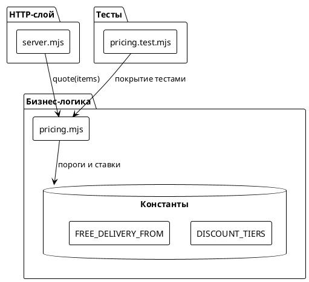
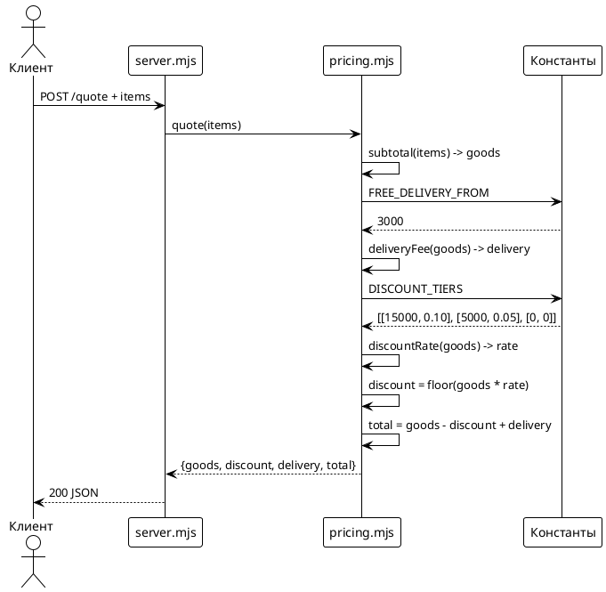

# Системные требования: Пороговая скидка за объём заказа

## 1. Введение

### 1.1 Общая информация

| Поле | Значение |
|------|----------|
| **Название документа** | Системные требования: Пороговая скидка за объём заказа |
| **Версия** | 1.0 |
| **Статус** | Черновик |
| **Дата создания** | 2025-08-19 |
| **Автор** | System Analyst |
| **Связанные Issue** | #13 |
| **Предыдущая версия** | — |

### 1.2 Термины и определения

| Термин | Определение |
|--------|-------------|
| **goods** | Сумма позиций заказа без учёта доставки и скидки (рубли) |
| **discount** | Сумма скидки в рублях, рассчитываемая от `goods` |
| **delivery** | Стоимость доставки, рассчитываемая от `goods` (не от `goods - discount`) |
| **total** | Итоговая сумма к оплате: `goods - discount + delivery` |
| **порог скидки** | Минимальная сумма `goods`, при которой применяется скидка |
| **ставка скидки** | Процент скидки, применяемый к сумме `goods` |

### 1.3 Ссылки

- [Концепт решения](concept.md)
- [Постановка задачи](task.md)
- [Issue #13](https://github.com/po-helper-org/poh-demo-checkout/issues/13)

### 1.4 История изменений

| Версия | Дата | Автор | Изменение |
|--------|------|-------|-----------|
| 1.0 | 2025-08-19 | System Analyst | Создание документа на основе утверждённого концепта |

---

## 2. Общее описание

### 2.1 Текущее состояние (As-Is)

**Код-доказательства из текущей реализации:**

Файл `src/pricing.mjs` (строки 1-53):
```javascript
export const DELIVERY_FEE = 300;
export const FREE_DELIVERY_FROM = 3000;

export function subtotal(items) {
  // Сумма позиций без доставки
  // Валидация: проверяет массив, цену, количество
  return items.reduce((sum, item) => sum + item.price * item.qty, 0);
}

export function deliveryFee(amount) {
  return amount >= FREE_DELIVERY_FROM ? 0 : DELIVERY_FEE;
}

export function quote(items) {
  const goods = subtotal(items);
  const delivery = deliveryFee(goods);
  return { goods, delivery, total: goods + delivery };
}
```

Файл `src/server.mjs` (строки 662-717):
```javascript
export const app = async (req, res) => {
  if (req.url === '/quote' && req.method === 'POST') {
    return send(res, 200, quote(body?.items));
  }
};
```

**Текущий ответ API:**
```json
{"goods":5000,"delivery":0,"total":5000}
```

**Ключевые компоненты:**
- `src/pricing.mjs` — чистые функции расчёта стоимости
- `src/server.mjs` — HTTP-обёртка, разбор запроса
- `tests/pricing.test.mjs` — покрытие расчётов тестами

**Ограничения текущего решения:**
- Нет поля `discount` в ответе API
- Нет логики расчёта скидки по порогам объёма заказа
- Скидка не учитывается в поле `total`

### 2.2 Архитектурное решение

[Ссылка на утверждённый концепт](concept.md)

**Выбранный концепт:** Концепт 1 (Правильное) — Чистая функция `discountRate()` + расширение `quote()`

**Модификации из концепта 4:**
- Пороги скидки вынесены в массив `DISCOUNT_TIERS` для удобства редактирования
- Сохранена простая логика поиска (прямой перебор вместо `find()`)

**Обоснование:**
- Следует архитектуре проекта (арифметика в `pricing.mjs`, чистые функции)
- Тестируемость (логика скидки покрывается теми же тестами)
- Расширяемость (массив порогов легко редактируется)
- Без новых зависимостей
- Корректная проверка порога доставки (`deliveryFee(goods)` до расчёта скидки)

### 2.3 Диаграмма компонентов



### 2.4 Схема последовательности



---

## 3. План миграции

### 3.1 Этапы внедрения

```plantuml
@startuml
!theme plain
start

:Этап 1\nПодготовка;
:Добавить DISCOUNT_TIERS\nв pricing.mjs;
:Реализовать discountRate();
if (тесты на границы\nпроходят?) then (да)
  :Этап 2\nИнтеграция;
  :Модифицировать quote();
  if (все тесты\nпроходят?) then (да)
    :Этап 3\nВнедрение;
    :Запуск в прод;
    stop
  else (нет)
    :исправление ошибок;
    repeat
  endif
else (нет)
  :доработка discountRate;
  repeat
endif

@enduml
```

### 3.2 Таблица этапов

| Этап | Описание | Критерий готовности | План отката |
|------|----------|---------------------|-------------|
| 1 | Подготовка: добавить константы и функцию `discountRate()` | Тесты на границы (0, 5000, 15000) проходят | Откат изменений в `pricing.mjs` |
| 2 | Интеграция: модифицировать `quote()` для включения скидки | Все существующие тесты + новые тесты проходят | Откат изменений в `quote()` |
| 3 | Внедрение: деплой в прод | Мониторинг без ошибок, `POST /quote` возвращает `discount` | Откат на предыдущую версию коммита |

---

## 4. Функциональные требования — Backend / БД / API

### 4.1 Задача 4.1.1: Добавление констант скидки и функции расчёта ставки

| Поле | Значение |
|------|----------|
| **Ответственный за тех. реализацию** | Backend Developer |
| **Задача на разработку** | [Jira-ссылка] [Статус: К выполнению] |

**Описание:**
Добавить в `src/pricing.mjs` массив порогов скидки `DISCOUNT_TIERS` и чистую функцию `discountRate(amount)`, которая возвращает ставку скидки (0, 0.05 или 0.10) в зависимости от суммы заказа.

**Обоснование:**
Следует выбранному концепту: вынести пороги в массив для расширяемости, сохранить простую логику поиска. Чистая функция гарантирует тестируемость без сети.

**Затрагиваемые компоненты:**
- `src/pricing.mjs` — добавить `DISCOUNT_TIERS` после строки 10, добавить `discountRate()` после `deliveryFee()`

**Критерии приёмки:**
1. `DISCOUNT_TIERS` объявлен как `export const` с тремя парами: `[15000, 0.10]`, `[5000, 0.05]`, `[0, 0]`
2. `discountRate(amount)` — чистая функция, возвращает число (ставка скидки)
3. Функция использует `Math.floor()` для округления скидки вниз
4. Покрыта тестами на все границы: 0, 4999, 5000, 14999, 15000

**Зависимости:**
— (нет)

**Нефункциональные требования:**
- NFR-1: Функция должна быть O(1) по времени (прямой перебор 3 элементов)
- NFR-2: Не должно быть новых зависимостей в `package.json`

---

### 4.2 Задача 4.2.1: Модификация функции `quote()` для включения скидки

| Поле | Значение |
|------|----------|
| **Ответственный за тех. реализацию** | Backend Developer |
| **Задача на разработку** | [Jira-ссылка] [Статус: К выполнению] |

**Описание:**
Изменить функцию `quote(items)` в `src/pricing.mjs` для расчёта и включения поля `discount` в ответ. Формула: `total = goods - discount + delivery`. Критически: `deliveryFee(goods)` вызывается **до** расчёта скидки.

**Обоснование:**
Реализует бизнес-логику скидки с учётом критического ограничения: порог бесплатной доставки проверяется по `goods`, а не по `goods - discount`. Сохраняет порядок вызова `deliveryFee()` первым.

**Затрагиваемые компоненты:**
- `src/pricing.mjs` — модифицировать `quote()` (строки 48-52)

**Критерии приёмки:**
1. `quote()` возвращает объект `{goods, discount, delivery, total}`
2. `discount = Math.floor(goods * discountRate(goods))`
3. `total = goods - discount + delivery`
4. `deliveryFee(goods)` вызывается до расчёта скидки
5. Покрыт тестом на edge-кейс: `goods=3000, discount=300` → доставка = 0

**Зависимости:**
- Зависимость от задачи 4.1.1 (требует `DISCOUNT_TIERS` и `discountRate()`)

**Нефункциональные требования:**
- NFR-1: Функция остаётся чистой (без побочных эффектов)
- NFR-2: Обратная совместимость по числу позиций (добавляется поле, не удаляется)

---

### 4.3 Задача 4.3.1: Покрытие новой логики тестами

| Поле | Значение |
|------|----------|
| **Ответственный за тех. реализацию** | Backend Developer / QA |
| **Задача на разработку** | [Jira-ссылка] [Статус: К выполнению] |

**Описание:**
Добавить в `tests/pricing.test.mjs` тесты на границы порогов скидки и edge-кейсы. Обеспечить покрытие всех сценариев из HowToDemo.

**Обоснование:**
Расчёт — единственное, что может сломаться молча в этом репозитории. Новая логика скидки требует проверки на граничных значениях и edge-кейс с доставкой.

**Затрагиваемые компоненты:**
- `tests/pricing.test.mjs` — добавить тесты после строки 53

**Критерии приёмки:**
1. Тест на границу 0₽ → скидка 0₽
2. Тест на границу 4999₽ → скидка 0₽
3. Тест на границу 5000₽ → скидка 250₽ (5%)
4. Тест на границу 14999₽ → скидка 749₽ (5%)
5. Тест на границу 15000₽ → скидка 1500₽ (10%)
6. Тест на edge-кейс: `goods=3000, discount=300` → доставка = 0 (не 300₽)
7. Команда `node --test "tests/*.test.mjs"` проходит без ошибок

**Зависимости:**
- Зависимость от задачи 4.1.1 (требует `discountRate()`)
- Зависимость от задачи 4.2.1 (требует модифицированный `quote()`)

---

## 5. Требования к интерфейсам

> **Раздел 5 не применим.** Документ содержит только backend-изменения (логика расчёта скидки в `pricing.mjs`). HTTP-слой (`server.mjs`) не модифицируется, UI-изменения не требуются.

---

## 6. Ревью требований

| Роль | Имя | Статус |
|------|-----|--------|
| Аналитик | System Analyst | ☑ Согласовано |
| Разработчик Backend | — | ☐ На согласовании |
| Разработчик Frontend | — | ☐ На согласовании (неприменимо) |
| Тестирование | — | ☐ На согласовании |

---

## 7. Риски и ограничения

### 7.1 Риски

| ID | Риск | Вероятность | Влияние | Митигация |
|----|------|-------------|---------|-----------|
| R1 | Скидка отнимает бесплатную доставку | Низкая | Среднее | Явная проверка: `deliveryFee(goods)` вызывается до расчёта скидки (задача 4.2.1, критерий 4) |
| R2 | Ошибка в формуле расчёта `total` | Низкая | Высокое | Тесты на все границы порогов (задача 4.3.1, критерии 1-5) |
| R3 | Breaking change для клиентов API | Низкая | Низкое | Добавление поля в JSON обратно совместимо; демо-стенд не имеет внешних клиентов с жёсткими контрактами |
| R4 | Непокрытый код логики скидки | Средняя | Высокое | Логика в `pricing.mjs` (чистые функции), а не в `server.mjs` — покрывается тестами (задача 4.3.1) |
| R5 | Ошибка округления на границах | Низкая | Среднее | Явные тесты на граничные значения (4999, 5000, 14999, 15000) |

### 7.2 Ограничения

1. **Порог доставки проверяется по `goods`, а не по `goods - discount`** — критическое ограничение из Issue #13, отражает бизнес-логику: доставка бесплатна при сумме позиций от 3000₽, независимо от скидки.

2. **Без новых зависимостей** — сервис принципиально не использует внешние пакеты. Все изменения должны использовать стандартную библиотеку Node.js.

3. **Арифметика в `pricing.mjs`** — логика расчёта должна быть чистыми функциями для тестирования без сети. HTTP-слой (`server.mjs`) только разбирает запрос и отдаёт коды.

4. **Включительные границы порогов** — заказ ровно на 5000₽ получает 5% скидку, на 15000₽ — 10%. Это documented behavior, а не баг.

5. **Округление вниз** — `Math.floor(goods * rate)` даёт целое число рублей. Заказ на 4999.99₽ не получит скидку, хотя "почти 5000" — это особенность, а не ошибка.

---

## 8. Приложения

### 8.1 SQL-скрипты

> Не применимо — система не использует базу данных.

### 8.2 Маппинги порогов скидки

| Сумма позиций (`goods`) | Ставка | Скидка (пример) |
|-------------------------|--------|-----------------|
| 0 – 4999.99 | 0% | 0₽ |
| 5000 – 14999.99 | 5% | `floor(goods * 0.05)` |
| от 15000 | 10% | `floor(goods * 0.10)` |

### 8.3 Шпаргалки

**Формула расчёта:**
```javascript
const goods = subtotal(items);
const delivery = deliveryFee(goods);           // По goods, НЕ по goods - discount!
const discount = Math.floor(goods * discountRate(goods));
const total = goods - discount + delivery;
```

**Критический edge-кейс:**
- `goods = 3000`, `discount = 300`
- Ожидаемо: `delivery = 0` (порог достигнут по `goods`)
- НЕ ожидаемо: `delivery = 300` (неверно: порог не достигнут по `goods - discount`)

**Порядок вызова в `quote()`:**
1. `subtotal(items)` → `goods`
2. `deliveryFee(goods)` → `delivery` (до скидки!)
3. `discountRate(goods)` → `rate`
4. `Math.floor(goods * rate)` → `discount`
5. `goods - discount + delivery` → `total`
