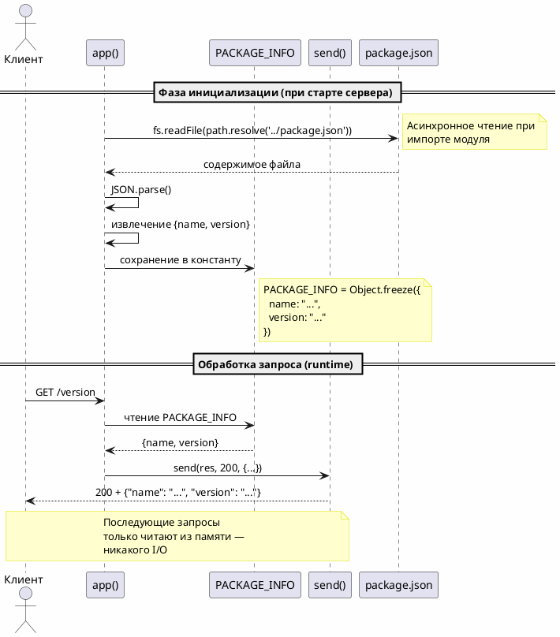
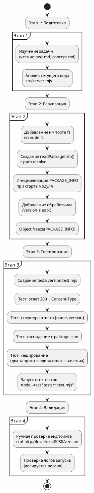

# FNR-1: Системные требования
# Эндпоинт GET /version с версией из package.json

---

## 1. Введение

### 1.1 Общая информация

| Поле | Значение |
|------|----------|
| **Название требования** | Эндпоинт GET /version с версией из package.json |
| **ID документа** | FNR-1-SR |
| **Версия** | 1.0 |
| **Статус** | Черновик |
| **Дата создания** | 2026-08-24 |
| **Автор** | System Analyst |
| **Ответственный за реализацию** | Backend Developer |
| **Связанные документы** | [FNR-1 Task](sa_documentation/FNR/FNR_1/task.md), [FNR-1 Concept](sa_documentation/FNR/FNR_1/concept.md) |
| **Источник требования** | po-helper-org/poh-demo-checkout#105 |

### 1.2 Термины и определения

| Термин | Определение |
|--------|-------------|
| **Эндпоинт /version** | HTTP-эндпоинт GET-метода, возвращающий информацию о версии сервиса |
| **package.json** | Файл манифеста Node.js-проекта, содержащий метаданные (name, version) |
| **Кеширование при старте** | Стратегия чтения конфигурации при инициализации модуля с сохранением в константе |
| **Immutable** | Неизменяемый объект (зафиксирован через Object.freeze()) |

### 1.3 Ссылки на связанные документы

| Документ | Описание |
|----------|----------|
| [FNR-1 Task](sa_documentation/FNR/FNR_1/task.md) | Постановка задачи с диагнозом проблемы |
| [FNR-1 Concept](sa_documentation/FNR/FNR_1/concept.md) | Концепты решений и вердикт дебатов |
| [CLAUDE.md](CLAUDE.md) | Гайд для Claude Code в репозитории |
| [src/server.mjs](src/server.mjs) | Исходный код HTTP-сервера |

### 1.4 История изменений

| Версия | Дата | Автор | Описание изменений |
|--------|------|-------|-------------------|
| 1.0 | 2026-08-24 | System Analyst | Первая версия системных требований |

---

## 2. Общее описание

### 2.1 Текущее состояние (As-Is)

#### 2.1.1 Описание текущего поведения

При разборе инцидентов на продакшене определение текущей версии сервиса требует чтения логов выкатки вручную. Это медленный процесс, зависящий от человеческого фактора.

#### 2.1.2 Ключевые компоненты текущего решения

**Компонент: `src/server.mjs`**

Файл реализует HTTP-сервер с тремя эндпоинтами:

```javascript
// Строки 27-61 в src/server.mjs
export const app = async (req, res) => {
  if (req.url === '/healthz') return send(res, 200, { ok: true });

  if (req.url === '/stats' && req.method === 'GET') {
    return send(res, 200, counters.getStats());
  }

  if (req.url === '/quote' && req.method === 'POST') {
    // ... обработка расчёта стоимости
  }

  return send(res, 404, { error: 'не найдено' });
};
```

**Функция `send()`** (строки 11-18) — универсальный обработчик ответов:
```javascript
function send(res, code, body) {
  const payload = JSON.stringify(body);
  res.writeHead(code, {
    'content-type': 'application/json; charset=utf-8',
    'content-length': Buffer.byteLength(payload),
  });
  res.end(payload);
}
```

**Источник данных о версии** — `package.json`:
```json
{
  "name": "poh-demo-checkout",
  "version": "0.1.0"
}
```

#### 2.1.3 Ограничения текущего решения

| Ограничение | Описание |
|-------------|----------|
| Отсутствие HTTP-эндпоинта | Нет способа получить версию через HTTP |
| Ручной процесс | Требует чтения логов выкатки человеком |
| Задержка при инцидентах | Версия определяется не мгновенно |

### 2.2 Архитектурное решение

**Выбранный концепт:** №1 — Кеширование при старте (с модификациями из дебатов)

**Обоснование выбора:**
1. **Архитектурная чистота** — чтение конфигурации при инициализации, обработка запросов без I/O
2. **Производительность** — O(1) операция возврата из памяти, готовность к высокочастотному polling
3. **Надёжность** — ошибка чтения детектируется при старте (фатально), а не в runtime
4. **Масштабируемость** — не потребует переписывания при росте нагрузки

**Модификации из дебатов:**
| № | Модификация | Причина |
|---|-------------|---------|
| 1 | try-catch при чтении на старте с exit(1) | Логирование ошибки и недопускание старта с битой конфигурацией |
| 2 | Логирование загруженных name/version | Audit trail для debugging |
| 3 | Тест проверяет кеширование | Два запроса должны вернуть одинаковые значения |
| 4 | PACKAGE_INFO immutable | Object.freeze() для защиты от мутаций |

### 2.3 Диаграмма компонентов

```plantuml
@startuml
!define RECTANGLE class

skinparam componentStyle rectangle
skinparam backgroundColor #FEFEFE

package "Сервис расчёта стоимости" {
  [HTTP Server\nsrc/server.mjs] as Server {
    [app() function] as App
    [send() helper] as Send
    [PACKAGE_INFO\n(кешированные данные)] as Cache
  }

  [package.json\n(источник данных)] as Package

  [Metrics Module\nsrc/metrics.mjs] as Metrics {
    [counters] as Counters
  }

  [Pricing Module\nsrc/pricing.mjs] as Pricing
}

package "Тесты" {
  [server.test.mjs\nсуществующие тесты] as Test1
  [version.test.mjs\nновые тесты] as Test2
}

package "Внешний мир" {
  [Клиент\nмониторинг/devops] as Client
}

' Взаимодействия
Client --> App : HTTP GET /version
App --> Cache : чтение из памяти
Cache --> Send : возврат данных
Send --> Client : 200 + JSON

Package ..> App : читается при старте
App --> Cache : инициализация

App --> Counters : существующий вызов
App --> Pricing : существующий вызов

Test2 --> App : проверка эндпоинта
Test1 --> App : существующие тесты

note right of Cache
  Кешируется при старте:
  - name: "poh-demo-checkout"
  - version: "0.1.0"
  Зафиксирован Object.freeze()
end note

@enduml
```

### 2.4 Схема последовательности



---

## 3. План миграции

### 3.1 Этапы внедрения



### 3.2 Таблица этапов с откаты

| Этап | Описание | Откат | Критерий готовности |
|------|----------|--------|---------------------|
| 1 | Подготовка и анализ кода | N/A | Понимание точки внедрения, выбран концепт |
| 2 | Реализация в `src/server.mjs` | `git checkout src/server.mjs` | Код компилируется, сервер стартует |
| 3 | Создание тестов `tests/version.test.mjs` | Удалить файл тестов | Все тесты проходят |
| 4 | Валидация и ручное тестирование | N/A | curl возвращает корректный JSON |

### 3.3 Критерии готовности

| Критерий | Проверка |
|----------|----------|
| Сервер стартует без ошибок | `npm start` запускается успешно |
| Логируется версия при старте | В консоли видны загруженные name/version |
| Эндпоинт отвечает 200 | `curl -i http://localhost:8080/version` возвращает statusCode 200 |
| Content-Type корректный | Заголовок содержит `application/json` |
| Ответ соответствует package.json | Значения совпадают с package.json |
| Кеширование работает | Два последовательных запроса возвращают одинаковые значения |
| Все тесты проходят | `node --test "tests/*.test.mjs"` — 0 ошибок |

---

## 4. Функциональные требования — Backend / БД / API

### 4.1 Задача 1: Инициализация кешированных данных версии

| Метаданные | Значение |
|------------|----------|
| **ID** | FNR-1-BACKEND-001 |
| **Название** | Инициализация PACKAGE_INFO при старте модуля |
| **Ответственный за тех. реализацию** | Backend Developer |
| **Задача на разработку** | DEV-XXX |
| **Статус Jira** | Новая |

#### 4.1.1 Описание

Добавить в модуль `src/server.mjs` код для чтения `package.json` при старте и кеширования значений `name` и `version` в неизменяемой константе `PACKAGE_INFO`.

#### 4.1.2 Обоснование

Чтение конфигурации при инициализации модуля обеспечивает:
- Мгновенный ответ на запросы (O(1) из памяти)
- Детектирование ошибок конфигурации при старте (фатально)
- Архитектурную чистоту (разделение init-фазы и обработки запросов)

#### 4.1.3 Затрагиваемые компоненты

- `src/server.mjs` — добавление импорта и инициализации

#### 4.1.4 Детали реализации

**Импорты:**
```javascript
import { readFile } from 'node:fs';
import { resolve } from 'node:path';
```

**Функция чтения:**
```javascript
async function readPackageInfo() {
  const pkgPath = resolve(import.meta.dir, '../package.json');
  try {
    const content = await readFile(pkgPath, 'utf-8');
    const pkg = JSON.parse(content);
    const { name, version } = pkg;

    // Логирование для audit trail
    console.log(`Версия сервиса: ${name}@${version}`);

    return { name, version };
  } catch (err) {
    console.error('Ошибка чтения package.json:', err.message);
    process.exit(1);
  }
}
```

**Инициализация константы (на верхнем уровне модуля):**
```javascript
const PACKAGE_INFO = await readPackageInfo();
Object.freeze(PACKAGE_INFO);
```

#### 4.1.5 Критерии приёмки

1. При старте сервера в консоли логируется версия: `Версия сервиса: poh-demo-checkout@0.1.0`
2. Если `package.json` не читается — сервер завершается с кодом 1
3. `PACKAGE_INFO` является frozen-объектом (Object.isFrozen() === true)

#### 4.1.6 Зависимости

Нет.

---

### 4.2 Задача 2: Реализация эндпоинта GET /version

| Метаданные | Значение |
|------------|----------|
| **ID** | FNR-1-BACKEND-002 |
| **Название** | Добавление обработчика GET /version |
| **Ответственный за тех. реализацию** | Backend Developer |
| **Задача на разработку** | DEV-XXX |
| **Статус Jira** | Новая |

#### 4.2.1 Описание

Добавить в функцию `app()` обработчик для пути `/version` и метода `GET`, возвращающий кешированные данные из `PACKAGE_INFO`.

#### 4.2.2 Обоснование

Эндпоинт требуется для мониторинга и DevOps-операций для быстрого определения версии сервиса без чтения логов.

#### 4.2.3 Затрагиваемые компоненты

- `src/server.mjs` — добавление обработчика в `app()`

#### 4.2.4 Детали реализации

**Обработчик в `app()` (вставить после `/healthz`):**
```javascript
export const app = async (req, res) => {
  if (req.url === '/healthz') return send(res, 200, { ok: true });

  // Новый обработчик
  if (req.url === '/version' && req.method === 'GET') {
    return send(res, 200, PACKAGE_INFO);
  }

  if (req.url === '/stats' && req.method === 'GET') {
    return send(res, 200, counters.getStats());
  }
  // ... остальной код
};
```

#### 4.2.5 API-спецификация

| Атрибут | Значение |
|---------|----------|
| **Метод** | GET |
| **Путь** | /version |
| **Описание** | Возвращает версию и имя сервиса |

**Перечень эндпоинтов:**

| Эндпоинт | Метод | Описание |
|----------|-------|----------|
| /version | GET | Получение информации о версии сервиса |

**Формат ответа (успех):**

```json
{
  "name": "poh-demo-checkout",
  "version": "0.1.0"
}
```

**Статусы ответа:**

| Код | Описание | Тело ответа |
|-----|----------|-------------|
| 200 | Успех | `{name, version}` |
| 404 | Не реализовано (теоретически) | Текущая реализация всегда 200 |

**Content-Type:** `application/json; charset=utf-8`

#### 4.2.6 Критерии приёмки

1. `GET /version` возвращает код 200
2. Заголовок `content-type` содержит `application/json`
3. Тело ответа содержит поля `name` и `version`
4. Значения совпадают с `package.json`

#### 4.2.7 Нефункциональные требования

| Параметр | Значение |
|----------|----------|
| **Время ответа** | < 1ms (операция в памяти) |
| **Нагрузка** | Поддерживает высокочастотный polling |
| **Отказоустойчивость** | При ошибке чтения при старте — сервер не стартует |

#### 4.2.8 Зависимости

- FNR-1-BACKEND-001 (инициализация PACKAGE_INFO) — должно быть выполнено первым

---

### 4.3 Задача 3: Интеграционные тесты для /version

| Метаданные | Значение |
|------------|----------|
| **ID** | FNR-1-BACKEND-003 |
| **Название** | Создание тестов для эндпоинта /version |
| **Ответственный за тех. реализацию** | Backend Developer |
| **Задача на разработку** | DEV-XXX |
| **Статус Jira** | Новая |

#### 4.3.1 Описание

Создать файл `tests/version.test.mjs` с набором тестов для проверки эндпоинта `GET /version`.

#### 4.3.2 Обоснование

Интеграционные тесты гарантируют корректность работы эндпоинта и защищают от регрессии при будущих изменениях.

#### 4.3.3 Затрагиваемые компоненты

- `tests/version.test.mjs` — новый файл

#### 4.3.4 Детали реализации

**Структура тестового файла:**

```javascript
import assert from 'node:assert/strict';
import { test } from 'node:test';
import { readFile } from 'node:fs';
import { app } from '../src/server.mjs';

// Вспомогательная функция request() — аналогично tests/server.test.mjs
async function request(url, method = 'GET', body = null) {
  const req = {
    url,
    method,
    headers: body ? { 'content-type': 'application/json' } : {},
  };

  const chunks = [];
  const res = {
    statusCode: null,
    headers: {},
    writeHead: function(code, headers) {
      this.statusCode = code;
      this.headers = headers;
    },
    write: function(chunk) { chunks.push(chunk); },
    end: function(chunk) {
      if (chunk) chunks.push(chunk);
    },
  };

  req[Symbol.asyncIterator] = async function*() {
    if (body) yield Buffer.from(JSON.stringify(body));
  };

  await app(req, res);
  const responseBody = Buffer.concat(chunks).toString('utf8');
  return {
    statusCode: res.statusCode,
    headers: res.headers,
    body: JSON.parse(responseBody),
  };
}

test('GET /version возвращает 200 и Content-Type application/json', async () => {
  const res = await request('/version', 'GET');
  assert.equal(res.statusCode, 200);
  assert.match(res.headers['content-type'], /application\/json/);
});

test('GET /version возвращает структуру с name и version', async () => {
  const res = await request('/version', 'GET');
  assert.ok(res.body.name);
  assert.ok(res.body.version);
  assert.equal(typeof res.body.name, 'string');
  assert.equal(typeof res.body.version, 'string');
});

test('GET /version возвращает значения из package.json', async () => {
  const pkg = JSON.parse(await readFile('package.json', 'utf-8'));
  const res = await request('/version', 'GET');
  assert.equal(res.body.name, pkg.name);
  assert.equal(res.body.version, pkg.version);
});

test('GET /version кеширует данные (два запроса возвращают одно и то же)', async () => {
  const res1 = await request('/version', 'GET');
  const res2 = await request('/version', 'GET');
  assert.deepEqual(res1.body, res2.body);
});
```

#### 4.3.5 Критерии приёмки

1. Все тесты проходят: `node --test "tests/version.test.mjs"`
2. Все тесты в наборе проходят: `node --test "tests/*.test.mjs"`
3. Покрытие составляет: проверка статуса, Content-Type, структуры, совпадения с package.json, кеширования

#### 4.3.6 Зависимости

- FNR-1-BACKEND-002 (реализация эндпоинта) — должно быть выполнено первым

---

## 5. Требования к интерфейсам — Frontend / UI

**Статус:** Не применимо

**Обоснование:** Задача касается только backend-изменений (HTTP-эндпоинт на сервере). Внешний интерфейс (UI) не затрагивается — изменения коснутся только API-клиентов (мониторинг, DevOps-инструменты).

---

## 6. Ревью требований

| Роль | Имя | Дата | Подпись | Комментарии |
|------|-----|------|---------|-------------|
| Системный аналитик | | | | |
| Разработчик Backend | | | | |
| Разработчик Frontend | N/A | N/A | N/A | Не применимо |
| QA / Тестирование | | | | |

---

## 7. Риски и ограничения

### 7.1 Риски

| ID | Риск | Вероятность | Влияние | Митигация |
|----|------|-------------|---------|-----------|
| R-1 | Ошибка чтения package.json при старте | Низкая | Критическое | Сервер не стартует с exit(1), логируется ошибка |
| R-2 | Изменение структуры package.json | Низкая | Среднее | Чтение только полей name/version, остальное игнорируется |
| R-3 | Высокая нагрузка на /version | Средняя | Низкое | Кеширование при старте обеспечивает O(1) |
| R-4 | Конфликт путей при импорте модуля | Очень низкая | Среднее | Использование import.meta.dir для надёжного разрешения пути |

### 7.2 Ограничения

1. **Технические ограничения:**
   - Зависимостей у сервиса нет (CLAUDE.md:16) — используется только стандартный `node:fs`
   - Node.js версии >=22 (engines в package.json)

2. **Функциональные ограничения:**
   - Возвращаются только поля `name` и `version`
   - Нет авторизации для эндпоинта
   - Нет кеша в runtime (кешируется при старте)

3. **Эксплуатационные ограничения:**
   - Изменение версии в package.json требует перезапуска сервера (ожидаемое поведение для деплоя)

---

## 8. Приложения

### 8.1 Пример использования curl

```bash
# Запрос версии
curl http://localhost:8080/version

# Ожидаемый ответ
# {"name":"poh-demo-checkout","version":"0.1.0"}
```

### 8.2 Карта маппинга данных

| Источник | Поле | Назначение | Эндпоинт |
|----------|------|------------|----------|
| package.json | name | PACKAGE_INFO.name | /version → name |
| package.json | version | PACKAGE_INFO.version | /version → version |

### 8.3 Шпаргалка по файлам

| Файл | Изменения | Новые строки (примерно) |
|------|-----------|-------------------------|
| src/server.mjs | +импорты, +функция, +инициализация, +обработчик | ~20-25 |
| tests/version.test.mjs | новый файл | ~80-100 |

---

*Документ создан: 2026-08-24*
*Команда: `/fnr-system-requirements`*
*Следующий шаг: `/validate-doc sa_documentation/FNR/FNR_1/system_requirements.md`*
