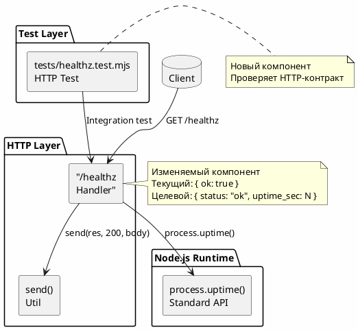
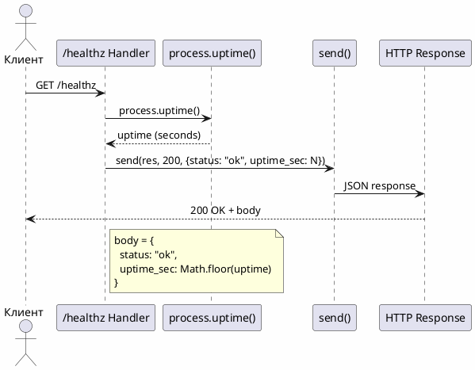
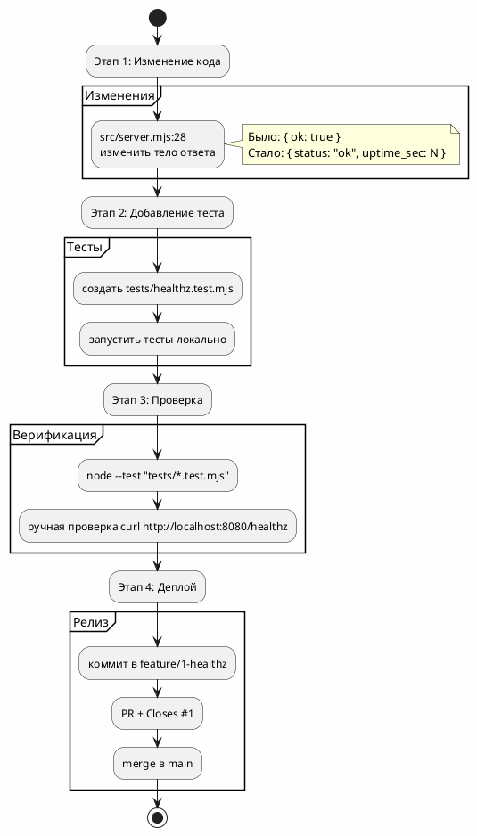

# Системные требования — FNR-1: Эндпоинт GET /healthz с временем работы процесса

**FNR ID:** FNR-1
**Дата создания:** 2026-08-24
**Статус:** Черновик
**Версия:** 1.0

---

## 1. Введение

### 1.1. Общая информация

| Поле | Значение |
|------|----------|
| **Название требования** | Эндпоинт GET /healthz с временем работы процесса |
| **FNR ID** | FNR-1 |
| **Тип задачи** | Рефакторинг / Корректировка существующей функциональности |
| **Приоритет** | Medium |
| **Ответственный продукт** | — |
| **Ответственный за тех. реализацию** | Backend-разработчик |
| **Связанные Issue** | — |
| **Дата начала** | 2026-08-24 |
| **Дата окончания (план)** | — |

### 1.2. Термины и определения

| Термин | Определение |
|--------|-------------|
| **uptime** | Время работы процесса в секундах с момента запуска |
| **healthcheck** | Эндпоинт для проверки работоспособности сервиса |
| **process.uptime()** | Стандартный API Node.js для получения uptime процесса |

### 1.3. Ссылки на связанные документы

| Документ | Ссылка |
|----------|-------|
| Task (постановка) | [task.md](./task.md) |
| Концепты решений | [concept.md](./concept.md) |
| Исходный код (server.mjs) | [src/server.mjs:28](../../src/server.mjs:28) |
| CLAUDE.md (границы кода) | [CLAUDE.md](../../CLAUDE.md) |

### 1.4. История изменений

| Версия | Дата | Автор | Описание изменения |
|--------|------|-------|-------------------|
| 1.0 | 2026-08-24 | Issue-Agent | Первая версия системных требований |

---

## 2. Общее описание

### 2.1. As-Is: Текущее состояние

Эндпоинт `GET /healthz` существует в кодовой базе (`src/server.mjs:28`) и возвращает следующий ответ:

```javascript
// Текущая реализация в src/server.mjs:28
if (req.url === '/healthz') return send(res, 200, { ok: true });
```

**Формат ответа:**
```json
{
  "ok": true
}
```

**Ключевые компоненты:**

| Компонент | Описание | Ограничения |
|-----------|----------|-------------|
| `src/server.mjs` | HTTP-слой, тонкая обёртка вокруг бизнес-логики | Содержит только разбор запроса и коды ответов |
| Утилита `send()` | Формирование JSON-ответов с правильными заголовками | — |
| Эндпоинт `/healthz` | Healthcheck маршрутизация | Текущий формат не соответствует требованиям |

**Ограничения текущего решения:**

1. Отсутствует поле `uptime_sec` — время работы процесса не возвращается
2. Поле `ok` не соответствует требуемому формату `status: "ok"`
3. Нет специализированного теста для HTTP-эндпоинта

### 2.2. Архитектурное решение

**Выбранный концепт:** Концепт 1 (Минимальное изменение) — утверждён по итогам архитектурных дебатов ([concept.md](./concept.md)).

**Обоснование:**
- Соответствует архитектурным границам проекта (тонкий HTTP-слой)
- Соблюдает принцип «Новая логика — новый тест»
- Минимальные усилия при максимальной корректности
- Без новых зависимостей и излишнего абстрагирования

**Ссылка на архитектурные дебаты:** [concept.md](./concept.md#архитектурные-дебаты)

### 2.3. Диаграмма компонентов



### 2.4. Схема последовательности



---

## 3. План миграции

### 3.1. Общая схема внедрения



### 3.2. Таблица этапов внедрения

| # | Этап | Описание | Критерий готовности | Стратегия отката |
|---|------|----------|---------------------|------------------|
| 1 | Изменение кода | Модификация `src/server.mjs:28` для нового формата ответа | Код изменён, формат соответствует требованиям | `git checkout -- src/server.mjs` |
| 2 | Добавление теста | Создание `tests/healthz.test.mjs` с HTTP-тестом | Тест проходит локально | Удалить файл теста |
| 3 | Верификация | Запуск всех тестов `node --test "tests/*.test.mjs"` | Все тесты зелёные | — |
| 4 | Релиз | Создание PR с `Closes #1`, merge в main | PRmerged | Закрыть PR, откатить коммит |

### 3.3. Критерии готовности этапов

| Этап | Критерий |
|------|----------|
| Изменение кода | `uptime_sec` — целое число, `>= 0`; `status` — строка `"ok"` |
| Добавление теста | Тест проверяет статус-код, заголовок Content-Type, оба поля ответа |
| Верификация | `node --test "tests/*.test.mjs"` проходит без ошибок |
| Релиз | PR одобрен и смёржен в main |

---

## 4. Функциональные требования — Backend / БД / API

### 4.1. Задача 1: Изменение эндпоинта GET /healthz

#### Метаданные

| Поле | Значение |
|------|----------|
| **ID задачи** | FNR-1-BACKEND-1 |
| **Название** | Изменение эндпоинта GET /healthz |
| **Ответственный за тех. реализацию** | Backend-разработчик |
| **Jira-ссылка** | — |
| **Статус** | Новая |

#### Описание

Изменить тело ответа эндпоинта `GET /healthz` в файле `src/server.mjs:28` с текущего формата `{ ok: true }` на требуемый формат `{ status: "ok", uptime_sec: <целое> }`.

Значение `uptime_sec` вычисляется как `Math.floor(process.uptime())` — целое число секунд с момента старта процесса Node.js.

#### Обоснование

Текущий формат ответа не соответствует требованиям, указанным в [`task.md:86-91`](./task.md). Поле `uptime_sec` необходимо для мониторинга времени работы процесса.

#### Затрагиваемые компоненты

| Компонент | Тип воздействия | Описание |
|-----------|----------------|----------|
| `src/server.mjs:28` | Изменение | Строка с обработчиком `/healthz` |

#### Критерии приёмки

1. GET-запрос к `http://localhost:8080/healthz` возвращает статус-код **200**
2. Заголовок `Content-Type` равен `application/json; charset=utf-8`
3. Тело ответа содержит поле `status` со значением `"ok"` (строка)
4. Тело ответа содержит поле `uptime_sec` — целое число (тип `number` в JSON)
5. Значение `uptime_sec` `>= 0`
6. Значение `uptime_sec` увеличивается со временем (при последовательных запросах)

#### Зависимости

Нет.

#### Нефункциональные требования

| Параметр | Требование | Способ проверки |
|----------|------------|------------------|
| Время ответа | < 10ms (без вызовов БД/внешних API) | `curl -w "%{time_total}"` |
| Зависимости | Только стандартная библиотека Node.js | Проверка `package.json` (не должен изменяться) |

---

### 4.2. Задача 2: Создание теста для эндпоинта GET /healthz

#### Метаданные

| Поле | Значение |
|------|----------|
| **ID задачи** | FNR-1-BACKEND-2 |
| **Название** | Создание теста для эндпоинта GET /healthz |
| **Ответственный за тех. реализацию** | Backend-разработчик |
| **Jira-ссылка** | — |
| **Статус** | Новая |

#### Описание

Создать файл `tests/healthz.test.mjs` с интеграционным тестом для эндпоинта `GET /healthz`. Тест должен запускать реальный HTTP-сервер на случайном порту (`port = 0`) и проверять HTTP-контракт эндпоинта.

#### Обоснование

Согласно [`CLAUDE.md:59`](../../CLAUDE.md:59): «Новая логика — новый тест». Существующие тесты в `tests/pricing.test.mjs` проверяют только чистые функции без сети. Для HTTP-эндпоинта нужен тест с реальным сервером.

#### Затрагиваемые компоненты

| Компонент | Тип воздействия | Описание |
|-----------|----------------|----------|
| `tests/healthz.test.mjs` | Добавление | Новый файл с HTTP-тестом |

#### Критерии приёмки

1. Тест запускается командой `node --test "tests/*.test.mjs"`
2. Тест проверяет статус-код 200
3. Тест проверяет заголовок `Content-Type: application/json; charset=utf-8`
4. Тест проверяет поле `status === "ok"`
5. Тест проверяет тип `uptime_sec === 'number'`
6. Тест проверяет `Number.isInteger(uptime_sec) === true`
7. Тест проверяет `uptime_sec >= 0`
8. Тест закрывает сервер после выполнения (`server.close()`)

#### Зависимости

Нет (тест не зависит от других задач).

#### Нефункциональные требования

| Параметр | Требование | Способ проверки |
|----------|------------|------------------|
| Время выполнения теста | < 1s | Запуск теста локально |
| Флактирность | Тест стабилен на CI | Мониторинг после первого прогона на CI |

#### Пример кода теста

```javascript
import assert from 'node:assert/strict';
import { test } from 'node:test';
import { createServer } from 'node:http';
import { app } from '../src/server.mjs';

test('GET /healthz возвращает статус и время работы', async () => {
  const server = createServer(app);
  const port = 0; // случайный свободный порт

  await new Promise(resolve => server.listen(port, resolve));

  const res = await fetch(`http://localhost:${server.address().port}/healthz`);
  const body = await res.json();

  assert.equal(res.status, 200);
  assert.equal(res.headers.get('content-type'), 'application/json; charset=utf-8');
  assert.equal(body.status, 'ok');
  assert.equal(typeof body.uptime_sec, 'number');
  assert.ok(Number.isInteger(body.uptime_sec));
  assert.ok(body.uptime_sec >= 0);

  server.close();
});
```

---

### 4.3. Задача 3: Обновление .delivery/checks.json

#### Метаданные

| Поле | Значение |
|------|----------|
| **ID задачи** | FNR-1-BACKEND-3 |
| **Название** | Обновление .delivery/checks.json |
| **Ответственный за тех. реализацию** | Backend-разработчик |
| **Jira-ссылка** | — |
| **Статус** | Новая |

#### Описание

Обновить ожидаемый формат ответа в файле `.delivery/checks.json` для проверки `healthz` с текущего `{ "ok": true }` на новый формат `{ "status": "ok", "uptime_sec": <число> }`.

#### Обоснование

Delivery-Agent использует этот файл для проверки работоспособности сервиса после деплоя ([`.delivery/checks.json:85-87`](../../.delivery/checks.json:85-87)). Без обновления проверки будут падать.

#### Затрагиваемые компоненты

| Компонент | Тип воздействия | Описание |
|-----------|----------------|----------|
| `.delivery/checks.json` | Изменение | Поле `expect_json` для проверки `healthz` |

#### Критерии приёмки

1. Поле `expect_json` для проверки `healthz` содержит `"status": "ok"`
2. Поле `expect_json` для проверки `healthz` содержит `"uptime_sec"` (значение не проверяется, только наличие поля)

#### Зависимости

Зависит от FNR-1-BACKEND-1 (изменение эндпоинта).

#### Нефункциональные требования

Не применимо.

---

## 5. Требования к интерфейсам — Frontend / UI

**Не применимо** — задача не содержит изменений в клиентском коде, верстке или UI-логике. Все изменения относятся к серверному коду (Backend).

---

## 6. Ревью требований

| Роль | Имя | Статус | Комментарии |
|------|-----|--------|-------------|
| Аналитик | — | — | — |
| Разработчик Backend | — | — | — |
| Разработчик Frontend | — | — | — |
| Тестирование | — | — | — |

---

## 7. Риски и ограничения

### 7.1. Таблица рисков

| ID | Риск | Вероятность | Влияние | Митигация |
|----|------|-------------|---------|-----------|
| R1 | Тест с `createServer` флакает на CI из-за занятости портов | Средняя | Низкая | Использовать `port = 0` (случайный свободный порт). При первом случае флака добавить ретраи/таймаут. |
| R2 | Изменение формата ответа ломает существующих потребителей | Низкая | Средняя | Это демо-стенд, не прод. Если потребители есть — согласовать с ними заранее. |
| R3 | `process.uptime()` возвращает дробное число, округление `Math.floor` теряет точность | Низкая | Низкая | Требуется целое число секунд — округление вниз соответствует требованиям. |

### 7.2. Ограничения

1. **Обратная совместимость** — Текущий формат `{ ok: true }` изменяется на `{ status: "ok", uptime_sec: N }`. Это ломающее изменение для потребителей, проверяющих поле `ok`. Потребители должны быть обновлены.

2. **Погрешность измерения uptime** — Значение `uptime_sec` округлено вниз (`Math.floor`), поэтому реальное время работы может быть на `(1 - ε)` секунды больше.

3. **Зависимости** — Новые зависимости не добавляются, используется только стандартная библиотека Node.js.

4. **Типы данных** — `uptime_sec` всегда целое число (integer), дробная часть отбрасывается.

---

## 8. Приложения

### 8.1. Изменение в src/server.mjs

**Было:**
```javascript
if (req.url === '/healthz') return send(res, 200, { ok: true });
```

**Стало:**
```javascript
if (req.url === '/healthz') return send(res, 200, {
  status: 'ok',
  uptime_sec: Math.floor(process.uptime())
});
```

### 8.2. Пример curl-запросов

```bash
# Текущий ответ (до изменения)
$ curl http://localhost:8080/healthz
{"ok":true}

# Ожидаемый ответ (после изменения)
$ curl http://localhost:8080/healthz
{"status":"ok","uptime_sec":12345}
```

### 8.3. Справочная информация по process.uptime()

- **Описание:** `process.uptime()` возвращает время работы процесса в секундах
- **Возвращаемое значение:** Число с плавающей точкой (float)
- **Документация:** https://nodejs.org/api/process.html#processuptime
- **Округление:** `Math.floor()` используется для получения целого числа секунд

---

**Следующие шаги:**

1. Утвердить системные требования
2. Передать задачу в разработку через Issue с меткой `ready-for-dev`
3. После разработки: `/validate-doc sa_documentation/FNR/FNR_1/system_requirements.md`
