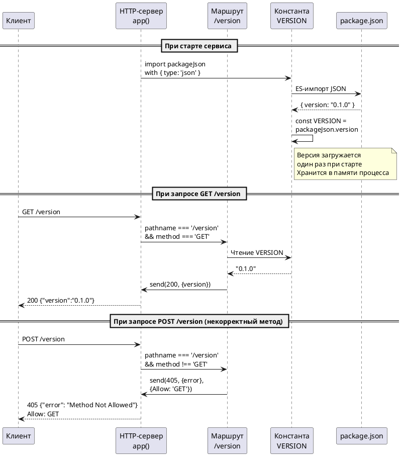

# FNR-1: Системные требования — Эндпоинт GET /version

## 1. Введение

### 1.1. Метаданные

| Поле | Значение |
|------|----------|
| **Документ** | Системные требования (System Requirements) |
| **Задача** | Эндпоинт GET /version с версией сервиса из package.json |
| **Источник** | Issue po-helper-org/poh-demo-checkout#151 |
| **Выбранный концепт** | Концепт 1: ES-импорт JSON (с модификациями из дебатов) |
| **Дата** | 2026-08-25 |
| **Версия** | 1.0 |
| **Статус** | Утверждённые требования |

### 1.2. Термины и определения

| Термин | Определение |
|--------|-------------|
| **Версия сервиса** | Семантическая версия из `package.json` (поле `version`), идентифицирующая текущий код |
| **ES-импорт JSON** | Нативный механизм Node.js 22+ для импорта JSON-файлов с атрибутом `with { type: 'json' }` |
| **Версия при старте** | Значение версии фиксируется при инициализации модуля и обновляется только при перезапуске процесса |
| **Hot reload** | Горячая замена кода без перезапуска процесса (в текущей задаче не поддерживается) |

### 1.3. Связанные документы

| Документ | Расположение |
|----------|---------------|
| Постановка задачи | `sa_documentation/FNR/FNR_1/task.md` |
| Концепты решений | `sa_documentation/FNR/FNR_1/concept.md` |
| Код сервиса | `src/server.mjs` |
| Тесты | `tests/server.test.mjs` |
| Контекст кода | `sa_documentation/repomix-output.xml` |

### 1.4. История изменений

| Версия | Дата | Автор | Изменение |
|--------|------|-------|-----------|
| 1.0 | 2026-08-25 | System Analyst | Первичная версия системных требований на основе утверждённого Концепта 1 |

---

## 2. Общее описание

### 2.1. As-Is: Текущее поведение

**Контекст:**

В текущем состоянии сервис [`src/server.mjs`](src/server.mjs) предоставляет единственный информационный эндпоинт [`GET /healthz`](src/server.mjs:977-985), который возвращает статус работы и время работы сервиса (`uptime_sec`). Однако этот эндпоинт не идентифицирует версию работающего кода.

**Ограничения текущего решения:**

| Характеристика | Текущее состояние | Доказательство |
|----------------|-------------------|----------------|
| Идентификация версии | Отсутствует | В [`server.mjs:39-94`](src/server.mjs:39-94) нет маршрута для версии |
| Источник версии | `package.json:3` (значение `0.1.0`) | Версия хранится в [`package.json:3`](package.json:3) |
| Метка образа | Недостоверна | Образ пересобирается молча без явного указания версии |
| Логи старта | Идентичны для всех версий | [`server.mjs:1034`](src/server.mjs:1034) — строка не содержит версию |

**Ключевые компоненты:**

- [`src/server.mjs`](src/server.mjs) — HTTP-сервер с маршрутом `/healthz`
- [`package.json`](package.json) — источник версии (`version: "0.1.0"`)
- [`tests/server.test.mjs`](tests/server.test.mjs) — тесты HTTP-обработчиков

### 2.2. Архитектурное решение

**Выбранный подход:** Концепт 1 (ES-импорт JSON) с модификациями из архитектурных дебатов.

**Суть решения:**

Использовать нативный ES-импорт JSON для чтения `package.json` при инициализации модуля. Версия загружается один раз при старте сервиса и хранится в константе. Эндпоинт `/version` следует паттерну `/healthz` — проверка метода, ответ 405 с заголовком `Allow: GET` для не-GET запросов.

**Код доказательство:**

```javascript
// ES-импорт JSON (Node.js 22+)
import packageJson from '../package.json' with { type: 'json' };
const VERSION = packageJson.version;
```

**Модификации из дебатов:**

1. **Явная спецификация:** версия грузится при старте сервиса, обновляется только при перезапуске
2. **Тестовый сценарий:** поведение при отсутствии/битом `package.json` — сервис не стартует (это ожидаемое поведение)
3. **Документация в коде:** комментарий о привязке версии к старту процесса

### 2.3. Диаграмма компонентов

```plantuml
@startuml
!define RECTANGLE class

package "HTTP-сервер" {
  [app()]\nФункция-обработчик\nзапросов] as App
  [send()]\nВспомогательная\nфункция ответа] as Send
}

package "Модуль версионирования" {
  [VERSION]\nКонстанта версии\nиз package.json] as Version
  [/version]\nНовый маршрут] as Route
}

package "Источники данных" {
  [package.json]\nФайл манифеста\nс версией] as Package
}

database "В памяти процесса" {
  [Константа VERSION]\nЗагружается при\nстарте сервиса] as MemVersion
}

Route ..> App : обрабатывает маршрут
Route ..> Send : отправляет ответ
Version ..> Package : ES-импорт JSON
Version ..> MemVersion : хранит значение
Route ..> MemVersion : читает значение

note right of Version
  ES-импорт с атрибутом
  with { type: 'json' }
  Загружается один раз
  при старте модуля
end note

note right of Route
  GET: 200 с {version}
  POST/PUT/DELETE: 405
  с заголовком Allow: GET
end note

@enduml
```

### 2.4. Схема последовательности



---

## 3. План миграции

### 3.1. Этапы внедрения

```plantuml
@startuml
start
:Этап 1: Подготовка;
:Изучение существующего\nпаттерна /healthz;
:Определение места\nдля нового маршрута;

if Версия Node.js >= 22? then (Да)
  :Этап 2: Реализация;
  :Добавление ES-импорта\npackage.json;
  :Добавление маршрута\n/version;
  note right
    Следует паттерну
    /healthz для 405
  end note
  :Этап 3: Тестирование;
  :Написание тестов\nдля /version;
  :Проверка тестов\nnode --test;
  :Этап 4: Валидация;
  :Проверка HowToDemo;
  :Проверка /healthz\n(не изменился);

else (Нет)
  :Стоп: требование\nNode.js >=22;
  stop
endif

:Этап 5: Завершение;
:Коммит в ветку\nfeature/151-version-endpoint;
:PR с Closes #151;
stop
@enduml
```

### 3.2. Таблица этапов

| Этап | Описание | Критерий готовности | Откат |
|------|----------|---------------------|-------|
| **1. Подготовка** | Изучение паттерна `/healthz` в [`server.mjs:977-985`](src/server.mjs:977-985) | Понято место для нового маршрута | Удаление добавленного кода |
| **2. Реализация** | Добавление ES-импорта и маршрута `/version` | Код добавлен в `src/server.mjs` | `git checkout -- src/server.mjs` |
| **3. Тестирование** | Написание тестов в `tests/server.test.mjs` | Тесты проходят `node --test` | Удаление тестов |
| **4. Валидация** | Проверка HowToDemo и `/healthz` | Все критерии выполнены | Отмена коммита |
| **5. Завершение** | PR с `Closes #151` | PR открыт и отревьюен | Закрытие PR |

### 3.3. Критерии готовности

| Критерий | Проверка |
|----------|----------|
| 1. GET /version отвечает 200 | `curl http://localhost:8080/version` → код 200 |
| 2. Тело содержит версию | Ответ содержит `{"version": "0.1.0"}` |
| 3. POST /version отвечает 405 | `curl -X POST http://localhost:8080/version` → код 405 |
| 4. Заголовок Allow присутствует | Заголовок `Allow: GET` |
| 5. /healthz не изменился | `GET /healthz` → прежнее поведение |
| 6. Тесты проходят | `node --test "tests/*.test.mjs"` → код 0 |

---

## 4. Функциональные требования — Backend

### 4.1. Задача 1: Добавление маршрута /version в server.mjs

#### 4.1.1. Метаданные

| Поле | Значение |
|------|----------|
| **Ответственный за тех. реализацию** | Backend-разработчик |
| **Задача на разработку** | Реализовать маршрут GET /version с версией из package.json |
| **Jira-ссылка** | #151 (статус: ready-for-dev) |

#### 4.1.2. Описание требования

Добавить новый HTTP-маршрут `/version` в [`src/server.mjs`](src/server.mjs), который возвращает версию сервиса из `package.json`. Маршрут должен:

1. Использовать ES-импорт JSON для чтения `package.json` при старте модуля
2. Хранить версию в константе `VERSION`
3. Возвращать версию при GET-запросе
4. Следовать паттерну `/healthz` для обработки не-GET методов (405)

#### 4.1.3. Обоснование

- **Проблема:** По живому сервису невозможно определить версию работающего кода
- **Решение:** Добавить эндпоинт `/version` с версией из `package.json`
- **Почему ES-импорт:** Нативный механизм Node.js 22+ (соответствует `engines.node >=22`), версия загружается один раз при старте
- **Почему отдельный маршрут:** `/healthz` не должен меняться по ограничению задачи

#### 4.1.4. Затрагиваемые компоненты

| Компонент | Изменение |
|-----------|-----------|
| `src/server.mjs` | Добавить импорт `package.json` и маршрут `/version` |
| `package.json` | Источник версии (только чтение, изменений нет) |

#### 4.1.5. Критерии приёмки

1. GET `/version` возвращает HTTP 200
2. Тело ответа содержит JSON с полем `version` равным `"0.1.0"`
3. POST `/version` возвращает HTTP 405 с телом `{"error": "Method Not Allowed"}`
4. При 405 ответ содержит заголовок `Allow: GET`
5. PUT `/version` возвращает HTTP 405
6. DELETE `/version` возвращает HTTP 405
7. GET `/healthz` возвращает прежний результат (не изменился)
8. Сервис не стартует при отсутствии/битом `package.json` (фейл-фаст)

#### 4.1.6. Зависимости

| Зависимость | Тип |
|-------------|-----|
| Node.js версии 22+ | Технологическая (требуется для ES-импорта JSON) |

#### 4.1.7. API-спецификация

**Эндпоинты:**

| Метод | Путь | Описание | Коды ответов |
|-------|------|----------|--------------|
| GET | `/version` | Получение версии сервиса | 200, 405 |
| POST | `/version` | Не поддерживается | 405 |
| PUT | `/version` | Не поддерживается | 405 |
| DELETE | `/version` | Не поддерживается | 405 |

**Формат ответа (200 OK):**

```json
{
  "version": "0.1.0"
}
```

**Формат ответа (405 Method Not Allowed):**

```json
{
  "error": "Method Not Allowed"
}
```

**Заголовки при 405:**

| Заголовок | Значение |
|-----------|----------|
| Allow | GET |

#### 4.1.8. Нефункциональные требования

| Требование | Значение |
|------------|----------|
| **Производительность** | Версия загружается один раз при старте, O(1) по времени ответа |
| **Память** | O(1) — хранение одной строки в константе |
| **Надёжность** | Фейл-фаст при отсутствии `package.json` — сервис не стартует |
| **Совместимость** | Требуется Node.js 22+ (уже указано в `engines.node`) |

---

### 4.2. Задача 2: Добавление тестов для маршрута /version

#### 4.2.1. Метаданные

| Поле | Значение |
|------|----------|
| **Ответственный за тех. реализацию** | Backend-разработчик / QA |
| **Задача на разработку** | Написать тесты для нового маршрута `/version` |
| **Jira-ссылка** | #151 (статус: ready-for-dev) |

#### 4.2.2. Описание требования

Добавить тесты в [`tests/server.test.mjs`](tests/server.test.mjs), покрывающие:

1. Успешный GET-запрос к `/version` (200, тело содержит версию)
2. Не-GET методы (POST, PUT, DELETE) возвращают 405 с заголовком `Allow: GET`
3. Версия совпадает с `package.json`

#### 4.2.3. Обоснование

- **Принцип:** «Новая логика — новый тест» (из [`AGENTS.md`](AGENTS.md:1766))
- **Покрытие:** Аналогично тестам `/healthz` в [`server.test.mjs:1578-1597`](tests/server.test.mjs:1578-1597)
- **Регрессия:** Защита от случайных изменений маршрута

#### 4.2.4. Затрагиваемые компоненты

| Компонент | Изменение |
|-----------|-----------|
| `tests/server.test.mjs` | Добавить тесты для `/version` |
| `src/server.mjs` | Тестируется косвенно через `app()` |

#### 4.2.5. Критерии приёмки

1. Тест `GET /version возвращает 200 с полем version` проходит
2. Тест `POST /version возвращает 405 с заголовком Allow: GET` проходит
3. Тест `PUT /version возвращает 405` проходит
4. Тест `DELETE /version возвращает 405` проходит
5. Все существующие тесты не ломаются
6. Команда `node --test "tests/*.test.mjs"` возвращает код 0

#### 4.2.6. Зависимости

| Зависимость | Тип |
|-------------|-----|
| Задача 1 (Реализация маршрута) | Технологическая (тесты требуют функционал) |

---

## 5. Требования к интерфейсам — Frontend / UI

**Не применимо** — задача не содержит UI-изменений. Все изменения касаются серверного кода (`src/server.mjs`) и тестов.

---

## 6. Ревью требований

| Роль | Имя | Статус | Дата | Комментарии |
|------|-----|--------|------|-------------|
| **Аналитик** | System Analyst | Готово | 2026-08-25 | — |
| **Разработчик Backend** | — | Требуется ревью | — | — |
| **Разработчик Frontend** | — | Не применимо | — | Задача не содержит UI-изменений |
| **Тестирование** | — | Требуется ревью | — | — |

---

## 7. Риски и ограничения

### 7.1. Риски

| ID | Риск | Вероятность | Влияние | Митигация |
|----|------|-------------|---------|-----------|
| R1 | Изменение требований Node.js (снижение с 22+) | Низкая | Средняя | Документировано: при изменении требуется переход на Концепт 2 (fs.readFile) |
| R2 | Переход на monorepo с `package.json` в подкаталогах | Низкая | Средняя | Путь `../package.json` стандартен; при изменении структуры — адаптация импорта |
| R3 | Отсутствие `package.json` при запуске | Очень низкая | Высокая | Фейл-фаст — правильное поведение; сервис не должен работать без версии |
| R4 | Hot reload без перезапуска процесса | Низкая | Низкая | Документировано: версия привязана к старту процесса; для hot reload требуется перезапуск |

### 7.2. Ограничения

1. **Версия при старте:** Значение версии фиксируется при инициализации модуля и обновляется только при перезапуске процесса сервиса
2. **Node.js 22+:** Решение использует нативный ES-импорт JSON, требующий Node.js версии 22 или выше
3. **Фейл-фаст:** При отсутствии или повреждении `package.json` сервис не стартует — это ожидаемое поведение
4. **Без hot reload:** Версия не обновляется при горячей замене кода без перезапуска процесса
5. **Структура проекта:** Импорт использует относительный путь `../package.json` из `src/` — изменение структуры требует адаптации
6. **Без новых зависимостей:** Сервис не имеет зависимостей и не должен их добавлять
7. **/healthz не меняется:** Существующий маршрут `/healthz` остаётся без изменений

---

## 8. Приложения

### 8.1. Пример кода реализации

```javascript
// src/server.mjs — добавление в начало файла

// ES-импорт JSON (Node.js 22+)
import packageJson from '../package.json' with { type: 'json' };

// Версия загружается один раз при старте сервиса
// Обновляется только при перезапуске процесса
const VERSION = packageJson.version;

// ... существующий код ...

// В функции app() — добавить после /healthz

if (pathname === '/version') {
  if (req.method !== 'GET') {
    return send(res, 405, { error: 'Method Not Allowed' }, { 'Allow': 'GET' });
  }
  return send(res, 200, { version: VERSION });
}
```

### 8.2. Пример кода тестов

```javascript
// tests/server.test.mjs — добавление тестов

test('GET /version возвращает 200 с полем version', async () => {
  const res = await request('/version', 'GET');
  assert.equal(res.statusCode, 200);
  assert.equal(typeof res.body.version, 'string');
  assert.ok(res.body.version.length > 0);
});

test('POST /version возвращает 405 с заголовком Allow: GET', async () => {
  const res = await request('/version', 'POST');
  assert.equal(res.statusCode, 405);
  assert.equal(res.body.error, 'Method Not Allowed');
  assert.equal(res.headers['Allow'], 'GET');
});

test('PUT /version возвращает 405', async () => {
  const res = await request('/version', 'PUT');
  assert.equal(res.statusCode, 405);
  assert.equal(res.headers['Allow'], 'GET');
});

test('DELETE /version возвращает 405', async () => {
  const res = await request('/version', 'DELETE');
  assert.equal(res.statusCode, 405);
  assert.equal(res.headers['Allow'], 'GET');
});
```

### 8.3. HowToDemo — проверка готовности

1. Запустить сервис: `node src/server.mjs`
2. Отправить `GET /version` → код 200, тело `{"version": "0.1.0"}`
3. Отправить `POST /version` → код 405, заголовок `Allow: GET`
4. Отправить `GET /healthz` → код 200 (прежнее поведение)
5. Запустить `node --test "tests/*.test.mjs"` → код возврата 0

---

**Следующий шаг:** `/validate-doc sa_documentation/FNR/FNR_1/system_requirements.md`
